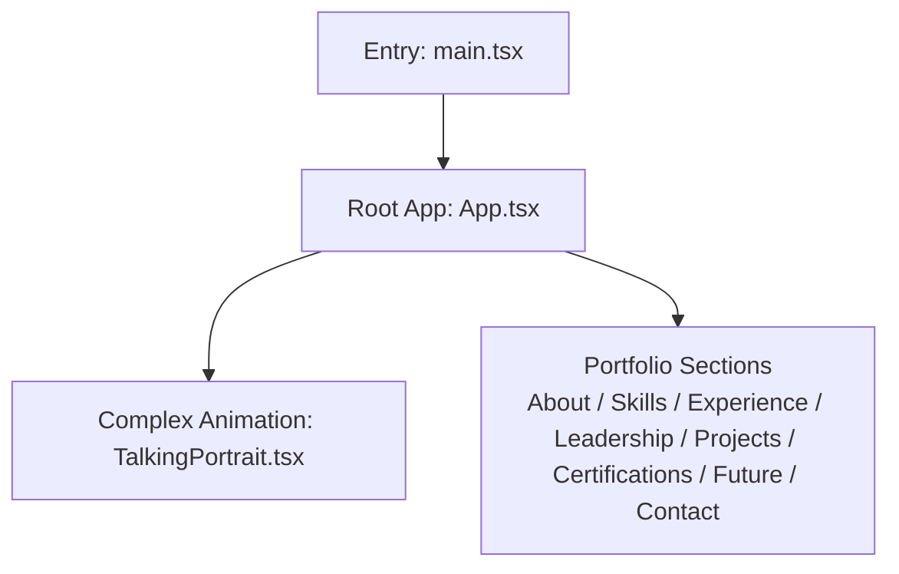
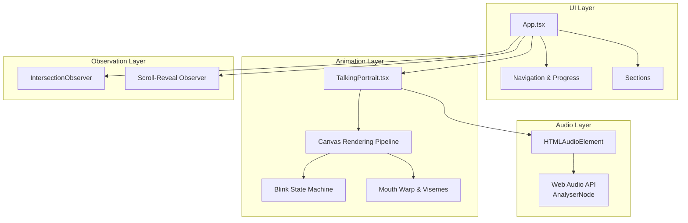
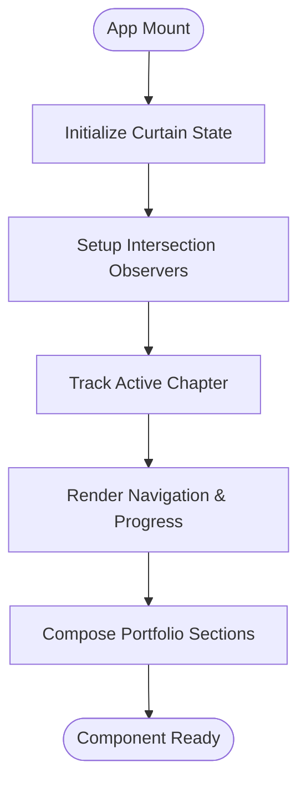
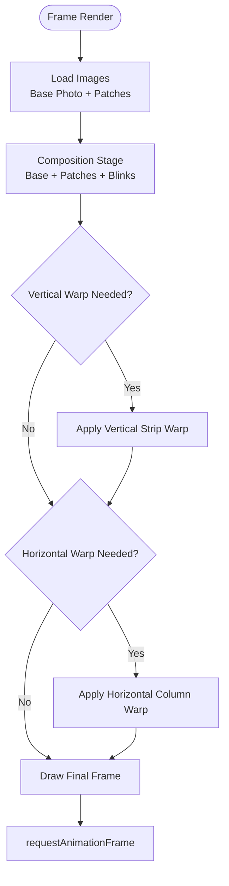
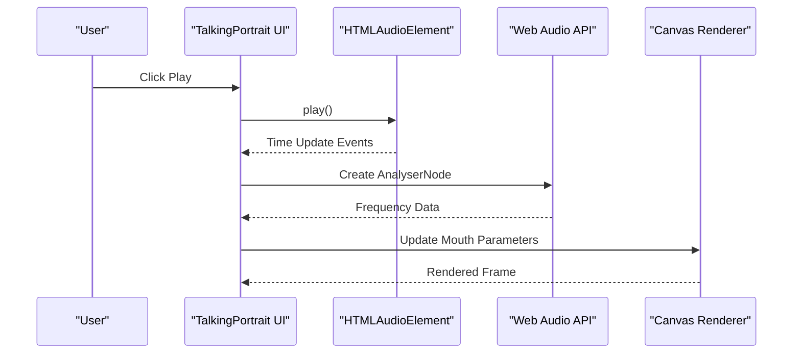
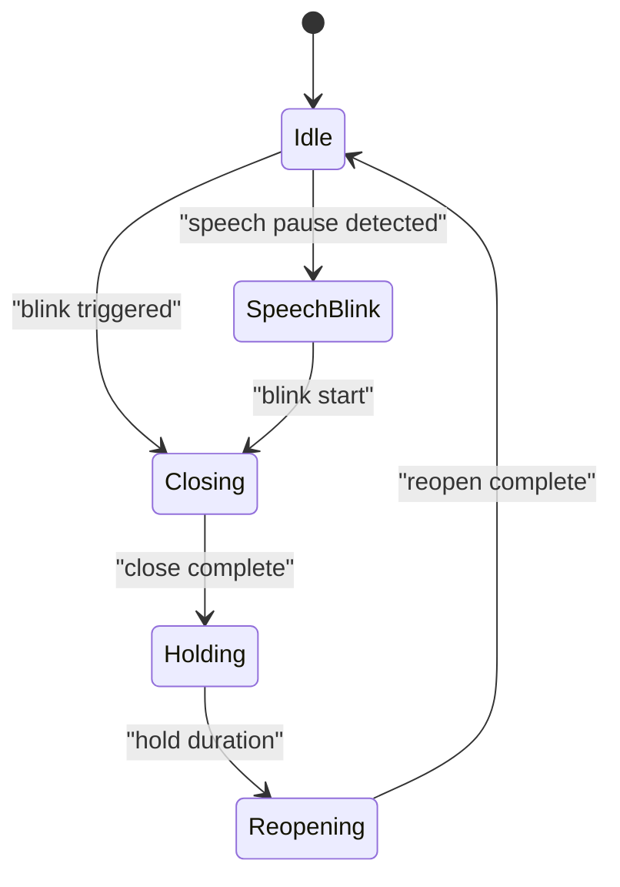
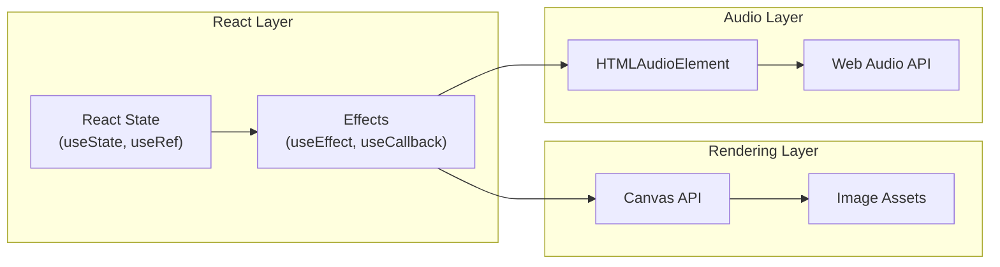
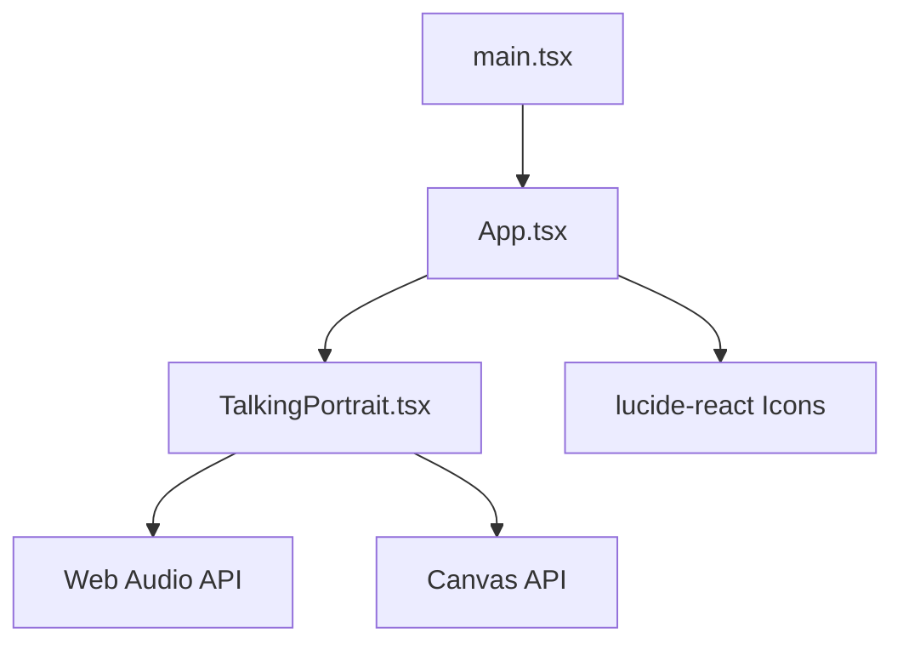

# Architecture Overview

<cite>
**Referenced Files in This Document**
- [main.tsx](file://src/main.tsx)
- [App.tsx](file://src/App.tsx)
- [TalkingPortrait.tsx](file://src/components/TalkingPortrait.tsx)
- [package.json](file://package.json)
</cite>

## Table of Contents
1. [Introduction](#introduction)
2. [Project Structure](#project-structure)
3. [Core Components](#core-components)
4. [Architecture Overview](#architecture-overview)
5. [Detailed Component Analysis](#detailed-component-analysis)
6. [Dependency Analysis](#dependency-analysis)
7. [Performance Considerations](#performance-considerations)
8. [Troubleshooting Guide](#troubleshooting-guide)
9. [Conclusion](#conclusion)

## Introduction
This document describes the Levi Portfolio system architecture as a React-based single-page application. The application uses a component-driven design where `App.tsx` acts as the central controller for navigation, scroll behavior, and section state, while `TalkingPortrait.tsx` is the complex animation component responsible for rendering a photorealistic talking portrait using the Canvas API and Web Audio API.

The portfolio follows a single-page application pattern with scroll-driven sections, an observer-based reveal system, and a separation between UI logic (React state and layout) and heavy rendering operations (Canvas image warping, blink simulation, and audio-reactive motion).

## Project Structure
At runtime, the application is bootstrapped by the entry file, which mounts the root React component into the DOM. The main application component owns global UI state and composes the page sections, including the animated portrait component.

**Diagram sources**
- [main.tsx:1-11](file://src/main.tsx#L1-L11)
- [App.tsx:42-727](file://src/App.tsx#L42-L727)
- [TalkingPortrait.tsx:318-746](file://src/components/TalkingPortrait.tsx#L318-L746)

**Section sources**
- [main.tsx:1-11](file://src/main.tsx#L1-L11)
- [App.tsx:1-727](file://src/App.tsx#L1-L727)
- [TalkingPortrait.tsx:1-746](file://src/components/TalkingPortrait.tsx#L1-L746)
- [package.json:1-37](file://package.json#L1-L37)

## Core Components
The system has two primary architectural components:

- **App**: Central controller for the portfolio. It manages:
  - Active chapter tracking via Intersection Observer.
  - Scroll-reveal animations.
  - Navigation visibility and progress.
  - Curtain/unfold interaction.
  - Section composition and content layout.

- **TalkingPortrait**: Complex animation component that renders a realistic talking portrait. It manages:
  - Canvas-based image composition and deformation.
  - Blink simulation with anatomical landmarks.
  - Phoneme-to-viseme mapping synchronized to audio.
  - Micro-motion and head movement.
  - Web Audio API integration for audio-reactive mouth movement.

**Section sources**
- [App.tsx:42-727](file://src/App.tsx#L42-L727)
- [TalkingPortrait.tsx:318-746](file://src/components/TalkingPortrait.tsx#L318-L746)

## Architecture Overview
The Levi Portfolio follows a layered, component-based architecture:

- **Presentation Layer**: React components render the user interface.
- **State Management Layer**: Local React state and refs manage UI state and animation timing.
- **Rendering Layer**: Canvas API handles high-performance image manipulation.
- **Integration Layer**: Web APIs such as Web Audio API and Intersection Observer are integrated through hooks and event listeners.

**Diagram sources**
- [App.tsx:42-727](file://src/App.tsx#L42-L727)
- [TalkingPortrait.tsx:318-746](file://src/components/TalkingPortrait.tsx#L318-L746)

## Detailed Component Analysis

### App.tsx — Central Controller
`App.tsx` is the top-level component that orchestrates the portfolio experience. It manages:

- **Curtain Interaction**: Locks scroll until the curtain unfolds, then restores normal scrolling.
- **Active Chapter Tracking**: Uses Intersection Observer to determine the currently visible section and updates the active chapter accordingly.
- **Scroll-Reveal Animations**: Adds visibility classes to elements when they enter the viewport.
- **Navigation State**: Controls navigation visibility, mobile menu toggle, and smooth scrolling to sections.
- **Section Composition**: Renders all portfolio sections, including About, Skills, Experience, Leadership, Projects, Certifications, Future, and Contact.

**Diagram sources**
- [App.tsx:42-727](file://src/App.tsx#L42-L727)

**Section sources**
- [App.tsx:42-727](file://src/App.tsx#L42-L727)

### TalkingPortrait.tsx — Complex Animation Component
`TalkingPortrait.tsx` implements a sophisticated animation pipeline for facial expressions synchronized with audio playback.

#### Rendering Pipeline
The component uses a multi-stage rendering pipeline:

1. **Composition Stage**: Base photo + authentic photographic patches (teeth, tongue, gums, oral shadows, closed eyelids) are composited into an offscreen buffer.
2. **Deformation Stage**: The composed frame undergoes two warps:
   - Vertical strip warp for jaw drop, cheek lift, brow micro-motion, and lower-lid response during blinks.
   - Horizontal column warp for lip-corner stretch (smile) and lip pucker (round).
3. **Blink System**: Realistic eye closure with traveling lid animation.
4. **Micro-Motion**: Organic noise for brow, jaw breath, micro-saccades, and slow head cadence.

**Diagram sources**
- [TalkingPortrait.tsx:370-608](file://src/components/TalkingPortrait.tsx#L370-L608)

#### Audio Integration
The component integrates with both HTMLAudioElement and Web Audio API:

- **HTMLAudioElement**: Manages audio playback, time updates, and metadata loading.
- **Web Audio API**: Creates AnalyserNode for real-time frequency data analysis to modulate mouth openness based on audio volume.

**Diagram sources**
- [TalkingPortrait.tsx:340-368](file://src/components/TalkingPortrait.tsx#L340-L368)
- [TalkingPortrait.tsx:610-648](file://src/components/TalkingPortrait.tsx#L610-L648)

#### Blink State Machine
The blink system implements a natural human-like blinking pattern:

- Randomized intervals between blinks (2.5–5.2 seconds)
- Eased closing, brief hold, and eased reopening phases
- Inter-ocular lead for one eye blinking slightly first
- Speech-triggered blinks during conversational pauses
- Occasional double blinks for naturalism

**Diagram sources**
- [TalkingPortrait.tsx:423-507](file://src/components/TalkingPortrait.tsx#L423-L507)

**Section sources**
- [TalkingPortrait.tsx:318-746](file://src/components/TalkingPortrait.tsx#L318-L746)

### Conceptual Overview
The architecture separates concerns effectively:

- **UI Logic vs Rendering Logic**: React handles UI state and layout, while Canvas handles pixel-level manipulation.
- **Pipeline Pattern**: Image processing follows a clear pipeline from composition to deformation to final output.
- **Observer Pattern**: Scroll-triggered animations use Intersection Observer for performance and maintainability.
- **Separation of Concerns**: Audio management, visual rendering, and user interaction are clearly separated.

[No sources needed since this diagram shows conceptual workflow, not actual code structure]

## Dependency Analysis
The application has clear dependency relationships:

- **Entry Point**: `main.tsx` imports and mounts `App.tsx`.
- **Component Hierarchy**: `App.tsx` imports and renders `TalkingPortrait.tsx`.
- **External Dependencies**: React, ReactDOM, and Lucide icons are used throughout the application.

**Diagram sources**
- [main.tsx:1-11](file://src/main.tsx#L1-L11)
- [App.tsx:1-8](file://src/App.tsx#L1-L8)
- [TalkingPortrait.tsx:1-2](file://src/components/TalkingPortrait.tsx#L1-L2)

**Section sources**
- [main.tsx:1-11](file://src/main.tsx#L1-L11)
- [App.tsx:1-727](file://src/App.tsx#L1-L727)
- [TalkingPortrait.tsx:1-746](file://src/components/TalkingPortrait.tsx#L1-L746)
- [package.json:13-16](file://package.json#L13-L16)

## Performance Considerations
The architecture includes several performance optimizations:

- **Offscreen Buffering**: Multiple canvas buffers prevent redundant image processing.
- **Conditional Rendering**: Warp operations are only applied when necessary.
- **Efficient Animation Loop**: Uses `requestAnimationFrame` for smooth 60fps rendering.
- **Memory Management**: Proper cleanup of observers and animation frames.
- **Lazy Loading**: Images are loaded asynchronously and checked for completion before rendering.

Key performance patterns include:
- Using `useMemo` for computed values like active phrase ID.
- Using `useCallback` for stable function references.
- Avoiding unnecessary re-renders through proper state management.
- Efficient Canvas operations with minimal redraws.

## Troubleshooting Guide
Common issues and their solutions:

### Audio Context Issues
- **Problem**: Web Audio API context suspended or blocked.
- **Solution**: Ensure user interaction triggers audio context creation and resume.
- **Implementation**: Check context state and call `resume()` when needed.

### Canvas Rendering Problems
- **Problem**: Images not loaded or canvas context unavailable.
- **Solution**: Check image completion status and canvas context availability.
- **Implementation**: Add null checks and fallback rendering.

### Observer Cleanup
- **Problem**: Memory leaks from unclosed observers.
- **Solution**: Always disconnect observers in cleanup functions.
- **Implementation**: Use `disconnect()` in useEffect cleanup.

**Section sources**
- [TalkingPortrait.tsx:340-358](file://src/components/TalkingPortrait.tsx#L340-L358)
- [App.tsx:60-85](file://src/App.tsx#L60-L85)

## Conclusion
The Levi Portfolio demonstrates a well-architected React single-page application that effectively separates UI logic from complex rendering operations. The system successfully combines modern web technologies including React, Canvas API, and Web Audio API to create an engaging portfolio experience.

Key architectural strengths include:
- Clear separation of concerns between UI and rendering layers.
- Efficient use of modern web APIs for animations and audio.
- Robust state management with React hooks.
- Performance-conscious design with offscreen buffering and conditional rendering.
- Maintainable code structure with well-defined component boundaries.

The architecture provides a solid foundation for future enhancements while maintaining excellent user experience and performance characteristics.