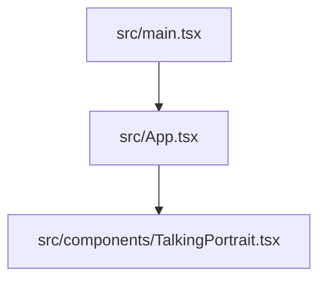
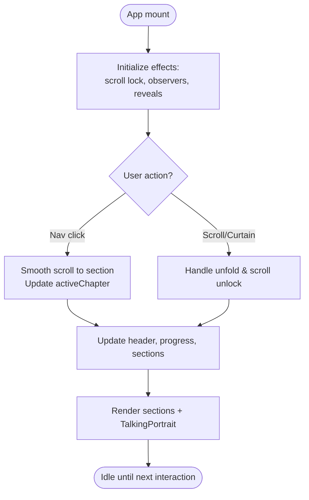
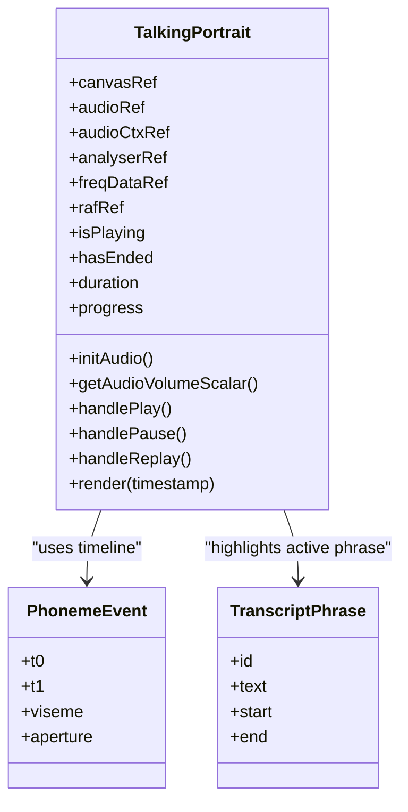
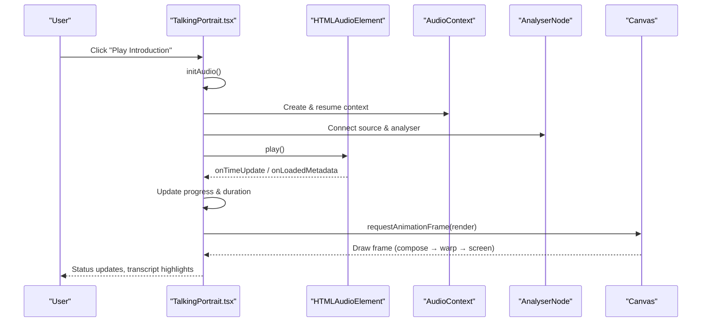
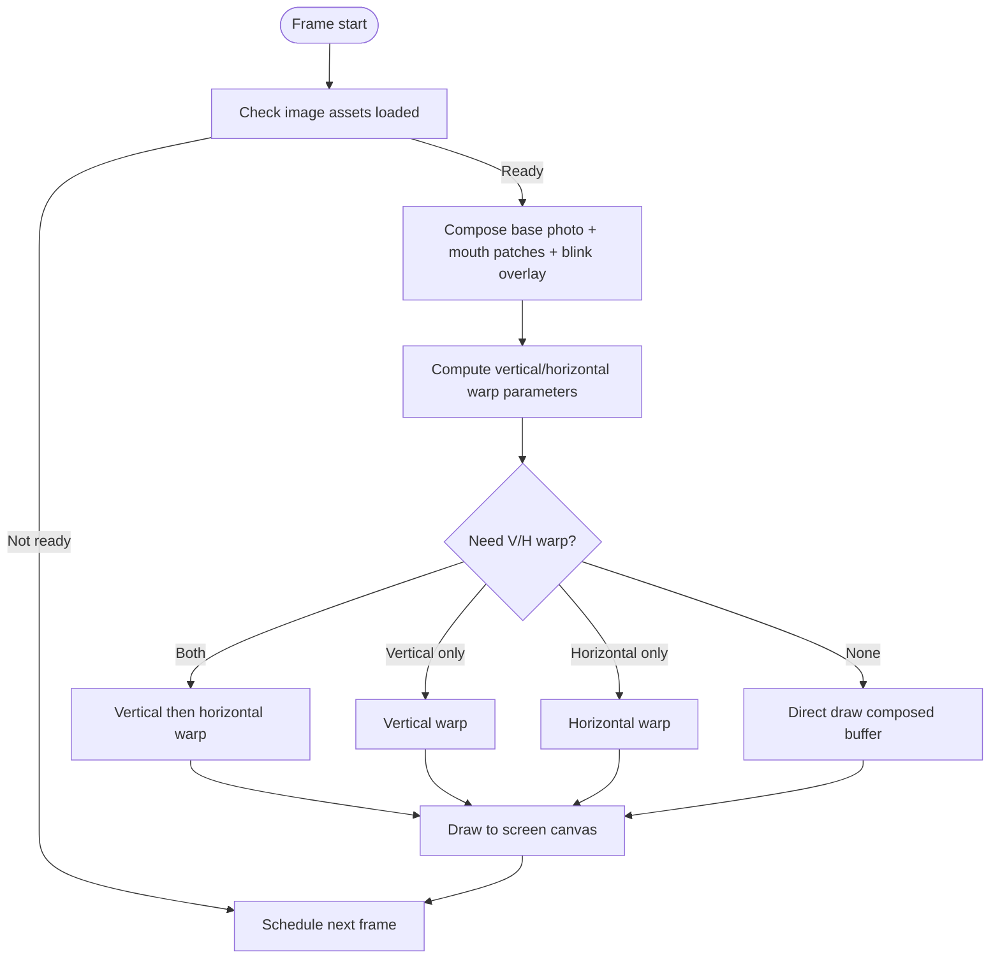
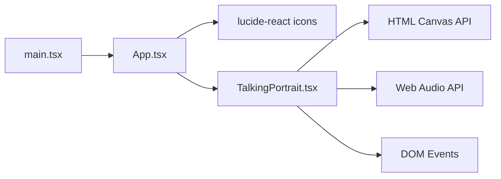

# Component Hierarchy

<cite>
**Referenced Files in This Document**
- [main.tsx](file://src/main.tsx)
- [App.tsx](file://src/App.tsx)
- [TalkingPortrait.tsx](file://src/components/TalkingPortrait.tsx)
</cite>

## Table of Contents
1. [Introduction](#introduction)
2. [Project Structure](#project-structure)
3. [Core Components](#core-components)
4. [Architecture Overview](#architecture-overview)
5. [Detailed Component Analysis](#detailed-component-analysis)
6. [Dependency Analysis](#dependency-analysis)
7. [Performance Considerations](#performance-considerations)
8. [Troubleshooting Guide](#troubleshooting-guide)
9. [Conclusion](#conclusion)

## Introduction
This document explains the React component hierarchy and orchestration strategy for the portfolio application, focusing on:
- The entry point at `main.tsx`
- The root controller at `App.tsx`
- The complex animation component at `components/TalkingPortrait.tsx`

It covers parent-child relationships, prop passing patterns, state lifting strategies, section navigation, scroll animations, lifecycle management, dependency injection patterns, and separation of concerns between presentation and business logic.

## Project Structure
The relevant frontend code is organized into three primary files:
- `src/main.tsx`: Application bootstrap and React root mounting.
- `src/App.tsx`: Root component, layout controller, section navigation, scroll behavior, and UI composition.
- `src/components/TalkingPortrait.tsx`: Self-contained talking portrait animation with audio synchronization, canvas rendering, and internal UI controls.



**Diagram sources**
- [main.tsx:1-10](file://src/main.tsx#L1-L10)
- [App.tsx:1-10](file://src/App.tsx#L1-L10)
- [TalkingPortrait.tsx:1-10](file://src/components/TalkingPortrait.tsx#L1-L10)

**Section sources**
- [main.tsx:1-10](file://src/main.tsx#L1-L10)
- [App.tsx:1-10](file://src/App.tsx#L1-L10)
- [TalkingPortrait.tsx:1-10](file://src/components/TalkingPortrait.tsx#L1-L10)

## Core Components
- `main.tsx` mounts the React application under a strict mode wrapper and renders the root `App` component. It does not manage application state or business logic.
- `App.tsx` is the central controller. It owns global UI state (active chapter, navigation visibility, unfold state), orchestrates scroll-based section tracking, manages reveal animations, and composes all sections including the Talking Portrait.
- `TalkingPortrait.tsx` is a self-contained animation and media component. It manages its own audio playback, canvas rendering loop, blink state machine, phoneme-to-viseme mapping, transcript display, and progress bar. It exposes no props to `App`, making it an isolated subsystem.

Key responsibilities:
- `App.tsx`:
  - Section navigation via IDs and smooth scrolling.
  - IntersectionObserver-driven active chapter tracking.
  - Scroll-reveal animation registration.
  - Curtain/unfold interaction controlling initial scroll lock.
  - Rendering all portfolio sections and the Talking Portrait.
- `TalkingPortrait.tsx`:
  - Audio setup, play/pause/replay control.
  - Canvas-based photorealistic facial deformation pipeline.
  - Blink state machine and micro-motion.
  - Transcript highlighting based on current time.
  - Progress bar seeking.

**Section sources**
- [main.tsx:1-10](file://src/main.tsx#L1-L10)
- [App.tsx:42-144](file://src/App.tsx#L42-L144)
- [TalkingPortrait.tsx:318-746](file://src/components/TalkingPortrait.tsx#L318-L746)

## Architecture Overview
The application follows a simple top-down architecture:
- Bootstrap layer (`main.tsx`) creates the React root and mounts `App`.
- Controller layer (`App.tsx`) coordinates user interactions, scroll behavior, and section visibility.
- Feature layer (`TalkingPortrait.tsx`) encapsulates complex animation and media logic without leaking implementation details upward.

```mermaid
sequenceDiagram
participant Browser as "Browser"
participant Main as "main.tsx"
participant App as "App.tsx"
participant TP as "TalkingPortrait.tsx"
Browser->>Main : Load page
Main->>App : Render <App />
App->>TP : Render <TalkingPortrait />
TP->>TP : Setup audio context & analyser
TP->>TP : Start render loop (requestAnimationFrame)
TP-->>App : No props; self-contained
App-->>Browser : Compose sections, nav, content
```

**Diagram sources**
- [main.tsx:6-10](file://src/main.tsx#L6-L10)
- [App.tsx:142-144](file://src/App.tsx#L142-L144)
- [TalkingPortrait.tsx:340-358](file://src/components/TalkingPortrait.tsx#L340-L358)
- [TalkingPortrait.tsx:371-608](file://src/components/TalkingPortrait.tsx#L371-L608)

## Detailed Component Analysis

### Entry Point: `main.tsx`
Responsibilities:
- Import React StrictMode and createRoot.
- Mount the root DOM node and render `<StrictMode><App /></StrictMode>`.
- Import global styles.

Lifecycle:
- Executes once during initialization.
- Delegates all runtime behavior to `App`.

State and props:
- No local state.
- No props passed to `App`.

Error handling:
- Relies on React error boundaries elsewhere if needed; none defined here.

Performance:
- Minimal overhead; only bootstraps the app.

**Section sources**
- [main.tsx:1-10](file://src/main.tsx#L1-L10)

### Root Controller: `App.tsx`
Responsibilities:
- Global UI state:
  - Active chapter ID.
  - Navigation open/closed state.
  - Navigation visibility flag.
  - Curtain unfold state.
  - Name hover offset for 3D tilt effect.
- Section navigation:
  - Smooth scroll to section by ID.
  - Update active chapter based on intersection observer.
- Scroll animations:
  - Lock body scroll until curtain unfolds.
  - Register reveal observers for `.reveal` elements.
- Composition:
  - Renders intro curtain, Talking Portrait section, and all portfolio sections.
  - Renders header navigation with chapter buttons and contact link.

Parent-child relationships:
- Parent to `TalkingPortrait` component.
- Parent to all section elements rendered inline within its JSX tree.

Prop passing patterns:
- `TalkingPortrait` receives no props; it is fully self-contained.
- Inline event handlers are passed directly to child elements (e.g., scrollTo, mouse move handlers).

State lifting strategies:
- Active chapter state is lifted to `App` to coordinate navigation highlight and progress bar.
- Navigation visibility is lifted to `App` to gate header opacity and pointer events.
- Curtain unfold state is lifted to `App` to control scroll lock and transition timing.

Component lifecycle management:
- Uses `useEffect` for:
  - Scroll lock and wheel listener setup/teardown.
  - IntersectionObserver for active section tracking.
  - IntersectionObserver for reveal animations.
- Uses `useMemo` for computed active index.

Dependency injection patterns:
- External icons from `lucide-react` are imported and used directly.
- No custom services injected; DOM APIs and browser features are used directly.

Separation of concerns:
- Presentation: All JSX structure and styling classes live in `App.tsx`.
- Business logic: Section tracking, scroll behavior, and navigation coordination reside in `App.tsx`.
- Animation/media logic is delegated to `TalkingPortrait.tsx`.



**Diagram sources**
- [App.tsx:42-100](file://src/App.tsx#L42-L100)
- [App.tsx:101-175](file://src/App.tsx#L101-L175)
- [App.tsx:177-721](file://src/App.tsx#L177-L721)

**Section sources**
- [App.tsx:10-21](file://src/App.tsx#L10-L21)
- [App.tsx:42-100](file://src/App.tsx#L42-L100)
- [App.tsx:101-175](file://src/App.tsx#L101-L175)
- [App.tsx:177-721](file://src/App.tsx#L177-L721)

### Complex Animation Component: `TalkingPortrait.tsx`
Responsibilities:
- Audio playback control:
  - Play, pause, replay.
  - AudioContext and AnalyserNode setup.
  - Duration and progress state updates.
- Canvas rendering pipeline:
  - Offscreen buffers for composition and warping.
  - Vertical strip warp for jaw drop, cheek lift, brow motion, lower-lid response.
  - Horizontal column warp for lip-corner stretch and pucker.
  - Traveling eyelid drawing for natural blinks.
  - Micro-gaze and head cadence for organic movement.
- Speech synchronization:
  - Phoneme timeline mapped to visemes and aperture values.
  - Real-time volume scalar derived from frequency data.
  - Natural speech blinks aligned with pauses.
- Internal UI:
  - Status badge, transcript highlights, progress bar seeking, action buttons.

Data structures:
- Image dimensions and landmarks for eyes and mouth.
- Phoneme events with time ranges, viseme types, and aperture weights.
- Transcript phrases with start/end times.
- Blink parameters and scheduling.

Complexity considerations:
- Per-frame canvas operations require careful optimization:
  - Conditional warps to avoid unnecessary passes.
  - Offscreen buffers to reduce redraw cost.
  - Threshold checks to skip negligible displacements.

Error handling:
- AudioContext creation wrapped in try/catch with warnings.
- Playback errors logged.

State management:
- Local state for playing status, ended status, duration, and progress.
- Refs for mutable animation loop variables and DOM/audio references.



**Diagram sources**
- [TalkingPortrait.tsx:101-106](file://src/components/TalkingPortrait.tsx#L101-L106)
- [TalkingPortrait.tsx:200-212](file://src/components/TalkingPortrait.tsx#L200-L212)
- [TalkingPortrait.tsx:318-358](file://src/components/TalkingPortrait.tsx#L318-L358)
- [TalkingPortrait.tsx:371-608](file://src/components/TalkingPortrait.tsx#L371-L608)
- [TalkingPortrait.tsx:610-746](file://src/components/TalkingPortrait.tsx#L610-L746)

#### Sequence: Play and Animate


**Diagram sources**
- [TalkingPortrait.tsx:340-358](file://src/components/TalkingPortrait.tsx#L340-L358)
- [TalkingPortrait.tsx:610-648](file://src/components/TalkingPortrait.tsx#L610-L648)
- [TalkingPortrait.tsx:371-608](file://src/components/TalkingPortrait.tsx#L371-L608)
- [TalkingPortrait.tsx:728-742](file://src/components/TalkingPortrait.tsx#L728-L742)

#### Flow: Frame Rendering Pipeline


**Diagram sources**
- [TalkingPortrait.tsx:549-608](file://src/components/TalkingPortrait.tsx#L549-L608)

**Section sources**
- [TalkingPortrait.tsx:35-67](file://src/components/TalkingPortrait.tsx#L35-L67)
- [TalkingPortrait.tsx:101-197](file://src/components/TalkingPortrait.tsx#L101-L197)
- [TalkingPortrait.tsx:200-215](file://src/components/TalkingPortrait.tsx#L200-L215)
- [TalkingPortrait.tsx:217-316](file://src/components/TalkingPortrait.tsx#L217-L316)
- [TalkingPortrait.tsx:318-358](file://src/components/TalkingPortrait.tsx#L318-L358)
- [TalkingPortrait.tsx:371-608](file://src/components/TalkingPortrait.tsx#L371-L608)
- [TalkingPortrait.tsx:610-746](file://src/components/TalkingPortrait.tsx#L610-L746)

## Dependency Analysis
- `main.tsx` depends on React and ReactDOM client APIs to mount the app.
- `App.tsx` depends on:
  - React hooks (`useState`, `useEffect`, `useMemo`).
  - Icon components from `lucide-react`.
  - `TalkingPortrait` component.
- `TalkingPortrait.tsx` depends on:
  - React hooks and refs.
  - HTML5 Canvas API.
  - Web Audio API (`AudioContext`, `AnalyserNode`).
  - Native audio element events.

Coupling and cohesion:
- `App.tsx` has high cohesion around layout and navigation; low coupling to animation internals.
- `TalkingPortrait.tsx` is highly cohesive and decoupled from `App.tsx`; it does not receive props and manages its own state and side effects.

Potential circular dependencies:
- None observed; imports are unidirectional from `main.tsx` to `App.tsx` to `TalkingPortrait.tsx`.

External integration points:
- DOM APIs for scroll, observers, and event listeners.
- File system resources for images and audio.



**Diagram sources**
- [main.tsx:1-10](file://src/main.tsx#L1-L10)
- [App.tsx:1-8](file://src/App.tsx#L1-L8)
- [TalkingPortrait.tsx:1-10](file://src/components/TalkingPortrait.tsx#L1-L10)
- [TalkingPortrait.tsx:340-358](file://src/components/TalkingPortrait.tsx#L340-L358)
- [TalkingPortrait.tsx:371-608](file://src/components/TalkingPortrait.tsx#L371-L608)

**Section sources**
- [main.tsx:1-10](file://src/main.tsx#L1-L10)
- [App.tsx:1-8](file://src/App.tsx#L1-L8)
- [TalkingPortrait.tsx:1-10](file://src/components/TalkingPortrait.tsx#L1-L10)
- [TalkingPortrait.tsx:340-358](file://src/components/TalkingPortrait.tsx#L340-L358)
- [TalkingPortrait.tsx:371-608](file://src/components/TalkingPortrait.tsx#L371-L608)

## Performance Considerations
- Canvas rendering:
  - Use offscreen buffers to minimize redundant draws.
  - Skip warps when displacement thresholds are below visual significance.
  - Batch image draws and restore contexts efficiently.
- Audio analysis:
  - Limit frequency bin sampling to relevant ranges.
  - Avoid heavy computations inside the render loop; precompute constants where possible.
- Scroll and observers:
  - Ensure observers disconnect on cleanup to prevent memory leaks.
  - Debounce or throttle expensive operations if added later.
- React re-renders:
  - Keep `App.tsx` state minimal and stable.
  - Avoid unnecessary re-renders of `TalkingPortrait` by not passing volatile props.

[No sources needed since this section provides general guidance]

## Troubleshooting Guide
Common issues and resolutions:
- AudioContext suspended:
  - Resume context on user gesture before playback.
  - Log warnings if setup fails due to browser restrictions.
- Images not loaded:
  - Wait for image completion before starting the render loop.
  - Verify asset paths and availability.
- Canvas not rendering:
  - Confirm canvas ref exists and context is available.
  - Check that width/height are set correctly.
- Section navigation not updating:
  - Ensure sections have correct IDs and are observed by IntersectionObserver.
  - Verify scroll behavior and smooth scrolling support.

**Section sources**
- [TalkingPortrait.tsx:340-358](file://src/components/TalkingPortrait.tsx#L340-L358)
- [TalkingPortrait.tsx:549-553](file://src/components/TalkingPortrait.tsx#L549-L553)
- [App.tsx:60-75](file://src/App.tsx#L60-L75)

## Conclusion
The application’s component hierarchy is intentionally simple and focused:
- `main.tsx` boots the app.
- `App.tsx` acts as the central controller for navigation, scroll behavior, and composition.
- `TalkingPortrait.tsx` encapsulates complex animation and media logic, remaining independent of the parent component.

This separation enables clear responsibilities, maintainable code, and scalable extension points. Future enhancements can add new sections or features without entangling animation logic with layout concerns.

[No sources needed since this section summarizes without analyzing specific files]