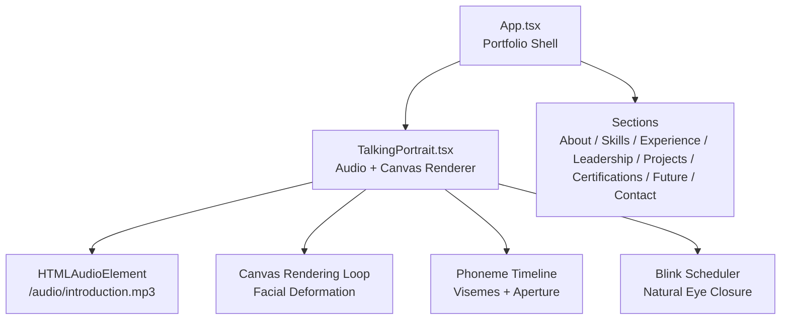
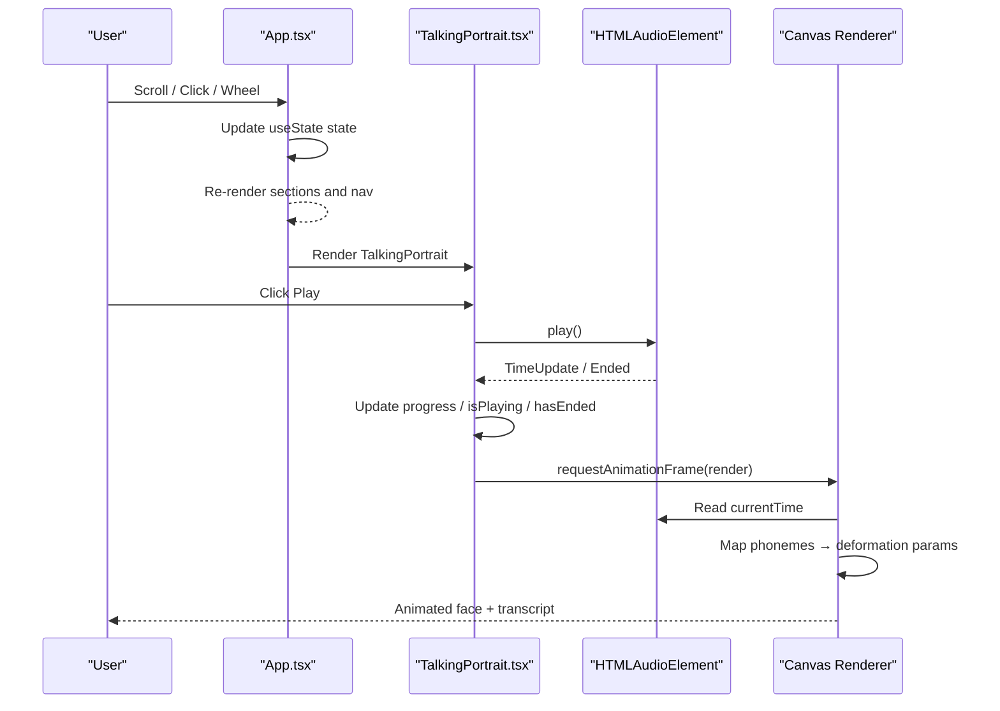
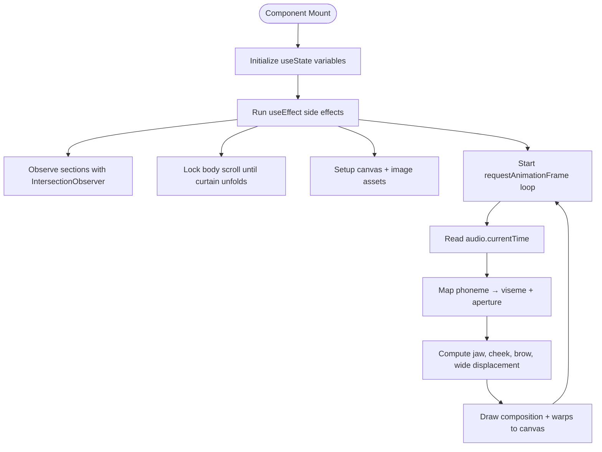
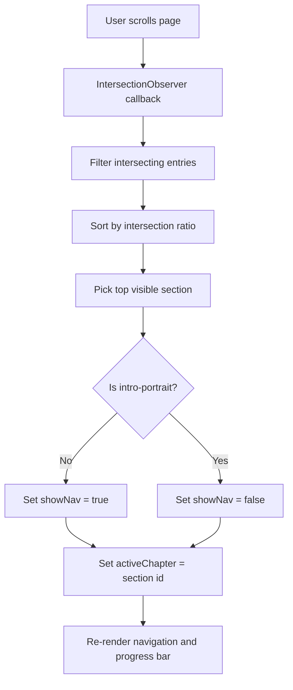
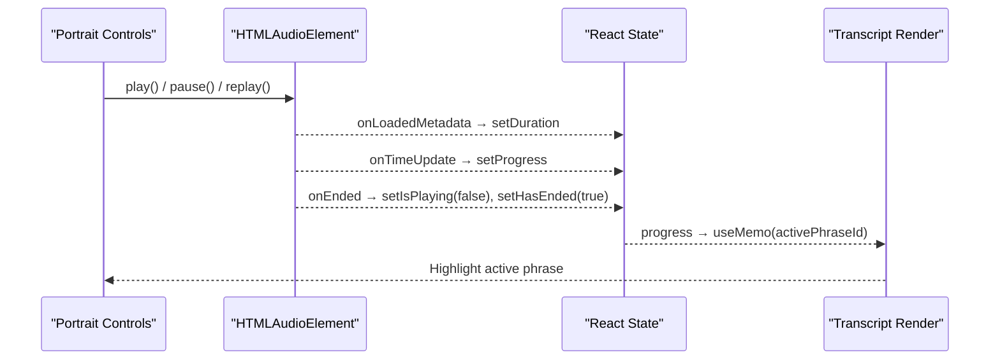
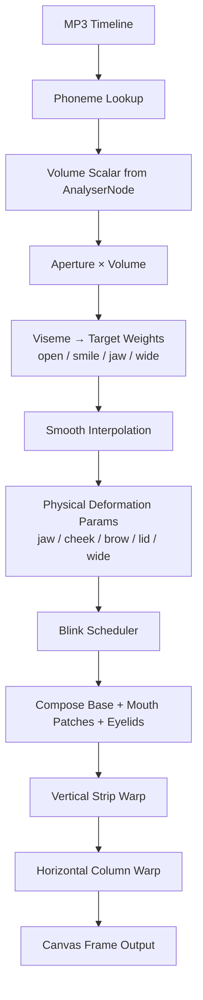
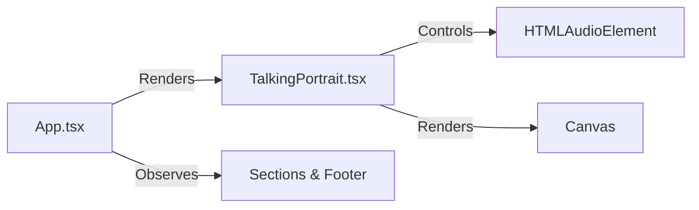
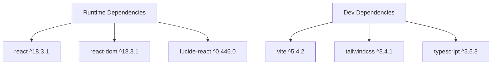

# Data Flow Architecture

<cite>
**Referenced Files in This Document**
- [App.tsx](file://src/App.tsx)
- [TalkingPortrait.tsx](file://src/components/TalkingPortrait.tsx)
- [package.json](file://package.json)
</cite>

## Table of Contents
1. [Introduction](#introduction)
2. [Project Structure](#project-structure)
3. [Core Components](#core-components)
4. [Architecture Overview](#architecture-overview)
5. [Detailed Component Analysis](#detailed-component-analysis)
6. [Dependency Analysis](#dependency-analysis)
7. [Performance Considerations](#performance-considerations)
8. [Troubleshooting Guide](#troubleshooting-guide)
9. [Conclusion](#conclusion)

## Introduction
This document explains the data flow architecture of the Levi Portfolio system with a focus on unidirectional state updates, event-driven communication, and real-time audio-to-animation synchronization. The application uses React hooks for state management and a canvas-based rendering loop for facial deformation driven by an MP3 timeline.

Key responsibilities:
- `App.tsx` manages global portfolio navigation, scroll position tracking, section visibility, and user interaction state.
- `TalkingPortrait.tsx` owns audio playback, phoneme timeline processing, blink scheduling, and physical facial deformation parameters.
- The data flow is strictly unidirectional: user events update local or parent state, which then flows down to child components and side effects such as canvas rendering and DOM observation.

## Project Structure
The runtime UI is composed of two main React files:
- Application shell and portfolio sections live in `src/App.tsx`.
- The talking portrait component lives in `src/components/TalkingPortrait.tsx`.

**Diagram sources**
- [App.tsx:42-92](file://src/App.tsx#L42-L92)
- [TalkingPortrait.tsx:318-746](file://src/components/TalkingPortrait.tsx#L318-L746)

**Section sources**
- [App.tsx:10-21](file://src/App.tsx#L10-L21)
- [App.tsx:42-92](file://src/App.tsx#L42-L92)
- [TalkingPortrait.tsx:318-338](file://src/components/TalkingPortrait.tsx#L318-L338)

## Core Components
- **Application State Manager (`App.tsx`)**
  - Manages chapter navigation, navigation visibility, curtain unfold state, and mouse-driven name offset.
  - Uses `useState` for reactive UI state and `useEffect` for browser-side effects like scroll locking and intersection observation.
  - Uses `useMemo` to compute the active chapter index from the active chapter id.

- **Talking Portrait Controller (`TalkingPortrait.tsx`)**
  - Owns audio playback state, progress, duration, and end-of-playback state.
  - Initializes Web Audio API analyser nodes for real-time volume estimation.
  - Drives a `requestAnimationFrame` loop that maps phonemes to facial deformation parameters and renders frames to a canvas.
  - Synchronizes transcript highlighting using computed phrase indices derived from current progress.

**Section sources**
- [App.tsx:42-92](file://src/App.tsx#L42-L92)
- [App.tsx:87-92](file://src/App.tsx#L87-L92)
- [TalkingPortrait.tsx:318-368](file://src/components/TalkingPortrait.tsx#L318-L368)

## Architecture Overview
The system follows a unidirectional data flow pattern:
1. User interactions (scroll, click, wheel, mouse move) trigger state updates via React hooks.
2. State changes cause re-renders and side effects.
3. Side effects interact with the browser APIs (DOM, IntersectionObserver, AudioContext, Canvas).
4. Real-time loops read authoritative sources (audio time, analyser frequency data) and compute visual outputs without mutating shared mutable state directly.

**Diagram sources**
- [App.tsx:49-92](file://src/App.tsx#L49-L92)
- [TalkingPortrait.tsx:318-368](file://src/components/TalkingPortrait.tsx#L318-L368)
- [TalkingPortrait.tsx:434-608](file://src/components/TalkingPortrait.tsx#L434-L608)
- [TalkingPortrait.tsx:610-746](file://src/components/TalkingPortrait.tsx#L610-L746)

## Detailed Component Analysis

### Unidirectional State Management with React Hooks
- `useState` holds UI state:
  - App-level: active chapter, navigation open/close, show/hide nav, curtain unfolded, name offset.
  - Portrait-level: playing state, ended state, duration, progress.
- `useEffect` handles side effects:
  - Scroll lock until curtain unfolds.
  - Section tracking via `IntersectionObserver`.
  - Scroll-reveal animations.
  - Canvas initialization and animation loop lifecycle.
- `useMemo` computes derived values:
  - Active chapter index based on active chapter id.
  - Active phrase id based on current progress.

**Diagram sources**
- [App.tsx:49-92](file://src/App.tsx#L49-L92)
- [TalkingPortrait.tsx:370-608](file://src/components/TalkingPortrait.tsx#L370-L608)

**Section sources**
- [App.tsx:42-92](file://src/App.tsx#L42-L92)
- [TalkingPortrait.tsx:318-368](file://src/components/TalkingPortrait.tsx#L318-L368)

### Scroll Position Tracking and Section Navigation State
- The app locks scrolling while the intro curtain is visible.
- An `IntersectionObserver` tracks which section is most visible and updates `activeChapter`.
- When the intro portrait section is visible, the navigation is hidden; otherwise, it is shown.
- Smooth scrolling is triggered by navigation buttons.

**Diagram sources**
- [App.tsx:49-75](file://src/App.tsx#L49-L75)
- [App.tsx:87-92](file://src/App.tsx#L87-L92)

**Section sources**
- [App.tsx:49-75](file://src/App.tsx#L49-L75)
- [App.tsx:87-92](file://src/App.tsx#L87-L92)

### Audio Playback Synchronization and Transcript Highlighting
- The portrait component controls an HTML audio element and exposes play/pause/replay actions.
- On metadata load, duration is set; on time update, progress is updated; on ended, playback state transitions to finished.
- The active phrase is computed from progress against predefined phrase intervals.
- The transcript UI highlights the active phrase and marks past phrases.

**Diagram sources**
- [TalkingPortrait.tsx:334-338](file://src/components/TalkingPortrait.tsx#L334-L338)
- [TalkingPortrait.tsx:610-746](file://src/components/TalkingPortrait.tsx#L610-L746)

**Section sources**
- [TalkingPortrait.tsx:334-338](file://src/components/TalkingPortrait.tsx#L334-L338)
- [TalkingPortrait.tsx:610-746](file://src/components/TalkingPortrait.tsx#L610-L746)

### Data Transformation Pipeline: Raw Audio Input to Facial Deformation Parameters
The pipeline transforms raw audio timing into realistic facial motion:
1. **Timeline Source**: The MP3 file is the authoritative source for speech timing.
2. **Phoneme Lookup**: For each frame, the current audio time is matched against a phoneme timeline containing start/end times, viseme type, and aperture value.
3. **Volume Scaling**: Real-time frequency analysis provides a subtle volume scalar that modulates aperture values.
4. **Target Articulation Mapping**: Each viseme maps to target mouth shapes: open, smile, round, narrow, closed. These targets influence open-mouth weight, smile weight, jaw drop, and horizontal lip stretch/pucker.
5. **Smooth Interpolation**: Targets are smoothed over time to avoid abrupt jumps.
6. **Physical Deformation Parameters**: Computed parameters include jaw displacement, cheek lift, brow movement, lower-lid response, and horizontal lip-wide displacement.
7. **Blink Scheduling**: Natural blinks are scheduled during speech pauses and between blinks with randomized timing.
8. **Composition and Warping**: The base photo is composited with authentic mouth patches and eyelid overlays, then vertically and horizontally warped according to computed parameters.

**Diagram sources**
- [TalkingPortrait.tsx:100-216](file://src/components/TalkingPortrait.tsx#L100-L216)
- [TalkingPortrait.tsx:340-368](file://src/components/TalkingPortrait.tsx#L340-L368)
- [TalkingPortrait.tsx:434-608](file://src/components/TalkingPortrait.tsx#L434-L608)

**Section sources**
- [TalkingPortrait.tsx:100-216](file://src/components/TalkingPortrait.tsx#L100-L216)
- [TalkingPortrait.tsx:340-368](file://src/components/TalkingPortrait.tsx#L340-L368)
- [TalkingPortrait.tsx:434-608](file://src/components/TalkingPortrait.tsx#L434-L608)

### Event-Driven Communication Patterns Between Components
- Parent-child communication occurs through props and controlled state:
  - `App.tsx` renders `TalkingPortrait` inside the intro section.
  - `TalkingPortrait` owns its own internal state and does not expose complex control methods to the parent.
- Cross-cutting concerns are handled locally:
  - Scroll and navigation state remain in `App.tsx`.
  - Audio and canvas state remain in `TalkingPortrait.tsx`.
- There is no global store; state is localized and flows downward where needed.

**Diagram sources**
- [App.tsx:142-144](file://src/App.tsx#L142-L144)
- [TalkingPortrait.tsx:727-746](file://src/components/TalkingPortrait.tsx#L727-L746)

**Section sources**
- [App.tsx:142-144](file://src/App.tsx#L142-L144)
- [TalkingPortrait.tsx:727-746](file://src/components/TalkingPortrait.tsx#L727-L746)

### State Synchronization Mechanisms
- **Audio-driven state**: Progress is synchronized from `audio.currentTime` via `onTimeUpdate`.
- **Derived state**: Active phrase id is computed from progress using `useMemo`.
- **Side-effect synchronization**: The render loop reads audio time directly rather than relying solely on React state, ensuring smooth animation even when React updates lag behind audio timing.
- **Browser API synchronization**: IntersectionObserver keeps navigation state aligned with scroll position.

**Section sources**
- [TalkingPortrait.tsx:334-338](file://src/components/TalkingPortrait.tsx#L334-L338)
- [TalkingPortrait.tsx:434-441](file://src/components/TalkingPortrait.tsx#L434-L441)
- [App.tsx:60-75](file://src/App.tsx#L60-L75)

### Performance Considerations for Large-Scale Data Updates
- **Minimize React re-renders**:
  - Use `useMemo` for derived values like active chapter index and active phrase id.
  - Keep high-frequency updates out of React state where possible; use refs for mutable values accessed in the render loop.
- **Efficient canvas rendering**:
  - Offscreen buffers are used for composition and warping to reduce redundant drawing operations.
  - Vertical and horizontal warps are conditionally applied only when necessary.
- **Audio analysis cost control**:
  - Frequency data is sampled within the render loop but limited to a small frequency range for volume estimation.
- **Scroll observation efficiency**:
  - IntersectionObserver thresholds and root margins reduce unnecessary callbacks.
- **Asset loading**:
  - Images are loaded once and reused; the render loop waits for images to be complete before drawing.

**Section sources**
- [App.tsx:87-92](file://src/App.tsx#L87-L92)
- [TalkingPortrait.tsx:334-338](file://src/components/TalkingPortrait.tsx#L334-L338)
- [TalkingPortrait.tsx:393-402](file://src/components/TalkingPortrait.tsx#L393-L402)
- [TalkingPortrait.tsx:585-601](file://src/components/TalkingPortrait.tsx#L585-L601)
- [TalkingPortrait.tsx:360-368](file://src/components/TalkingPortrait.tsx#L360-L368)
- [App.tsx:60-75](file://src/App.tsx#L60-L75)

## Dependency Analysis
The project depends on React and ReactDOM, with Vite as the build tool. Optional image processing libraries are present in dev dependencies but are not used by the runtime UI.

**Diagram sources**
- [package.json:13-34](file://package.json#L13-L34)

**Section sources**
- [package.json:1-37](file://package.json#L1-L37)

## Performance Considerations
- Prefer local state and refs for high-frequency updates to avoid excessive re-renders.
- Batch UI updates where possible; for example, update progress less frequently if needed for very large datasets.
- Use conditional rendering and memoization to prevent unnecessary recalculations.
- Keep canvas operations minimal per frame; reuse offscreen canvases and avoid heavy pixel manipulation unless required.
- Monitor memory usage for large image assets and ensure proper cleanup of observers and animation frames.

[No sources needed since this section provides general guidance]

## Troubleshooting Guide
Common issues and their likely causes:
- **AudioContext suspended**: Some browsers require user gesture to resume AudioContext. Ensure play is triggered by user interaction and handle suspension gracefully.
- **Playback errors**: Network failures or missing audio files can cause playback errors; check console warnings and verify asset paths.
- **Canvas not rendering**: If images are not loaded, the render loop may skip drawing; ensure assets exist and are accessible.
- **Navigation not updating**: Verify that section elements have correct ids and that IntersectionObserver is observing them.
- **Stuttering animation**: Excessive DOM updates or heavy canvas operations can cause jank; consider reducing update frequency or optimizing draw calls.

**Section sources**
- [TalkingPortrait.tsx:340-358](file://src/components/TalkingPortrait.tsx#L340-L358)
- [TalkingPortrait.tsx:610-648](file://src/components/TalkingPortrait.tsx#L610-L648)
- [App.tsx:60-75](file://src/App.tsx#L60-L75)

## Conclusion
The Levi Portfolio system implements a clean, unidirectional data flow using React hooks and browser APIs. State updates originate from user interactions and cascade through the component tree, while real-time audio drives facial deformation through a well-defined transformation pipeline. The architecture balances simplicity and performance by keeping high-frequency logic in refs and canvas loops, minimizing React re-renders, and leveraging efficient observation patterns for scroll and navigation state.

[No sources needed since this section summarizes without analyzing specific files]