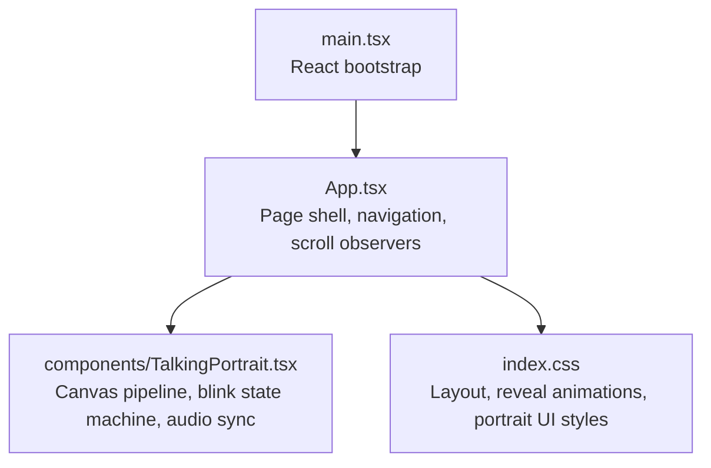
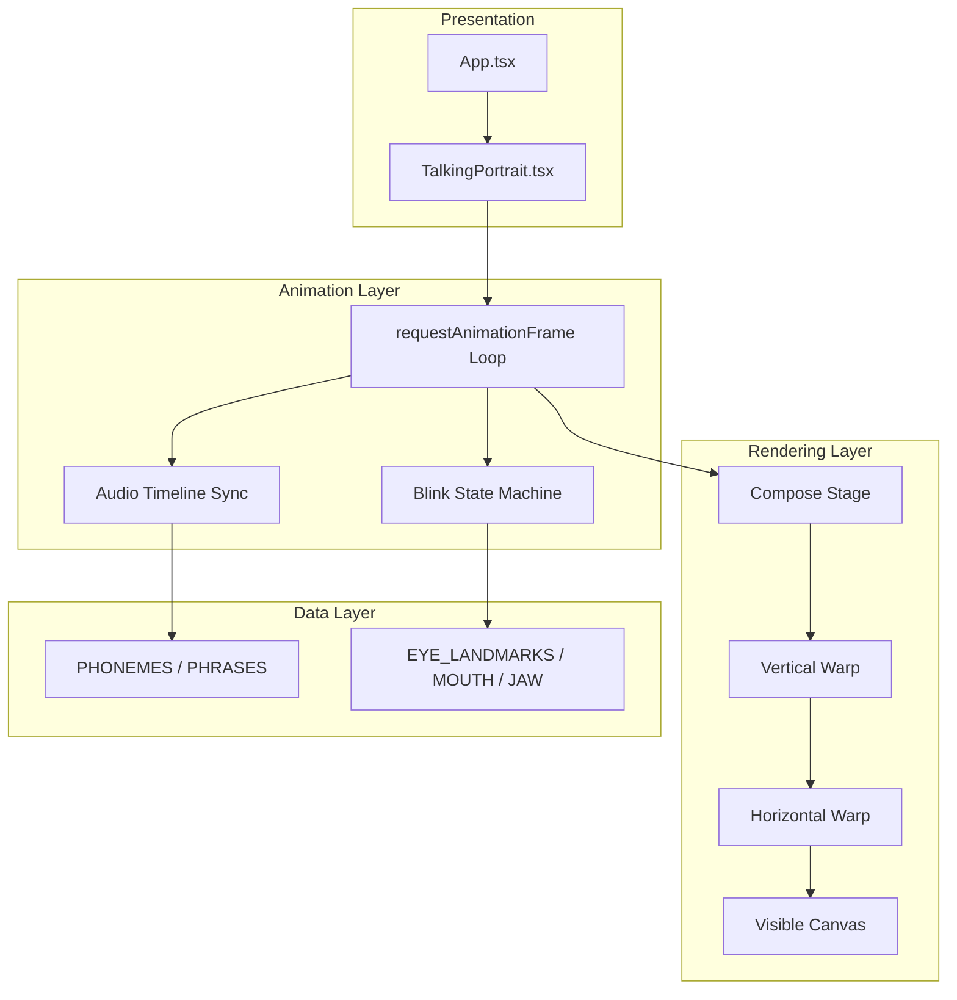
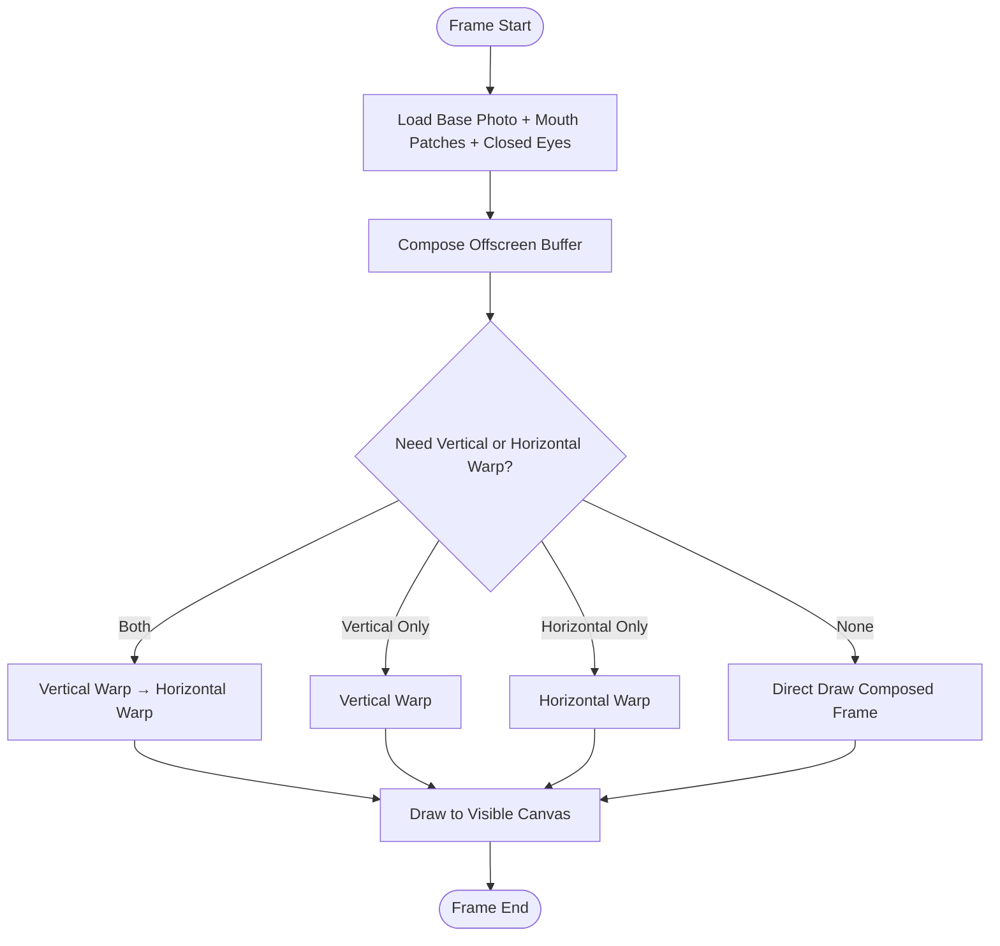
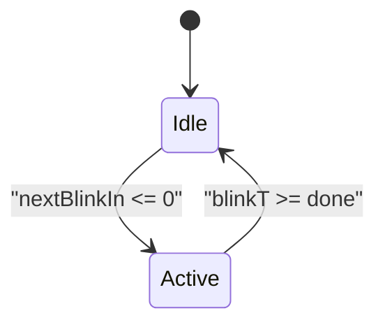
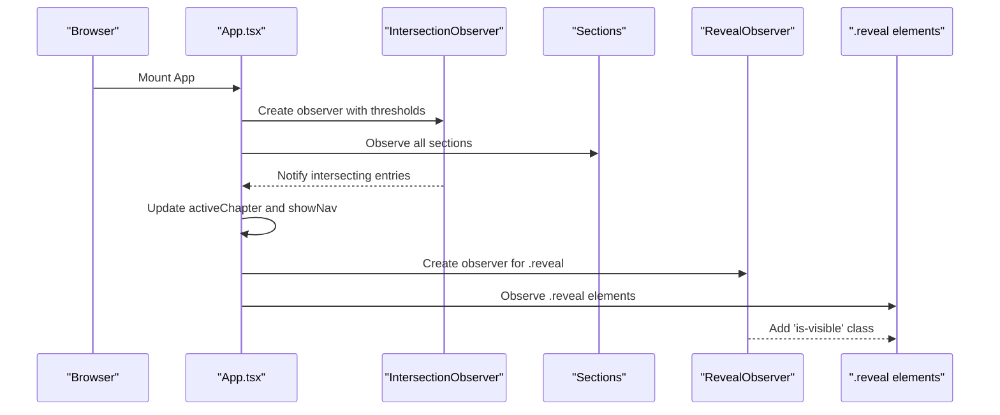
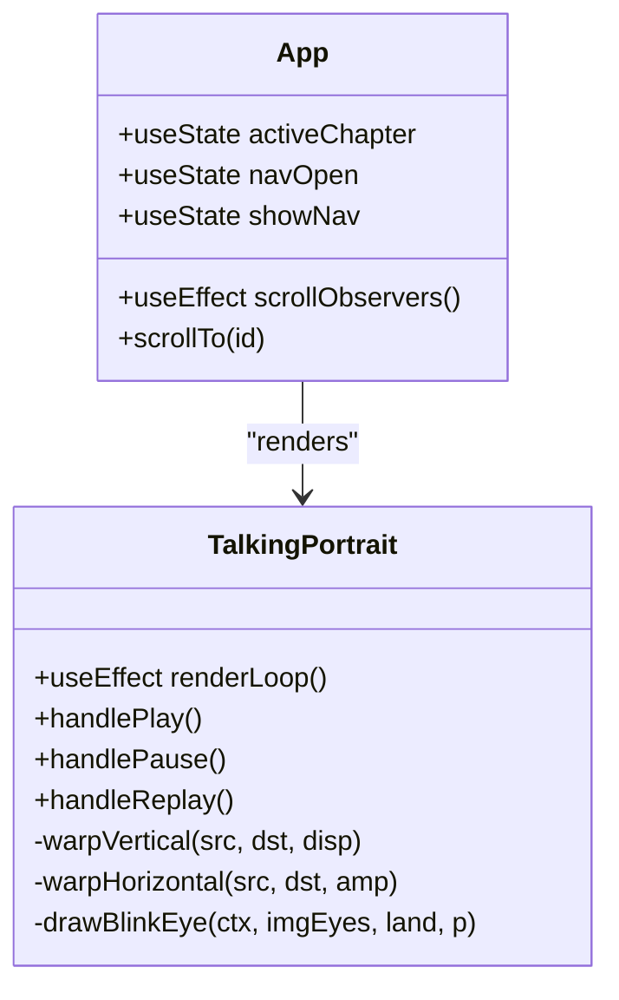
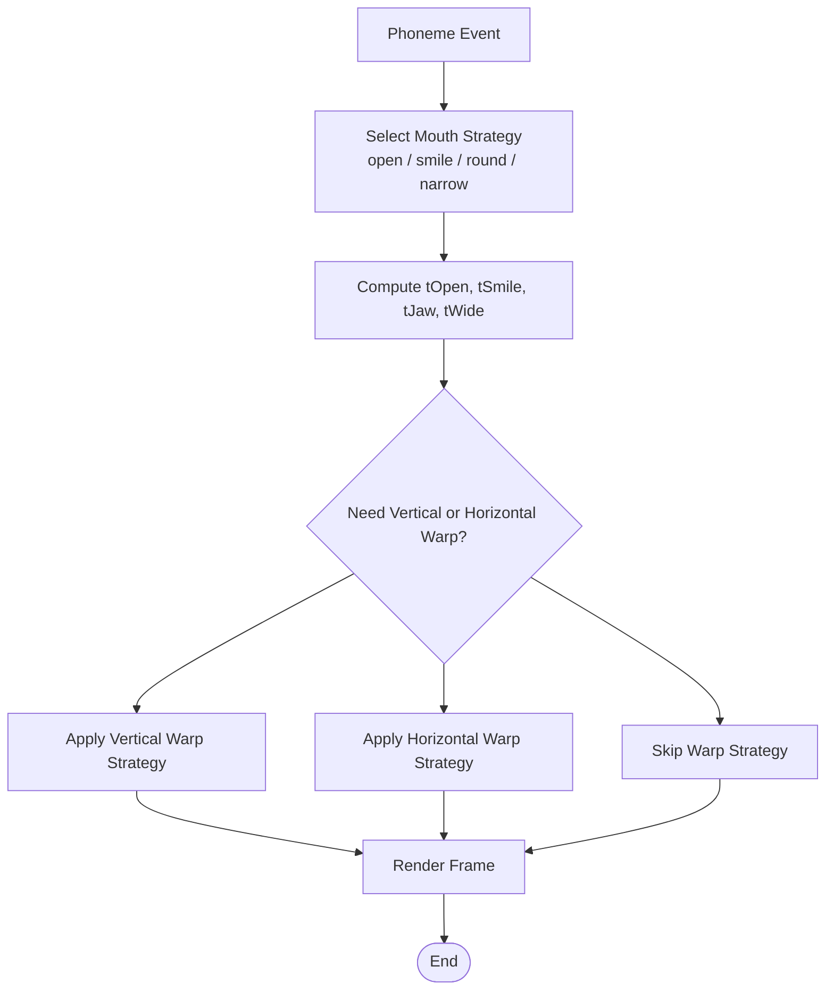
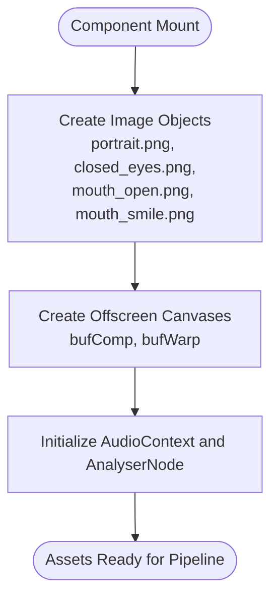
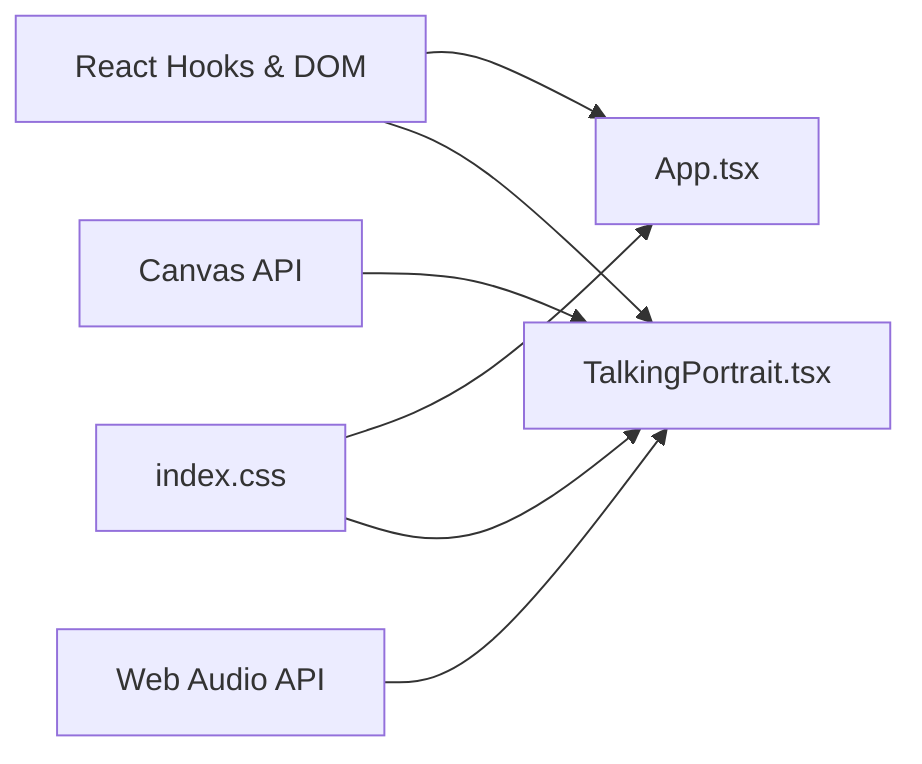

# Design Patterns

<cite>
**Referenced Files in This Document**
- [App.tsx](file://src/App.tsx)
- [TalkingPortrait.tsx](file://src/components/TalkingPortrait.tsx)
- [main.tsx](file://src/main.tsx)
- [index.css](file://src/index.css)
</cite>

## Table of Contents
1. [Introduction](#introduction)
2. [Project Structure](#project-structure)
3. [Core Components](#core-components)
4. [Architecture Overview](#architecture-overview)
5. [Detailed Component Analysis](#detailed-component-analysis)
6. [Dependency Analysis](#dependency-analysis)
7. [Performance Considerations](#performance-considerations)
8. [Troubleshooting Guide](#troubleshooting-guide)
9. [Conclusion](#conclusion)

## Introduction
This document explains the design patterns implemented in the Levi Portfolio system and shows how they improve maintainability, testability, and extensibility. The portfolio is a React application with:
- A scroll-driven layout that tracks sections and reveals content on intersection.
- A photorealistic talking portrait component that composes images, warps geometry, animates blinks, and syncs mouth movement to audio.
- A clean separation between page composition, animation orchestration, and visual rendering.

The key patterns documented here are:
- Pipeline Pattern for image processing.
- State Machine Pattern for blink control.
- Observer Pattern for scroll-triggered animations using IntersectionObserver.
- Component-Based Architecture for clear separation of concerns.
- Strategy Pattern for different animation modes.
- Factory Pattern for asset loading.

## Project Structure
At runtime, the application entry point renders the root React tree, which mounts the main `App` component. The `App` component owns navigation, section tracking, and scroll-reveal behavior, while delegating the animated portrait to a dedicated component.

**Diagram sources**
- [main.tsx:6-10](file://src/main.tsx#L6-L10)
- [App.tsx:42-92](file://src/App.tsx#L42-L92)
- [TalkingPortrait.tsx:318-370](file://src/components/TalkingPortrait.tsx#L318-L370)
- [index.css:81-83](file://src/index.css#L81-L83)

**Section sources**
- [main.tsx:1-11](file://src/main.tsx#L1-L11)
- [App.tsx:1-100](file://src/App.tsx#L1-L100)
- [TalkingPortrait.tsx:1-370](file://src/components/TalkingPortrait.tsx#L1-L370)
- [index.css:1-83](file://src/index.css#L1-L83)

## Core Components
- App: orchestrates chapter navigation, scroll locking during the intro curtain, active section detection, and scroll-reveal animations.
- TalkingPortrait: implements the core animation pipeline, audio synchronization, and realistic facial deformation.
- index.css: provides reusable animation classes such as `.reveal` and `.is-visible`, plus portrait-specific UI styling.

Key responsibilities:
- Navigation and chapter progress live in `App`.
- Canvas rendering, warp functions, and blink logic live in `TalkingPortrait`.
- Visual transitions and responsive layout live in `index.css`.

**Section sources**
- [App.tsx:42-92](file://src/App.tsx#L42-L92)
- [TalkingPortrait.tsx:318-608](file://src/components/TalkingPortrait.tsx#L318-L608)
- [index.css:81-83](file://src/index.css#L81-L83)

## Architecture Overview
The system follows a layered architecture:
- Presentation layer: React components render the UI.
- Animation layer: requestAnimationFrame loop drives frame-by-frame updates.
- Rendering layer: offscreen canvases compose and deform images before drawing to the visible canvas.
- Data layer: phoneme timelines, phrase transcripts, and eye/mouth landmarks drive animation parameters.

**Diagram sources**
- [App.tsx:60-85](file://src/App.tsx#L60-L85)
- [TalkingPortrait.tsx:370-608](file://src/components/TalkingPortrait.tsx#L370-L608)
- [TalkingPortrait.tsx:100-216](file://src/components/TalkingPortrait.tsx#L100-L216)
- [TalkingPortrait.tsx:41-63](file://src/components/TalkingPortrait.tsx#L41-L63)

## Detailed Component Analysis

### Pipeline Pattern in Image Processing
The talking portrait uses a strict image-processing pipeline:
- Compose stage: base photo + authentic photographic patches (mouth open/smile) + traveling-lid blink overlay.
- Vertical warp: per-row displacement for jaw drop, cheek lift, brow micro-motion, and lower-lid response.
- Horizontal warp: lip-corner stretch or pucker around the mouth with gaussian falloff.
- Render stage: draw the final deformed frame to the visible canvas.

**Diagram sources**
- [TalkingPortrait.tsx:380-402](file://src/components/TalkingPortrait.tsx#L380-L402)
- [TalkingPortrait.tsx:549-601](file://src/components/TalkingPortrait.tsx#L549-L601)

Benefits:
- Maintainability: Each stage is isolated; changes to one warp do not affect others.
- Testability: Warp functions can be unit-tested independently with fixed inputs.
- Performance: Conditional execution avoids unnecessary warps when no motion is required.

Implementation highlights:
- Compose stage draws base image, mouth patches, and blink overlays into an offscreen buffer.
- Vertical warp applies row-wise displacement based on computed windows for brow, lid, cheek, and jaw.
- Horizontal warp applies column-wise displacement around the mouth center.
- Render stage chooses the minimal path: direct draw, vertical-only, horizontal-only, or both warps.

**Section sources**
- [TalkingPortrait.tsx:370-402](file://src/components/TalkingPortrait.tsx#L370-L402)
- [TalkingPortrait.tsx:549-601](file://src/components/TalkingPortrait.tsx#L549-L601)
- [TalkingPortrait.tsx:270-316](file://src/components/TalkingPortrait.tsx#L270-L316)

### State Machine Pattern for Blink Animation Control
The blink system is modeled as a finite state machine with two states:
- Idle: waiting until the next random interval triggers a blink.
- Active: executing a three-phase blink curve (close → hold → reopen), including randomized timing and inter-ocular lead.

**Diagram sources**
- [TalkingPortrait.tsx:410-432](file://src/components/TalkingPortrait.tsx#L410-L432)
- [TalkingPortrait.tsx:486-507](file://src/components/TalkingPortrait.tsx#L486-L507)

Behavioral details:
- Closing duration, closed hold, and reopening duration are randomized per blink.
- One eye may lead slightly to simulate natural asymmetry.
- Double blinks occur occasionally to increase realism.
- Speech pauses trigger additional blinks aligned with the audio timeline.

Benefits:
- Predictability: Blink phases are explicit and bounded by durations.
- Extensibility: New blink behaviors (e.g., surprise blinks) can be added without changing idle logic.
- Testability: State transitions and timing curves can be verified deterministically.

**Section sources**
- [TalkingPortrait.tsx:410-432](file://src/components/TalkingPortrait.tsx#L410-L432)
- [TalkingPortrait.tsx:486-507](file://src/components/TalkingPortrait.tsx#L486-L507)
- [TalkingPortrait.tsx:217-225](file://src/components/TalkingPortrait.tsx#L217-L225)

### Observer Pattern for Scroll-Triggered Animations
Scroll interactions use the Observer Pattern via `IntersectionObserver`:
- Section observer: detects which section is most visible and updates the active chapter and navigation visibility.
- Reveal observer: adds a CSS class to elements marked for reveal when they enter the viewport.

**Diagram sources**
- [App.tsx:60-85](file://src/App.tsx#L60-L85)

Benefits:
- Decoupling: Scroll events are handled declaratively through observers rather than imperative listeners.
- Scalability: New sections and reveal targets can be added without modifying core logic.
- Performance: Observers batch intersection checks and avoid expensive scroll handlers.

**Section sources**
- [App.tsx:60-85](file://src/App.tsx#L60-L85)
- [index.css:81-83](file://src/index.css#L81-L83)

### Component-Based Architecture
The application separates concerns across components:
- App manages global state (active chapter, navigation visibility, unfold state).
- TalkingPortrait encapsulates all animation and rendering logic.
- CSS modules provide reusable animation utilities and layout rules.

**Diagram sources**
- [App.tsx:42-92](file://src/App.tsx#L42-L92)
- [TalkingPortrait.tsx:318-370](file://src/components/TalkingPortrait.tsx#L318-L370)
- [TalkingPortrait.tsx:270-316](file://src/components/TalkingPortrait.tsx#L270-L316)

Benefits:
- Cohesion: Each component owns its domain (navigation vs. animation).
- Coupling control: TalkingPortrait exposes only necessary methods and state.
- Reusability: Animation utilities like warp functions are internal but could be extracted if needed.

**Section sources**
- [App.tsx:42-92](file://src/App.tsx#L42-L92)
- [TalkingPortrait.tsx:318-370](file://src/components/TalkingPortrait.tsx#L318-L370)

### Strategy Pattern for Different Animation Modes
Different animation strategies are selected based on input conditions:
- Mouth shape strategy: phoneme type determines target weights for open, smile, jaw, and wide parameters.
- Warp selection strategy: decides whether to apply vertical warp, horizontal warp, both, or none.
- Blink strategy: selects timing parameters and inter-ocular lead per blink event.

**Diagram sources**
- [TalkingPortrait.tsx:442-484](file://src/components/TalkingPortrait.tsx#L442-L484)
- [TalkingPortrait.tsx:585-601](file://src/components/TalkingPortrait.tsx#L585-L601)

Benefits:
- Flexibility: New phoneme strategies or warp strategies can be added without altering existing logic.
- Clarity: Strategy selection is explicit and localized.
- Testability: Each strategy can be tested with representative inputs.

**Section sources**
- [TalkingPortrait.tsx:442-484](file://src/components/TalkingPortrait.tsx#L442-L484)
- [TalkingPortrait.tsx:585-601](file://src/components/TalkingPortrait.tsx#L585-L601)

### Factory Pattern for Asset Loading
Asset loading is centralized within the render effect:
- Base photo, closed eyes, mouth open, and mouth smile images are created and assigned sources.
- Offscreen canvases are created for compose and warp stages.
- Audio context and analyser nodes are initialized on first play.

**Diagram sources**
- [TalkingPortrait.tsx:380-402](file://src/components/TalkingPortrait.tsx#L380-L402)
- [TalkingPortrait.tsx:340-358](file://src/components/TalkingPortrait.tsx#L340-L358)

Benefits:
- Centralization: All resource creation happens in one place, reducing duplication.
- Lifecycle safety: Resources are tied to component lifecycle and cleaned up appropriately.
- Extensibility: New assets can be added by extending the factory block.

**Section sources**
- [TalkingPortrait.tsx:380-402](file://src/components/TalkingPortrait.tsx#L380-L402)
- [TalkingPortrait.tsx:340-358](file://src/components/TalkingPortrait.tsx#L340-L358)

## Dependency Analysis
The primary dependencies are:
- React hooks and DOM APIs used throughout App and TalkingPortrait.
- Canvas API for image composition and deformation.
- Web Audio API for audio analysis and playback control.
- CSS classes for reveal animations and portrait UI.

**Diagram sources**
- [App.tsx:1-92](file://src/App.tsx#L1-L92)
- [TalkingPortrait.tsx:1-370](file://src/components/TalkingPortrait.tsx#L1-L370)
- [index.css:81-83](file://src/index.css#L81-L83)

**Section sources**
- [App.tsx:1-92](file://src/App.tsx#L1-L92)
- [TalkingPortrait.tsx:1-370](file://src/components/TalkingPortrait.tsx#L1-L370)
- [index.css:1-83](file://src/index.css#L1-L83)

## Performance Considerations
- Conditional warping: The pipeline skips unnecessary warp operations when displacement is negligible.
- Offscreen buffers: Composition and deformation happen offscreen to minimize repaint cost.
- Micro-motion limits: Facial micro-motions are constrained to sub-pixel ranges to avoid visible jitter.
- Observer efficiency: IntersectionObserver reduces scroll handler overhead compared to raw scroll events.
- Audio sampling: Frequency data is sampled from a limited range to keep calculations lightweight.

[No sources needed since this section provides general guidance]

## Troubleshooting Guide
Common issues and resolutions:
- AudioContext suspended: Ensure user gesture initiates playback and resume the context before playing.
- Missing assets: Verify image paths and ensure assets are loaded before entering the render loop.
- Blink not triggering: Check nextBlinkIn countdown and blinkActive state transitions.
- Scroll observer not updating: Confirm sections have IDs and are observed correctly.
- Reveal animations not firing: Ensure elements have the `.reveal` class and the observer is attached after DOM readiness.

**Section sources**
- [TalkingPortrait.tsx:610-648](file://src/components/TalkingPortrait.tsx#L610-L648)
- [App.tsx:60-85](file://src/App.tsx#L60-L85)

## Conclusion
The Levi Portfolio system demonstrates practical usage of several design patterns:
- Pipeline Pattern structures image processing into clear, testable stages.
- State Machine Pattern models blink behavior with predictable transitions.
- Observer Pattern decouples scroll interactions from UI updates.
- Component-Based Architecture isolates concerns between navigation and animation.
- Strategy Pattern enables flexible selection of mouth shapes and warp operations.
- Factory Pattern centralizes asset initialization.

These patterns collectively improve maintainability, testability, and extensibility, making it straightforward to add new animation modes, assets, or scroll behaviors without disrupting existing functionality.

[No sources needed since this section summarizes without analyzing specific files]