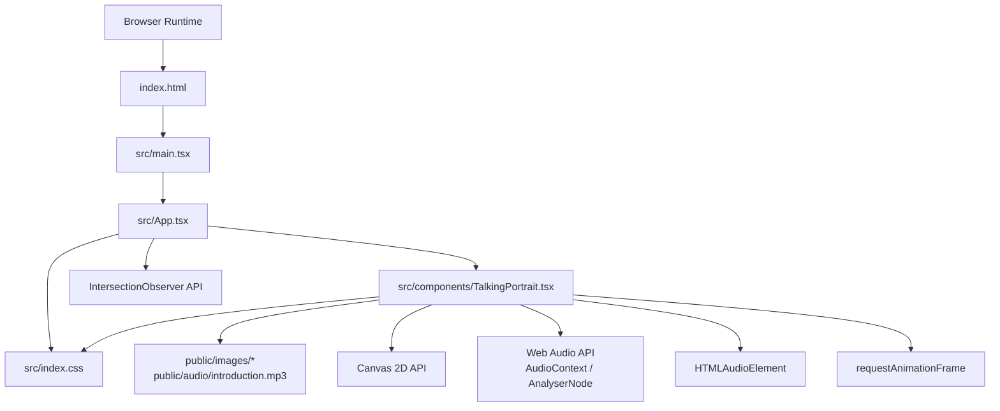
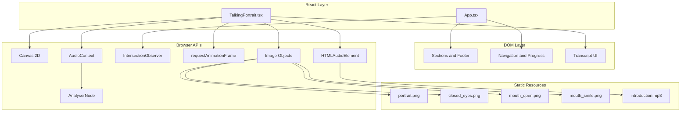
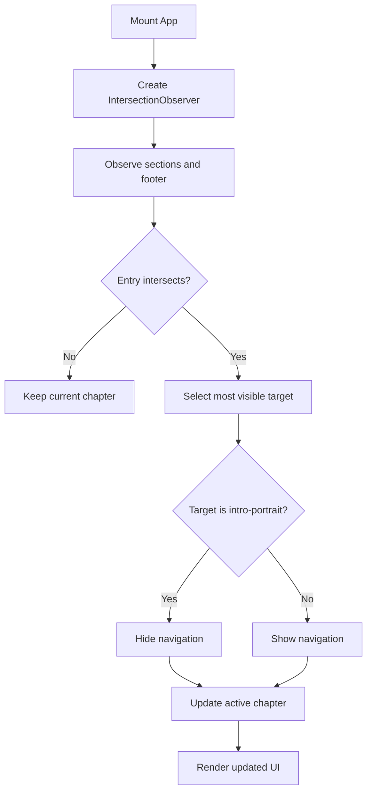
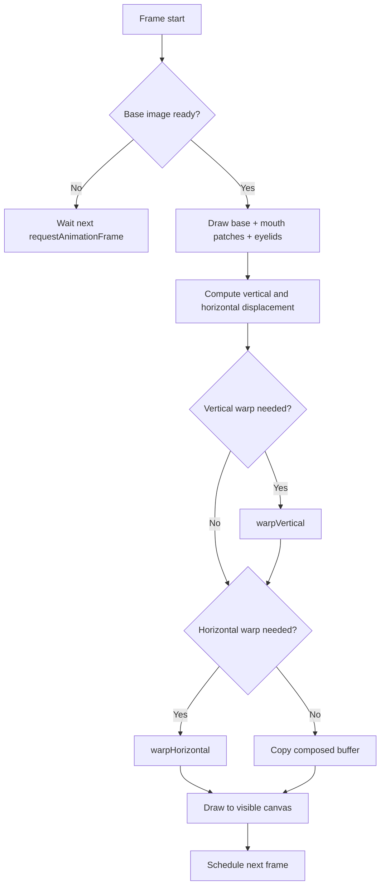
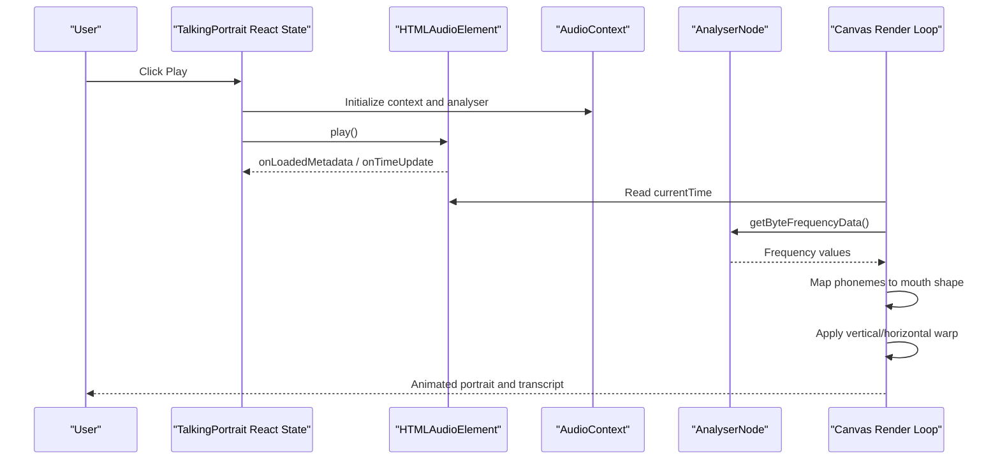
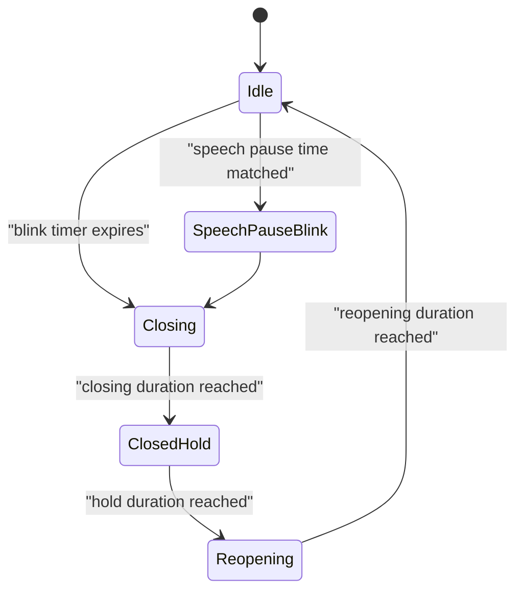
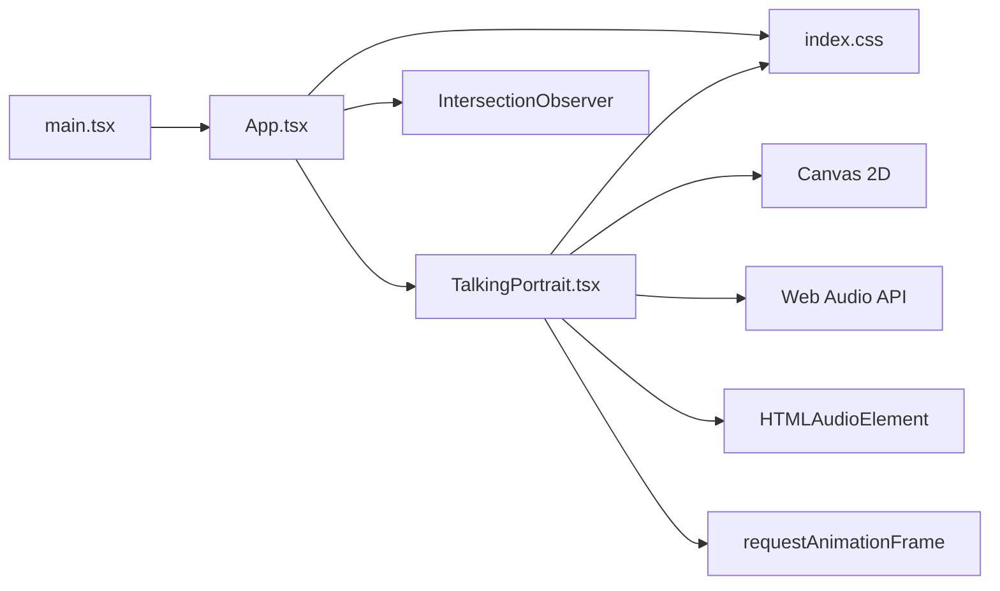

# System Boundaries & Integration

<cite>
**Referenced Files in This Document**
- [main.tsx](file://src/main.tsx)
- [App.tsx](file://src/App.tsx)
- [TalkingPortrait.tsx](file://src/components/TalkingPortrait.tsx)
- [index.css](file://src/index.css)
- [update_audio_trigger.cjs](file://tools/update_audio_trigger.cjs)
</cite>

## Table of Contents
1. [Introduction](#introduction)
2. [Project Structure](#project-structure)
3. [Core Components](#core-components)
4. [Architecture Overview](#architecture-overview)
5. [Detailed Component Analysis](#detailed-component-analysis)
6. [Dependency Analysis](#dependency-analysis)
7. [Performance Considerations](#performance-considerations)
8. [Security Boundaries](#security-boundaries)
9. [Error Handling and Fallbacks](#error-handling-and-fallbacks)
10. [Troubleshooting Guide](#troubleshooting-guide)
11. [Conclusion](#conclusion)

## Introduction
This document explains the system boundaries and external integrations for a React-based portfolio application that renders an animated talking portrait, tracks scroll sections with Intersection Observer, and synchronizes audio playback with visual animation. The focus is on:

- Where the React application layer ends and browser-native APIs begin.
- How Canvas rendering, Audio API, Intersection Observer, and static asset loading cross system boundaries.
- Error handling strategies, fallback behavior, and security considerations.
- Performance isolation between UI state, animation loops, and media pipelines.
- Data exchange points and boundary-crossing protocols that keep the system stable and maintainable.

The application is intentionally small: `main.tsx` mounts React, `App.tsx` owns page layout and scroll tracking, and `TalkingPortrait.tsx` owns the canvas animation, audio synchronization, and transcript display.

## Project Structure
At runtime, the application follows this entry and component flow:

**Diagram sources**
- [main.tsx:1-11](file://src/main.tsx#L1-L11)
- [App.tsx:1-727](file://src/App.tsx#L1-L727)
- [TalkingPortrait.tsx:1-746](file://src/components/TalkingPortrait.tsx#L1-L746)
- [index.css:1-800](file://src/index.css#L1-L800)

**Section sources**
- [main.tsx:1-11](file://src/main.tsx#L1-L11)
- [App.tsx:1-727](file://src/App.tsx#L1-L727)
- [TalkingPortrait.tsx:1-746](file://src/components/TalkingPortrait.tsx#L1-L746)
- [index.css:1-800](file://src/index.css#L1-L800)

## Core Components
The system has three primary runtime responsibilities:

| Boundary | Owner | Responsibility | External API or Resource |
|---|---|---|---|
| Application shell | `App.tsx` | Chapter navigation, scroll locking, section visibility, progress bar, and portfolio layout | DOM, Intersection Observer, CSS classes |
| Portrait renderer | `TalkingPortrait.tsx` | Photorealistic face deformation, blink simulation, mouth patches, audio-reactive volume scaling, transcript sync | Canvas 2D, Web Audio API, HTMLAudioElement, Image objects |
| Entry point | `main.tsx` | Mounts React in strict mode and loads global styles | React DOM client |

Key integration patterns:

- **React to DOM**: `App.tsx` manipulates `document.body.style.overflow`, observes sections by ID, and scrolls into view.
- **React to Canvas**: `TalkingPortrait.tsx` creates offscreen canvases, draws image assets, applies vertical and horizontal warps, and renders frames via `requestAnimationFrame`.
- **React to Audio**: `TalkingPortrait.tsx` wraps an `<audio>` element with `AudioContext` and `AnalyserNode` to compute a real-time volume scalar used for mouth openness.
- **React to Intersection Observer**: `App.tsx` uses two observers: one for active chapter tracking and one for reveal animations.
- **Static asset boundary**: Images and MP3 are loaded from `/images/` and `/audio/`; their availability affects render readiness and playback.

**Section sources**
- [App.tsx:49-92](file://src/App.tsx#L49-L92)
- [TalkingPortrait.tsx:318-370](file://src/components/TalkingPortrait.tsx#L318-L370)
- [TalkingPortrait.tsx:371-608](file://src/components/TalkingPortrait.tsx#L371-L608)
- [main.tsx:1-11](file://src/main.tsx#L1-L11)

## Architecture Overview
The application can be viewed as layered boundaries:

**Diagram sources**
- [App.tsx:49-92](file://src/App.tsx#L49-L92)
- [App.tsx:101-727](file://src/App.tsx#L101-L727)
- [TalkingPortrait.tsx:318-370](file://src/components/TalkingPortrait.tsx#L318-L370)
- [TalkingPortrait.tsx:371-608](file://src/components/TalkingPortrait.tsx#L371-L608)
- [TalkingPortrait.tsx:650-745](file://src/components/TalkingPortrait.tsx#L650-L745)

## Detailed Component Analysis

### React Application Shell: `App.tsx`
`App.tsx` is the top-level React component. It manages:

- Scroll lock until the curtain unfolds.
- Active chapter selection based on visible sections.
- Navigation visibility and smooth scrolling.
- Rendering of portfolio sections, including the embedded `TalkingPortrait` component.

#### Section Tracking with Intersection Observer
`App.tsx` creates an observer that:

- Filters entries by `isIntersecting`.
- Sorts by intersection ratio.
- Updates `activeChapter` and `showNav`.
- Hides navigation when the intro portrait section is visible.
- Observes all `section[id]` and `footer[id]` elements.

**Diagram sources**
- [App.tsx:60-75](file://src/App.tsx#L60-L75)

#### Curtain and Scroll Lock
Before the curtain unfolds, `App.tsx`:

- Sets `document.body.style.overflow = 'hidden'`.
- Adds a wheel listener that triggers unfolding.
- Clears overflow after a timeout once unfolded.

This is a direct DOM boundary crossing controlled by React state.

**Section sources**
- [App.tsx:49-58](file://src/App.tsx#L49-L58)
- [App.tsx:60-75](file://src/App.tsx#L60-L75)
- [App.tsx:87-92](file://src/App.tsx#L87-L92)
- [App.tsx:101-144](file://src/App.tsx#L101-L144)

### Talking Portrait Renderer: `TalkingPortrait.tsx`
`TalkingPortrait.tsx` is the most complex boundary-crossing component. It integrates:

- Canvas 2D for compositing and deforming photographic assets.
- Web Audio API for frequency analysis and volume-based animation scaling.
- HTMLAudioElement for authoritative timeline control.
- Image objects for base portrait, closed eyes, open mouth, and smile mouth assets.
- `requestAnimationFrame` for a high-frequency render loop.

#### Canvas Rendering Pipeline
The render pipeline has four stages:

1. **Compose stage**: Draw base portrait, mouth patches, and traveling eyelid overlay into an offscreen canvas.
2. **Vertical warp**: Apply jaw drop, brow micro-motion, cheek lift, and lower-lid response per row.
3. **Horizontal warp**: Apply lip-corner stretch or pucker around the mouth.
4. **Screen draw**: Copy the final frame to the visible canvas.

**Diagram sources**
- [TalkingPortrait.tsx:371-408](file://src/components/TalkingPortrait.tsx#L371-L408)
- [TalkingPortrait.tsx:549-608](file://src/components/TalkingPortrait.tsx#L549-L608)

#### Audio Reactivity and Timeline Synchronization
The component treats the MP3 timeline as authoritative:

- `HTMLAudioElement` provides `currentTime`, `duration`, `onLoadedMetadata`, `onTimeUpdate`, and `onEnded`.
- `AudioContext` and `AnalyserNode` extract frequency data to compute a volume scalar.
- Phoneme events map time ranges to mouth shapes: open, smile, round, narrow, closed.
- Blink timing is influenced by speech pauses and natural intervals.

**Diagram sources**
- [TalkingPortrait.tsx:340-368](file://src/components/TalkingPortrait.tsx#L340-L368)
- [TalkingPortrait.tsx:434-484](file://src/components/TalkingPortrait.tsx#L434-L484)
- [TalkingPortrait.tsx:610-648](file://src/components/TalkingPortrait.tsx#L610-L648)
- [TalkingPortrait.tsx:727-742](file://src/components/TalkingPortrait.tsx#L727-L742)

#### Blink and Micro-Motion Model
Blink behavior is modeled as a state machine:

- Randomized closing, hold, and reopening durations.
- Inter-ocular lead so one eye closes slightly before the other.
- Natural double blinks and breath-pause blinks during speech.
- Micro-saccades and slow head cadence add organic motion without visible shaking.

**Diagram sources**
- [TalkingPortrait.tsx:217-225](file://src/components/TalkingPortrait.tsx#L217-L225)
- [TalkingPortrait.tsx:423-432](file://src/components/TalkingPortrait.tsx#L423-L432)
- [TalkingPortrait.tsx:486-507](file://src/components/TalkingPortrait.tsx#L486-L507)

**Section sources**
- [TalkingPortrait.tsx:318-370](file://src/components/TalkingPortrait.tsx#L318-L370)
- [TalkingPortrait.tsx:371-608](file://src/components/TalkingPortrait.tsx#L371-L608)
- [TalkingPortrait.tsx:650-745](file://src/components/TalkingPortrait.tsx#L650-L745)

### Entry Point: `main.tsx`
`main.tsx` is minimal and focused:

- Imports React StrictMode and `createRoot`.
- Renders `App` into the DOM root.
- Loads global CSS.

It does not directly touch Canvas, Audio, or Intersection Observer; those responsibilities are delegated to child components.

**Section sources**
- [main.tsx:1-11](file://src/main.tsx#L1-L11)

## Dependency Analysis
The following diagram shows how modules depend on each other and on browser APIs:

**Diagram sources**
- [main.tsx:1-11](file://src/main.tsx#L1-L11)
- [App.tsx:1-727](file://src/App.tsx#L1-L727)
- [TalkingPortrait.tsx:1-746](file://src/components/TalkingPortrait.tsx#L1-L746)

**Section sources**
- [main.tsx:1-11](file://src/main.tsx#L1-L11)
- [App.tsx:1-727](file://src/App.tsx#L1-L727)
- [TalkingPortrait.tsx:1-746](file://src/components/TalkingPortrait.tsx#L1-L746)

## Performance Considerations
The system separates concerns to reduce contention between UI updates and heavy rendering:

| Concern | Strategy | Rationale |
|---|---|---|
| Animation loop | `requestAnimationFrame` inside a single effect | Keeps Canvas drawing synchronized with the compositor and avoids unnecessary redraws. |
| Offscreen buffers | Separate canvases for compose and warp stages | Reduces repeated expensive operations and allows conditional warp paths. |
| Audio analysis | `AnalyserNode` reads only a limited frequency range | Limits CPU cost while still providing meaningful volume feedback. |
| Scroll tracking | Intersection Observer with thresholds | Avoids polling and reduces layout thrash. |
| Asset readiness | Render loop waits for base image completion | Prevents blank or partially drawn frames. |
| Cleanup | Effect cleanup cancels animation frame and disconnects observers | Prevents memory leaks and stale timers. |

Potential optimization opportunities:

- Add explicit resource loading guards so the component does not start the render loop until all required images are complete.
- Debounce or throttle transcript updates if they become too frequent.
- Consider using `OffscreenCanvas` if the project grows beyond a single portrait.
- Centralize error logging for failed asset loads and audio playback.

[No sources needed since this section provides general guidance]

## Security Boundaries
The application primarily interacts with trusted local resources and standard browser APIs. Key security considerations include:

- **Static assets**: Images and audio are served from the `public` directory. There is no dynamic file upload or user-controlled URL injection in the analyzed code.
- **External links**: The portfolio includes links to GitHub and LinkedIn with `target="_blank"` and `rel="noopener noreferrer"`, reducing tab-nabbing risks.
- **Media autoplay policy**: Audio playback requires user gesture or browser permission; the component handles suspended `AudioContext` states and catches playback errors.
- **No File System access usage**: The analyzed source files do not use the File System Access API; audio and images are loaded through standard web resource mechanisms.
- **CSS and fonts**: Fonts are imported from Google Fonts; this is a third-party dependency that should be reviewed for supply-chain security.

Recommended security practices:

- Validate any future dynamic URLs or user-provided content.
- Use Content Security Policy headers to restrict script and media origins.
- Audit third-party font and icon dependencies.
- Avoid exposing sensitive metadata in public assets.

**Section sources**
- [App.tsx:248-256](file://src/App.tsx#L248-L256)
- [TalkingPortrait.tsx:340-358](file://src/components/TalkingPortrait.tsx#L340-L358)
- [TalkingPortrait.tsx:610-648](file://src/components/TalkingPortrait.tsx#L610-L648)

## Error Handling and Fallbacks
The current implementation uses lightweight error handling:

| Boundary | Current Behavior | Recommended Fallback |
|---|---|---|
| AudioContext setup | Catches exceptions and logs a warning | Disable audio-reactive features and fall back to non-audio mouth animation. |
| Audio playback | Catches `play()` errors and logs warnings | Show a user-facing message explaining autoplay restrictions. |
| Canvas context | Returns early if `getContext('2d')` fails | Gracefully degrade to a static portrait without animation. |
| Image assets | Waits for base image completion before drawing | Display a placeholder or skeleton while assets load. |
| Intersection Observer | Uses native API without explicit feature detection | Fall back to scroll event listeners if unsupported. |
| requestAnimationFrame | Used without explicit fallback | Fall back to `setTimeout` or CSS animations if unavailable. |

The existing code already isolates failures where possible:

- Audio initialization is wrapped in try/catch.
- Playback attempts are wrapped in try/catch.
- Render loop checks for canvas context and image readiness.
- Observers are disconnected in cleanup functions.

**Section sources**
- [TalkingPortrait.tsx:340-358](file://src/components/TalkingPortrait.tsx#L340-L358)
- [TalkingPortrait.tsx:371-378](file://src/components/TalkingPortrait.tsx#L371-L378)
- [TalkingPortrait.tsx:549-553](file://src/components/TalkingPortrait.tsx#L549-L553)
- [TalkingPortrait.tsx:610-648](file://src/components/TalkingPortrait.tsx#L610-L648)
- [App.tsx:60-75](file://src/App.tsx#L60-L75)

## Troubleshooting Guide

### Portrait Does Not Animate
**Likely causes:**

- Canvas context is unavailable.
- Base image has not loaded.
- `requestAnimationFrame` is blocked or paused.

**Checks:**

- Verify the canvas element exists and `getContext('2d')` succeeds.
- Confirm `/images/portrait.png` is available.
- Ensure the component is mounted and not unmounted prematurely.

**Section sources**
- [TalkingPortrait.tsx:371-378](file://src/components/TalkingPortrait.tsx#L371-L378)
- [TalkingPortrait.tsx:549-553](file://src/components/TalkingPortrait.tsx#L549-L553)

### Audio Plays but No Volume Reactivity
**Likely causes:**

- `AudioContext` creation failed.
- `AnalyserNode` is not connected.
- Browser autoplay policy suspended the context.

**Checks:**

- Look for warnings about `AudioContext` setup.
- Confirm the audio element is connected to the media element source.
- Resume suspended contexts on user interaction.

**Section sources**
- [TalkingPortrait.tsx:340-358](file://src/components/TalkingPortrait.tsx#L340-L358)
- [TalkingPortrait.tsx:610-648](file://src/components/TalkingPortrait.tsx#L610-L648)

### Transcript Does Not Highlight Correct Phrase
**Likely causes:**

- `progress` state is not updating.
- Time ranges in phrase definitions do not match audio duration.
- Audio metadata did not load correctly.

**Checks:**

- Verify `onLoadedMetadata` sets duration.
- Verify `onTimeUpdate` updates progress.
- Confirm phrase start/end times align with the MP3 timeline.

**Section sources**
- [TalkingPortrait.tsx:727-742](file://src/components/TalkingPortrait.tsx#L727-L742)

### Navigation or Chapter Tracking Is Broken
**Likely causes:**

- Intersection Observer is not observing elements.
- Section IDs do not match expected values.
- Navigation visibility logic hides UI unexpectedly.

**Checks:**

- Confirm sections have correct `id` attributes.
- Check that observers are created and disconnected properly.
- Review logic that hides navigation for the intro portrait section.

**Section sources**
- [App.tsx:60-75](file://src/App.tsx#L60-L75)
- [App.tsx:142-144](file://src/App.tsx#L142-L144)

### Autoplay Trigger Script Changes Are Not Applied
The repository contains a build tool script that modifies `src/App.tsx` to add an automatic audio trigger. If autoplay behavior seems inconsistent:

- Inspect whether the script has modified `App.tsx`.
- Compare the current `useEffect` structure with the regex pattern used by the script.
- Be aware that automated scripts may introduce side effects or mismatched state references.

**Section sources**
- [update_audio_trigger.cjs:1-19](file://tools/update_audio_trigger.cjs#L1-L19)

## Conclusion
The application cleanly separates concerns across three layers:

- **React layer**: Manages UI state, navigation, and composition.
- **Rendering layer**: Owns Canvas drawing, image compositing, and animation timing.
- **Browser API layer**: Provides Canvas 2D, Web Audio, Intersection Observer, and media element capabilities.

Stability comes from:

- Treating the audio timeline as authoritative.
- Using offscreen buffers for expensive Canvas operations.
- Isolating audio analysis from the main render path.
- Cleaning up observers and animation frames.
- Catching and logging API failures rather than crashing.

Maintainability improves when future changes respect these boundaries:

- Do not mix DOM manipulation into the Canvas render loop.
- Keep audio reactivity optional and gracefully degraded.
- Centralize asset loading and error reporting.
- Document new boundary crossings with clear contracts and fallbacks.

[No sources needed since this section summarizes without analyzing specific files]