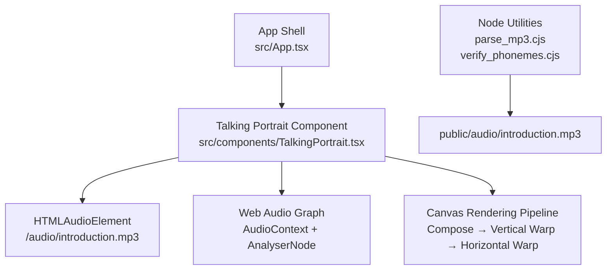
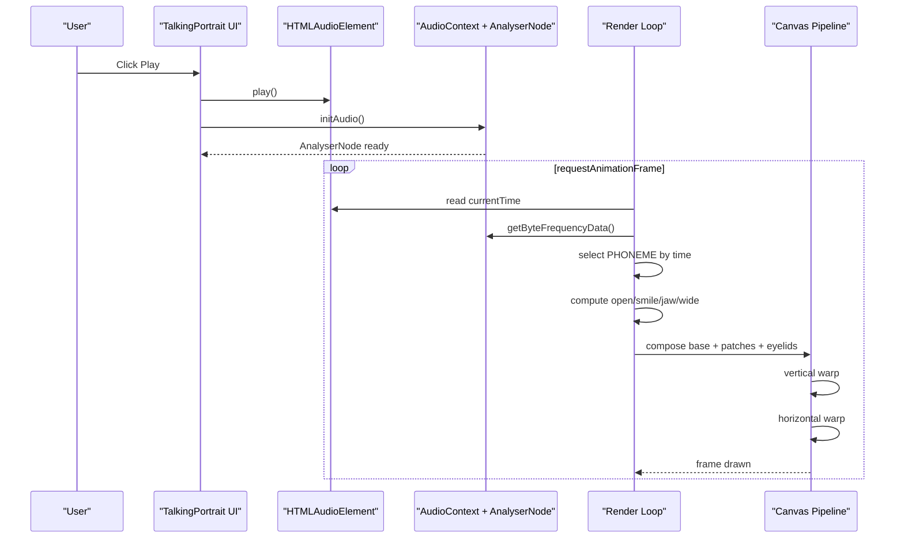
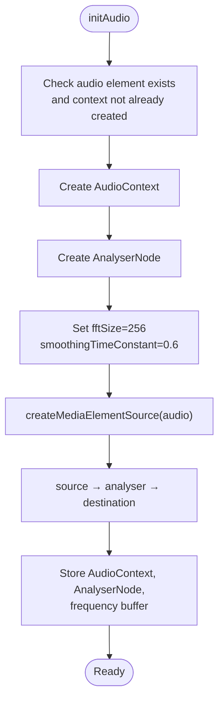
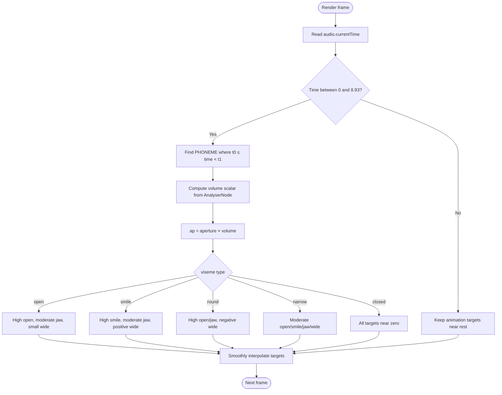
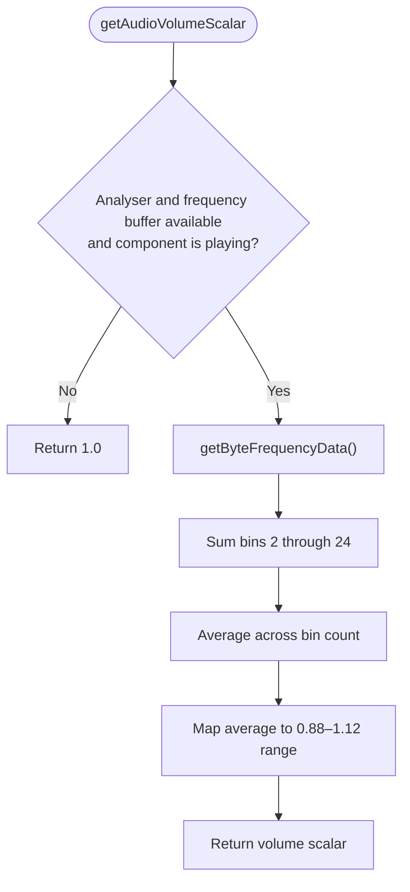
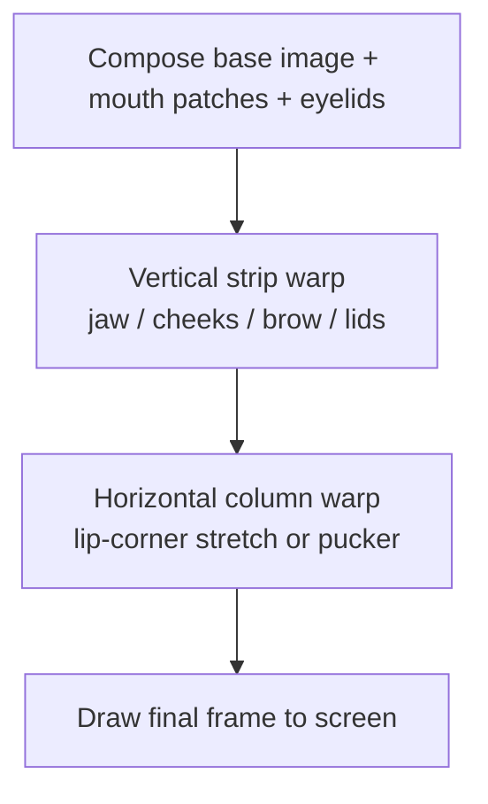
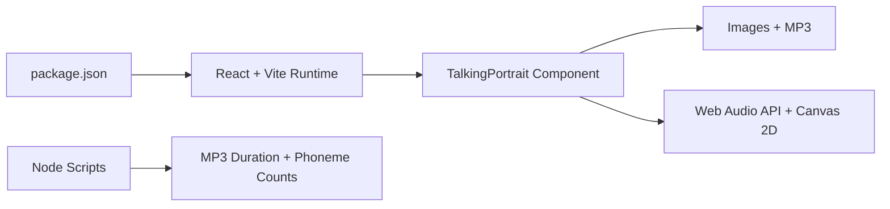

# Audio Integration System

<cite>
**Referenced Files in This Document**   
- [src/App.tsx](file://src/App.tsx)
- [src/components/TalkingPortrait.tsx](file://src/components/TalkingPortrait.tsx)
- [parse_mp3.cjs](file://parse_mp3.cjs)
- [verify_phonemes.cjs](file://verify_phonemes.cjs)
- [package.json](file://package.json)
</cite>

## Table of Contents
1. [Introduction](#introduction)
2. [Project Structure](#project-structure)
3. [Core Components](#core-components)
4. [Architecture Overview](#architecture-overview)
5. [Detailed Component Analysis](#detailed-component-analysis)
6. [Dependency Analysis](#dependency-analysis)
7. [Performance Considerations](#performance-considerations)
8. [Troubleshooting Guide](#troubleshooting-guide)
9. [Conclusion](#conclusion)
10. [Appendices](#appendices)

## Introduction
This document explains the Audio Integration System that synchronizes facial animations with speech audio. The system is centered around a photorealistic talking portrait component that:
- Uses the Web Audio API to analyze real-time audio amplitude and apply volume-reactive animation scaling.
- Maintains a phoneme timeline that maps audio time segments to specific facial visemes such as open, smile, round, narrow, and closed.
- Renders a two-stage canvas deformation pipeline for jaw drop, cheek lift, brow motion, lip-corner stretch, and natural blinking.
- Displays synchronized transcript phrases aligned with the same audio timeline.
- Includes Node.js utilities for MP3 duration parsing and phoneme verification.

The implementation is built on React, TypeScript, Canvas 2D rendering, and the browser’s Web Audio API. There is no live microphone input or automatic speech recognition; synchronization is driven by a pre-recorded MP3 file and a hand-authored phoneme timeline.

## Project Structure
At a high level, the audio integration lives inside the portfolio application:
- The main application shell renders the talking portrait section.
- The talking portrait component owns the audio element, Web Audio graph, render loop, phoneme timeline, and visual deformation logic.
- Node scripts provide offline analysis and verification tools for the audio asset and phoneme mapping.

**Diagram sources**
- [src/App.tsx:142-144](file://src/App.tsx#L142-L144)
- [src/components/TalkingPortrait.tsx:318-358](file://src/components/TalkingPortrait.tsx#L318-L358)
- [src/components/TalkingPortrait.tsx:370-608](file://src/components/TalkingPortrait.tsx#L370-L608)
- [parse_mp3.cjs:1-45](file://parse_mp3.cjs#L1-L45)
- [verify_phonemes.cjs:1-87](file://verify_phonemes.cjs#L1-L87)

**Section sources**
- [src/App.tsx:142-144](file://src/App.tsx#L142-L144)
- [src/components/TalkingPortrait.tsx:318-358](file://src/components/TalkingPortrait.tsx#L318-L358)
- [parse_mp3.cjs:1-45](file://parse_mp3.cjs#L1-L45)
- [verify_phonemes.cjs:1-87](file://verify_phonemes.cjs#L1-L87)

## Core Components
The core runtime behavior is implemented in the talking portrait component. It manages:
- Audio playback state and metadata.
- Web Audio API initialization and frequency analysis.
- A per-frame render loop that computes facial articulation from the phoneme timeline.
- Two-stage canvas warping for vertical and horizontal facial deformation.
- Natural blink timing and micro-motion.
- Synchronized transcript display.

Key responsibilities:
- **Audio control:** play, pause, replay, progress tracking, and duration handling.
- **Audio analysis:** FFT-based frequency data sampling to compute a volume scalar.
- **Phoneme mapping:** selecting the active phoneme event based on current audio time.
- **Animation targets:** open mouth weight, smile weight, jaw depth, and lip-wide displacement.
- **Visual composition:** base image, mouth patches, eyelid overlay, and warp passes.

**Section sources**
- [src/components/TalkingPortrait.tsx:318-358](file://src/components/TalkingPortrait.tsx#L318-L358)
- [src/components/TalkingPortrait.tsx:360-368](file://src/components/TalkingPortrait.tsx#L360-L368)
- [src/components/TalkingPortrait.tsx:370-608](file://src/components/TalkingPortrait.tsx#L370-L608)
- [src/components/TalkingPortrait.tsx:610-742](file://src/components/TalkingPortrait.tsx#L610-L742)

## Architecture Overview
The audio integration follows a clear separation between authoritative timing data and rendering logic:

1. **Authoritative timeline:** The MP3 file and the `PHONEMES` array define when each viseme occurs.
2. **Playback layer:** An HTML audio element provides `currentTime`, duration, and lifecycle events.
3. **Analysis layer:** An `AudioContext` and `AnalyserNode` sample frequency data during playback.
4. **Animation layer:** The render loop converts audio time into facial animation targets.
5. **Rendering layer:** Canvas composes the base photo, mouth patches, eyelids, and applies deformations.

**Diagram sources**
- [src/components/TalkingPortrait.tsx:340-358](file://src/components/TalkingPortrait.tsx#L340-L358)
- [src/components/TalkingPortrait.tsx:360-368](file://src/components/TalkingPortrait.tsx#L360-L368)
- [src/components/TalkingPortrait.tsx:434-608](file://src/components/TalkingPortrait.tsx#L434-L608)
- [src/components/TalkingPortrait.tsx:610-648](file://src/components/TalkingPortrait.tsx#L610-L648)

## Detailed Component Analysis

### Web Audio API Implementation
The component initializes an `AudioContext` and connects the HTML audio element through a media element source to an analyser node. The analyser uses an FFT size of 256 and smoothing to produce stable frequency data. During playback, the component reads byte frequency data and computes a volume scalar in the range approximately 0.88 to 1.12. This scalar multiplies the phoneme aperture so louder audio produces slightly stronger mouth movement.

Important behaviors:
- Audio context creation is lazy and guarded by user interaction.
- The context may be suspended initially and must be resumed before playback.
- Frequency analysis only runs while the component is playing.
- Errors during audio setup are logged rather than thrown.

**Diagram sources**
- [src/components/TalkingPortrait.tsx:340-358](file://src/components/TalkingPortrait.tsx#L340-L358)

**Section sources**
- [src/components/TalkingPortrait.tsx:340-358](file://src/components/TalkingPortrait.tsx#L340-L358)
- [src/components/TalkingPortrait.tsx:360-368](file://src/components/TalkingPortrait.tsx#L360-L368)

### Phoneme Timeline Management
The phoneme timeline is a static array of events. Each event has:
- Start and end times in seconds.
- A viseme type: open, smile, round, narrow, or closed.
- An aperture value representing mouth openness.

During each frame, the render loop finds the active phoneme based on the current audio time. If the audio time is within the supported range, the viseme determines target values for mouth openness, smile intensity, jaw depth, and lip-wide displacement. Closed phonemes leave all targets at zero, representing resting lips.

**Diagram sources**
- [src/components/TalkingPortrait.tsx:100-197](file://src/components/TalkingPortrait.tsx#L100-L197)
- [src/components/TalkingPortrait.tsx:434-484](file://src/components/TalkingPortrait.tsx#L434-L484)

**Section sources**
- [src/components/TalkingPortrait.tsx:100-197](file://src/components/TalkingPortrait.tsx#L100-L197)
- [src/components/TalkingPortrait.tsx:434-484](file://src/components/TalkingPortrait.tsx#L434-L484)

### Speech Recognition Integration Capabilities
The current implementation does not include live speech recognition or microphone capture. Instead, it relies on:
- A pre-recorded MP3 file.
- A hand-authored phoneme timeline.
- Transcript phrases aligned with the same timeline.

Automatic phoneme detection is therefore not present in this codebase. If you want to add automatic detection, you would need to integrate a speech-to-text or phoneme segmentation service and then map its output to the existing viseme types and timeline structure.

For now, the system treats the MP3 and `PHONEMES` array as the single authoritative source of truth for synchronization.

**Section sources**
- [src/components/TalkingPortrait.tsx:100-197](file://src/components/TalkingPortrait.tsx#L100-L197)
- [src/components/TalkingPortrait.tsx:199-212](file://src/components/TalkingPortrait.tsx#L199-L212)
- [src/components/TalkingPortrait.tsx:434-478](file://src/components/TalkingPortrait.tsx#L434-L478)

### Volume-Reactive Animations
Volume reactivity is implemented by sampling the analyser’s frequency bins and computing an average over a limited low-frequency range. The result is clamped into a small multiplier around 1.0. This multiplier scales the phoneme aperture, making mouth movements slightly more pronounced during louder passages without changing the timing.

Key characteristics:
- Only active during playback.
- Uses a subset of frequency bins to avoid extreme highs.
- Produces a bounded scalar to keep animations stable.
- Does not change phoneme timing, only intensity.

**Diagram sources**
- [src/components/TalkingPortrait.tsx:360-368](file://src/components/TalkingPortrait.tsx#L360-L368)

**Section sources**
- [src/components/TalkingPortrait.tsx:360-368](file://src/components/TalkingPortrait.tsx#L360-L368)
- [src/components/TalkingPortrait.tsx:445-463](file://src/components/TalkingPortrait.tsx#L445-L463)

### Canvas Deformation and Blinking Pipeline
The visual pipeline has three conceptual stages:
1. **Compose stage:** Draw the base portrait, mouth patches, and eyelid overlay into an offscreen buffer.
2. **Vertical warp stage:** Displace rows to simulate jaw drop, cheek lift, brow motion, and eyelid movement.
3. **Horizontal warp stage:** Stretch or pucker the lip region around the mouth center.

Blinking is implemented as a traveling-lid effect using a separate eyelid image. The eyelid margin moves from the crease toward the lower lid, with randomized closing, hold, and reopening durations. Micro-motion adds subtle head sway, gaze shifts, and breath-like oscillation.

**Diagram sources**
- [src/components/TalkingPortrait.tsx:270-316](file://src/components/TalkingPortrait.tsx#L270-L316)
- [src/components/TalkingPortrait.tsx:549-601](file://src/components/TalkingPortrait.tsx#L549-L601)

**Section sources**
- [src/components/TalkingPortrait.tsx:270-316](file://src/components/TalkingPortrait.tsx#L270-L316)
- [src/components/TalkingPortrait.tsx:549-601](file://src/components/TalkingPortrait.tsx#L549-L601)

### Transcript and Phrase Synchronization
Transcript phrases are defined alongside the phoneme timeline. The active phrase is computed from the current progress. The UI highlights the currently spoken phrase and marks past phrases as spoken. This keeps the visible text aligned with the same audio timeline used for facial animation.

**Section sources**
- [src/components/TalkingPortrait.tsx:199-212](file://src/components/TalkingPortrait.tsx#L199-L212)
- [src/components/TalkingPortrait.tsx:334-338](file://src/components/TalkingPortrait.tsx#L334-L338)
- [src/components/TalkingPortrait.tsx:674-691](file://src/components/TalkingPortrait.tsx#L674-L691)

### MP3 Parsing Utilities
The Node script `parse_mp3.cjs` reads the MP3 file from disk and performs a simple frame-header scan. It:
- Skips ID3v2 metadata if present.
- Detects MPEG version, layer, bitrate index, and sample rate index.
- Calculates frame length and counts frames.
- Estimates total duration using the standard MP3 frame formula.

This utility helps verify that the expected audio duration matches the hardcoded timeline bounds.

**Section sources**
- [parse_mp3.cjs:1-45](file://parse_mp3.cjs#L1-L45)

### Phoneme Verification Tools
The script `verify_phonemes.cjs` contains a structured syllable-level phoneme map aligned with the same audio timeline. It groups phonemes by word and includes type, value, and width annotations. Running the script prints the total number of words and phonemes, which can help validate that the manual mapping is complete and consistent.

**Section sources**
- [verify_phonemes.cjs:1-87](file://verify_phonemes.cjs#L1-L87)

## Dependency Analysis
The audio integration depends on:
- React component state and refs for UI and rendering coordination.
- The HTML audio element for playback and time updates.
- The Web Audio API for frequency analysis.
- Canvas 2D APIs for image drawing and pixel manipulation.
- Static assets: portrait image, closed eyelid image, mouth patch images, and the MP3 audio file.
- Node scripts for offline MP3 analysis and phoneme verification.

**Diagram sources**
- [package.json:1-37](file://package.json#L1-L37)
- [src/components/TalkingPortrait.tsx:318-358](file://src/components/TalkingPortrait.tsx#L318-L358)
- [parse_mp3.cjs:1-45](file://parse_mp3.cjs#L1-L45)
- [verify_phonemes.cjs:1-87](file://verify_phonemes.cjs#L1-L87)

**Section sources**
- [package.json:1-37](file://package.json#L1-L37)
- [src/components/TalkingPortrait.tsx:318-358](file://src/components/TalkingPortrait.tsx#L318-L358)
- [parse_mp3.cjs:1-45](file://parse_mp3.cjs#L1-L45)
- [verify_phonemes.cjs:1-87](file://verify_phonemes.cjs#L1-L87)

## Performance Considerations
Real-time audio processing and long audio playback require careful attention to CPU, memory, and rendering cost:

- **Audio context lifecycle:** The audio context is created lazily and should be resumed after user gesture. Avoid recreating it on every play attempt.
- **AnalyserNode usage:** Frequency data is sampled every frame only while playing. Keep the FFT size modest; the current configuration uses 256.
- **Render loop optimization:** The component uses `requestAnimationFrame` and skips unnecessary warp passes when displacements are below thresholds.
- **Offscreen buffers:** Two intermediate canvases are used for compose and warp stages. Reuse them instead of creating new ones per frame.
- **Image loading:** Images are loaded once and checked for completion before drawing. Ensure assets are cached to avoid repeated network requests.
- **State updates:** UI state changes are separated from the high-frequency render loop. Progress and duration updates come from audio events.
- **Memory management:** Cancel the animation frame on cleanup. Avoid allocating arrays or objects inside the render loop.
- **Long playback:** For very long audio files, consider streaming or progressive loading strategies outside this component, but keep the phoneme timeline aligned with actual playback time.

[No sources needed since this section provides general guidance]

## Troubleshooting Guide

### Audio Does Not Start
Common causes:
- The browser requires a user gesture before creating an `AudioContext`.
- The audio context is in a suspended state.
- The audio element is missing or the MP3 path is incorrect.

Actions:
- Ensure the user clicks Play before audio starts.
- Resume the audio context if it is suspended.
- Verify the audio element references the correct MP3 file.

**Section sources**
- [src/components/TalkingPortrait.tsx:340-358](file://src/components/TalkingPortrait.tsx#L340-L358)
- [src/components/TalkingPortrait.tsx:610-627](file://src/components/TalkingPortrait.tsx#L610-L627)

### Lips Do Not Move or Animation Looks Flat
Possible reasons:
- The audio time is outside the supported timeline range.
- The phoneme aperture is too low.
- Volume reactivity is disabled because the component is not playing.
- Mouth patch images are not loaded.

Actions:
- Confirm the current audio time falls within the timeline bounds.
- Check the phoneme aperture values.
- Verify the component is playing and the analyser is active.
- Ensure `/images/mouth_open.png` and `/images/mouth_smile.png` are available.

**Section sources**
- [src/components/TalkingPortrait.tsx:434-484](file://src/components/TalkingPortrait.tsx#L434-L484)
- [src/components/TalkingPortrait.tsx:549-576](file://src/components/TalkingPortrait.tsx#L549-L576)

### Lip Sync Is Off
Likely causes:
- The MP3 duration differs from the timeline bounds.
- The phoneme start/end times do not match the actual speech.
- The audio source was replaced without updating the timeline.

Actions:
- Run `parse_mp3.cjs` to verify the exact MP3 duration.
- Compare the timeline bounds with the parsed duration.
- Adjust `PHONEMES` and transcript phrases to match the updated audio.

**Section sources**
- [parse_mp3.cjs:1-45](file://parse_mp3.cjs#L1-L45)
- [src/components/TalkingPortrait.tsx:100-197](file://src/components/TalkingPortrait.tsx#L100-L197)
- [src/components/TalkingPortrait.tsx:199-212](file://src/components/TalkingPortrait.tsx#L199-L212)

### Blinking Looks Unnatural
Possible issues:
- Blink timing intervals are too regular or too frequent.
- Eyelid landmarks do not match the portrait resolution.
- The eyelid image is missing or misaligned.

Actions:
- Review the blink interval and closure curve parameters.
- Verify eyelid landmark coordinates against the portrait dimensions.
- Ensure the closed eyelid image is present and correctly referenced.

**Section sources**
- [src/components/TalkingPortrait.tsx:214-268](file://src/components/TalkingPortrait.tsx#L214-L268)
- [src/components/TalkingPortrait.tsx:423-507](file://src/components/TalkingPortrait.tsx#L423-L507)

### Volume Reactivity Has No Effect
Reasons:
- The analyser is not initialized.
- The component is paused or ended.
- Frequency data is not being sampled.

Actions:
- Confirm `initAudio` runs on first play.
- Check that the component is playing.
- Add temporary logging around `getByteFrequencyData` to confirm samples are taken.

**Section sources**
- [src/components/TalkingPortrait.tsx:340-368](file://src/components/TalkingPortrait.tsx#L340-L368)

## Conclusion
The Audio Integration System combines a precise phoneme timeline, Web Audio API analysis, and a two-stage canvas deformation pipeline to synchronize facial animation with speech audio. It prioritizes deterministic timing from a recorded MP3 while adding subtle volume-reactive intensity and natural human motion such as blinking and micro-saccades.

For future enhancements:
- Add automatic phoneme detection by integrating a speech recognition or phoneme segmentation pipeline.
- Support multiple audio sources by parameterizing the audio URL and timeline.
- Extend viseme types if richer facial expressions are required.
- Improve performance by profiling the render loop and considering WebGL for complex deformations.
- Use the provided Node scripts to validate audio duration and phoneme coverage whenever the audio asset changes.

[No sources needed since this section summarizes without analyzing specific files]

## Appendices

### Adding a New Audio Source
To add a new audio source:
1. Place the new MP3 under the public audio directory.
2. Update the audio element source path in the component.
3. Create a new phoneme timeline matching the new audio duration.
4. Update transcript phrases to align with the new timeline.
5. Verify duration using `parse_mp3.cjs`.
6. Validate phoneme coverage using `verify_phonemes.cjs`.

**Section sources**
- [src/components/TalkingPortrait.tsx:727-742](file://src/components/TalkingPortrait.tsx#L727-L742)
- [parse_mp3.cjs:1-45](file://parse_mp3.cjs#L1-L45)
- [verify_phonemes.cjs:1-87](file://verify_phonemes.cjs#L1-L87)

### Customizing Phoneme Mappings
To customize phoneme mappings:
1. Edit the phoneme event array to adjust start times, end times, viseme types, and apertures.
2. Keep viseme types consistent with the supported set: open, smile, round, narrow, closed.
3. Ensure there are no overlapping or missing time ranges within the audio duration.
4. Test playback and visually inspect mouth shapes.
5. Use the verification script to count and review phoneme entries.

**Section sources**
- [src/components/TalkingPortrait.tsx:100-197](file://src/components/TalkingPortrait.tsx#L100-L197)
- [verify_phonemes.cjs:1-87](file://verify_phonemes.cjs#L1-L87)

### Debugging Audio Synchronization Issues
Recommended debugging steps:
- Log the current audio time each frame.
- Log the selected phoneme and its aperture.
- Log the computed volume scalar.
- Compare the MP3 duration from `parse_mp3.cjs` with the timeline bounds.
- Temporarily disable volume reactivity to isolate timing vs intensity issues.
- Use the transcript UI to confirm phrase alignment.

**Section sources**
- [src/components/TalkingPortrait.tsx:360-368](file://src/components/TalkingPortrait.tsx#L360-L368)
- [src/components/TalkingPortrait.tsx:434-484](file://src/components/TalkingPortrait.tsx#L434-L484)
- [parse_mp3.cjs:1-45](file://parse_mp3.cjs#L1-L45)