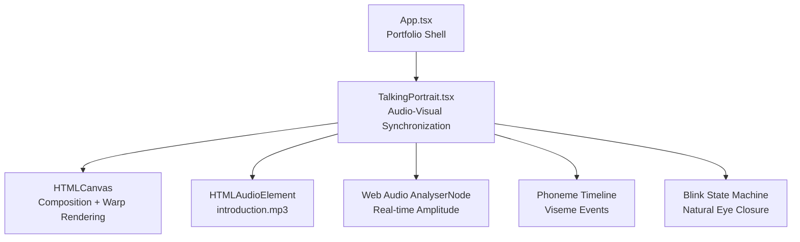
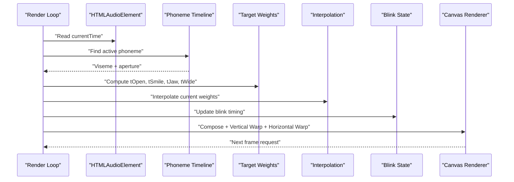
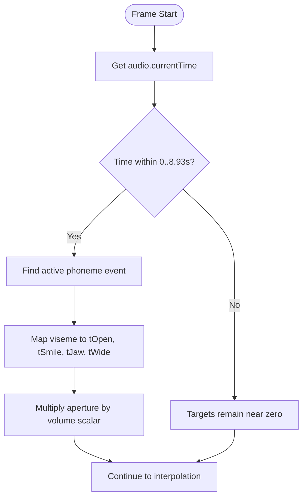
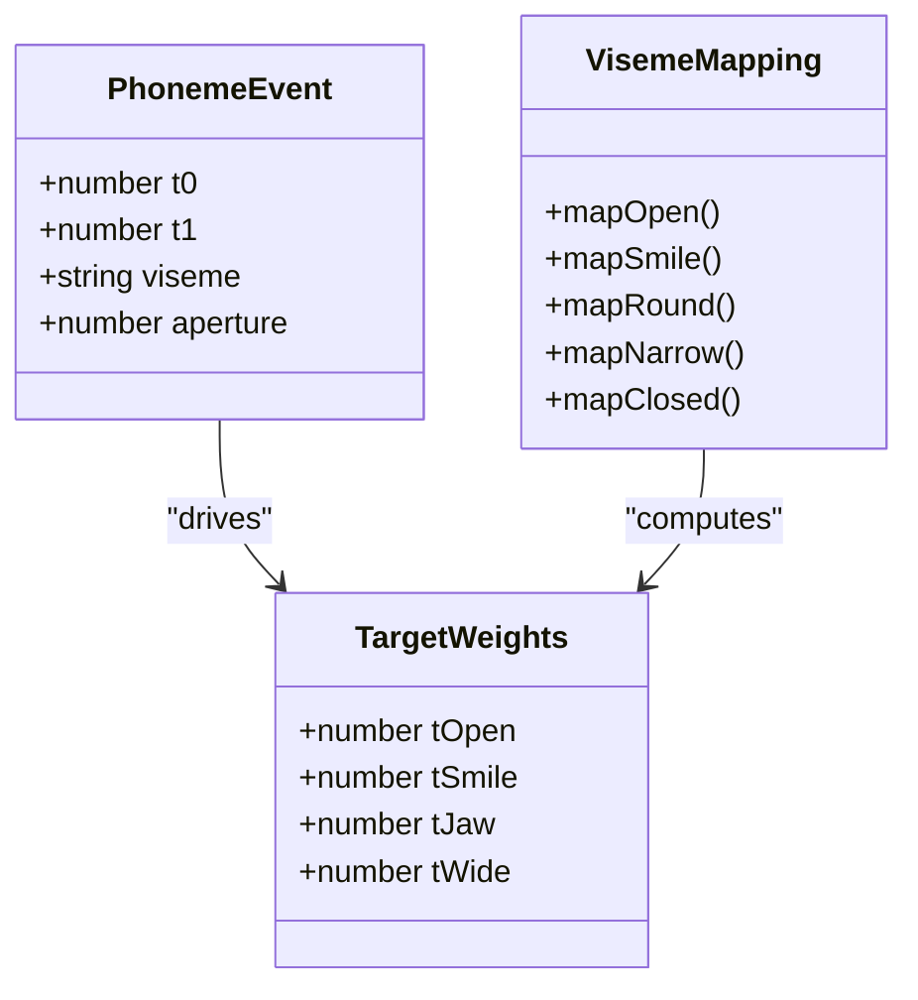
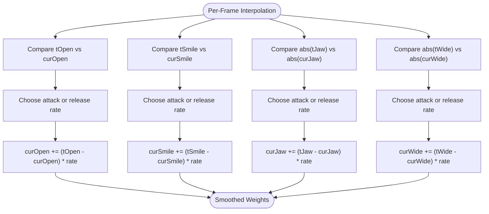
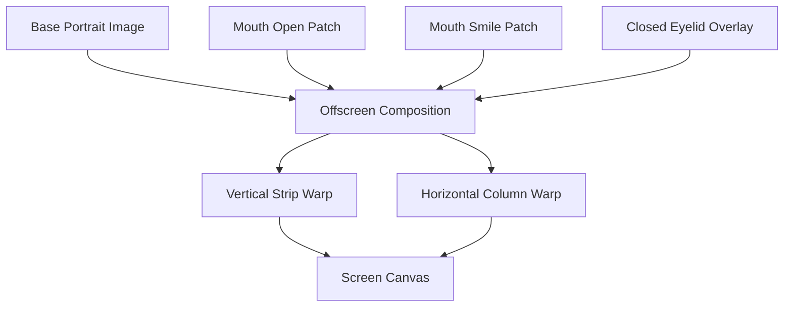
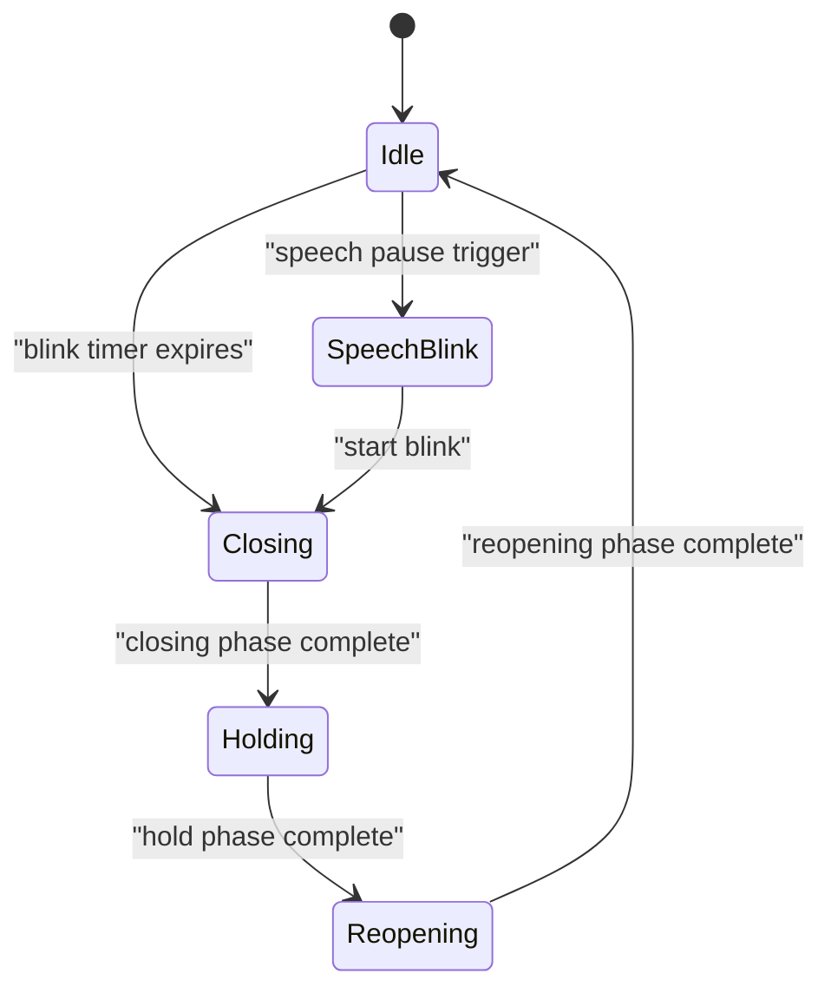
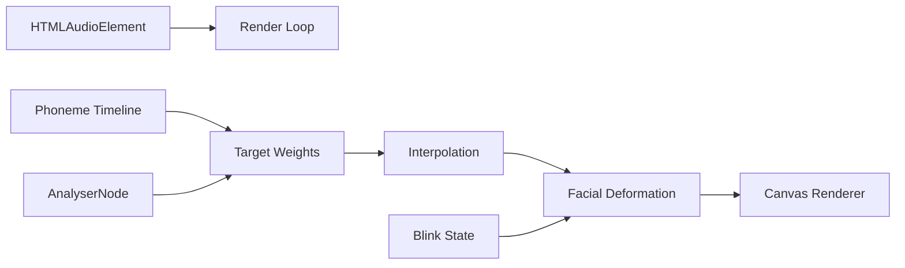

# Audio-Visual Synchronization

<cite>
**Referenced Files in This Document**
- [TalkingPortrait.tsx](file://src/components/TalkingPortrait.tsx)
- [App.tsx](file://src/App.tsx)
</cite>

## Table of Contents
1. [Introduction](#introduction)
2. [Project Structure](#project-structure)
3. [Core Components](#core-components)
4. [Architecture Overview](#architecture-overview)
5. [Detailed Component Analysis](#detailed-component-analysis)
6. [Dependency Analysis](#dependency-analysis)
7. [Performance Considerations](#performance-considerations)
8. [Troubleshooting Guide](#troubleshooting-guide)
9. [Conclusion](#conclusion)

## Introduction
This document explains the audio-visual synchronization system that coordinates facial animations with speech audio playback. The system is implemented as a photorealistic talking portrait component that:

- Uses the HTML `<audio>` element’s `currentTime` as the authoritative timeline for phoneme-based facial animation.
- Maps each phoneme to target weights controlling mouth openness, smile intensity, jaw drop, and horizontal lip stretch/pucker.
- Smoothly interpolates between mouth shapes using per-frame exponential smoothing so transitions feel natural and avoid jarring jumps.
- Adds volume-reactive animation by analyzing real-time audio amplitude through an `AnalyserNode`.
- Renders the face through a two-stage canvas pipeline: composition followed by vertical and horizontal warps.
- Includes natural blinking, micro-motion, and subtle head movement to keep the portrait alive without breaking lip-sync timing.

The main application shell renders the talking portrait inside a portfolio layout, while the actual synchronization logic lives in the talking portrait component.

**Section sources**
- [App.tsx:142-144](file://src/App.tsx#L142-L144)
- [TalkingPortrait.tsx:3-33](file://src/components/TalkingPortrait.tsx#L3-L33)

## Project Structure
At a high level, the project is a React + Vite application where:

- `src/App.tsx` provides the overall portfolio UI and mounts the talking portrait.
- `src/components/TalkingPortrait.tsx` contains the complete audio-visual synchronization implementation.
- Public assets include the base portrait image, closed-eyes image, mouth patches, and the spoken audio file.



**Diagram sources**
- [App.tsx:142-144](file://src/App.tsx#L142-L144)
- [TalkingPortrait.tsx:318-330](file://src/components/TalkingPortrait.tsx#L318-L330)
- [TalkingPortrait.tsx:340-358](file://src/components/TalkingPortrait.tsx#L340-L358)
- [TalkingPortrait.tsx:434-607](file://src/components/TalkingPortrait.tsx#L434-L607)

**Section sources**
- [App.tsx:142-144](file://src/App.tsx#L142-L144)
- [TalkingPortrait.tsx:318-330](file://src/components/TalkingPortrait.tsx#L318-L330)

## Core Components
The synchronization system is centered around the `TalkingPortrait` component. Its responsibilities include:

| Responsibility | Description |
|---|---|
| Audio timeline driver | Reads `audio.currentTime` every frame and maps it to the current phoneme event. |
| Target weight computation | Converts the active phoneme into four target weights: `tOpen`, `tSmile`, `tJaw`, and `tWide`. |
| Smooth interpolation | Applies per-frame exponential smoothing to current weights so mouth shapes transition naturally. |
| Volume reactivity | Computes a small amplitude-based scalar from the Web Audio API and multiplies phoneme aperture by it. |
| Visual rendering | Composes the base photo, mouth patches, and blink overlay, then applies vertical and horizontal warps. |
| Natural motion | Adds blinking, micro-saccades, breath, brow movement, cheek lift, and subtle head cadence. |

Key implementation anchors:

- Phoneme timeline and viseme mapping: [TalkingPortrait.tsx:100-197](file://src/components/TalkingPortrait.tsx#L100-L197)
- Target weight assignment: [TalkingPortrait.tsx:443-463](file://src/components/TalkingPortrait.tsx#L443-L463)
- Interpolation rates: [TalkingPortrait.tsx:480-484](file://src/components/TalkingPortrait.tsx#L480-L484)
- Volume scalar: [TalkingPortrait.tsx:360-368](file://src/components/TalkingPortrait.tsx#L360-L368)
- Render loop: [TalkingPortrait.tsx:434-607](file://src/components/TalkingPortrait.tsx#L434-L607)

**Section sources**
- [TalkingPortrait.tsx:100-197](file://src/components/TalkingPortrait.tsx#L100-L197)
- [TalkingPortrait.tsx:360-368](file://src/components/TalkingPortrait.tsx#L360-L368)
- [TalkingPortrait.tsx:434-607](file://src/components/TalkingPortrait.tsx#L434-L607)

## Architecture Overview
The audio-visual pipeline follows a strict render-loop architecture driven by `requestAnimationFrame`. Each frame performs these steps:

1. Read the current audio time.
2. Find the active phoneme event.
3. Compute target weights based on viseme class and volume.
4. Smoothly interpolate current weights toward targets.
5. Update blink state and natural motion parameters.
6. Compose the base portrait, mouth patches, and eyelid overlay.
7. Apply vertical warp for jaw, cheeks, brow, and lid response.
8. Apply horizontal warp for lip-corner stretch or pucker.
9. Draw the final frame to the screen canvas.



**Diagram sources**
- [TalkingPortrait.tsx:434-607](file://src/components/TalkingPortrait.tsx#L434-L607)

**Section sources**
- [TalkingPortrait.tsx:434-607](file://src/components/TalkingPortrait.tsx#L434-L607)

## Detailed Component Analysis

### Audio Timeline and Phoneme Mapping
The audio timeline is the single source of truth for lip-sync accuracy. The component reads `audio.currentTime` every frame and searches the phoneme array for the event whose time range includes the current audio time.

Important details:

- The phoneme array defines start time, end time, viseme type, and aperture value.
- Viseme types include open, smile, round, narrow, and closed.
- Closed phonemes produce zero target weights, representing resting lips.
- The audio duration is approximately 8.93 seconds, matching the provided introduction audio.



**Diagram sources**
- [TalkingPortrait.tsx:439-478](file://src/components/TalkingPortrait.tsx#L439-L478)
- [TalkingPortrait.tsx:100-197](file://src/components/TalkingPortrait.tsx#L100-L197)

**Section sources**
- [TalkingPortrait.tsx:100-197](file://src/components/TalkingPortrait.tsx#L100-L197)
- [TalkingPortrait.tsx:439-478](file://src/components/TalkingPortrait.tsx#L439-L478)

### Target Weight System: tOpen, tSmile, tJaw, tWide
Each viseme class produces a different combination of target weights. These weights control:

| Target | Meaning | Typical Behavior |
|---|---|---|
| `tOpen` | Mouth openness | High for open vowels, moderate for rounded sounds, low for smiles and narrow consonants. |
| `tSmile` | Smile intensity | High for smiling visemes, lower for other shapes. |
| `tJaw` | Physical jaw drop | Strongest for open and rounded visemes; reduced for smiles and narrow shapes. |
| `tWide` | Horizontal lip stretch vs pucker | Positive for smile stretch, negative for round/pucker, small positive for narrow. |

The mapping ensures that phonemes are not just “open” or “closed,” but have distinct mouth geometry. For example:

- Open viseme emphasizes jaw drop and openness.
- Smile viseme emphasizes corner stretch and smile patch weight.
- Round viseme emphasizes jaw drop and negative horizontal displacement for pucker.
- Narrow viseme uses moderate openness, smile, jaw, and positive wide values.



**Diagram sources**
- [TalkingPortrait.tsx:100-106](file://src/components/TalkingPortrait.tsx#L100-L106)
- [TalkingPortrait.tsx:443-463](file://src/components/TalkingPortrait.tsx#L443-L463)

**Section sources**
- [TalkingPortrait.tsx:443-463](file://src/components/TalkingPortrait.tsx#L443-L463)

### Smooth Interpolation Algorithms
To prevent jarring visual jumps, the component does not set mouth shape values directly. Instead, it computes target weights every frame and smoothly moves current animated weights toward those targets.

The interpolation uses per-frame exponential smoothing with different attack and release rates:

- Attack (increasing target): faster rate for snappy onset.
- Release (decreasing target): slower rate for soft decay.
- Jaw and wide use absolute-value comparisons because `tWide` can be negative.

This approach creates natural syllabic easing: quick opening and smoother closing, which matches human articulation better than linear or stepwise changes.



**Diagram sources**
- [TalkingPortrait.tsx:480-484](file://src/components/TalkingPortrait.tsx#L480-L484)

**Section sources**
- [TalkingPortrait.tsx:480-484](file://src/components/TalkingPortrait.tsx#L480-L484)

### Volume-Reactive Animation System
The system enhances realism by adjusting mouth movement intensity based on real-time audio amplitude. It uses the Web Audio API:

1. Creates an `AudioContext`.
2. Connects the HTML audio element to an `AnalyserNode`.
3. Sets FFT size and smoothing constant.
4. Reads frequency data every frame.
5. Computes an average over a limited frequency band.
6. Returns a small scalar between roughly 0.88 and 1.12.
7. Multiplies the phoneme aperture by this scalar before computing target weights.

This means louder speech slightly increases mouth openness, jaw drop, and smile intensity, making the animation feel more expressive without changing the phoneme timing.

```mermaid
sequenceDiagram
participant AudioEl as "HTMLAudioElement"
participant Ctx as "AudioContext"
participant Analyser as "AnalyserNode"
participant Loop as "Render Loop"
AudioEl->>Ctx : "Create media element source"
Ctx->>Analyser : "Connect analyser"
Analyser->>Ctx : "Connect to destination"
Loop->>Analyser : "getByteFrequencyData()"
Analyser-->>Loop : "Frequency bins"
Loop->>Loop : "Compute average amplitude"
Loop->>Loop : "Return volume scalar"
```

**Diagram sources**
- [TalkingPortrait.tsx:340-358](file://src/components/TalkingPortrait.tsx#L340-L358)
- [TalkingPortrait.tsx:360-368](file://src/components/TalkingPortrait.tsx#L360-L368)
- [TalkingPortrait.tsx:447-449](file://src/components/TalkingPortrait.tsx#L447-L449)

**Section sources**
- [TalkingPortrait.tsx:340-358](file://src/components/TalkingPortrait.tsx#L340-L358)
- [TalkingPortrait.tsx:360-368](file://src/components/TalkingPortrait.tsx#L360-L368)
- [TalkingPortrait.tsx:447-449](file://src/components/TalkingPortrait.tsx#L447-L449)

### Canvas Composition and Deformation Pipeline
The visual output is produced by a two-stage pipeline:

1. **Composition stage**: Draws the base portrait, mouth-open and mouth-smile photographic patches, and the traveling-lid blink overlay into an offscreen buffer.
2. **Deformation stage**: Applies vertical and horizontal warps to simulate physical facial movement.

Vertical warp handles:

- Jaw drop below the mouth.
- Cheek lift during smiles.
- Brow micro-motion.
- Lower-lid response during blinks.

Horizontal warp handles:

- Lip-corner stretch for smiles.
- Lip pucker for rounded sounds.



**Diagram sources**
- [TalkingPortrait.tsx:549-601](file://src/components/TalkingPortrait.tsx#L549-L601)
- [TalkingPortrait.tsx:270-316](file://src/components/TalkingPortrait.tsx#L270-L316)

**Section sources**
- [TalkingPortrait.tsx:270-316](file://src/components/TalkingPortrait.tsx#L270-L316)
- [TalkingPortrait.tsx:549-601](file://src/components/TalkingPortrait.tsx#L549-L601)

### Blink and Micro-Motion System
Although not strictly part of lip-sync, the blink and micro-motion system contributes heavily to perceived realism. The component implements:

- A blink state machine with randomized closing, hold, and reopening durations.
- Natural inter-ocular lead so one eye closes slightly before the other.
- Occasional double blinks.
- Speech-triggered blinks during conversational pauses.
- Zero-mean micro-motion including breath, brow movement, cheek lift, and sub-pixel head sway.
- Fixational micro-saccades that move gaze slightly without shaking the face.



**Diagram sources**
- [TalkingPortrait.tsx:217-225](file://src/components/TalkingPortrait.tsx#L217-L225)
- [TalkingPortrait.tsx:423-432](file://src/components/TalkingPortrait.tsx#L423-L432)
- [TalkingPortrait.tsx:486-507](file://src/components/TalkingPortrait.tsx#L486-L507)
- [TalkingPortrait.tsx:511-547](file://src/components/TalkingPortrait.tsx#L511-L547)

**Section sources**
- [TalkingPortrait.tsx:217-225](file://src/components/TalkingPortrait.tsx#L217-L225)
- [TalkingPortrait.tsx:423-432](file://src/components/TalkingPortrait.tsx#L423-L432)
- [TalkingPortrait.tsx:486-507](file://src/components/TalkingPortrait.tsx#L486-L507)
- [TalkingPortrait.tsx:511-547](file://src/components/TalkingPortrait.tsx#L511-L547)

## Dependency Analysis
The synchronization system has clear internal dependencies:

- The render loop depends on the audio element for timing.
- The phoneme timeline drives target weights.
- Target weights drive interpolated current weights.
- Current weights drive physical deformation parameters.
- The Web Audio analyser influences aperture scaling.
- The canvas renderer consumes all computed parameters.



**Diagram sources**
- [TalkingPortrait.tsx:318-330](file://src/components/TalkingPortrait.tsx#L318-L330)
- [TalkingPortrait.tsx:340-358](file://src/components/TalkingPortrait.tsx#L340-L358)
- [TalkingPortrait.tsx:434-607](file://src/components/TalkingPortrait.tsx#L434-L607)

**Section sources**
- [TalkingPortrait.tsx:318-330](file://src/components/TalkingPortrait.tsx#L318-L330)
- [TalkingPortrait.tsx:434-607](file://src/components/TalkingPortrait.tsx#L434-L607)

## Performance Considerations
Maintaining smooth 60fps rendering while processing audio data requires careful optimization. The current implementation already includes several performance-conscious patterns:

| Technique | Purpose |
|---|---|
| `requestAnimationFrame` loop | Syncs rendering to the display refresh rate. |
| Offscreen buffers | Separates composition from deformation to reduce redundant drawing. |
| Conditional warp execution | Only applies vertical or horizontal warp when needed. |
| Small frequency-band analysis | Limits amplitude calculation to a narrow band instead of full spectrum. |
| Sub-pixel micro-motion | Keeps motion subtle to avoid heavy visual artifacts. |
| Clamped delta time | Prevents large jumps if the tab is inactive. |

Recommendations for further optimization:

1. **Avoid recreating objects every frame.** Keep typed arrays, canvas contexts, and image references stable across frames.
2. **Reduce analyser bandwidth if needed.** The current FFT size and frequency band are reasonable, but you can lower `fftSize` or analyze fewer bins if CPU usage is high.
3. **Skip expensive operations when idle.** The render loop already checks whether images are loaded; extend similar guards for unused features like blinks or micro-motion when the audio is paused.
4. **Batch canvas operations.** Minimize context state changes such as global alpha and transforms.
5. **Use device pixel ratio carefully.** If the canvas is scaled for high-DPI displays, ensure the effective resolution does not exceed what the user’s device needs.
6. **Profile audio latency.** If lip-sync feels delayed, check browser audio scheduling and network buffering rather than only adjusting animation rates.

[No sources needed since this section provides general guidance]

## Troubleshooting Guide

### Lip-Sync Feels Late or Early
**Likely causes:**

- Audio buffering delay.
- Browser audio scheduling differences.
- Mismatch between phoneme timing and actual audio content.
- Heavy rendering work causing frame drops.

**What to check:**

- Verify that the phoneme timeline matches the exact audio file used at runtime.
- Confirm that `audio.currentTime` is being read every frame.
- Check whether the audio element is playing normally without stuttering.
- Inspect whether the render loop is skipping frames due to heavy canvas work.

**Relevant implementation areas:**

- Audio timeline reading: [TalkingPortrait.tsx:439-440](file://src/components/TalkingPortrait.tsx#L439-L440)
- Phoneme lookup: [TalkingPortrait.tsx:445-447](file://src/components/TalkingPortrait.tsx#L445-L447)
- Render loop lifecycle: [TalkingPortrait.tsx:603-607](file://src/components/TalkingPortrait.tsx#L603-L607)

**Section sources**
- [TalkingPortrait.tsx:439-447](file://src/components/TalkingPortrait.tsx#L439-L447)
- [TalkingPortrait.tsx:603-607](file://src/components/TalkingPortrait.tsx#L603-L607)

### Mouth Shapes Look Too Sharp or Jumpy
**Likely causes:**

- Interpolation rates too aggressive.
- Phoneme transitions too abrupt.
- Volume scalar amplifying small amplitude spikes.

**Adjustments:**

- Reduce attack rates to make openings less snappy.
- Increase release rates to soften closures.
- Narrow the volume scalar range if amplitude noise causes exaggerated mouth movement.

**Relevant implementation areas:**

- Interpolation rates: [TalkingPortrait.tsx:480-484](file://src/components/TalkingPortrait.tsx#L480-L484)
- Volume scalar: [TalkingPortrait.tsx:360-368](file://src/components/TalkingPortrait.tsx#L360-L368)

**Section sources**
- [TalkingPortrait.tsx:360-368](file://src/components/TalkingPortrait.tsx#L360-L368)
- [TalkingPortrait.tsx:480-484](file://src/components/TalkingPortrait.tsx#L480-L484)

### Audio Does Not Start Automatically
**Likely cause:**

- Browsers require a user gesture before creating or resuming an `AudioContext`.

**Behavior in code:**

- Audio context initialization happens on play.
- The context is resumed if suspended.
- Playback errors are logged rather than thrown.

**Relevant implementation areas:**

- Audio setup: [TalkingPortrait.tsx:340-358](file://src/components/TalkingPortrait.tsx#L340-L358)
- Play handler: [TalkingPortrait.tsx:611-627](file://src/components/TalkingPortrait.tsx#L611-L627)

**Section sources**
- [TalkingPortrait.tsx:340-358](file://src/components/TalkingPortrait.tsx#L340-L358)
- [TalkingPortrait.tsx:611-627](file://src/components/TalkingPortrait.tsx#L611-L627)

### Portrait Looks Static When No Sound Is Playing
**Expected behavior:**

- Without active audio, target weights stay near zero.
- Micro-motion still adds subtle life.
- The face should remain visually close to the original photograph.

**Relevant implementation areas:**

- Default target weights: [TalkingPortrait.tsx:443-443](file://src/components/TalkingPortrait.tsx#L443-L443)
- Micro-motion and head movement: [TalkingPortrait.tsx:511-547](file://src/components/TalkingPortrait.tsx#L511-L547)

**Section sources**
- [TalkingPortrait.tsx:443-443](file://src/components/TalkingPortrait.tsx#L443-L443)
- [TalkingPortrait.tsx:511-547](file://src/components/TalkingPortrait.tsx#L511-L547)

## Conclusion
The audio-visual synchronization system combines a precise audio-driven timeline with physically inspired facial deformation. By mapping phonemes to target weights, applying smooth interpolation, adding volume-reactive intensity, and rendering through a two-stage canvas pipeline, the system achieves realistic lip-sync without sacrificing performance.

For customization:

- Adjust phoneme timing to match new audio content.
- Tune interpolation rates to change how snappy or soft mouth transitions feel.
- Modify the volume scalar range to increase or decrease expression intensity.
- Extend viseme mappings to support additional mouth shapes if needed.

For production use, prioritize stable audio timing, efficient canvas operations, and conservative animation rates to maintain smooth 60fps rendering while keeping the portrait expressive and natural.

[No sources needed since this section summarizes without analyzing specific files]