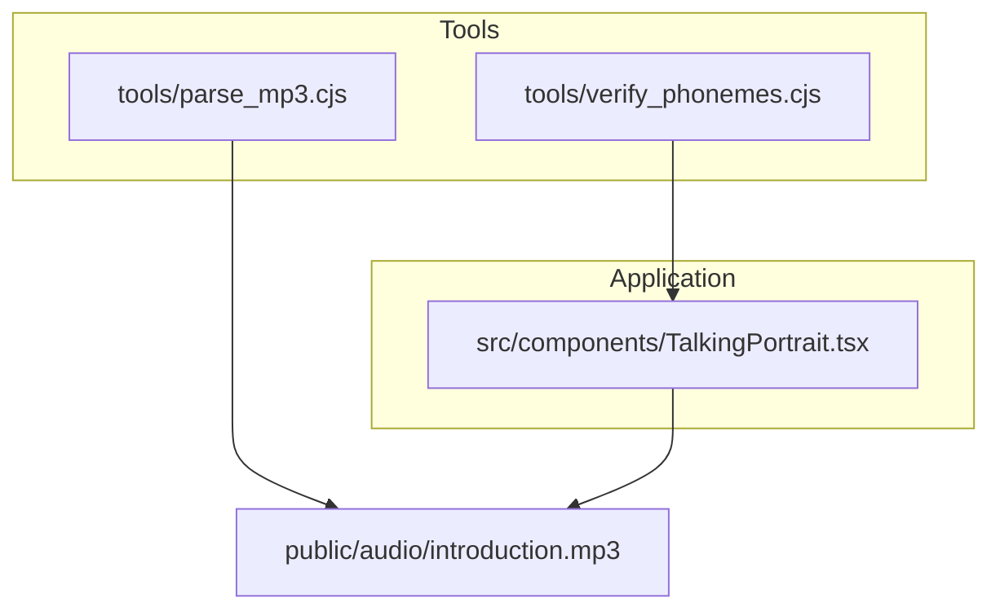
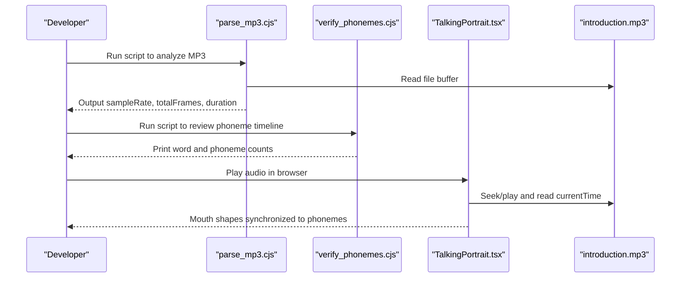
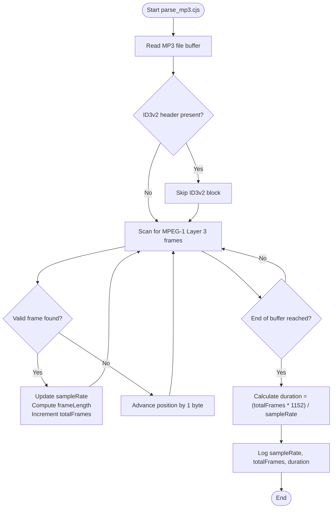
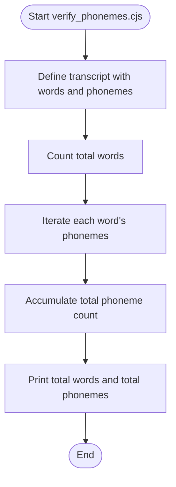
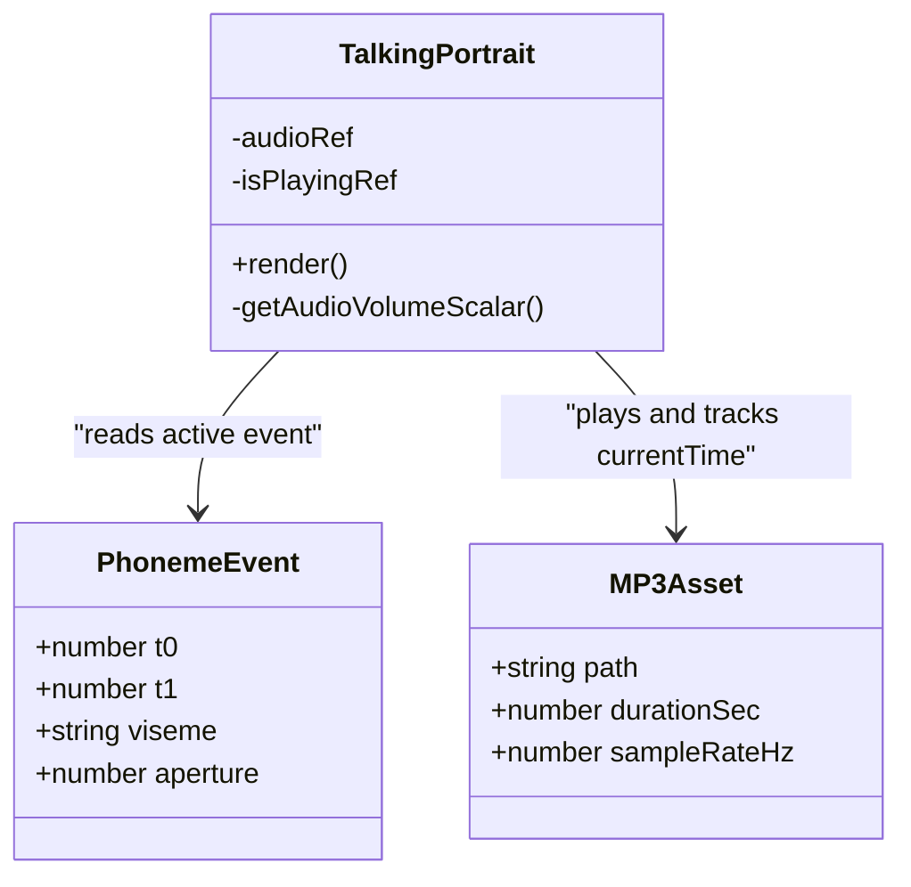
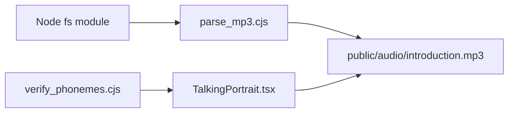

# MP3 Processing & Analysis Tools

<cite>
**Referenced Files in This Document**
- [parse_mp3.cjs](file://tools/parse_mp3.cjs)
- [verify_phonemes.cjs](file://tools/verify_phonemes.cjs)
- [TalkingPortrait.tsx](file://src/components/TalkingPortrait.tsx)
- [package.json](file://package.json)
</cite>

## Table of Contents
1. [Introduction](#introduction)
2. [Project Structure](#project-structure)
3. [Core Components](#core-components)
4. [Architecture Overview](#architecture-overview)
5. [Detailed Component Analysis](#detailed-component-analysis)
6. [Dependency Analysis](#dependency-analysis)
7. [Performance Considerations](#performance-considerations)
8. [Troubleshooting Guide](#troubleshooting-guide)
9. [Conclusion](#conclusion)

## Introduction
This document explains the MP3 processing and analysis tools used to prepare audio assets and validate phoneme timelines for a talking portrait animation. It focuses on two Node.js utilities:

- parse_mp3.cjs: Extracts core MP3 properties such as sample rate, total frame count, and exact duration by parsing MP3 frames directly from the file buffer.
- verify_phonemes.cjs: Provides a high-precision phoneme timeline aligned with the target MP3, enabling validation of timing alignment and viseme-to-speech correspondence.

These tools are designed to support consistent lip-sync between audio and animated mouth shapes in the application’s Talking Portrait component.

## Project Structure
The relevant files for this documentation are located under tools/ and src/components/. The project is a Vite-based React application; the Node scripts operate outside the build pipeline and can be executed directly with Node.

**Diagram sources**
- [parse_mp3.cjs:1-45](file://tools/parse_mp3.cjs#L1-L45)
- [verify_phonemes.cjs:1-87](file://tools/verify_phonemes.cjs#L1-L87)
- [TalkingPortrait.tsx:100-212](file://src/components/TalkingPortrait.tsx#L100-L212)

**Section sources**
- [package.json:1-35](file://package.json#L1-L35)

## Core Components
- parse_mp3.cjs reads an MP3 file from disk, skips optional ID3v2 metadata, scans MPEG-1 Layer 3 frames, computes per-frame length using bitrate and sample rate, counts frames, and derives duration in seconds.
- verify_phonemes.cjs defines a structured transcript of words and phonemes with precise start/end times, phoneme types (open, smile, round, closed, narrow), intensity values, and width multipliers. It also prints summary counts for quick sanity checks.

Key responsibilities:
- Audio preparation: ensure the MP3 has correct sample rate and expected duration before integrating into the app.
- Timeline verification: confirm that phoneme timings align with the actual audio and match the animation model.

**Section sources**
- [parse_mp3.cjs:1-45](file://tools/parse_mp3.cjs#L1-L45)
- [verify_phonemes.cjs:1-87](file://tools/verify_phonemes.cjs#L1-L87)

## Architecture Overview
The tools integrate into the development workflow around the Talking Portrait component:

- parse_mp3.cjs validates the MP3 asset independently of the UI.
- verify_phonemes.cjs cross-checks the phoneme timeline against the same audio duration referenced by the animation code.
- TalkingPortrait.tsx consumes the audio and applies viseme-driven mouth parameters based on the current playback time.

**Diagram sources**
- [parse_mp3.cjs:1-45](file://tools/parse_mp3.cjs#L1-L45)
- [verify_phonemes.cjs:1-87](file://tools/verify_phonemes.cjs#L1-L87)
- [TalkingPortrait.tsx:460-484](file://src/components/TalkingPortrait.tsx#L460-L484)

## Detailed Component Analysis

### parse_mp3.cjs
Purpose:
- Validate MP3 format and extract essential properties needed for synchronization.

Processing logic:
- Reads the MP3 file synchronously from a fixed path.
- Skips ID3v2 metadata if present.
- Scans for valid MPEG-1 Layer 3 frames.
- Derives sample rate from frame headers.
- Computes frame length using bitrate and sample rate.
- Counts frames and calculates duration in seconds.

Output:
- Prints sample rate, total frame count, and duration with millisecond precision.

Usage example:
- Execute the script from the repository root so it can locate the MP3 at the expected path.

Integration notes:
- Use the reported duration to confirm that the animation timeline matches the audio.
- Ensure the sample rate matches expectations for smooth playback and accurate timing.

**Diagram sources**
- [parse_mp3.cjs:1-45](file://tools/parse_mp3.cjs#L1-L45)

**Section sources**
- [parse_mp3.cjs:1-45](file://tools/parse_mp3.cjs#L1-L45)

### verify_phonemes.cjs
Purpose:
- Provide a precise phoneme timeline aligned with the MP3 and print summary statistics for validation.

Data model:
- Transcript entries represent words with start and end times.
- Each word contains phoneme segments with t0/t1 timing, type (viseme category), value (aperture intensity), and width multiplier.

Validation approach:
- Iterates over all words and phonemes to compute totals.
- Serves as a reference dataset for manual or automated checks against the animation timeline.

Usage example:
- Run the script to see the total number of words and phonemes defined in the timeline.

Integration notes:
- Compare these counts and timings with the phoneme array used in the Talking Portrait component to ensure consistency.
- Use the printed counts as a baseline when adjusting the timeline after editing the MP3.

**Diagram sources**
- [verify_phonemes.cjs:1-87](file://tools/verify_phonemes.cjs#L1-L87)

**Section sources**
- [verify_phonemes.cjs:1-87](file://tools/verify_phonemes.cjs#L1-L87)

### TalkingPortrait.tsx Integration Context
The Talking Portrait component uses a phoneme timeline and maps visemes to mouth parameters based on the current audio time. It references the same MP3 duration and expects the timeline to cover the full audio span.

Key integration points:
- Phoneme events define viseme categories and aperture values.
- Playback time drives selection of the active phoneme event.
- Viseme-specific parameters control jaw depth, lip-corner stretch, and patch weights.

**Diagram sources**
- [TalkingPortrait.tsx:100-212](file://src/components/TalkingPortrait.tsx#L100-L212)
- [TalkingPortrait.tsx:460-484](file://src/components/TalkingPortrait.tsx#L460-L484)

**Section sources**
- [TalkingPortrait.tsx:100-212](file://src/components/TalkingPortrait.tsx#L100-L212)
- [TalkingPortrait.tsx:460-484](file://src/components/TalkingPortrait.tsx#L460-L484)

## Dependency Analysis
- parse_mp3.cjs depends only on Node’s built-in filesystem module and the presence of the MP3 file at a fixed path.
- verify_phonemes.cjs is self-contained and does not import external modules; it serves as a data definition and reporting tool.
- Both tools complement the runtime behavior in TalkingPortrait.tsx by ensuring the audio asset and timeline are consistent.

**Diagram sources**
- [parse_mp3.cjs:1-45](file://tools/parse_mp3.cjs#L1-L45)
- [verify_phonemes.cjs:1-87](file://tools/verify_phonemes.cjs#L1-L87)
- [TalkingPortrait.tsx:100-212](file://src/components/TalkingPortrait.tsx#L100-L212)

**Section sources**
- [parse_mp3.cjs:1-45](file://tools/parse_mp3.cjs#L1-L45)
- [verify_phonemes.cjs:1-87](file://tools/verify_phonemes.cjs#L1-L87)
- [TalkingPortrait.tsx:100-212](file://src/components/TalkingPortrait.tsx#L100-L212)

## Performance Considerations
- parse_mp3.cjs performs a single pass over the file buffer. For very large MP3 files, consider streaming or chunked reading to reduce memory usage.
- Frame scanning is linear in file size; complexity is O(n) where n is the number of bytes scanned until EOF.
- verify_phonemes.cjs runs quickly since it only iterates over a small in-memory transcript structure.
- In the browser, TalkingPortrait.tsx updates mouth parameters per frame based on currentTime; keep the phoneme list concise to minimize lookup overhead.

[No sources needed since this section provides general guidance]

## Troubleshooting Guide

Common issues and resolutions:

- Missing MP3 file:
  - Symptom: parse_mp3.cjs fails to read the file.
  - Resolution: Ensure public/audio/introduction.mp3 exists at the expected path relative to the repository root.

- Incorrect ID3 handling:
  - Symptom: Duration or frame count appears incorrect.
  - Resolution: Confirm the MP3 begins with a valid ID3v2 block or remove tags if unnecessary. The parser skips ID3v2 blocks when detected.

- Invalid or unsupported frames:
  - Symptom: Sample rate remains default or duration is zero.
  - Resolution: Verify the MP3 uses MPEG-1 Layer 3 frames and standard bitrates/sample rates supported by the parser.

- Timeline mismatch:
  - Symptom: Phonemes do not align with speech in the video.
  - Resolution: Re-run verify_phonemes.cjs to confirm counts and compare timestamps with the parsed duration. Adjust phoneme t0/t1 values to match the actual audio.

- Viseme-to-speech misalignment:
  - Symptom: Mouth shapes appear out of sync with specific words.
  - Resolution: Cross-check the phoneme types and aperture values against the Talking Portrait mapping. Ensure the active phoneme selection logic receives the correct currentTime range.

- Browser playback differences:
  - Symptom: Timing drifts across devices or browsers.
  - Resolution: Normalize the MP3 to a consistent sample rate and bitrate. Keep the phoneme timeline tightly bound to the verified duration.

**Section sources**
- [parse_mp3.cjs:1-45](file://tools/parse_mp3.cjs#L1-L45)
- [verify_phonemes.cjs:1-87](file://tools/verify_phonemes.cjs#L1-L87)
- [TalkingPortrait.tsx:460-484](file://src/components/TalkingPortrait.tsx#L460-L484)

## Conclusion
The parse_mp3.cjs and verify_phonemes.cjs tools provide a robust foundation for preparing and validating audio assets and phoneme timelines for the Talking Portrait feature. By verifying MP3 properties and ensuring phoneme timings align with the actual audio, developers can achieve reliable lip-sync and consistent user experience across platforms. Integrate these tools early in the workflow to catch format and timing issues before deployment.

[No sources needed since this section summarizes without analyzing specific files]