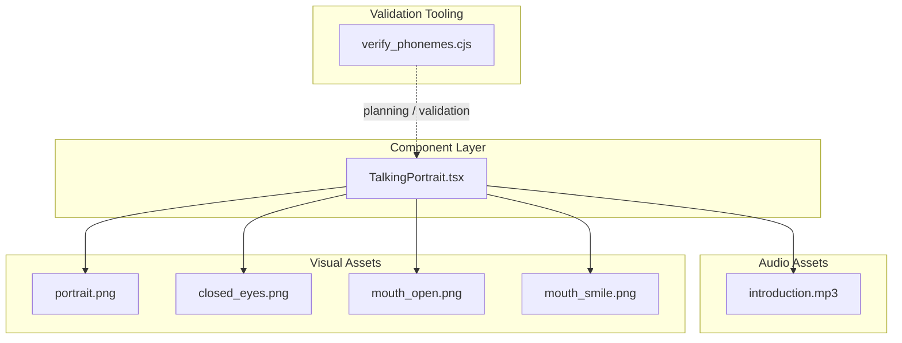
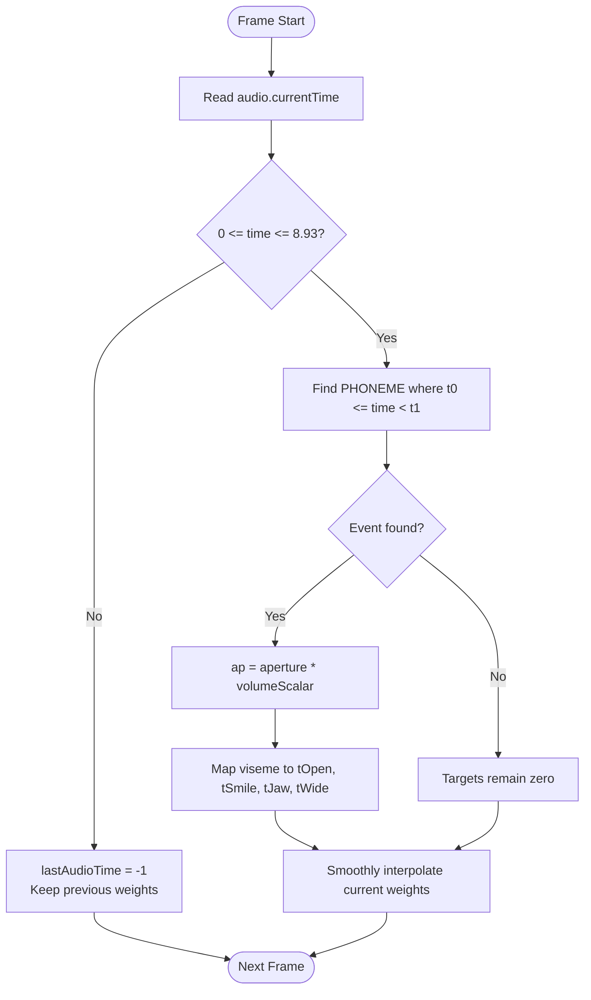
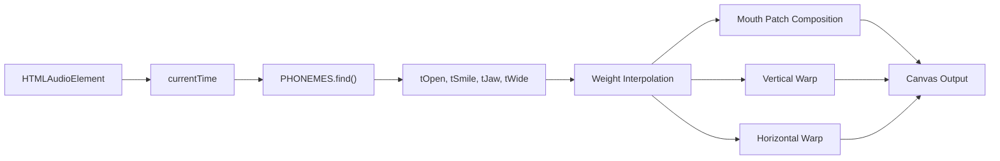

# Phoneme Timeline Management

<cite>
**Referenced Files in This Document**
- [TalkingPortrait.tsx](file://src/components/TalkingPortrait.tsx)
- [verify_phonemes.cjs](file://verify_phonemes.cjs)
</cite>

## Table of Contents
1. [Introduction](#introduction)
2. [Project Structure](#project-structure)
3. [Core Components](#core-components)
4. [Architecture Overview](#architecture-overview)
5. [Detailed Component Analysis](#detailed-component-analysis)
6. [Dependency Analysis](#dependency-analysis)
7. [Performance Considerations](#performance-considerations)
8. [Troubleshooting Guide](#troubleshooting-guide)
9. [Conclusion](#conclusion)

## Introduction
This document explains the phoneme timeline management system that synchronizes facial animation with speech audio for the introduction.mp3 file. It focuses on:
- The `PhonemeEvent` interface and its time boundaries, viseme types, and aperture values.
- The complete `PHONEMES` array mapping each segment of the audio to mouth shapes and jaw movement weights.
- The real-time lookup algorithm that selects the active phoneme based on current audio time and applies deformation weights.
- Practical guidance for adding new entries, customizing viseme mappings, and debugging timing synchronization.
- How phoneme timing affects visual smoothness through easing, volume scaling, and physical warping.

The system treats the MP3 timeline as authoritative: phoneme events define when specific mouth shapes should be visible, while the render loop continuously maps those events to facial deformation parameters.

## Project Structure
At a high level, the phoneme timeline lives inside the talking portrait component alongside image assets, canvas rendering, blink logic, and audio control. The verification script contains an alternate syllable map used during planning and validation.



**Diagram sources**
- [TalkingPortrait.tsx:380-391](file://src/components/TalkingPortrait.tsx#L380-L391)
- [TalkingPortrait.tsx:728-742](file://src/components/TalkingPortrait.tsx#L728-L742)
- [verify_phonemes.cjs:1-87](file://verify_phonemes.cjs#L1-L87)

**Section sources**
- [TalkingPortrait.tsx:1-33](file://src/components/TalkingPortrait.tsx#L1-L33)
- [verify_phonemes.cjs:1-87](file://verify_phonemes.cjs#L1-L87)

## Core Components
The core of the phoneme timeline system is defined by:
- `PhonemeEvent`: describes a single timed mouth shape.
- `PHONEMES`: the full ordered timeline for introduction.mp3.
- Real-time lookup: finds the active event from `audio.currentTime`.
- Viseme-to-deformation mapping: converts viseme + aperture into open-mouth weight, smile weight, jaw drop, and horizontal lip stretch.

Key responsibilities:
- Time boundary handling: `t0` inclusive, `t1` exclusive per event.
- Aperture normalization: aperture is a 0–1 intensity controlling how strongly the viseme is applied.
- Volume-aware modulation: aperture is multiplied by a small audio-reactive scalar so louder speech slightly increases mouth openness.
- Smooth interpolation: target weights are eased toward current weights to avoid snapping between phonemes.

**Section sources**
- [TalkingPortrait.tsx:100-106](file://src/components/TalkingPortrait.tsx#L100-L106)
- [TalkingPortrait.tsx:108-197](file://src/components/TalkingPortrait.tsx#L108-L197)
- [TalkingPortrait.tsx:442-484](file://src/components/TalkingPortrait.tsx#L442-L484)

## Architecture Overview
The animation pipeline connects audio playback to facial deformation through a frame-by-frame render loop.

```mermaid
sequenceDiagram
participant Audio as "HTMLAudioElement"
participant Loop as "Render Loop"
participant Lookup as "Phoneme Lookup"
participant Mapper as "Viseme Mapper"
participant Easing as "Easing & Smoothing"
participant Canvas as "Canvas Renderer"
Audio-->>Loop : currentTime
Loop->>Lookup : find active PHONEME where t0 <= time < t1
Lookup-->>Loop : PhonemeEvent or none
Loop->>Mapper : convert viseme + aperture to targets
Mapper-->>Loop : tOpen, tSmile, tJaw, tWide
Loop->>Easing : interpolate current weights toward targets
Easing-->>Loop : smoothed weights
Loop->>Canvas : compose base photo + mouth patches
Loop->>Canvas : apply vertical warp (jaw/cheeks/brow/lids)
Loop->>Canvas : apply horizontal warp (lip-corner stretch/pucker)
Canvas-->>Loop : next frame
```

**Diagram sources**
- [TalkingPortrait.tsx:434-484](file://src/components/TalkingPortrait.tsx#L434-L484)
- [TalkingPortrait.tsx:549-601](file://src/components/TalkingPortrait.tsx#L549-L601)

## Detailed Component Analysis

### PhonemeEvent Interface
`PhonemeEvent` defines one segment of the speaking timeline:
- `t0`: start time in seconds, inclusive.
- `t1`: end time in seconds, exclusive.
- `viseme`: mouth-shape category.
- `aperture`: intensity from 0 to 1; higher means more open or expressive mouth shape.

Valid viseme types:
- `'open'`: wide mouth opening, stronger jaw drop.
- `'smile'`: lip corners stretched outward, moderate jaw involvement.
- `'round'`: rounded lips, negative horizontal stretch indicating pucker.
- `'closed'`: lips resting together; all deformation targets become zero.
- `'narrow'`: moderately open but narrower shape, smaller horizontal stretch.

Complexity:
- Each event is a constant-time object.
- The timeline is an array; lookup is linear over the number of events.

**Section sources**
- [TalkingPortrait.tsx:100-106](file://src/components/TalkingPortrait.tsx#L100-L106)

### PHONEMES Array: Complete Timeline for introduction.mp3
The `PHONEMES` array covers approximately 0.28s to 8.92s, matching the spoken introduction. It includes:
- Word-level segments such as “Hi,” “I’m,” “Ngenzi,” “Levique.”
- Pauses represented by `'closed'` viseme with low aperture.
- Varying aperture values tuned to natural mouth openness.

Representative structure:
- Early greeting:
  - Open and smile visemes for “Hi,” followed by a closed pause.
- Name pronunciation:
  - Narrow and smile visemes for “Ngenzi.”
  - Open, smile, and closed visemes for “Levique.”
- Welcome phrase:
  - Round and closed visemes for “Welcome to my portfolio.”
- Passion statement:
  - Mix of open, narrow, round, and smile visemes across longer words.
- Closing sentence:
  - Open and smile visemes leading to a final smile.

How each entry maps to mouth behavior:
- `viseme` determines which facial features move.
- `aperture` controls how strongly those features move.
- Between entries, easing blends the previous and next mouth shapes.

**Section sources**
- [TalkingPortrait.tsx:108-197](file://src/components/TalkingPortrait.tsx#L108-L197)

### Real-Time Phoneme Lookup Algorithm
During each frame:
1. Read `audio.currentTime`.
2. If the time is within the valid range, scan `PHONEMES` for the first event where `t0 <= currentTime < t1`.
3. Multiply the event’s `aperture` by a small audio-reactive volume scalar.
4. Convert the selected viseme into four target weights:
   - `tOpen`: open-mouth patch opacity.
   - `tSmile`: smile patch opacity and cheek lift.
   - `tJaw`: vertical jaw drop.
   - `tWide`: horizontal lip-corner stretch or pucker.
5. Apply smoothing so current weights gradually approach targets.



**Diagram sources**
- [TalkingPortrait.tsx:434-484](file://src/components/TalkingPortrait.tsx#L434-L484)

**Section sources**
- [TalkingPortrait.tsx:434-484](file://src/components/TalkingPortrait.tsx#L434-L484)

### Viseme-to-Deformation Mapping
Each viseme produces different facial motion:

- `'open'`:
  - Strong open-mouth weight.
  - Moderate jaw drop.
  - Small smile and horizontal stretch.
- `'smile'`:
  - High smile weight.
  - Moderate open-mouth and jaw weight.
  - Positive horizontal stretch for lip-corner pull.
- `'round'`:
  - High open-mouth and jaw weight.
  - Negative horizontal stretch for lip pucker.
  - Low smile weight.
- `'narrow'`:
  - Moderate open-mouth, smile, and jaw weight.
  - Small positive horizontal stretch.
- `'closed'`:
  - All targets stay at zero; lips rest together.

These targets feed into:
- Mouth patch compositing (`mouth_open.png`, `mouth_smile.png`).
- Vertical strip warp for jaw drop, cheek lift, brow micro-motion, and lower-lid response.
- Horizontal column warp for lip-corner stretch or pucker.

**Section sources**
- [TalkingPortrait.tsx:447-463](file://src/components/TalkingPortrait.tsx#L447-L463)
- [TalkingPortrait.tsx:549-601](file://src/components/TalkingPortrait.tsx#L549-L601)

### Adding New Phoneme Entries
To extend the timeline:
1. Identify the exact second boundaries in introduction.mp3 using a waveform editor or the existing verification script.
2. Insert a new `PhonemeEvent` into `PHONEMES` with:
   - A precise `t0` and `t1`.
   - A suitable `viseme`.
   - An `aperture` value between 0 and 1.
3. Ensure adjacent events do not overlap incorrectly; keep `t1` of the previous event equal to `t0` of the next event for seamless transitions.
4. Test playback and verify that the mouth shape matches the intended sound.

Example pattern:
- For a short vowel sound, use `'open'` with a moderate-to-high aperture.
- For consonants requiring rounded lips, use `'round'`.
- For pauses or closures, use `'closed'` with near-zero aperture.

**Section sources**
- [TalkingPortrait.tsx:108-197](file://src/components/TalkingPortrait.tsx#L108-L197)
- [verify_phonemes.cjs:1-87](file://verify_phonemes.cjs#L1-L87)

### Customizing Viseme Mappings
If you want different facial behavior for a viseme:
- Adjust the target multipliers for `tOpen`, `tSmile`, `tJaw`, and `tWide`.
- Increase or decrease horizontal stretch by changing the sign and magnitude of `tWide`.
- Tune jaw depth by adjusting `tJaw`.
- Modify mouth-patch blending by changing the computed open and smile weights before drawing.

Important constraints:
- Keep aperture normalized to 0–1.
- Avoid extreme values that cause unnatural snapping or ghosting.
- Preserve `'closed'` as zero-weight unless you intentionally want lips to open during closure.

**Section sources**
- [TalkingPortrait.tsx:447-463](file://src/components/TalkingPortrait.tsx#L447-L463)
- [TalkingPortrait.tsx:562-576](file://src/components/TalkingPortrait.tsx#L562-L576)

### Debugging Timing Synchronization Issues
Common problems and fixes:
- Phoneme appears too early or late:
  - Check `t0` and `t1` against the actual audio waveform.
  - Confirm that the audio element source is `/audio/introduction.mp3`.
- Mouth snaps abruptly between sounds:
  - Verify that adjacent phoneme intervals touch without gaps.
  - Ensure easing is active; the loop interpolates current weights toward targets.
- Mouth looks too weak or too strong:
  - Adjust `aperture` values.
  - Inspect the audio-reactive volume scalar; it slightly modulates aperture.
- Transcript highlights do not match mouth movement:
  - Review `PHRASES` boundaries; they are separate from `PHONEMES` but should align conceptually.

Useful checks:
- Log `audio.currentTime` and the selected phoneme during playback.
- Compare the timeline comments in `PHONEMES` with the spoken words.
- Use `verify_phonemes.cjs` as a planning reference for syllable segmentation.

**Section sources**
- [TalkingPortrait.tsx:434-484](file://src/components/TalkingPortrait.tsx#L434-L484)
- [TalkingPortrait.tsx:728-742](file://src/components/TalkingPortrait.tsx#L728-L742)
- [verify_phonemes.cjs:1-87](file://verify_phonemes.cjs#L1-L87)

### Relationship Between Phoneme Timing and Visual Animation Smoothness
Smoothness depends on three layers:
1. **Timeline granularity**: Shorter, well-placed phoneme segments allow finer articulation.
2. **Easing**: Current weights smoothly approach target weights, preventing hard jumps between visemes.
3. **Physical warping**: Jaw, cheeks, brows, lids, and lip corners move with continuous displacement functions rather than discrete swaps.

Practical implications:
- Gaps between phoneme intervals can cause the face to relax unexpectedly.
- Overlapping intervals can cause ambiguous selection because lookup uses the first matching event.
- Very large aperture changes may still feel abrupt if easing rates are too slow relative to phoneme duration.
- Natural blinks and micro-motions add organic movement, but they must not dominate the phoneme-driven deformation.

**Section sources**
- [TalkingPortrait.tsx:480-484](file://src/components/TalkingPortrait.tsx#L480-L484)
- [TalkingPortrait.tsx:511-531](file://src/components/TalkingPortrait.tsx#L511-L531)
- [TalkingPortrait.tsx:549-601](file://src/components/TalkingPortrait.tsx#L549-L601)

## Dependency Analysis
The phoneme system depends on:
- HTML audio element for authoritative time.
- Canvas rendering for composing and warping images.
- Image assets for base portrait, closed eyes, and mouth patches.
- Optional analysis node for subtle audio-reactive volume scaling.



**Diagram sources**
- [TalkingPortrait.tsx:434-484](file://src/components/TalkingPortrait.tsx#L434-L484)
- [TalkingPortrait.tsx:549-601](file://src/components/TalkingPortrait.tsx#L549-L601)

**Section sources**
- [TalkingPortrait.tsx:318-338](file://src/components/TalkingPortrait.tsx#L318-L338)
- [TalkingPortrait.tsx:340-368](file://src/components/TalkingPortrait.tsx#L340-L368)
- [TalkingPortrait.tsx:434-484](file://src/components/TalkingPortrait.tsx#L434-L484)
- [TalkingPortrait.tsx:549-601](file://src/components/TalkingPortrait.tsx#L549-L601)

## Performance Considerations
- Linear phoneme lookup is acceptable for the current timeline size; if the timeline grows significantly, consider binary search or interval trees.
- Easing avoids expensive recomputation by incrementally updating weights.
- Canvas operations are conditional: vertical and horizontal warps are only applied when needed.
- Audio analysis runs only while playing and uses a small frequency band for volume estimation.

Recommendations:
- Keep phoneme segments reasonably granular but not excessively fine.
- Avoid unnecessary reflows by keeping image asset loading outside the hot path.
- Monitor frame rate if additional facial regions are animated.

[No sources needed since this section provides general guidance]

## Troubleshooting Guide
Symptoms and resolutions:
- No mouth movement:
  - Confirm audio is playing and `isPlayingRef.current` is true.
  - Verify `audio.currentTime` falls within 0–8.93s.
  - Check that `PHONEMES` contains events covering the current time.
- Mouth stays closed:
  - Ensure non-closed visemes have appropriate aperture values.
  - Check that the audio-reactive volume scalar is not collapsing aperture to zero.
- Lip-sync feels delayed:
  - Align `t0`/`t1` precisely with phoneme onset.
  - Reduce excessive easing lag if phoneme durations are very short.
- Transcript mismatch:
  - Review `PHRASES` boundaries separately from `PHONEMES`.
  - Confirm UI progress updates from `audio.currentTime`.

Operational tips:
- Use the verification script to plan syllable boundaries before editing `PHONEMES`.
- Add temporary console logs around phoneme lookup and target computation during development.
- Replay the introduction multiple times to confirm consistent behavior.

**Section sources**
- [TalkingPortrait.tsx:434-484](file://src/components/TalkingPortrait.tsx#L434-L484)
- [TalkingPortrait.tsx:610-648](file://src/components/TalkingPortrait.tsx#L610-L648)
- [verify_phonemes.cjs:1-87](file://verify_phonemes.cjs#L1-L87)

## Conclusion
The phoneme timeline management system synchronizes facial animation with speech by treating the MP3 timeline as authoritative. Each `PhonemeEvent` defines a time window, a viseme type, and an aperture intensity. The render loop finds the active phoneme, maps it to facial deformation targets, and smoothly interpolates those targets into physical warps and mouth-patch overlays. With careful timing, aperture tuning, and easing, the result is a realistic, responsive talking portrait that stays visually stable while accurately reflecting spoken sounds.

[No sources needed since this section summarizes without analyzing specific files]