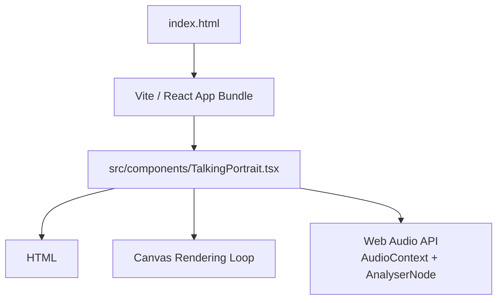
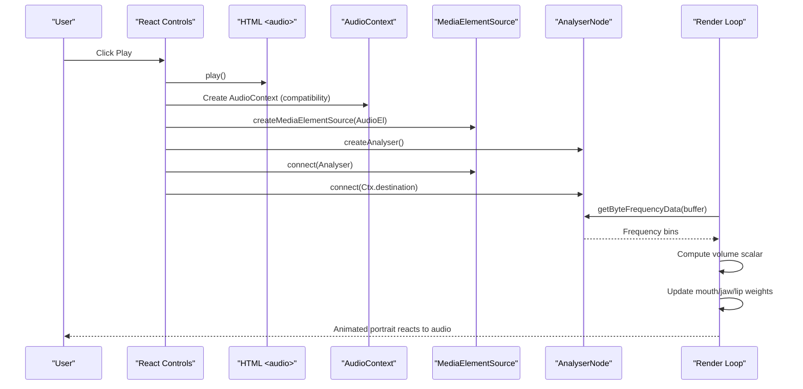
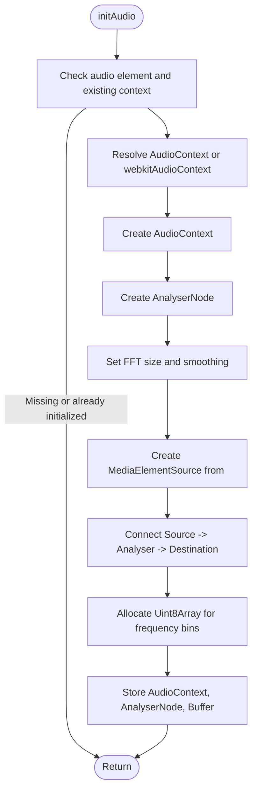
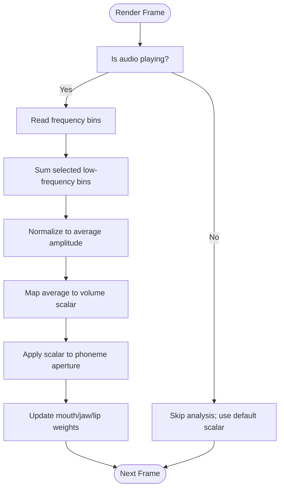
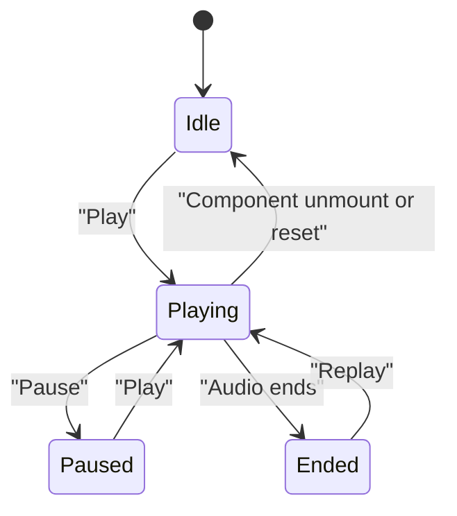
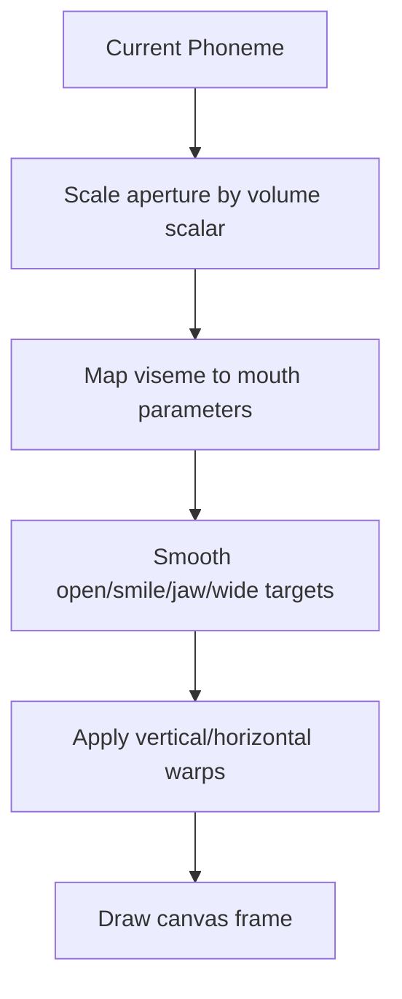
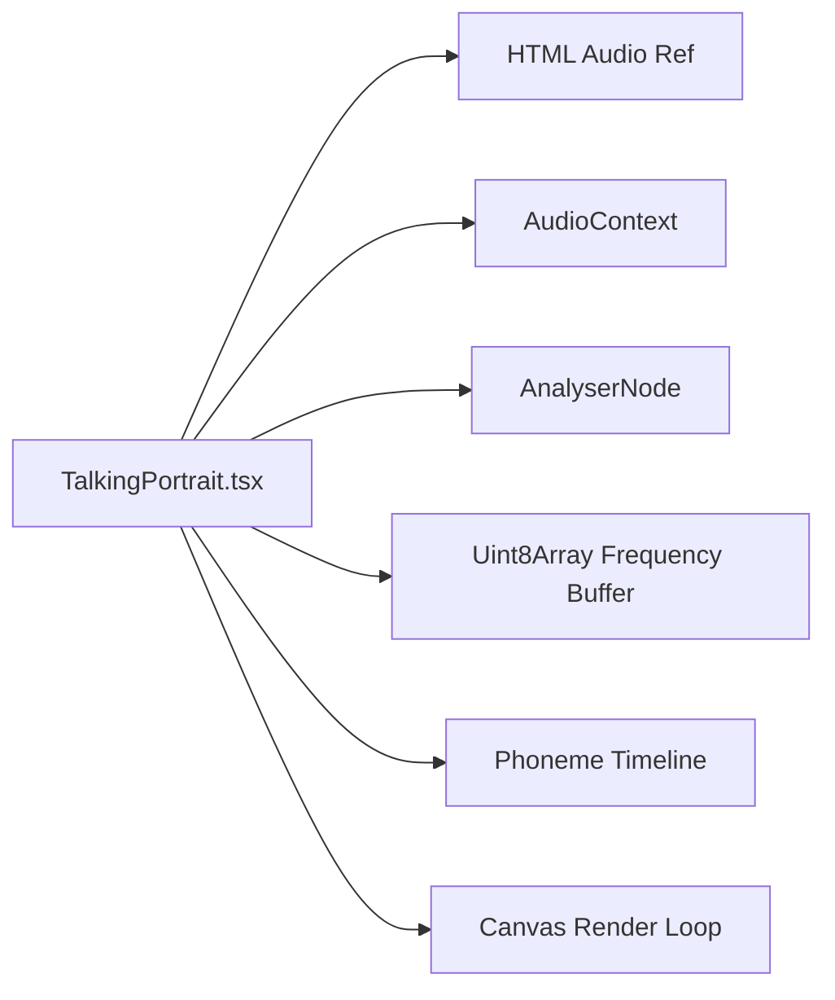

# Web Audio API Implementation

<cite>
**Referenced Files in This Document**
- [TalkingPortrait.tsx](file://src/components/TalkingPortrait.tsx)
- [index.html](file://index.html)
</cite>

## Table of Contents
1. [Introduction](#introduction)
2. [Project Structure](#project-structure)
3. [Core Components](#core-components)
4. [Architecture Overview](#architecture-overview)
5. [Detailed Component Analysis](#detailed-component-analysis)
6. [Dependency Analysis](#dependency-analysis)
7. [Performance Considerations](#performance-considerations)
8. [Troubleshooting Guide](#troubleshooting-guide)
9. [Conclusion](#conclusion)

## Introduction
This document explains the Web Audio API implementation used to enable real-time audio analysis and visualization for a photorealistic talking portrait component. The system reads an HTML audio element, analyzes its frequency content with an AnalyserNode, and uses the resulting data to modulate mouth animation parameters so that facial movement reacts to the actual audio signal.

The implementation focuses on:
- Initializing the Web Audio API with browser compatibility handling.
- Configuring an AnalyserNode with FFT size and smoothing.
- Connecting the HTML audio element as a MediaElementSource.
- Extracting frequency data each frame and computing a volume scalar.
- Mapping the computed scalar into mouth aperture and related deformation weights.
- Managing audio state transitions, error handling, and performance considerations for continuous real-time processing.

## Project Structure
The Web Audio integration lives inside the React component responsible for rendering the animated portrait and controlling playback. The HTML entry point loads the application bundle but does not directly contain audio logic.

**Diagram sources**
- [index.html:15-18](file://index.html#L15-L18)
- [TalkingPortrait.tsx:318-358](file://src/components/TalkingPortrait.tsx#L318-L358)
- [TalkingPortrait.tsx:370-608](file://src/components/TalkingPortrait.tsx#L370-L608)

**Section sources**
- [index.html:15-18](file://index.html#L15-L18)
- [TalkingPortrait.tsx:318-358](file://src/components/TalkingPortrait.tsx#L318-L358)

## Core Components
The Web Audio functionality is implemented within the `TalkingPortrait` component. It manages:
- An HTML `<audio>` element bound through a ref.
- A Web Audio `AudioContext`.
- An `AnalyserNode` configured for frequency analysis.
- A typed frequency buffer for reading frequency bins.
- A render loop that updates facial deformation based on audio analysis.

Key responsibilities:
- Initialize audio context once per audio element.
- Connect the media element source to the analyser and destination.
- Read frequency data every frame while playing.
- Compute a normalized volume scalar from selected low-frequency bins.
- Apply the scalar to phoneme-driven mouth shapes.

**Section sources**
- [TalkingPortrait.tsx:318-358](file://src/components/TalkingPortrait.tsx#L318-L358)
- [TalkingPortrait.tsx:360-368](file://src/components/TalkingPortrait.tsx#L360-L368)
- [TalkingPortrait.tsx:434-484](file://src/components/TalkingPortrait.tsx#L434-L484)

## Architecture Overview
The audio pipeline connects the HTML audio element to the Web Audio graph and then feeds frequency data into the animation loop.

**Diagram sources**
- [TalkingPortrait.tsx:340-358](file://src/components/TalkingPortrait.tsx#L340-L358)
- [TalkingPortrait.tsx:360-368](file://src/components/TalkingPortrait.tsx#L360-L368)
- [TalkingPortrait.tsx:434-484](file://src/components/TalkingPortrait.tsx#L434-L484)
- [TalkingPortrait.tsx:610-627](file://src/components/TalkingPortrait.tsx#L610-L627)

## Detailed Component Analysis

### Audio Context Initialization and Browser Compatibility
The initialization function:
- Guards against multiple initializations by checking whether the audio context already exists.
- Resolves `AudioContext` or the legacy `webkitAudioContext`.
- Creates an `AnalyserNode`, sets FFT size and smoothing time constant.
- Creates a `MediaElementSource` from the HTML audio element.
- Connects the source to the analyser and the analyser to the destination.
- Allocates a `Uint8Array` sized to the analyser’s frequency bin count.
- Wraps setup in a try/catch and logs warnings if creation fails.

**Diagram sources**
- [TalkingPortrait.tsx:340-358](file://src/components/TalkingPortrait.tsx#L340-L358)

**Section sources**
- [TalkingPortrait.tsx:340-358](file://src/components/TalkingPortrait.tsx#L340-L358)

### AnalyserNode Configuration
The analyser is configured with:
- FFT size set to 256.
- Smoothing time constant set to 0.6.

These settings determine:
- Frequency resolution and latency characteristics.
- Temporal smoothing between frames to reduce jitter in the frequency data.

The frequency bin array is allocated using `frequencyBinCount`, ensuring the buffer matches the analyser configuration.

**Section sources**
- [TalkingPortrait.tsx:346-354](file://src/components/TalkingPortrait.tsx#L346-L354)

### MediaElementSource Connection
The HTML audio element is connected to the Web Audio graph via:
- `createMediaElementSource(audioElement)`
- `source.connect(analyser)`
- `analyser.connect(destination)`

This allows the same audio to be both played through speakers and analyzed in real time.

**Section sources**
- [TalkingPortrait.tsx:349-351](file://src/components/TalkingPortrait.tsx#L349-L351)

### Frequency Data Extraction and Volume Calculation
Each frame during playback:
- The render loop calls `getByteFrequencyData` to fill the typed array with frequency bin amplitudes.
- A subset of low-frequency bins is summed to estimate overall energy.
- The sum is averaged across the selected range and normalized.
- The average is mapped to a scalar in a constrained range around 1.0.
- The scalar modulates the effective aperture of the current phoneme, influencing mouth opening, jaw drop, smile stretch, and lip rounding.

**Diagram sources**
- [TalkingPortrait.tsx:360-368](file://src/components/TalkingPortrait.tsx#L360-L368)
- [TalkingPortrait.tsx:442-463](file://src/components/TalkingPortrait.tsx#L442-L463)

**Section sources**
- [TalkingPortrait.tsx:360-368](file://src/components/TalkingPortrait.tsx#L360-L368)
- [TalkingPortrait.tsx:442-463](file://src/components/TalkingPortrait.tsx#L442-L463)

### Audio State Transitions and Playback Control
The component handles:
- Play: initializes audio, resumes suspended context, resets end state if needed, plays audio, and sets playing state.
- Pause: pauses the audio and clears playing state.
- Replay: reinitializes audio, resets time, clears end state, plays again, and sets playing state.
- Error handling: catches and warns on playback failures without breaking the UI.

**Diagram sources**
- [TalkingPortrait.tsx:610-648](file://src/components/TalkingPortrait.tsx#L610-L648)

**Section sources**
- [TalkingPortrait.tsx:610-648](file://src/components/TalkingPortrait.tsx#L610-L648)

### Integration With Animation and Visualization
The computed volume scalar is applied to phoneme targets:
- Open, smile, round, and narrow visemes map to different combinations of mouth openness, smile weight, jaw depth, and horizontal lip displacement.
- The scalar scales the target values before smoothing, allowing louder audio to produce more pronounced mouth movements.
- Blink timing and micro-motion remain independent of the audio scalar, preserving natural human-like behavior.

**Diagram sources**
- [TalkingPortrait.tsx:442-484](file://src/components/TalkingPortrait.tsx#L442-L484)
- [TalkingPortrait.tsx:549-601](file://src/components/TalkingPortrait.tsx#L549-L601)

**Section sources**
- [TalkingPortrait.tsx:442-484](file://src/components/TalkingPortrait.tsx#L442-L484)
- [TalkingPortrait.tsx:549-601](file://src/components/TalkingPortrait.tsx#L549-L601)

## Dependency Analysis
The Web Audio implementation depends on:
- The HTML audio element ref.
- The React render loop driven by `requestAnimationFrame`.
- The phoneme timeline and phrase metadata for synchronization.
- Canvas drawing functions for face deformation.

**Diagram sources**
- [TalkingPortrait.tsx:318-358](file://src/components/TalkingPortrait.tsx#L318-L358)
- [TalkingPortrait.tsx:370-608](file://src/components/TalkingPortrait.tsx#L370-L608)

**Section sources**
- [TalkingPortrait.tsx:318-358](file://src/components/TalkingPortrait.tsx#L318-L358)
- [TalkingPortrait.tsx:370-608](file://src/components/TalkingPortrait.tsx#L370-L608)

## Performance Considerations
Real-time audio analysis and canvas rendering impose ongoing CPU costs. The implementation includes several performance-relevant patterns:

- Frequency bin selection: Only a limited range of low-frequency bins is summed, reducing per-frame computation.
- Typed arrays: Using `Uint8Array` avoids frequent allocations and improves memory efficiency.
- Conditional analysis: The volume scalar calculation skips when the analyser or buffer is unavailable or when not playing.
- Smoothed targets: Phoneme targets are smoothed over time, preventing abrupt jumps and reducing visual jitter.
- RequestAnimationFrame: The render loop uses the browser’s animation frame callback for consistent timing.
- Offscreen buffers: Composition and warping use intermediate canvases to minimize redundant drawing operations.

Recommendations for further optimization:
- Avoid creating new AudioContext instances repeatedly; reuse the existing one.
- Consider lowering FFT size if latency becomes critical, balancing frequency resolution.
- Throttle heavy canvas operations if frame rate drops under load.
- Ensure images and audio assets are preloaded to avoid stalls during first frames.

[No sources needed since this section provides general guidance]

## Troubleshooting Guide
Common issues and how the code addresses them:

- AudioContext not available or blocked:
  - The code resolves `AudioContext` or `webkitAudioContext`.
  - Setup is wrapped in try/catch and logs a warning if it fails.

- Suspended audio context:
  - Before playing, the code checks if the context is suspended and resumes it asynchronously.

- Playback errors:
  - `play()` and replay attempts are wrapped in try/catch blocks that warn on failure without crashing the UI.

- Missing audio element:
  - Play and replay handlers guard against missing refs.

- Frequency data unavailable:
  - The volume scalar returns a neutral value when analyser or buffer is missing or when not playing.

Operational checks:
- Verify the HTML audio element has a valid source.
- Confirm user interaction triggers audio playback where required by browsers.
- Inspect console warnings for AudioContext setup or playback errors.

**Section sources**
- [TalkingPortrait.tsx:340-358](file://src/components/TalkingPortrait.tsx#L340-L358)
- [TalkingPortrait.tsx:610-648](file://src/components/TalkingPortrait.tsx#L610-L648)

## Conclusion
The Web Audio API implementation integrates seamlessly with the talking portrait component to provide real-time audio-reactive animation. By initializing an AudioContext, configuring an AnalyserNode, connecting the HTML audio element, and extracting frequency data each frame, the system computes a volume scalar that modulates mouth articulation. The design balances realism, performance, and robustness through careful state management, error handling, and efficient data processing.

[No sources needed since this section summarizes without analyzing specific files]