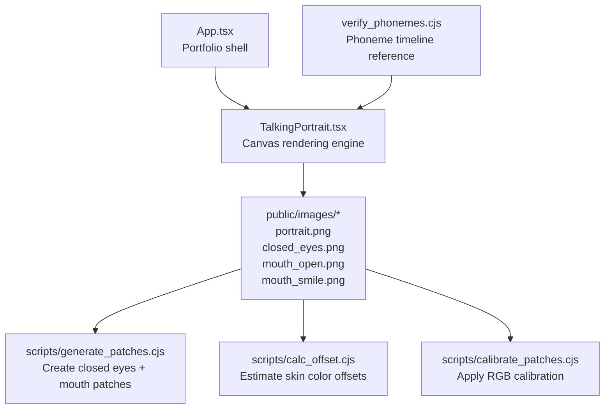
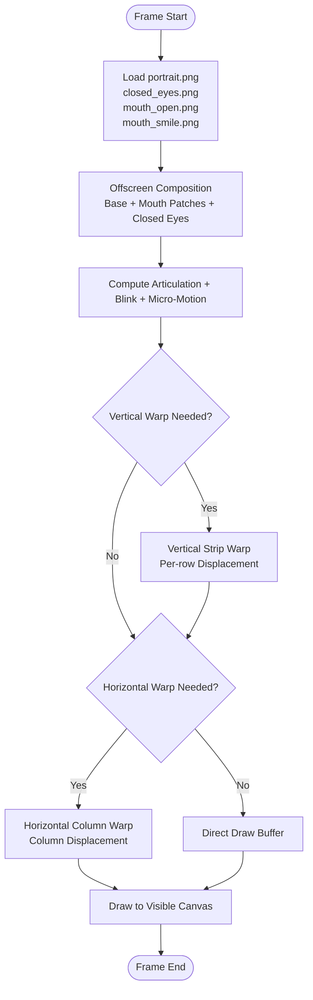
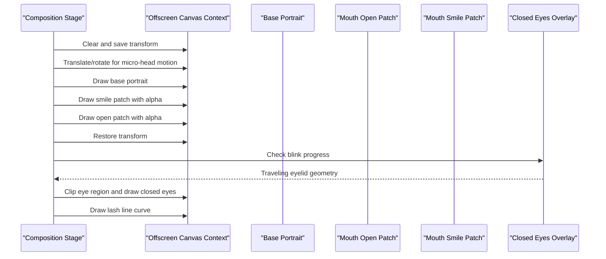
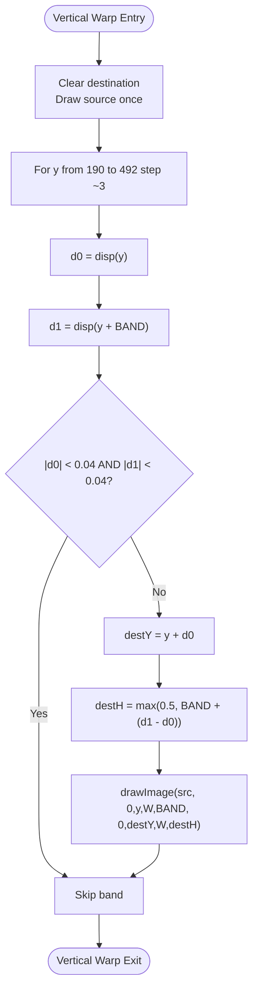
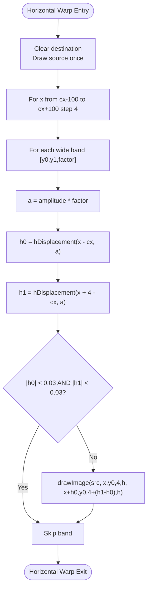
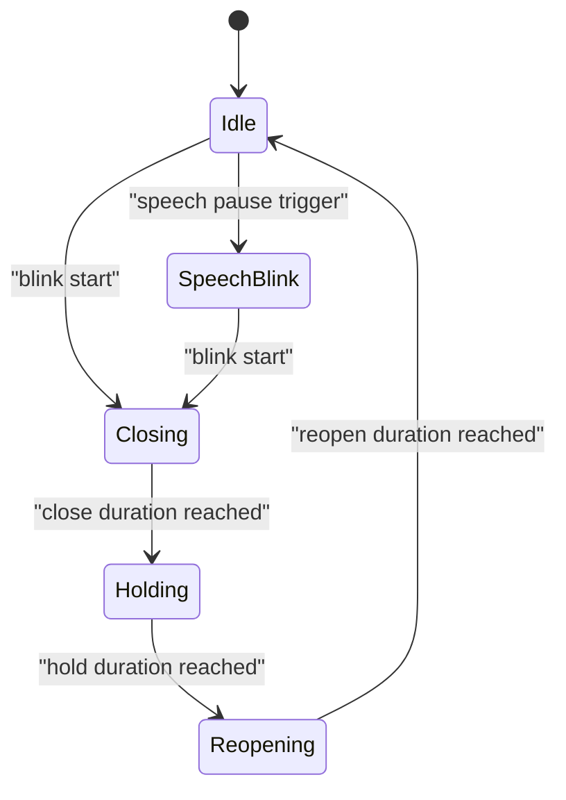
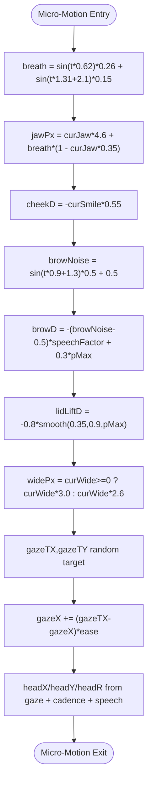
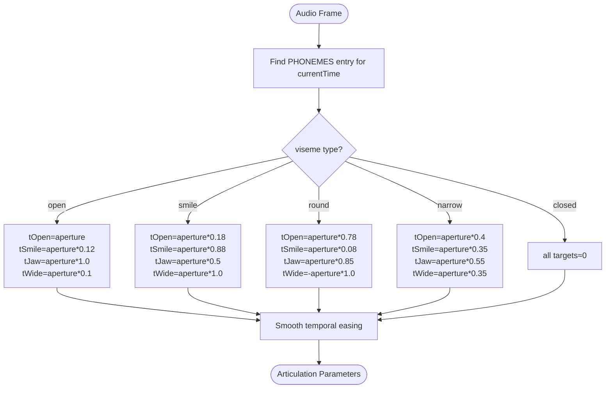
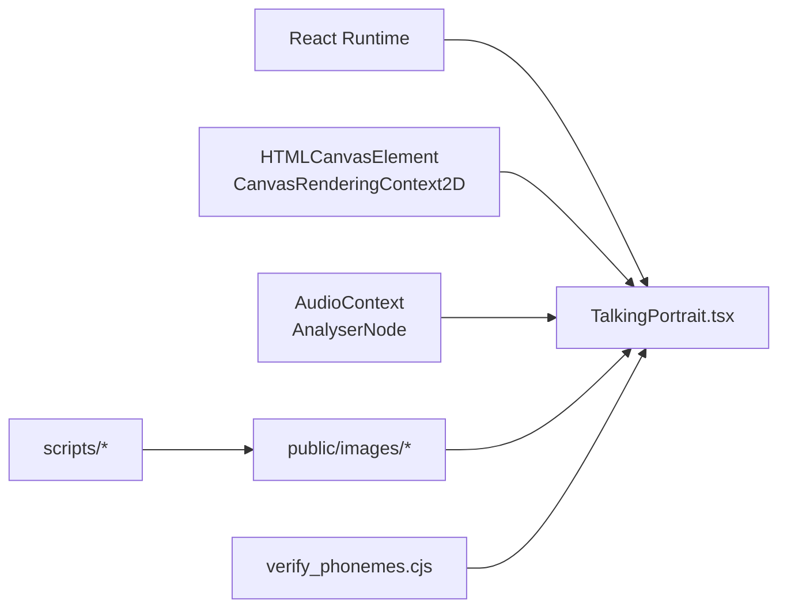

# Canvas Rendering Engine

<cite>
**Referenced Files in This Document**
- [TalkingPortrait.tsx](file://src/components/TalkingPortrait.tsx)
- [App.tsx](file://src/App.tsx)
- [generate_patches.cjs](file://scripts/generate_patches.cjs)
- [calc_offset.cjs](file://scripts/calc_offset.cjs)
- [calibrate_patches.cjs](file://scripts/calibrate_patches.cjs)
- [verify_phonemes.cjs](file://verify_phonemes.cjs)
</cite>

## Table of Contents
1. [Introduction](#introduction)
2. [Project Structure](#project-structure)
3. [Core Components](#core-components)
4. [Architecture Overview](#architecture-overview)
5. [Detailed Component Analysis](#detailed-component-analysis)
6. [Dependency Analysis](#dependency-analysis)
7. [Performance Considerations](#performance-considerations)
8. [Troubleshooting Guide](#troubleshooting-guide)
9. [Conclusion](#conclusion)
10. [Appendices](#appendices)

## Introduction
This document explains the Canvas Rendering Engine that powers the realistic talking portrait. The system does not animate a face by swapping static images; it composes an authentic base photograph with photographic patches and then applies physical deformation through two warps:
- Vertical strip warping for jaw drop, cheek lift, brow micro-motion, and lower-lid response.
- Horizontal column warping for lip-corner stretch and lip pucker.

The engine also implements:
- A traveling eyelid blink system that maps a real closed-eyelid image along an advancing lid margin.
- Micro-motion for breathing, head cadence, and fixational micro-saccades.
- Audio-driven phoneme-to-viseme mapping that controls mouth aperture, jaw depth, smile weight, and horizontal lip width.
- An offscreen composition pipeline that buffers base images and animated patches before warping to the screen canvas.

The documentation covers direct pixel manipulation techniques, coordinate transformations, mathematical formulas, performance strategies, and extension points for new expressions or modified deformation parameters.

## Project Structure
The rendering engine is implemented as a React component that owns the animation loop, audio synchronization, and Canvas operations. Supporting scripts prepare and calibrate the photographic assets used at runtime.

**Diagram sources**
- [App.tsx:101-144](file://src/App.tsx#L101-L144)
- [TalkingPortrait.tsx:318-608](file://src/components/TalkingPortrait.tsx#L318-L608)
- [generate_patches.cjs:1-122](file://scripts/generate_patches.cjs#L1-L122)
- [calc_offset.cjs:1-33](file://scripts/calc_offset.cjs#L1-L33)
- [calibrate_patches.cjs:1-21](file://scripts/calibrate_patches.cjs#L1-L21)
- [verify_phonemes.cjs:1-86](file://verify_phonemes.cjs#L1-L86)

**Section sources**
- [App.tsx:101-144](file://src/App.tsx#L101-L144)
- [TalkingPortrait.tsx:318-608](file://src/components/TalkingPortrait.tsx#L318-L608)

## Core Components
The core rendering logic lives in `TalkingPortrait.tsx`. It manages:
- Image asset loading and offscreen buffer creation.
- Audio context setup and frequency analysis.
- Animation state for speech articulation, blinking, and micro-motion.
- Composition of base photo and photographic patches.
- Vertical and horizontal warping pipelines.
- Blink drawing with traveling eyelid geometry.

Key responsibilities:
- **Composition stage**: Draw base portrait, mouth patches, and closed-eyes overlay into an offscreen canvas.
- **Deformation stage**: Apply vertical strip warp and horizontal column warp based on computed facial parameters.
- **Blink system**: Compute closure curves and draw the real closed-eyelid patch with a traveling lash line.
- **Micro-motion system**: Add zero-mean organic noise for breath, brow movement, cheek response, and slow head motion.
- **Audio-reactive scaling**: Adjust mouth aperture slightly using real-time frequency data.

**Section sources**
- [TalkingPortrait.tsx:3-33](file://src/components/TalkingPortrait.tsx#L3-L33)
- [TalkingPortrait.tsx:318-608](file://src/components/TalkingPortrait.tsx#L318-L608)

## Architecture Overview
The rendering pipeline follows a strict four-stage flow:

1. **Compose**: Base image plus authentic photographic patches are drawn into an offscreen buffer. Mouth patches use alpha blending; closed-eyes are composited with traveling eyelid geometry.
2. **Vertical Warp**: Per-row displacement simulates jaw drop, cheek lift, brow micro-motion, and lower-lid response.
3. **Horizontal Warp**: Column-wise displacement around the mouth simulates lip-corner stretch and lip pucker.
4. **Screen Output**: The final warped frame is drawn to the visible canvas.

**Diagram sources**
- [TalkingPortrait.tsx:370-608](file://src/components/TalkingPortrait.tsx#L370-L608)

**Section sources**
- [TalkingPortrait.tsx:370-608](file://src/components/TalkingPortrait.tsx#L370-L608)

## Detailed Component Analysis

### Image Composition Pipeline
The composition stage builds the animated frame before any deformation occurs. It uses three main image assets:
- `portrait.png`: Base photograph.
- `mouth_open.png` and `mouth_smile.png`: Authentic photographic mouth patches.
- `closed_eyes.png`: Real closed-eyelid overlay used during blinks.

Mouth patch opacity is controlled by smoothed open and smile weights raised to a mild power curve to avoid ghost lips while preserving lip-sync timing. Closed-eyes are drawn only when blink progress exceeds a small threshold, and the eyelid geometry is clipped to a curved eye region.

**Diagram sources**
- [TalkingPortrait.tsx:549-583](file://src/components/TalkingPortrait.tsx#L549-L583)
- [TalkingPortrait.tsx:230-268](file://src/components/TalkingPortrait.tsx#L230-L268)

**Section sources**
- [TalkingPortrait.tsx:549-583](file://src/components/TalkingPortrait.tsx#L549-L583)
- [TalkingPortrait.tsx:230-268](file://src/components/TalkingPortrait.tsx#L230-L268)

### Vertical Strip Warping Algorithm
The vertical warp applies per-row displacement across a band from row 190 to row 492. Each band has a fixed height, and the destination row and height are adjusted according to the displacement function. This creates a physically connected lower-face movement where jaw drop, cheek lift, brow motion, and lower-lid response combine smoothly.

Mathematical behavior:
- Band iteration step: approximately 3 pixels vertically.
- Destination row: `destY = y + d0`, where `d0` is displacement at row `y`.
- Destination height: `destH = max(0.5, BAND + (d1 - d0))`, ensuring stable sampling even under compression/expansion.
- Skip optimization: bands with negligible displacement at both edges are skipped.

Displacement composition:
- Brow window: active between rows 190–220.
- Lower-lid window: active between rows 236–264.
- Cheek window: active between rows 294–358.
- Jaw curve: hinged below the mouth, full across chin/neck, with smooth falloff.

**Diagram sources**
- [TalkingPortrait.tsx:270-287](file://src/components/TalkingPortrait.tsx#L270-L287)
- [TalkingPortrait.tsx:524-531](file://src/components/TalkingPortrait.tsx#L524-L531)

**Section sources**
- [TalkingPortrait.tsx:270-287](file://src/components/TalkingPortrait.tsx#L270-L287)
- [TalkingPortrait.tsx:524-531](file://src/components/TalkingPortrait.tsx#L524-L531)

### Horizontal Column Warping Algorithm
The horizontal warp applies column-wise displacement around the mouth center. It uses multiple horizontal bands with different falloff factors to simulate lip-corner stretch and lip pucker. The displacement function combines odd symmetry via hyperbolic tangent with Gaussian falloff to keep seams sub-pixel and natural.

Mathematical behavior:
- Horizontal range: mouth center ± 100 pixels.
- Column step: 4 pixels horizontally.
- Bands: five horizontal regions with factors 0.30, 0.70, 1.00, 0.70, 0.30.
- Displacement formula: `hDisplacement(dx, amp) = amp * tanh(dx / 22) * exp(-(dx²) / (58²))`.
- Destination width: `4 + (h1 - h0)` where `h0` and `h1` are displacements at column `x` and `x+4`.

**Diagram sources**
- [TalkingPortrait.tsx:289-316](file://src/components/TalkingPortrait.tsx#L289-L316)

**Section sources**
- [TalkingPortrait.tsx:289-316](file://src/components/TalkingPortrait.tsx#L289-L316)

### Blink System and Traveling Eyelid Geometry
The blink system uses a state machine with randomized closing, hold, and reopening durations. Each blink includes a small inter-ocular lead so one eye closes marginally first. During closure, the real closed-eyelid image is re-mapped so its lash line aligns exactly with the advancing lid edge. At full closure, the mapping becomes identity.

Key elements:
- Closure curve: eased close → brief hold → eased reopen.
- Eye landmarks: corner positions, crease Y, lash Y, lower lid Y, pupil center.
- Clipping path: quadratic curves define the eye region and moving lid edge.
- Lash line: soft stroke fades in as closure progresses.

**Diagram sources**
- [TalkingPortrait.tsx:423-507](file://src/components/TalkingPortrait.tsx#L423-L507)
- [TalkingPortrait.tsx:217-268](file://src/components/TalkingPortrait.tsx#L217-L268)

**Section sources**
- [TalkingPortrait.tsx:423-507](file://src/components/TalkingPortrait.tsx#L423-L507)
- [TalkingPortrait.tsx:217-268](file://src/components/TalkingPortrait.tsx#L217-L268)

### Micro-Motion System
Micro-motion adds subtle life to the face without visible shaking. It includes:
- Breathing: zero-mean sinusoidal motion affecting jaw and head position.
- Brow micro-motion: organic noise modulated by speech state.
- Cheek response: upward movement during smiles.
- Lower-lid squeeze: subtle response during blink closure.
- Fixational micro-saccades: random gaze targets with smooth interpolation.
- Slow head cadence: very small translation and rotation over time.

Coordinate transformation:
- Center-based transform: translate to image center, rotate by tiny angle, translate back with head offset.
- Head offset combines saccade target, sine/cosine cadence, and speech-reactive mouth influence.

**Diagram sources**
- [TalkingPortrait.tsx:511-547](file://src/components/TalkingPortrait.tsx#L511-L547)

**Section sources**
- [TalkingPortrait.tsx:511-547](file://src/components/TalkingPortrait.tsx#L511-L547)

### Phoneme-to-Viseme Mapping and Audio Reactivity
The engine maps spoken audio to visemes: open, smile, round, narrow, and closed. Each viseme produces distinct mouth shape parameters:
- Open: high jaw depth, moderate smile weight, slight horizontal stretch.
- Smile: high smile weight, moderate jaw depth, maximum horizontal stretch.
- Round: high jaw depth, low smile weight, negative horizontal stretch (pucker).
- Narrow: moderate values across all parameters.
- Closed: all targets near zero.

Audio volume scalar adjusts aperture slightly based on frequency analysis, adding realism without changing lip-sync timing.

**Diagram sources**
- [TalkingPortrait.tsx:442-484](file://src/components/TalkingPortrait.tsx#L442-L484)

**Section sources**
- [TalkingPortrait.tsx:442-484](file://src/components/TalkingPortrait.tsx#L442-L484)

### Mathematical Formulas and Coordinate Transformations
Key formulas and transformations used throughout the engine:

- Smoothstep ramp: `smooth(a, b, v) = clamp((v-a)/(b-a))` applied with cubic Hermite interpolation `t*t*(3-2*t)`.
- Jaw curve: piecewise function with hinge below mouth, full effect across chin/neck, and smooth exit.
- Horizontal displacement: `hDisplacement(dx, amp) = amp * tanh(dx/22) * exp(-dx²/58²)`.
- Blink closure: piecewise eased close → hold → reopen with cubic Hermite segments.
- Composition transform: `translate(center) → rotate(headR) → translate(-center + headOffset)`.
- Vertical warp destination: `destY = y + d(y)`, `destH = max(0.5, BAND + d(y+BAND) - d(y))`.
- Horizontal warp destination width: `width = 4 + h(x+4) - h(x)`.

These formulas ensure sub-pixel seamlessness, physically plausible deformation, and smooth temporal transitions.

**Section sources**
- [TalkingPortrait.tsx:67-99](file://src/components/TalkingPortrait.tsx#L67-L99)
- [TalkingPortrait.tsx:217-225](file://src/components/TalkingPortrait.tsx#L217-L225)
- [TalkingPortrait.tsx:270-316](file://src/components/TalkingPortrait.tsx#L270-L316)
- [TalkingPortrait.tsx:555-559](file://src/components/TalkingPortrait.tsx#L555-L559)

## Dependency Analysis
The rendering engine depends on several external resources and internal modules:

- **React**: Component lifecycle, refs, state, and memoization.
- **Canvas API**: Offscreen canvases, image drawing, clipping, and pixel manipulation.
- **Web Audio API**: AudioContext, AnalyserNode, and frequency data for audio-reactive scaling.
- **Image assets**: Base portrait and photographic patches generated/calibrated offline.
- **Supporting scripts**: Asset generation, color offset calculation, and calibration.

**Diagram sources**
- [TalkingPortrait.tsx:1-2](file://src/components/TalkingPortrait.tsx#L1-L2)
- [TalkingPortrait.tsx:340-358](file://src/components/TalkingPortrait.tsx#L340-L358)
- [generate_patches.cjs:1-122](file://scripts/generate_patches.cjs#L1-L122)
- [calc_offset.cjs:1-33](file://scripts/calc_offset.cjs#L1-L33)
- [calibrate_patches.cjs:1-21](file://scripts/calibrate_patches.cjs#L1-L21)
- [verify_phonemes.cjs:1-86](file://verify_phonemes.cjs#L1-L86)

**Section sources**
- [TalkingPortrait.tsx:1-2](file://src/components/TalkingPortrait.tsx#L1-L2)
- [TalkingPortrait.tsx:340-358](file://src/components/TalkingPortrait.tsx#L340-L358)
- [generate_patches.cjs:1-122](file://scripts/generate_patches.cjs#L1-L122)
- [calc_offset.cjs:1-33](file://scripts/calc_offset.cjs#L1-L33)
- [calibrate_patches.cjs:1-21](file://scripts/calibrate_patches.cjs#L1-L21)
- [verify_phonemes.cjs:1-86](file://verify_phonemes.cjs#L1-L86)

## Performance Considerations
The engine implements several optimization strategies:

- **Offscreen canvas buffering**: Two offscreen canvases separate composition, vertical warp, and horizontal warp stages to minimize redundant drawing and enable conditional warping.
- **Conditional warping**: Vertical and horizontal warps are only applied when thresholds are exceeded, avoiding unnecessary pixel operations.
- **Band skipping**: Both vertical and horizontal warps skip bands/columns with negligible displacement.
- **Efficient pixel operations**: Uses `drawImage` for block transfers rather than per-pixel manipulation, leveraging GPU acceleration where available.
- **Memory management**: Reuses canvas elements and contexts; avoids frequent allocation in the render loop.
- **Audio analysis caching**: Frequency data array is allocated once and reused.
- **RequestAnimationFrame loop**: Single animation frame request prevents multiple concurrent loops.

Recommendations for further optimization:
- Consider WebGL shaders for complex deformations if CPU-bound.
- Precompute band displacement tables for static facial regions.
- Use `willReadFrequently` canvas option if pixel reads become necessary.
- Batch image asset loading and validate completion before starting the render loop.

[No sources needed since this section provides general guidance]

## Troubleshooting Guide
Common issues and resolutions:

- **Images not loading**: Ensure `portrait.png`, `closed_eyes.png`, `mouth_open.png`, and `mouth_smile.png` exist in `public/images/`. The render loop waits for image completion before drawing.
- **AudioContext suspended**: Resume the audio context after user gesture. The code handles suspension but may require explicit resume in some browsers.
- **Blink artifacts**: Verify eyelid landmarks and closed-eyes patch alignment. Mismatched coordinates cause lash-line misalignment.
- **Ghost lips**: Adjust mouth patch alpha thresholds or recalibrate RGB offsets using `calc_offset.cjs` and `calibrate_patches.cjs`.
- **Warp seams**: Check band widths and displacement functions. Excessive displacement without proper falloff causes visible seams.
- **Performance drops**: Monitor whether warps are being applied unnecessarily. Increase threshold checks or reduce resolution if needed.

**Section sources**
- [TalkingPortrait.tsx:380-402](file://src/components/TalkingPortrait.tsx#L380-L402)
- [TalkingPortrait.tsx:550-553](file://src/components/TalkingPortrait.tsx#L550-L553)
- [calc_offset.cjs:9-27](file://scripts/calc_offset.cjs#L9-L27)
- [calibrate_patches.cjs:4-15](file://scripts/calibrate_patches.cjs#L4-L15)

## Conclusion
The Canvas Rendering Engine achieves photorealistic facial animation through a carefully designed composition and deformation pipeline. By combining authentic photographic patches with physical warping algorithms, natural blink mechanics, and subtle micro-motion, the system creates a lifelike talking portrait synchronized with audio. The architecture balances realism and performance through offscreen buffering, conditional warping, and efficient Canvas operations. Extending the system involves modifying viseme mappings, adjusting deformation parameters, or adding new photographic patches calibrated for color consistency.

[No sources needed since this section summarizes without analyzing specific files]

## Appendices

### Extending the System with New Facial Expressions
To add a new expression:
1. Define a new viseme type in the phoneme timeline.
2. Map the viseme to mouth aperture, jaw depth, smile weight, and horizontal width.
3. Create or adjust photographic patches for the new expression.
4. Calibrate patch colors using `calc_offset.cjs` and `calibrate_patches.cjs`.
5. Test visual quality and adjust alpha thresholds or deformation parameters.

Example modification points:
- Phoneme mapping: update viseme-to-parameter ratios.
- Deformation parameters: adjust `jawCurve`, `hDisplacement`, or band factors.
- Micro-motion: modify breath, brow, or head motion coefficients.

**Section sources**
- [TalkingPortrait.tsx:100-197](file://src/components/TalkingPortrait.tsx#L100-L197)
- [TalkingPortrait.tsx:442-484](file://src/components/TalkingPortrait.tsx#L442-L484)
- [generate_patches.cjs:77-122](file://scripts/generate_patches.cjs#L77-L122)
- [calc_offset.cjs:9-27](file://scripts/calc_offset.cjs#L9-L27)
- [calibrate_patches.cjs:4-15](file://scripts/calibrate_patches.cjs#L4-L15)

### Modifying Existing Deformation Parameters
Key parameters to tune:
- `JAW.start`, `JAW.full`, `JAW.hold`, `JAW.end`: Control jaw drop falloff.
- `MOUTH.cx`, `MOUTH.cy`: Center of mouth region for horizontal warp.
- `WIDE_BANDS`: Horizontal bands and falloff factors for lip expression.
- `browWindow`, `lidWindow`, `cheekWindow`: Vertical windows for facial regions.
- Micro-motion coefficients: breath amplitude, brow noise, head cadence.

Adjust these values incrementally and test visual output for naturalness.

**Section sources**
- [TalkingPortrait.tsx:60-99](file://src/components/TalkingPortrait.tsx#L60-L99)
- [TalkingPortrait.tsx:290-296](file://src/components/TalkingPortrait.tsx#L290-L296)
- [TalkingPortrait.tsx:511-547](file://src/components/TalkingPortrait.tsx#L511-L547)