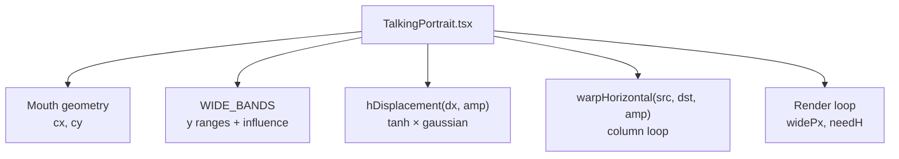
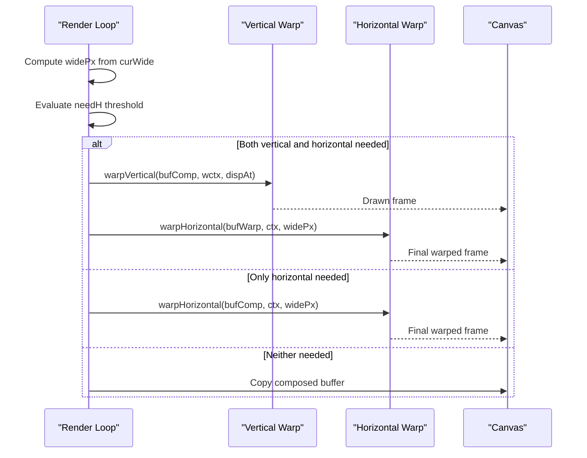
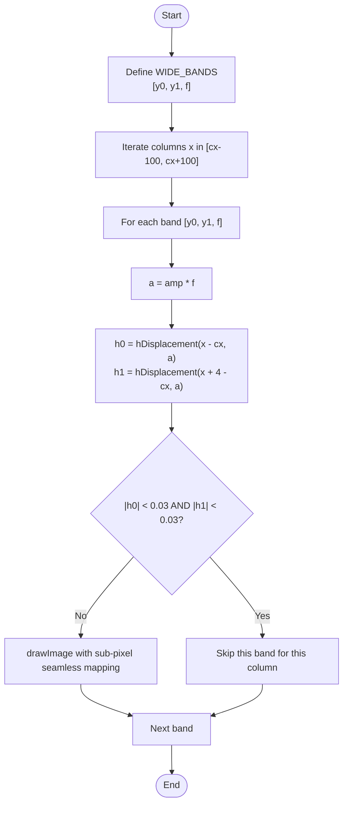
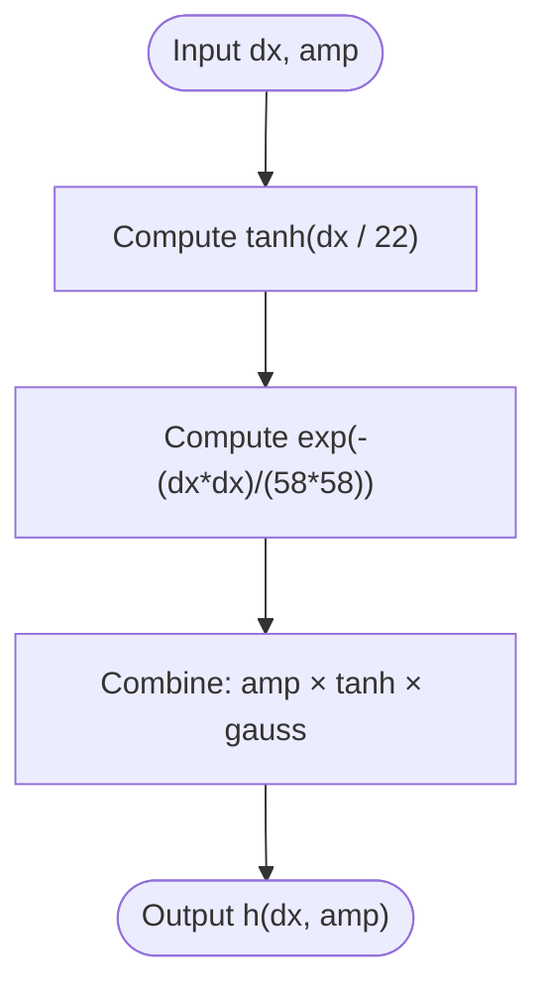
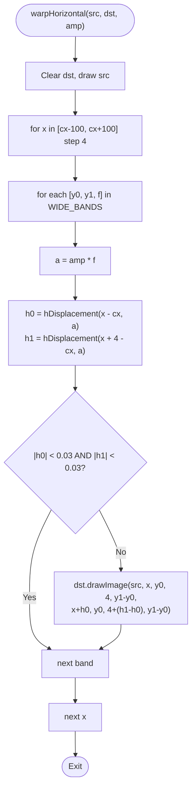
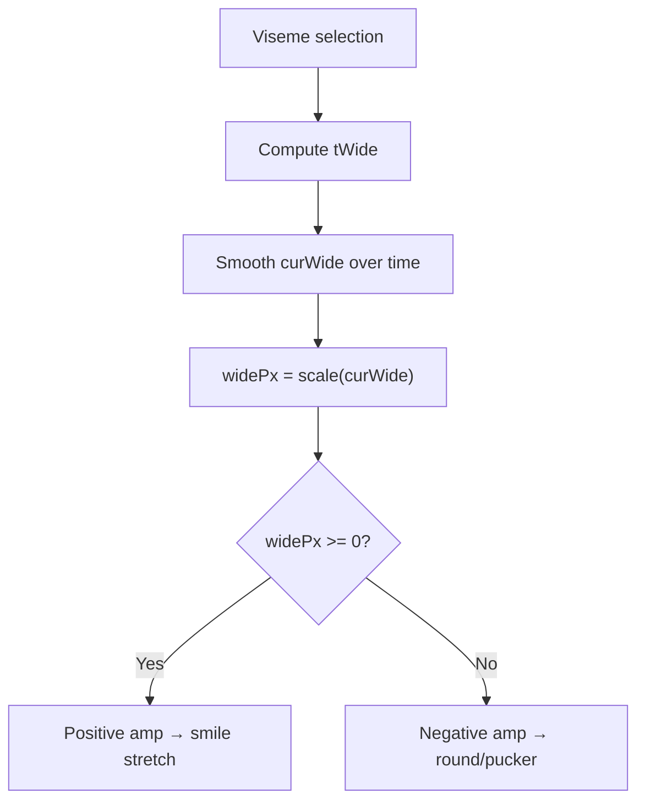
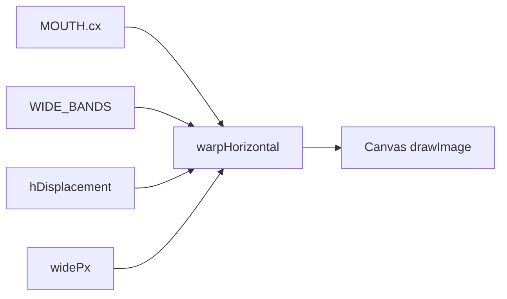

# Horizontal Column Warp System

<cite>
**Referenced Files in This Document**
- [TalkingPortrait.tsx](file://src/components/TalkingPortrait.tsx)
</cite>

## Table of Contents
1. [Introduction](#introduction)
2. [Project Structure](#project-structure)
3. [Core Components](#core-components)
4. [Architecture Overview](#architecture-overview)
5. [Detailed Component Analysis](#detailed-component-analysis)
6. [Dependency Analysis](#dependency-analysis)
7. [Performance Considerations](#performance-considerations)
8. [Troubleshooting Guide](#troubleshooting-guide)
9. [Conclusion](#conclusion)
10. [Appendices](#appendices)

## Introduction
This document explains the Horizontal Column Warp system that drives lip expressions through lateral deformation around the mouth. It focuses on how anatomical bands shape influence, how the displacement function creates natural-looking stretch and pucker, and how column-by-column processing maintains sub-pixel seamlessness while optimizing performance.

The horizontal warp is one part of a two-stage deformation pipeline:
- Vertical strip warp moves rows for jaw drop, cheek lift, brow motion, and lid response.
- Horizontal column warp stretches or puckers columns around the mouth to produce smiles and rounded shapes.

## Project Structure
The horizontal warp logic lives inside the talking portrait component. The relevant implementation includes:
- Anatomical constants for mouth center and vertical band definitions.
- A displacement function combining hyperbolic tangent and Gaussian falloff.
- A per-column drawing loop that applies optimized drawImage calls.
- Integration with the render loop that computes physical parameters such as widePx.

**Diagram sources**
- [TalkingPortrait.tsx:62-63](file://src/components/TalkingPortrait.tsx#L62-L63)
- [TalkingPortrait.tsx:96-98](file://src/components/TalkingPortrait.tsx#L96-L98)
- [TalkingPortrait.tsx:290-316](file://src/components/TalkingPortrait.tsx#L290-L316)
- [TalkingPortrait.tsx:522-522](file://src/components/TalkingPortrait.tsx#L522-L522)
- [TalkingPortrait.tsx:586-601](file://src/components/TalkingPortrait.tsx#L586-L601)

**Section sources**
- [TalkingPortrait.tsx:62-63](file://src/components/TalkingPortrait.tsx#L62-L63)
- [TalkingPortrait.tsx:290-316](file://src/components/TalkingPortrait.tsx#L290-L316)
- [TalkingPortrait.tsx:586-601](file://src/components/TalkingPortrait.tsx#L586-L601)

## Core Components
- WIDE_BANDS defines five anatomical zones around the mouth’s vertical range (approximately 300–374 pixels). Each zone has a start row, end row, and an influence factor from 0.30 to 1.00.
- hDisplacement computes lateral displacement using an odd-symmetry tanh multiplied by a Gaussian falloff.
- warpHorizontal processes image columns across a horizontal window centered at the mouth, applying per-band displacements and skipping negligible work.
- The render loop computes widePx, which controls smile stretch versus round/pucker expression.

Key responsibilities:
- WIDE_BANDS: anatomical zoning and strength shaping.
- hDisplacement: organic displacement curve.
- warpHorizontal: efficient column rendering.
- Render integration: parameter computation and conditional execution.

**Section sources**
- [TalkingPortrait.tsx:96-98](file://src/components/TalkingPortrait.tsx#L96-L98)
- [TalkingPortrait.tsx:290-316](file://src/components/TalkingPortrait.tsx#L290-L316)
- [TalkingPortrait.tsx:522-522](file://src/components/TalkingPortrait.tsx#L522-L522)
- [TalkingPortrait.tsx:586-601](file://src/components/TalkingPortrait.tsx#L586-L601)

## Architecture Overview
The horizontal warp integrates into the overall animation pipeline:

**Diagram sources**
- [TalkingPortrait.tsx:522-522](file://src/components/TalkingPortrait.tsx#L522-L522)
- [TalkingPortrait.tsx:586-601](file://src/components/TalkingPortrait.tsx#L586-L601)
- [TalkingPortrait.tsx:298-316](file://src/components/TalkingPortrait.tsx#L298-L316)

## Detailed Component Analysis

### WIDE_BANDS Configuration
WIDE_BANDS partitions the vertical region around the mouth into five bands with increasing then decreasing influence factors:
- Band 1: 300–308 px, influence 0.30
- Band 2: 308–316 px, influence 0.70
- Band 3: 316–360 px, influence 1.00
- Band 4: 360–368 px, influence 0.70
- Band 5: 368–374 px, influence 0.30

These bands concentrate deformation near the mouth’s core (centered around 316–360 px) and smoothly reduce influence toward the edges. The configuration allows tuning facial geometry by adjusting band boundaries and weights.

**Diagram sources**
- [TalkingPortrait.tsx:290-316](file://src/components/TalkingPortrait.tsx#L290-L316)

**Section sources**
- [TalkingPortrait.tsx:290-296](file://src/components/TalkingPortrait.tsx#L290-L296)

### hDisplacement Function
hDisplacement combines:
- An odd-symmetry tanh term that provides smooth sign-aware stretching direction.
- A Gaussian falloff that reduces displacement away from the mouth center.

Mathematical form:
- h(dx, amp) = amp × tanh(dx / 22) × exp(−(dx²) / (58²))

Where:
- dx is the horizontal offset from the mouth center.
- amp is the amplitude scaled by band influence.
- 22 controls the tanh transition width.
- 58 controls the Gaussian spread.

Behavior:
- Positive amp produces outward corner stretch (smile).
- Negative amp produces inward corner compression (round/pucker).
- Displacement peaks near the mouth center and tapers off symmetrically.

**Diagram sources**
- [TalkingPortrait.tsx:96-98](file://src/components/TalkingPortrait.tsx#L96-L98)

**Section sources**
- [TalkingPortrait.tsx:96-98](file://src/components/TalkingPortrait.tsx#L96-L98)

### warpHorizontal Column Processing
warpHorizontal performs:
- Clearing and initial draw of the source image.
- Iterating columns x from cx − 100 to cx + 100 in steps of 4.
- For each column, iterating all WIDE_BANDS to compute local amplitude a = amp × f.
- Evaluating h0 and h1 at x and x + 4 to determine top and bottom edge shifts.
- Skipping bands where both h0 and h1 are below 0.03 pixels.
- Drawing a narrow vertical slice with sub-pixel seamless mapping via drawImage.

Sub-pixel seamlessness:
- Using small column widths (4 px) and computing separate displacements at x and x + 4 ensures smooth transitions between adjacent slices.
- The drawImage call maps source rectangle to destination rectangle with fractional pixel offsets, preserving continuity.

Optimization checks:
- Bands with negligible displacement (< 0.03 px) are skipped entirely for that column, reducing draw calls.
- The outer loop step size (4 px) balances detail and performance.

**Diagram sources**
- [TalkingPortrait.tsx:298-316](file://src/components/TalkingPortrait.tsx#L298-L316)

**Section sources**
- [TalkingPortrait.tsx:298-316](file://src/components/TalkingPortrait.tsx#L298-L316)

### amp Parameter and Expression Control
The amp parameter passed to warpHorizontal comes from widePx computed in the render loop:
- Positive widePx yields positive amp → outward corner stretch (smile).
- Negative widePx yields negative amp → inward compression (round/pucker).
- The render loop scales curWide differently for positive vs negative values to balance visual intensity between smile and pucker.

Expression mapping:
- Smile visemes map to positive tWide, producing positive widePx.
- Round visemes map to negative tWide, producing negative widePx.
- Narrow and open visemes use smaller magnitudes, creating subtle lateral movement.

**Diagram sources**
- [TalkingPortrait.tsx:453-461](file://src/components/TalkingPortrait.tsx#L453-L461)
- [TalkingPortrait.tsx:480-484](file://src/components/TalkingPortrait.tsx#L480-L484)
- [TalkingPortrait.tsx:522-522](file://src/components/TalkingPortrait.tsx#L522-L522)

**Section sources**
- [TalkingPortrait.tsx:453-461](file://src/components/TalkingPortrait.tsx#L453-L461)
- [TalkingPortrait.tsx:480-484](file://src/components/TalkingPortrait.tsx#L480-L484)
- [TalkingPortrait.tsx:522-522](file://src/components/TalkingPortrait.tsx#L522-L522)

### Mathematical Formulas and Organic Movement
- Combined displacement: h(dx, amp) = amp × tanh(dx / 22) × exp(−(dx²) / (58²))
- Role of tanh: Provides smooth sign-aware lateral shift; saturates for large |dx|.
- Role of Gaussian: Ensures displacement fades naturally away from the mouth center.
- Band influence f: Scales amp locally so central bands have stronger effect than peripheral ones.
- Sub-pixel seamlessness: Achieved by evaluating h at both ends of each 4 px column and mapping via drawImage with fractional offsets.

These formulas create organic facial movements by:
- Avoiding hard edges or discontinuities.
- Concentrating deformation where anatomically appropriate.
- Maintaining zero-mean behavior when amp is zero (rest state aligns with original photo).

**Section sources**
- [TalkingPortrait.tsx:96-98](file://src/components/TalkingPortrait.tsx#L96-L98)
- [TalkingPortrait.tsx:290-316](file://src/components/TalkingPortrait.tsx#L290-L316)

## Dependency Analysis
The horizontal warp depends on:
- Mouth geometry constants (cx, cy).
- WIDE_BANDS configuration.
- hDisplacement function.
- Render loop variables (widePx, thresholds).

**Diagram sources**
- [TalkingPortrait.tsx:62-63](file://src/components/TalkingPortrait.tsx#L62-L63)
- [TalkingPortrait.tsx:96-98](file://src/components/TalkingPortrait.tsx#L96-L98)
- [TalkingPortrait.tsx:290-316](file://src/components/TalkingPortrait.tsx#L290-L316)
- [TalkingPortrait.tsx:522-522](file://src/components/TalkingPortrait.tsx#L522-L522)

**Section sources**
- [TalkingPortrait.tsx:62-63](file://src/components/TalkingPortrait.tsx#L62-L63)
- [TalkingPortrait.tsx:96-98](file://src/components/TalkingPortrait.tsx#L96-L98)
- [TalkingPortrait.tsx:290-316](file://src/components/TalkingPortrait.tsx#L290-L316)
- [TalkingPortrait.tsx:522-522](file://src/components/TalkingPortrait.tsx#L522-L522)

## Performance Considerations
- Column step size: Processing every 4 pixels reduces draw calls while maintaining smoothness.
- Negligible displacement check: Bands with |h0| < 0.03 and |h1| < 0.03 are skipped, minimizing unnecessary work.
- Conditional execution: The render loop only invokes warpHorizontal when |widePx| exceeds a small threshold.
- Sub-pixel mapping: drawImage handles fractional pixel coordinates efficiently without extra interpolation code.

Recommendations:
- Keep the 0.03 px skip threshold to avoid visible seams while saving GPU/CPU cycles.
- Tune the column step size if higher resolution or different aspect ratios require finer control.
- Monitor widePx magnitude to ensure the threshold avoids flicker due to rounding.

**Section sources**
- [TalkingPortrait.tsx:307-315](file://src/components/TalkingPortrait.tsx#L307-L315)
- [TalkingPortrait.tsx:586-601](file://src/components/TalkingPortrait.tsx#L586-L601)

## Troubleshooting Guide
Common issues and resolutions:
- Visible seams at column boundaries:
  - Ensure hDisplacement is evaluated at both x and x + 4 and that drawImage uses these values for seamless mapping.
  - Verify that the column step size is not too large for your target resolution.
- Weak or exaggerated expressions:
  - Adjust WIDE_BANDS influence factors to increase or decrease localized strength.
  - Modify widePx scaling in the render loop to balance smile vs pucker intensity.
- Jitter or flicker:
  - Increase the needH threshold slightly if tiny fluctuations cause unnecessary redraws.
  - Confirm that smoothing of curWide is applied consistently.

**Section sources**
- [TalkingPortrait.tsx:298-316](file://src/components/TalkingPortrait.tsx#L298-L316)
- [TalkingPortrait.tsx:522-522](file://src/components/TalkingPortrait.tsx#L522-L522)
- [TalkingPortrait.tsx:586-601](file://src/components/TalkingPortrait.tsx#L586-L601)

## Conclusion
The Horizontal Column Warp system delivers natural lip expressions by combining anatomical banding, a smooth displacement function, and efficient column-based rendering. WIDE_BANDS concentrates deformation around the mouth, hDisplacement provides organic stretch and pucker curves, and warpHorizontal ensures sub-pixel seamlessness while skipping negligible work. The amp parameter, driven by widePx, toggles between smile and round expressions, integrating seamlessly with the broader facial deformation pipeline.

## Appendices

### Extending the System
- Adding new expression types:
  - Introduce additional viseme mappings to adjust tWide with distinct signs or magnitudes.
  - Blend multiple viseme targets to create hybrid expressions (e.g., slight smile with mild pucker).
- Modifying band configurations:
  - Adjust WIDE_BANDS boundaries to match different facial geometries or camera angles.
  - Increase central band influence for pronounced mouth movement; reduce peripheral bands to minimize artifacts.
- Tuning displacement parameters:
  - Change the tanh divisor (22) to alter transition width.
  - Change the Gaussian spread (58) to extend or tighten the falloff region.

**Section sources**
- [TalkingPortrait.tsx:96-98](file://src/components/TalkingPortrait.tsx#L96-L98)
- [TalkingPortrait.tsx:290-296](file://src/components/TalkingPortrait.tsx#L290-L296)
- [TalkingPortrait.tsx:453-461](file://src/components/TalkingPortrait.tsx#L453-L461)