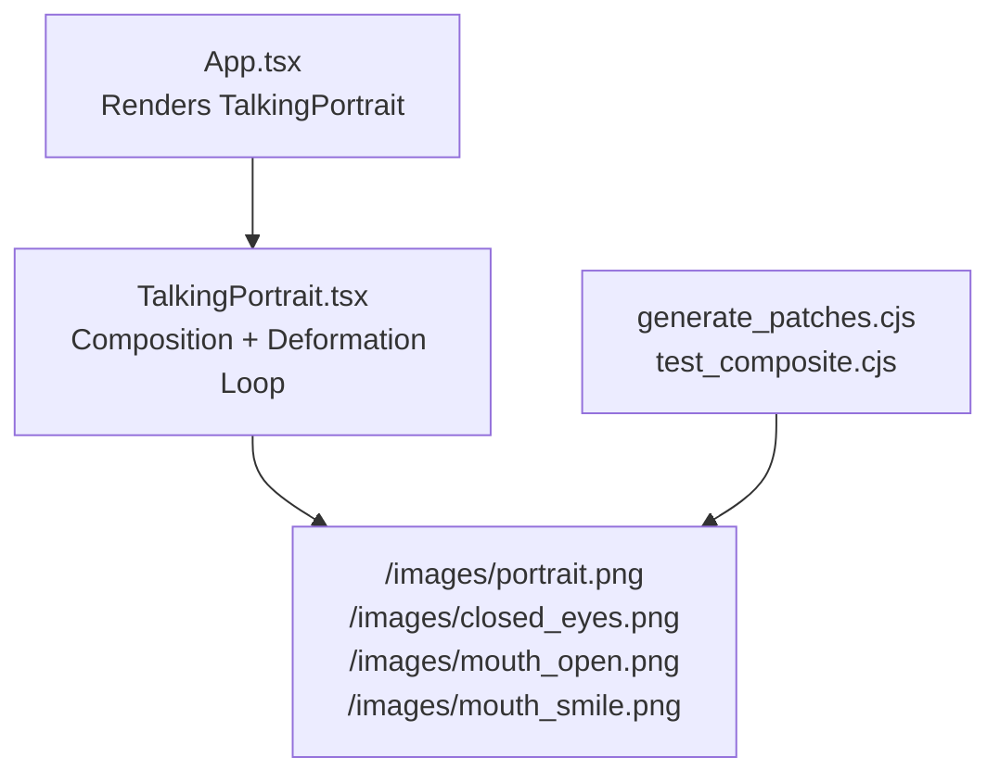
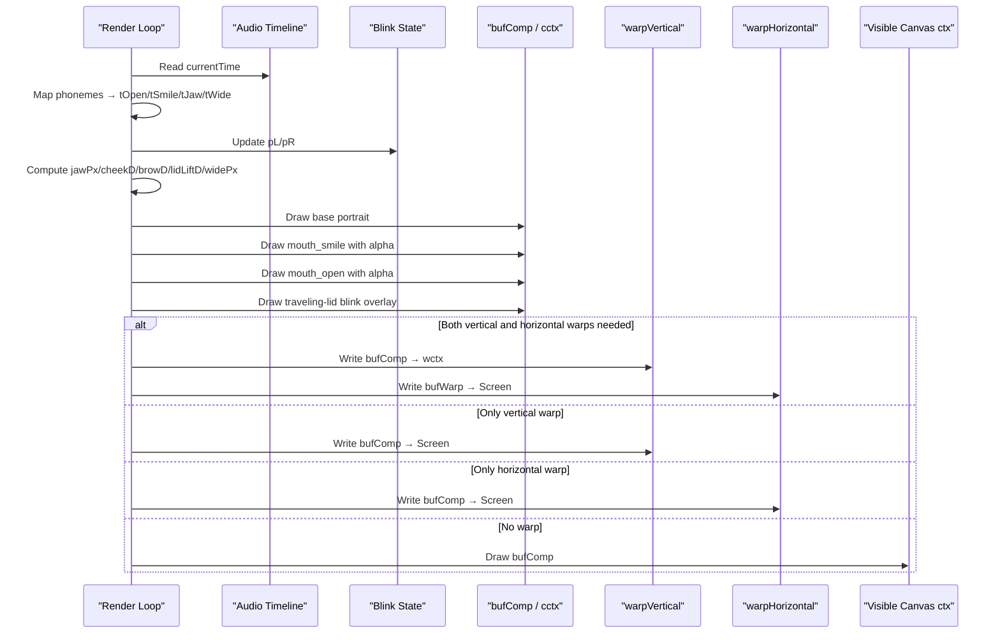
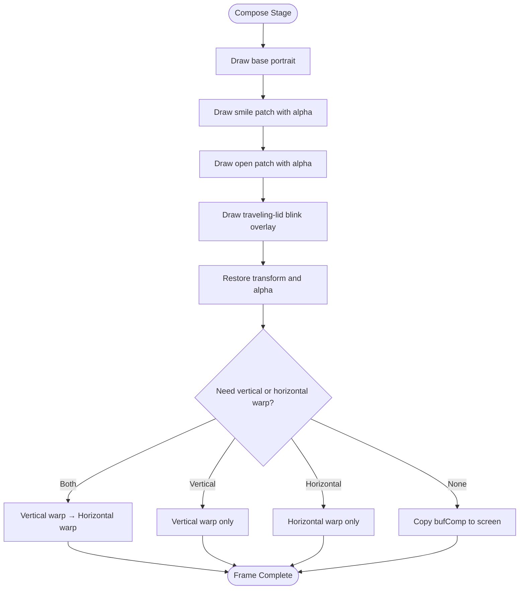
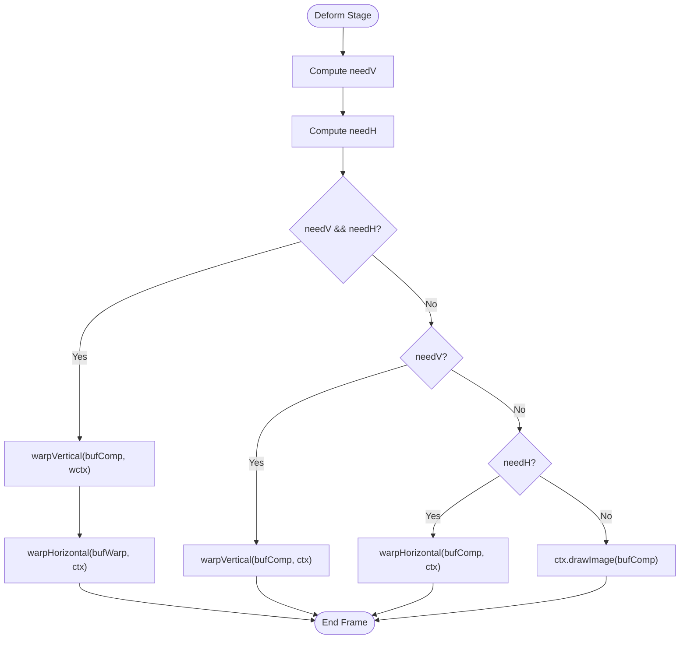
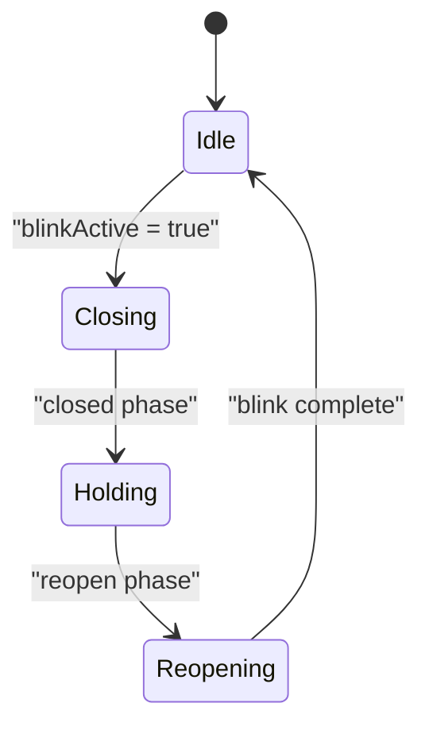
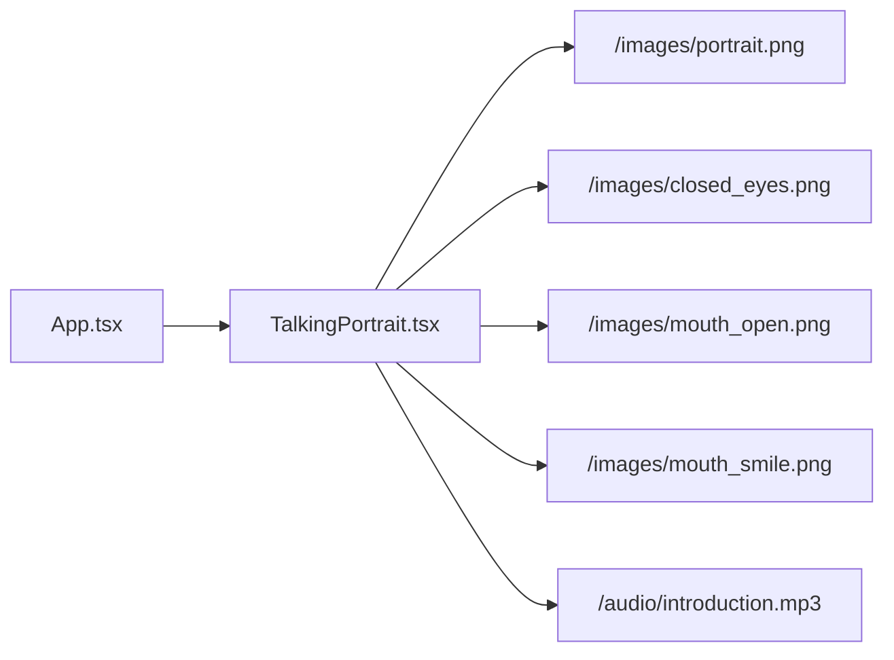

# Image Composition Pipeline

<cite>
**Referenced Files in This Document**
- [TalkingPortrait.tsx](file://src/components/TalkingPortrait.tsx)
- [App.tsx](file://src/App.tsx)
- [generate_patches.cjs](file://scripts/generate_patches.cjs)
- [test_composite.cjs](file://scripts/test_composite.cjs)
</cite>

## Table of Contents
1. [Introduction](#introduction)
2. [Project Structure](#project-structure)
3. [Core Components](#core-components)
4. [Architecture Overview](#architecture-overview)
5. [Detailed Component Analysis](#detailed-component-analysis)
6. [Dependency Analysis](#dependency-analysis)
7. [Performance Considerations](#performance-considerations)
8. [Troubleshooting Guide](#troubleshooting-guide)
9. [Conclusion](#conclusion)
10. [Appendices](#appendices)

## Introduction
This document explains the Image Composition Pipeline that underpins the facial animation system. The pipeline composites a base portrait photograph with authentic photographic patches for real teeth, tongue, gums, and oral cavity shadows, then applies physical deformations and natural blinks. It uses offscreen canvas buffering to prevent flickering during complex deformations, maintains smooth alpha blending between mouth expressions, and follows a strict layering order: base image → mouth patches (open/smile) → blink overlay → deformation warps.

The implementation is centered in the talking portrait component, while supporting scripts generate the photographic assets used at runtime.

## Project Structure
The relevant code for the composition pipeline lives primarily in the React component that renders the animated portrait. Supporting Node scripts prepare the photographic patches and test composite outputs.

**Diagram sources**
- [App.tsx:142-144](file://src/App.tsx#L142-L144)
- [TalkingPortrait.tsx:380-401](file://src/components/TalkingPortrait.tsx#L380-L401)
- [generate_patches.cjs:77-121](file://scripts/generate_patches.cjs#L77-L121)

**Section sources**
- [App.tsx:142-144](file://src/App.tsx#L142-L144)
- [TalkingPortrait.tsx:380-401](file://src/components/TalkingPortrait.tsx#L380-L401)
- [generate_patches.cjs:77-121](file://scripts/generate_patches.cjs#L77-L121)

## Core Components
The pipeline has four core responsibilities:

- Asset loading and readiness checks for the base portrait, closed eyes, and mouth patches.
- Offscreen composition into `bufComp` using `cctx`, including base image, mouth patches, and blink overlay.
- Deformation warping through `warpVertical` and `warpHorizontal`, optionally staged through `bufWarp` and `wctx`.
- Alpha blending and opacity curves for smooth transitions between open and smile mouth states.

Key implementation anchors:
- Canvas and buffer setup: [TalkingPortrait.tsx:375-401](file://src/components/TalkingPortrait.tsx#L375-L401)
- Compose stage drawing: [TalkingPortrait.tsx:549-583](file://src/components/TalkingPortrait.tsx#L549-L583)
- Deform stage selection: [TalkingPortrait.tsx:585-601](file://src/components/TalkingPortrait.tsx#L585-L601)
- Mouth patch generation: [generate_patches.cjs:77-121](file://scripts/generate_patches.cjs#L77-L121)

**Section sources**
- [TalkingPortrait.tsx:375-401](file://src/components/TalkingPortrait.tsx#L375-L401)
- [TalkingPortrait.tsx:549-601](file://src/components/TalkingPortrait.tsx#L549-L601)
- [generate_patches.cjs:77-121](file://scripts/generate_patches.cjs#L77-L121)

## Architecture Overview
The rendering loop runs per frame and performs these stages:

1. Compute speech-driven articulation targets from the audio timeline.
2. Update natural blink state and eyelid closure parameters.
3. Calculate physical warp parameters: jaw drop, cheek lift, brow motion, lid response, and lip-corner stretch/pucker.
4. Compose the base portrait and mouth patches on the offscreen `bufComp` canvas.
5. Apply vertical and horizontal warps, writing either directly to the screen context or staging through `bufWarp` and `wctx`.
6. Draw the final result to the visible canvas.

**Diagram sources**
- [TalkingPortrait.tsx:434-607](file://src/components/TalkingPortrait.tsx#L434-L607)

## Detailed Component Analysis

### Asset Loading Sequence and Error Handling
The component loads four images:
- Base portrait: `/images/portrait.png`
- Closed eyes: `/images/closed_eyes.png`
- Open mouth patch: `/images/mouth_open.png`
- Smile mouth patch: `/images/mouth_smile.png`

Each image is created via `new Image()` and assigned its source URL. Before drawing, the render loop checks `imgBase.complete` and `naturalWidth` to avoid rendering before the base image is ready. For mouth patches and eyes, it additionally checks `.complete` before drawing them. If the base image is not ready, the loop continues requesting frames without drawing.

Asset loading locations:
- Image creation and URLs: [TalkingPortrait.tsx:380-391](file://src/components/TalkingPortrait.tsx#L380-L391)
- Base image readiness guard: [TalkingPortrait.tsx:550-553](file://src/components/TalkingPortrait.tsx#L550-L553)
- Patch and eye draw guards: [TalkingPortrait.tsx:568-582](file://src/components/TalkingPortrait.tsx#L568-L582)

Error handling behavior:
- Missing or incomplete images are skipped rather than causing crashes.
- Audio playback errors are caught and logged.
- The render loop gracefully waits for asset readiness by continuing the animation frame cycle.

**Section sources**
- [TalkingPortrait.tsx:380-391](file://src/components/TalkingPortrait.tsx#L380-L391)
- [TalkingPortrait.tsx:550-553](file://src/components/TalkingPortrait.tsx#L550-L553)
- [TalkingPortrait.tsx:568-582](file://src/components/TalkingPortrait.tsx#L568-L582)

### Offscreen Canvas Buffering Strategy
Two offscreen canvases are created:
- `bufComp`: Holds the composed frame (base image + mouth patches + blink overlay).
- `bufWarp`: Used when both vertical and horizontal warps are required; it holds the intermediate warped result before drawing to the screen.

Contexts:
- `cctx`: 2D context for composing onto `bufComp`.
- `wctx`: 2D context for warping onto `bufWarp`.

Buffer setup:
- [TalkingPortrait.tsx:393-401](file://src/components/TalkingPortrait.tsx#L393-L401)

Why this prevents flicker:
- Complex deformations read from and write to stable buffers instead of repeatedly redrawing the visible canvas.
- Vertical and horizontal warps can be chained without tearing because each warp writes to a dedicated buffer.
- When no warps are active, the fully composed frame is copied directly to the screen, minimizing redraw cost.

**Section sources**
- [TalkingPortrait.tsx:393-401](file://src/components/TalkingPortrait.tsx#L393-L401)
- [TalkingPortrait.tsx:585-601](file://src/components/TalkingPortrait.tsx#L585-L601)

### Layering Order
The composition order is explicit and intentional:

1. Base portrait
2. Smile mouth patch
3. Open mouth patch
4. Blink overlay (traveling eyelids)
5. Deformation warps applied after composition

Layering implementation:
- Base portrait drawn first: [TalkingPortrait.tsx:555-560](file://src/components/TalkingPortrait.tsx#L555-L560)
- Smile patch drawn next: [TalkingPortrait.tsx:568-571](file://src/components/TalkingPortrait.tsx#L568-L571)
- Open patch drawn after smile: [TalkingPortrait.tsx:572-575](file://src/components/TalkingPortrait.tsx#L572-L575)
- Blink overlay drawn last in compose stage: [TalkingPortrait.tsx:578-582](file://src/components/TalkingPortrait.tsx#L578-L582)
- Warps applied after restore: [TalkingPortrait.tsx:585-601](file://src/components/TalkingPortrait.tsx#L585-L601)

**Diagram sources**
- [TalkingPortrait.tsx:549-601](file://src/components/TalkingPortrait.tsx#L549-L601)

**Section sources**
- [TalkingPortrait.tsx:549-601](file://src/components/TalkingPortrait.tsx#L549-L601)

### Alpha Blending and Opacity Curves
Mouth expression transitions use alpha blending controlled by `curOpen` and `curSmile`. To keep mid-weight frames opaque enough and avoid ghost lips, the alpha values are adjusted with a power curve:

- `openA = min(1, pow(max(0, curOpen), 0.8))`
- `smileA = min(1, pow(max(0, curSmile), 0.8))`

These formulas ensure:
- Smooth ramp-up and ramp-down of patch visibility.
- Natural-looking transitions between open and smile expressions.
- Preservation of lip-sync timing because the underlying weights remain tied to the phoneme timeline.

Alpha application:
- Smile patch alpha: [TalkingPortrait.tsx:568-571](file://src/components/TalkingPortrait.tsx#L568-L571)
- Open patch alpha: [TalkingPortrait.tsx:572-575](file://src/components/TalkingPortrait.tsx#L572-L575)

Mathematical notes:
- `pow(x, 0.8)` compresses low values slightly less than linear, keeping early transitions visible.
- `clamp01` ensures inputs stay within `[0, 1]` before applying the curve.
- Thresholds like `> 0.015` prevent drawing patches when their contribution is negligible.

**Section sources**
- [TalkingPortrait.tsx:566-576](file://src/components/TalkingPortrait.tsx#L566-L576)

### Deformation Warps
Two warps shape the face physically:

- Vertical strip warp (`warpVertical`): Applies per-row displacement for jaw drop, cheek lift, brow micro-motion, and lower-lid response during blinks.
- Horizontal column warp (`warpHorizontal`): Applies lip-corner stretch for smiles and pucker for round shapes, with Gaussian falloff around the mouth.

Warp selection logic:
- If both vertical and horizontal warps are significant, vertical warp writes to `wctx`, then horizontal warp writes to the screen.
- If only one warp is needed, it writes directly to the screen.
- If neither is needed, the composed frame is copied unchanged.

Warp implementation references:
- Vertical warp function: [TalkingPortrait.tsx:271-287](file://src/components/TalkingPortrait.tsx#L271-L287)
- Horizontal warp function: [TalkingPortrait.tsx:298-316](file://src/components/TalkingPortrait.tsx#L298-L316)
- Warp decision and execution: [TalkingPortrait.tsx:585-601](file://src/components/TalkingPortrait.tsx#L585-L601)

**Diagram sources**
- [TalkingPortrait.tsx:585-601](file://src/components/TalkingPortrait.tsx#L585-L601)
- [TalkingPortrait.tsx:271-316](file://src/components/TalkingPortrait.tsx#L271-L316)

**Section sources**
- [TalkingPortrait.tsx:271-316](file://src/components/TalkingPortrait.tsx#L271-L316)
- [TalkingPortrait.tsx:585-601](file://src/components/TalkingPortrait.tsx#L585-L601)

### Blink Overlay and Traveling Eyelids
The blink system draws a real closed-eyelid image mapped so the lash line aligns with the advancing eyelid edge. Closing, holding, and reopening phases are eased with a cubic polynomial curve. Left and right eyes can have randomized lead times for natural asymmetry.

Key functions and data:
- Blink closure easing: [TalkingPortrait.tsx:217-225](file://src/components/TalkingPortrait.tsx#L217-L225)
- Traveling-lid draw function: [TalkingPortrait.tsx:227-268](file://src/components/TalkingPortrait.tsx#L227-L268)
- Blink state machine and timing: [TalkingPortrait.tsx:423-507](file://src/components/TalkingPortrait.tsx#L423-L507)
- Blink overlay drawing in compose stage: [TalkingPortrait.tsx:578-582](file://src/components/TalkingPortrait.tsx#L578-L582)

**Diagram sources**
- [TalkingPortrait.tsx:217-225](file://src/components/TalkingPortrait.tsx#L217-L225)
- [TalkingPortrait.tsx:423-507](file://src/components/TalkingPortrait.tsx#L423-L507)

**Section sources**
- [TalkingPortrait.tsx:217-225](file://src/components/TalkingPortrait.tsx#L217-L225)
- [TalkingPortrait.tsx:227-268](file://src/components/TalkingPortrait.tsx#L227-L268)
- [TalkingPortrait.tsx:423-507](file://src/components/TalkingPortrait.tsx#L423-L507)
- [TalkingPortrait.tsx:578-582](file://src/components/TalkingPortrait.tsx#L578-L582)

### Authentic Photographic Patches
The mouth patches are generated from source imagery and saved as PNG files with soft elliptical alpha masks. The generator creates:
- `mouth_open.png`
- `mouth_smile.png`

The mask uses an elliptical falloff centered near the mouth region, ensuring smooth blending with the base portrait.

Patch generation details:
- Elliptical alpha mask and pixel sampling: [generate_patches.cjs:77-121](file://scripts/generate_patches.cjs#L77-L121)

**Section sources**
- [generate_patches.cjs:77-121](file://scripts/generate_patches.cjs#L77-L121)

### Extending the Pipeline
To extend the pipeline with additional facial features or modify patch positioning:

- Add new image assets:
  - Create new `Image()` instances and assign URLs similar to existing mouth and eye assets.
  - Reference paths: [TalkingPortrait.tsx:380-391](file://src/components/TalkingPortrait.tsx#L380-L391)

- Insert new patches into the compose stage:
  - Draw new patches after the base image and before or after existing mouth patches depending on desired layering.
  - Reference compose sequence: [TalkingPortrait.tsx:555-583](file://src/components/TalkingPortrait.tsx#L555-L583)

- Adjust alpha blending:
  - Apply the same `pow(value, 0.8)` curve to maintain natural transitions.
  - Reference alpha calculation: [TalkingPortrait.tsx:566-576](file://src/components/TalkingPortrait.tsx#L566-L576)

- Modify patch positioning:
  - Update landmark constants such as `MOUTH`, `EYE_LANDMARKS`, and warp band definitions if patch geometry changes.
  - Reference landmarks and warp bands: [TalkingPortrait.tsx:38-63](file://src/components/TalkingPortrait.tsx#L38-L63), [TalkingPortrait.tsx:290-296](file://src/components/TalkingPortrait.tsx#L290-L296)

- Validate composites offline:
  - Use the composite test script to verify expected outputs before running the live animation.
  - Reference test script: [test_composite.cjs:29-38](file://scripts/test_composite.cjs#L29-L38)

**Section sources**
- [TalkingPortrait.tsx:380-391](file://src/components/TalkingPortrait.tsx#L380-L391)
- [TalkingPortrait.tsx:555-583](file://src/components/TalkingPortrait.tsx#L555-L583)
- [TalkingPortrait.tsx:566-576](file://src/components/TalkingPortrait.tsx#L566-L576)
- [TalkingPortrait.tsx:38-63](file://src/components/TalkingPortrait.tsx#L38-L63)
- [TalkingPortrait.tsx:290-296](file://src/components/TalkingPortrait.tsx#L290-L296)
- [test_composite.cjs:29-38](file://scripts/test_composite.cjs#L29-L38)

## Dependency Analysis
The talking portrait component depends on:
- Static image assets under `/images/`.
- An audio file under `/audio/` for synchronized speech.
- The parent app component that mounts the talking portrait.

**Diagram sources**
- [App.tsx:142-144](file://src/App.tsx#L142-L144)
- [TalkingPortrait.tsx:380-391](file://src/components/TalkingPortrait.tsx#L380-L391)
- [TalkingPortrait.tsx:728-742](file://src/components/TalkingPortrait.tsx#L728-L742)

**Section sources**
- [App.tsx:142-144](file://src/App.tsx#L142-L144)
- [TalkingPortrait.tsx:380-391](file://src/components/TalkingPortrait.tsx#L380-L391)
- [TalkingPortrait.tsx:728-742](file://src/components/TalkingPortrait.tsx#L728-L742)

## Performance Considerations
- Offscreen buffering avoids flicker and reduces redundant redraws during complex deformations.
- Warp selection minimizes work: only apply warps when thresholds exceed small epsilon values.
- Alpha thresholds prevent unnecessary drawing of nearly invisible patches.
- Micro-motion and blink calculations are lightweight trigonometric operations bounded by small amplitudes.
- Audio analysis uses a modest FFT size and smoothing constant to balance responsiveness and stability.

[No sources needed since this section provides general guidance]

## Troubleshooting Guide
Common issues and resolutions:

- Images do not appear:
  - Verify `/images/portrait.png`, `/images/closed_eyes.png`, `/images/mouth_open.png`, and `/images/mouth_smile.png` exist and load successfully.
  - Check image readiness guards in the render loop.
  - References: [TalkingPortrait.tsx:380-391](file://src/components/TalkingPortrait.tsx#L380-L391), [TalkingPortrait.tsx:550-553](file://src/components/TalkingPortrait.tsx#L550-L553)

- Flickering during animations:
  - Ensure both `bufComp` and `bufWarp` are created and contexts are available.
  - Confirm warp selection logic is used instead of direct screen redraws.
  - References: [TalkingPortrait.tsx:393-401](file://src/components/TalkingPortrait.tsx#L393-L401), [TalkingPortrait.tsx:585-601](file://src/components/TalkingPortrait.tsx#L585-L601)

- Mouth patches look ghostly or too transparent:
  - Review the power curve exponent and alpha thresholds.
  - References: [TalkingPortrait.tsx:566-576](file://src/components/TalkingPortrait.tsx#L566-L576)

- Blinks flash or disappear:
  - Verify traveling-lid draw function and clip regions.
  - Check blink closure timing and left/right lead offsets.
  - References: [TalkingPortrait.tsx:227-268](file://src/components/TalkingPortrait.tsx#L227-L268), [TalkingPortrait.tsx:423-507](file://src/components/TalkingPortrait.tsx#L423-L507)

- Audio not driving animation:
  - Confirm audio element exists and metadata loaded.
  - Check playback error handling and audio context initialization.
  - References: [TalkingPortrait.tsx:341-358](file://src/components/TalkingPortrait.tsx#L341-L358), [TalkingPortrait.tsx:611-648](file://src/components/TalkingPortrait.tsx#L611-L648)

**Section sources**
- [TalkingPortrait.tsx:380-391](file://src/components/TalkingPortrait.tsx#L380-L391)
- [TalkingPortrait.tsx:393-401](file://src/components/TalkingPortrait.tsx#L393-L401)
- [TalkingPortrait.tsx:550-553](file://src/components/TalkingPortrait.tsx#L550-L553)
- [TalkingPortrait.tsx:566-576](file://src/components/TalkingPortrait.tsx#L566-L576)
- [TalkingPortrait.tsx:227-268](file://src/components/TalkingPortrait.tsx#L227-L268)
- [TalkingPortrait.tsx:423-507](file://src/components/TalkingPortrait.tsx#L423-L507)
- [TalkingPortrait.tsx:341-358](file://src/components/TalkingPortrait.tsx#L341-L358)
- [TalkingPortrait.tsx:611-648](file://src/components/TalkingPortrait.tsx#L611-L648)

## Conclusion
The Image Composition Pipeline combines authentic photographic assets with carefully tuned alpha blending and physical deformation warps to produce a realistic talking portrait. Offscreen buffering with `bufComp` and `bufWarp` prevents flicker during complex deformations, while the layering order ensures mouth patches and blink overlays integrate naturally with the base portrait. The power-curve opacity adjustments maintain smooth transitions without compromising lip-sync accuracy. With clear extension points, the pipeline can accommodate additional facial features and refined patch positioning.

[No sources needed since this section summarizes without analyzing specific files]

## Appendices

### Mathematical Formulas Summary
- Smooth interpolation: `smooth(a, b, v) = clamp((v - a) / (b - a))` followed by cubic ease.
- Jaw falloff: piecewise function based on jaw start/full/hold/end rows.
- Horizontal displacement: `hDisplacement(dx, amp) = amp * tanh(dx / 22) * exp(-(dx^2) / (58^2))`.
- Blink closure: cubic ease-in/ease-out with closing, hold, and opening phases.
- Mouth patch alpha: `alpha = min(1, pow(max(0, weight), 0.8))`.

[No sources needed since this section lists formulas conceptually]