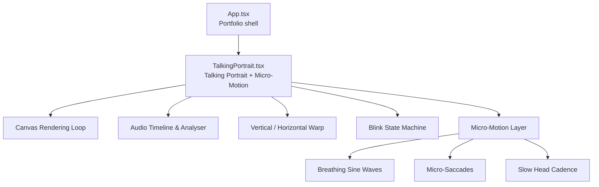
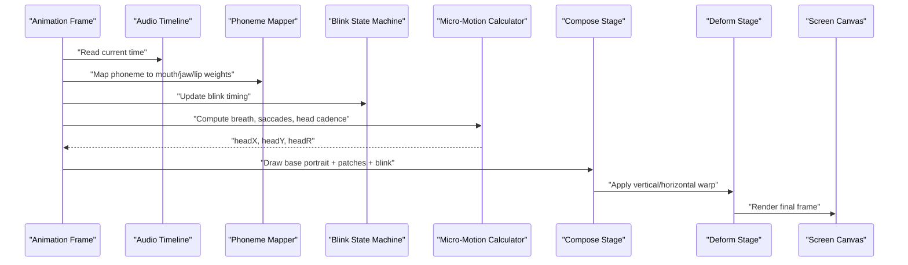
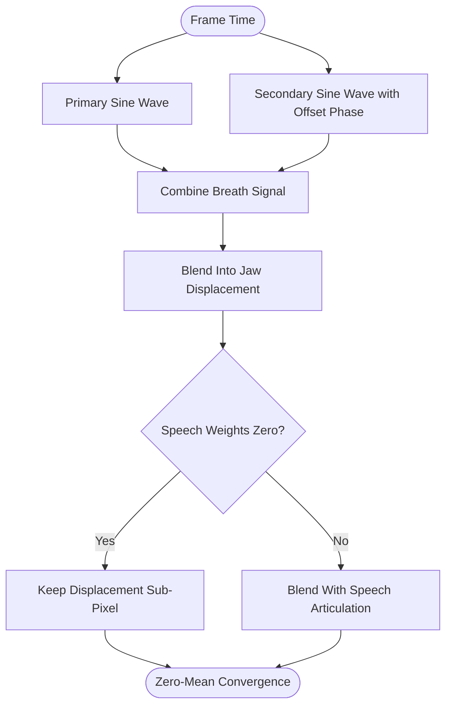
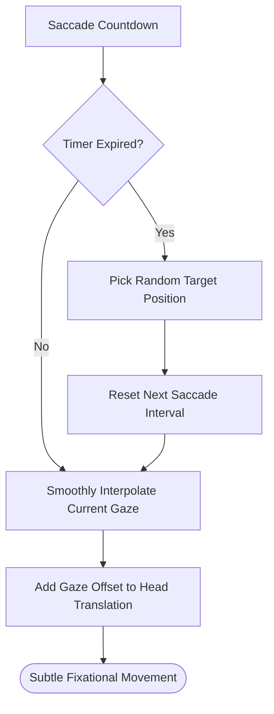
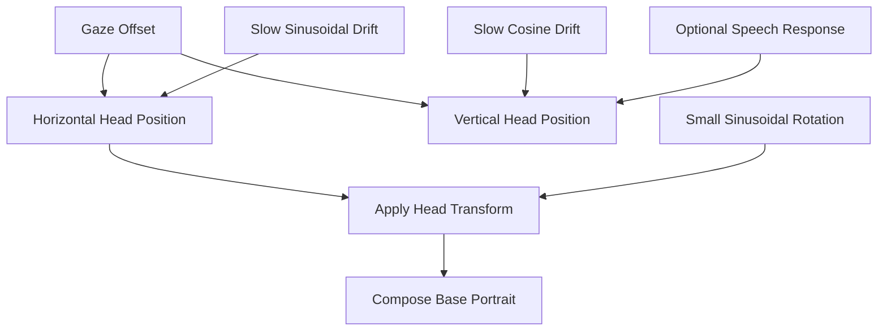
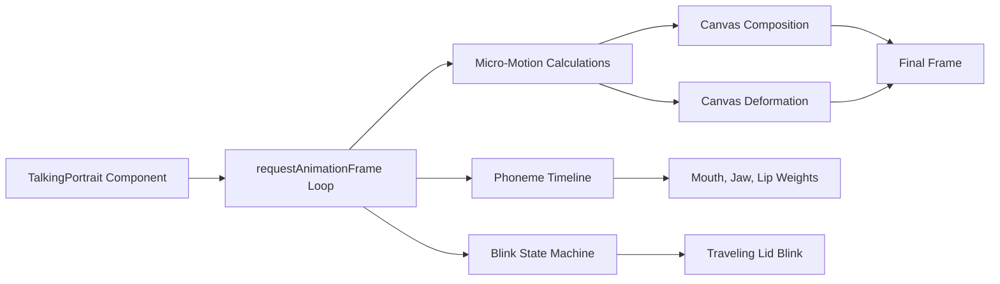

# Micro-Motion & Organic Movement

<cite>
**Referenced Files in This Document**
- [TalkingPortrait.tsx](file://src/components/TalkingPortrait.tsx)
- [App.tsx](file://src/App.tsx)
</cite>

## Table of Contents
1. [Introduction](#introduction)
2. [Project Structure](#project-structure)
3. [Core Components](#core-components)
4. [Architecture Overview](#architecture-overview)
5. [Detailed Component Analysis](#detailed-component-analysis)
6. [Dependency Analysis](#dependency-analysis)
7. [Performance Considerations](#performance-considerations)
8. [Troubleshooting Guide](#troubleshooting-guide)
9. [Conclusion](#conclusion)
10. [Appendices](#appendices)

## Introduction
This document explains the Micro-Motion system that keeps the portrait feeling alive through subtle, lifelike movement. The system is built around a zero-mean organic noise model: when no speech is active, all micro-motions converge to the original photograph so there is no visible shift. When speech is active, the same organic motion layer blends with articulation, blinks, and head cadence without breaking the illusion of stillness at rest.

The core behaviors documented here are:
- Breathing simulation using multiple sine waves with different frequencies and phases.
- Gaze tracking that simulates fixational micro-saccades with randomized target positions and smooth interpolation.
- Slow head cadence combining rotational and translational movement within sub-pixel bounds.
- Zero-mean convergence at rest, ensuring the frame returns to the original photo when all speech weights are zero.
- Timing parameters and randomization strategies designed to avoid mechanical repetition.
- Guidance for customizing intensity and personality through parameter changes.

## Project Structure
The Micro-Motion system lives inside the talking portrait component. The application shell mounts the component, while the component itself owns the animation loop, audio timeline, facial warps, blink state machine, and micro-motion calculations.

**Diagram sources**
- [App.tsx:143-147](file://src/App.tsx#L143-L147)
- [TalkingPortrait.tsx:318-330](file://src/components/TalkingPortrait.tsx#L318-L330)
- [TalkingPortrait.tsx:372-423](file://src/components/TalkingPortrait.tsx#L372-L423)
- [TalkingPortrait.tsx:455-629](file://src/components/TalkingPortrait.tsx#L455-L629)

**Section sources**
- [App.tsx:143-147](file://src/App.tsx#L143-L147)
- [TalkingPortrait.tsx:318-330](file://src/components/TalkingPortrait.tsx#L318-L330)

## Core Components
The Micro-Motion system is implemented as part of the talking portrait’s render loop. It does not run as a separate service; instead, it computes per-frame offsets and rotations that are applied during composition and deformation.

Key responsibilities:
- Compute organic breathing displacement from time-based sine waves.
- Generate micro-saccade targets and smoothly interpolate current gaze position.
- Add slow head rotation and translation.
- Blend micro-motion with speech-driven jaw, cheek, brow, and lip deformations.
- Ensure zero-mean behavior so the face converges to the original image when speech weights are zero.

**Section sources**
- [TalkingPortrait.tsx:29-33](file://src/components/TalkingPortrait.tsx#L29-L33)
- [TalkingPortrait.tsx:532-568](file://src/components/TalkingPortrait.tsx#L532-L568)
- [TalkingPortrait.tsx:577-582](file://src/components/TalkingPortrait.tsx#L577-L582)

## Architecture Overview
At a high level, each animation frame follows this flow:

1. Read elapsed time and audio progress.
2. Map phonemes to mouth/jaw/lip weights.
3. Update blink state.
4. Compute organic micro-motion: breath, saccades, head cadence.
5. Compose the base portrait with mouth patches and blinking eyelids.
6. Apply vertical and horizontal warps for facial deformation.
7. Draw the final frame to the screen canvas.

**Diagram sources**
- [TalkingPortrait.tsx:455-629](file://src/components/TalkingPortrait.tsx#L455-L629)

## Detailed Component Analysis

### Zero-Mean Organic Noise System
The organic noise system is explicitly described as zero-mean: the face never sits perfectly frozen, but every displacement converges to the original photograph at rest. This is achieved by:
- Using oscillating functions such as sine waves whose average over time is near zero.
- Adding small randomized perturbations rather than large deterministic loops.
- Keeping displacements small enough that they feel alive but do not look like shaking.
- Ensuring that when speech weights are zero, the computed offsets remain sub-pixel and visually negligible.

The implementation comment states that micro-motion includes brow, jaw breath, micro-saccades, and slow head cadence bounded to approximately ≤ 0.5 px / 0.1°, and that with all speech weights zero the frame stays within a sub-pixel breath of the original photograph.

**Section sources**
- [TalkingPortrait.tsx:29-33](file://src/components/TalkingPortrait.tsx#L29-L33)
- [TalkingPortrait.tsx:532-535](file://src/components/TalkingPortrait.tsx#L532-L535)

### Breathing Simulation
Breathing is modeled as a combination of two sine waves with different frequencies and phases. This creates a natural respiratory pattern rather than a single repetitive oscillation.

Behavioral details:
- A primary breathing wave drives a low-frequency sinusoidal displacement.
- A secondary wave adds harmonic variation to make the rhythm feel less mechanical.
- The breath value is blended into jaw movement so the lower face subtly rises and falls even when not speaking.
- The breath term is reduced slightly when the jaw is actively opening, preventing exaggerated mouth movement during speech.

**Diagram sources**
- [TalkingPortrait.tsx:535-536](file://src/components/TalkingPortrait.tsx#L535-L536)

**Section sources**
- [TalkingPortrait.tsx:535-536](file://src/components/TalkingPortrait.tsx#L535-L536)

### Gaze Tracking and Micro-Saccades
The gaze system simulates fixational eye movements by selecting new target positions at irregular intervals and smoothly interpolating toward them.

Key mechanics:
- A countdown timer determines when the next micro-saccade target should be chosen.
- Each target is a small random offset in both X and Y.
- The current gaze position is eased toward the target using a time-step–based interpolation factor.
- The resulting gaze offset contributes to head translation, keeping the eyes subtly off-center without obvious scanning.

**Diagram sources**
- [TalkingPortrait.tsx:554-563](file://src/components/TalkingPortrait.tsx#L554-L563)

**Section sources**
- [TalkingPortrait.tsx:554-563](file://src/components/TalkingPortrait.tsx#L554-L563)

### Slow Head Cadence
Head cadence combines slow rotation and slow translation to give the portrait a living presence. The rotation amplitude is very small, and the translation is dominated by micro-saccades plus gentle sinusoidal drift.

Important constraints:
- Rotation is expressed in radians and kept extremely small.
- Translation is kept within sub-pixel bounds.
- During speech, a small additional vertical head shift can occur based on mouth openness and smile weight, making the head respond naturally to articulation.
- At rest, these motions are small enough that the portrait appears nearly still.

**Diagram sources**
- [TalkingPortrait.tsx:564-568](file://src/components/TalkingPortrait.tsx#L564-L568)
- [TalkingPortrait.tsx:577-582](file://src/components/TalkingPortrait.tsx#L577-L582)

**Section sources**
- [TalkingPortrait.tsx:564-568](file://src/components/TalkingPortrait.tsx#L564-L568)
- [TalkingPortrait.tsx:577-582](file://src/components/TalkingPortrait.tsx#L577-L582)

### Convergence at Rest
The design guarantees that when all speech weights are zero, the micro-motion does not produce a visible shift. This is achieved by:
- Using oscillating signals with near-zero mean.
- Limiting amplitudes so displacements stay sub-pixel.
- Avoiding cumulative drift; each frame recomputes offsets from time and randomized targets rather than accumulating position.
- Blending micro-motion with speech weights so that articulation dominates only when needed.

This behavior is explicitly documented in the component’s architecture comment.

**Section sources**
- [TalkingPortrait.tsx:29-33](file://src/components/TalkingPortrait.tsx#L29-L33)
- [TalkingPortrait.tsx:532-535](file://src/components/TalkingPortrait.tsx#L532-L535)

### Timing Parameters and Randomization Strategies
The system uses several timing and randomization mechanisms to prevent mechanical repetition:

- **Blink timing:**
  - Closing duration is randomized within a narrow range.
  - Closed hold duration is randomized.
  - Reopening duration is randomized.
  - One eye may lead the other by a small randomized amount.
  - Spontaneous blink intervals are randomized, with occasional double blinks.
  - Speech pauses also trigger natural blinks.

- **Micro-saccade timing:**
  - The interval until the next target is randomized.
  - Target positions are randomly selected around the camera axis.
  - Smooth interpolation prevents abrupt jumps.

- **Head cadence:**
  - Slow sinusoidal drifts use different frequencies and phases.
  - Rotation amplitude is intentionally tiny.

- **Breathing:**
  - Multiple sine waves with different frequencies and phase offsets create non-repetitive respiratory patterns.

These parameters are tuned to keep motion organic without drawing attention to the animation itself.

**Section sources**
- [TalkingPortrait.tsx:444-453](file://src/components/TalkingPortrait.tsx#L444-L453)
- [TalkingPortrait.tsx:511-528](file://src/components/TalkingPortrait.tsx#L511-L528)
- [TalkingPortrait.tsx:554-568](file://src/components/TalkingPortrait.tsx#L554-L568)
- [TalkingPortrait.tsx:535-538](file://src/components/TalkingPortrait.tsx#L535-L538)

### Customizing Micro-Motion for Personality and Intensity
You can adjust the micro-motion system to express different character personalities or control intensity levels. Below are practical customization directions tied to the actual implementation.

#### Adjusting Breathing Intensity
- Increase or decrease the amplitudes of the breathing sine waves.
- Change the frequencies to make breathing slower or faster.
- Adjust how much breath blends into jaw movement.

Personality examples:
- Calm, steady character: smaller amplitudes, slower frequencies.
- Anxious or energetic character: larger amplitudes, slightly faster frequencies.

Relevant location:
- [TalkingPortrait.tsx:535-536](file://src/components/TalkingPortrait.tsx#L535-L536)

#### Adjusting Micro-Saccade Intensity
- Scale the random target ranges for gaze X and Y.
- Change the interpolation speed to make gaze shifts smoother or more reactive.
- Adjust the saccade interval range to make the eyes feel more restless or more still.

Personality examples:
- Confident, focused character: smaller target ranges, longer intervals.
- Curious or nervous character: larger target ranges, shorter intervals.

Relevant location:
- [TalkingPortrait.tsx:554-563](file://src/components/TalkingPortrait.tsx#L554-L563)

#### Adjusting Head Cadence
- Scale the sinusoidal head translation amplitudes.
- Scale the head rotation amplitude.
- Adjust whether speech increases head movement.

Personality examples:
- Authoritative, grounded character: minimal head movement.
- Expressive, animated character: larger translation and optional speech response.

Relevant location:
- [TalkingPortrait.tsx:564-568](file://src/components/TalkingPortrait.tsx#L564-L568)

#### Adjusting Brow and Facial Micro-Motion
- Modify brow noise amplitude.
- Adjust how strongly brow and lid movement respond to blinking.
- Tune cheek and jaw windows if you want stronger or subtler facial micro-motion.

Personality examples:
- Neutral expression: lower brow noise and lid response.
- Expressive face: higher brow response and stronger lid squeeze during blinks.

Relevant location:
- [TalkingPortrait.tsx:538-543](file://src/components/TalkingPortrait.tsx#L538-L543)

#### Important Constraint
When customizing, preserve the zero-mean property:
- Prefer oscillating functions centered near zero.
- Avoid adding constant offsets that would shift the portrait away from its resting position.
- Keep amplitudes small enough that rest frames remain visually stable.

**Section sources**
- [TalkingPortrait.tsx:535-568](file://src/components/TalkingPortrait.tsx#L535-L568)

## Dependency Analysis
The Micro-Motion system depends on:
- The React component lifecycle for setting up the animation loop.
- The HTML canvas for rendering.
- The Web Audio API for reading playback time and optionally analyzing volume.
- The phoneme and phrase timelines for speech-driven articulation.
- The blink state machine for natural eye closure.
- The compose and deform stages for physical facial deformation.

**Diagram sources**
- [TalkingPortrait.tsx:372-423](file://src/components/TalkingPortrait.tsx#L372-L423)
- [TalkingPortrait.tsx:455-629](file://src/components/TalkingPortrait.tsx#L455-L629)

**Section sources**
- [TalkingPortrait.tsx:372-423](file://src/components/TalkingPortrait.tsx#L372-L423)
- [TalkingPortrait.tsx:455-629](file://src/components/TalkingPortrait.tsx#L455-L629)

## Performance Considerations
The Micro-Motion system is designed to be lightweight:
- Micro-motion calculations are simple trigonometric operations.
- Randomized targets are updated infrequently compared to frame rate.
- Smooth interpolation avoids expensive re-targeting every frame.
- The canvas rendering path already handles compositing and warping efficiently.
- Micro-motion does not introduce heavy asset loading or complex shaders.

Potential optimization opportunities:
- Cache frequently used constants if they change dynamically.
- Reduce unnecessary redraws when all motion values are below thresholds.
- Keep randomization intervals reasonable so the CPU is not burdened by excessive recalculations.

[No sources needed since this section provides general guidance]

## Troubleshooting Guide
Common issues and their likely causes related to micro-motion and portrait animation:

- **Portrait looks frozen:**
  - Verify the animation loop is running.
  - Check that assets are loaded before rendering.
  - Confirm that micro-motion amplitudes are not accidentally set to zero.

- **Portrait shakes visibly:**
  - Reduce micro-saccade target ranges.
  - Reduce head translation and rotation amplitudes.
  - Ensure micro-motion remains zero-mean and does not accumulate drift.

- **Breathing feels mechanical:**
  - Use multiple sine waves with different frequencies and phases.
  - Avoid identical periods and phases across waves.
  - Adjust blending into jaw movement so breath does not exaggerate speech.

- **Blinks feel too frequent or unnatural:**
  - Review blink interval randomization.
  - Check closing, hold, and reopening durations.
  - Verify speech-pause blinks are not triggering too often.

- **Rest frame shifts visibly:**
  - Confirm that all micro-motion offsets converge to near zero when speech weights are zero.
  - Remove constant positional bias from sine or noise calculations.

**Section sources**
- [TalkingPortrait.tsx:29-33](file://src/components/TalkingPortrait.tsx#L29-L33)
- [TalkingPortrait.tsx:444-453](file://src/components/TalkingPortrait.tsx#L444-L453)
- [TalkingPortrait.tsx:554-568](file://src/components/TalkingPortrait.tsx#L554-L568)

## Conclusion
The Micro-Motion system adds a quiet, organic layer of life to the portrait. By combining breathing simulation, micro-saccades, and slow head cadence, it ensures the face feels present without distracting movement. The zero-mean design guarantees that at rest, the portrait remains visually stable and aligned with the original photograph. Timing and randomization are carefully balanced to avoid mechanical repetition, and the system is customizable enough to support different character personalities and intensity levels.

[No sources needed since this section summarizes without analyzing specific files]

## Appendices

### Quick Reference: Micro-Motion Parameters
- **Breathing:**
  - Primary sine wave frequency and amplitude.
  - Secondary sine wave frequency, amplitude, and phase offset.
  - Blend factor into jaw displacement.

- **Micro-Saccades:**
  - Random target range for X and Y.
  - Interpolation speed.
  - Next saccade interval range.

- **Head Cadence:**
  - Sinusoidal translation amplitudes.
  - Rotation amplitude.
  - Optional speech response scaling.

- **Facial Micro-Motion:**
  - Brow noise amplitude.
  - Lid response to blinking.
  - Cheek and jaw window scaling.

**Section sources**
- [TalkingPortrait.tsx:535-568](file://src/components/TalkingPortrait.tsx#L535-L568)