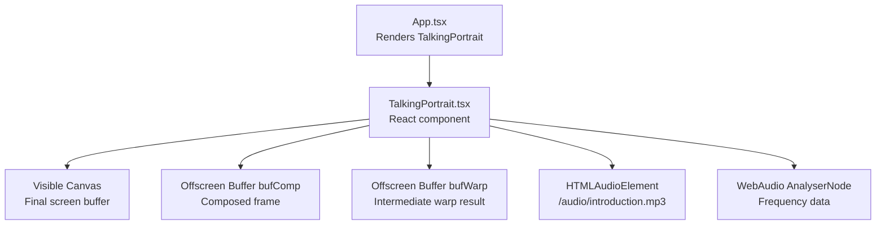
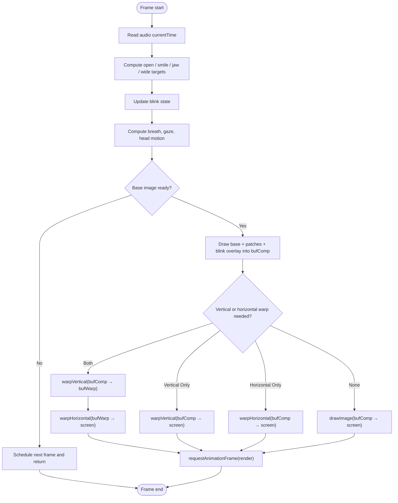
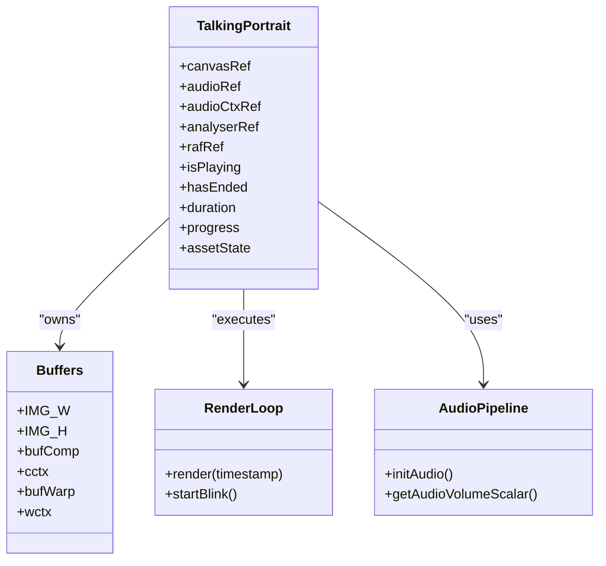
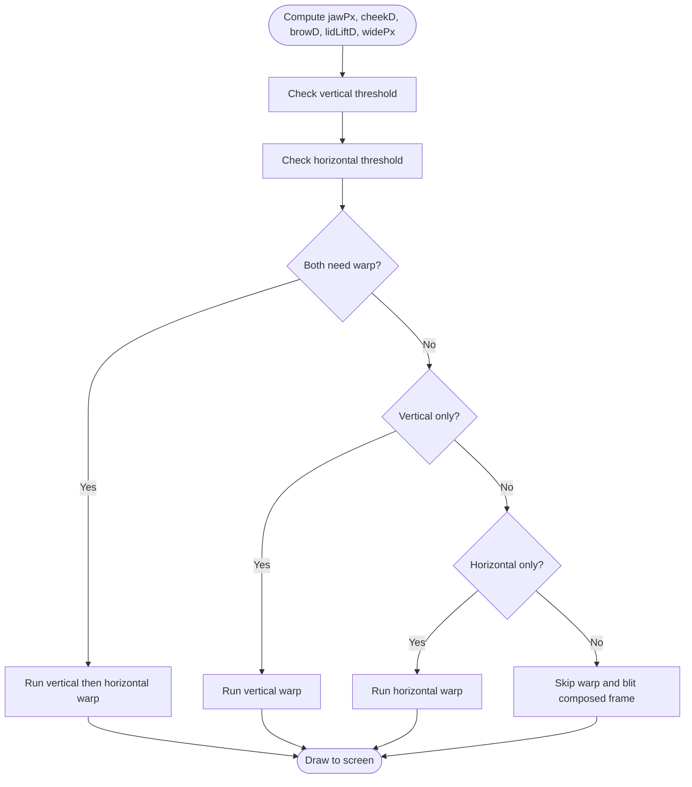
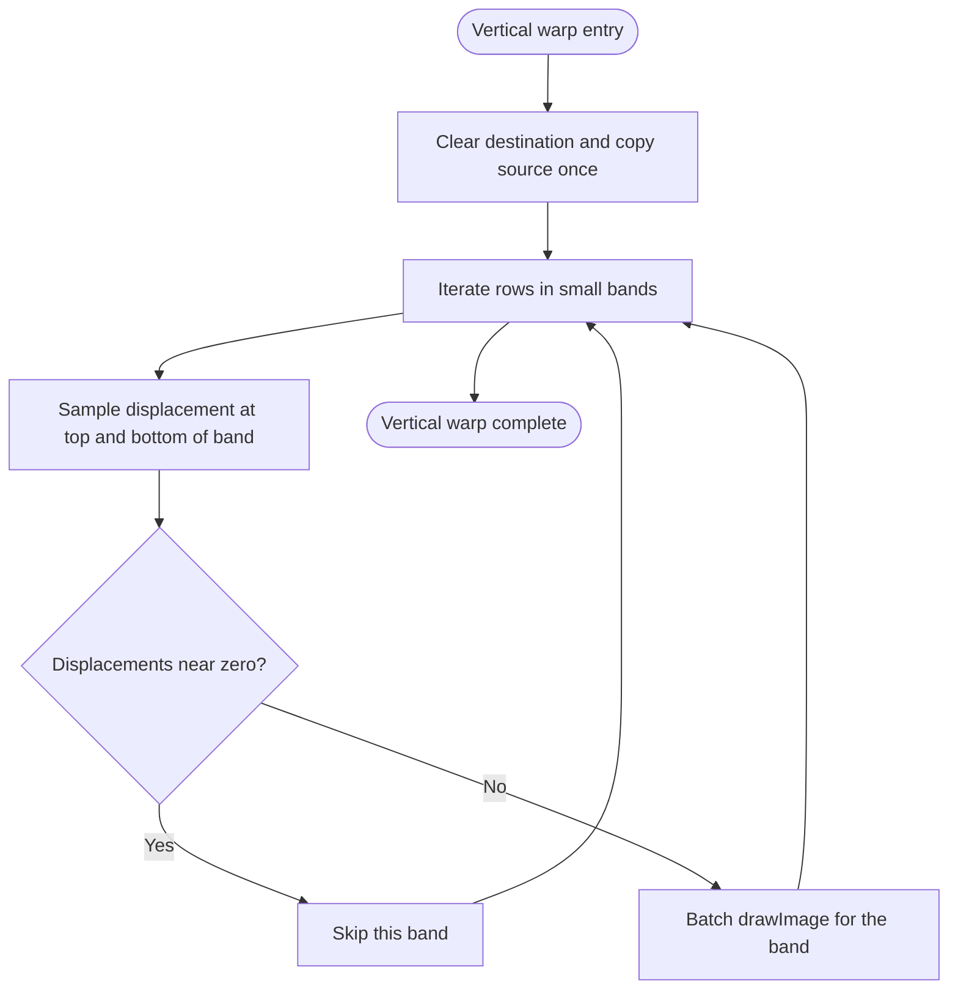
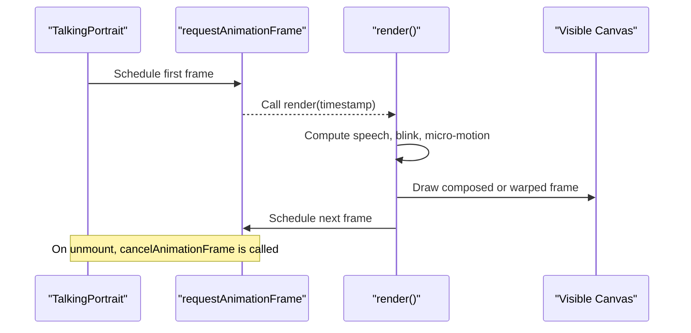
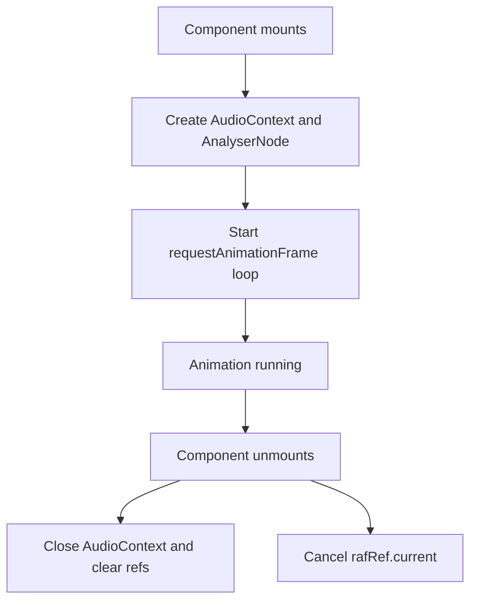
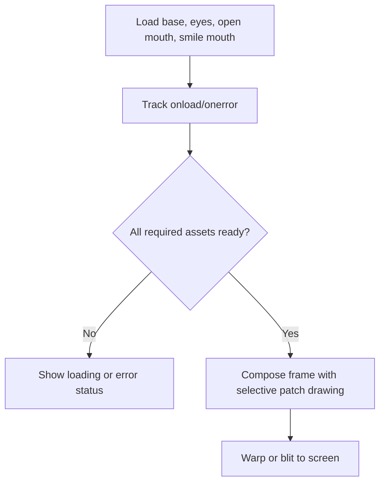
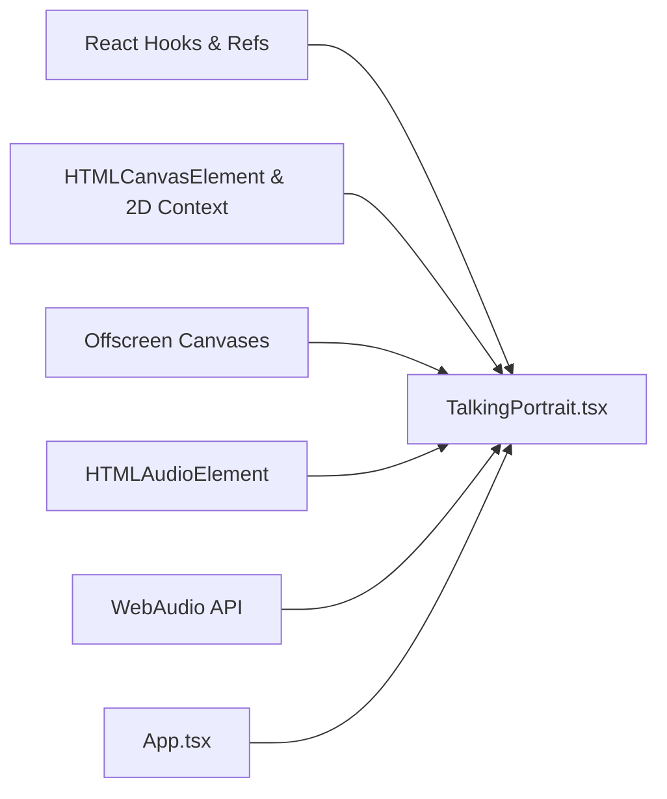

# Performance Optimization Strategies

<cite>
**Referenced Files in This Document**
- [TalkingPortrait.tsx](file://src/components/TalkingPortrait.tsx)
- [App.tsx](file://src/App.tsx)
</cite>

## Table of Contents
1. [Introduction](#introduction)
2. [Project Structure](#project-structure)
3. [Core Components](#core-components)
4. [Architecture Overview](#architecture-overview)
5. [Detailed Component Analysis](#detailed-component-analysis)
6. [Dependency Analysis](#dependency-analysis)
7. [Performance Considerations](#performance-considerations)
8. [Troubleshooting Guide](#troubleshooting-guide)
9. [Conclusion](#conclusion)

## Introduction
This document explains the performance optimization strategies used by the canvas rendering engine behind the realistic talking portrait component. The implementation focuses on smooth 60fps animation, flicker-free compositing, conditional warp execution, efficient pixel operations, clean animation-loop lifecycle management, and careful memory cleanup for audio and canvas resources. It also provides guidance for profiling bottlenecks, adapting to browser capabilities, and handling large image operations efficiently.

## Project Structure
The rendering logic lives inside a single React component that owns:
- A visible canvas for final output.
- Two offscreen canvases used as intermediate buffers.
- An audio element and WebAudio analyser for speech-driven animation.
- A `requestAnimationFrame` loop that computes articulation, blinks, micro-motion, and draws frames.

**Diagram sources**
- [App.tsx:143-147](file://src/App.tsx#L143-L147)
- [TalkingPortrait.tsx:318-330](file://src/components/TalkingPortrait.tsx#L318-L330)
- [TalkingPortrait.tsx:372-423](file://src/components/TalkingPortrait.tsx#L372-L423)
- [TalkingPortrait.tsx:770-784](file://src/components/TalkingPortrait.tsx#L770-L784)

**Section sources**
- [App.tsx:143-147](file://src/App.tsx#L143-L147)
- [TalkingPortrait.tsx:318-330](file://src/components/TalkingPortrait.tsx#L318-L330)

## Core Components
- Visible canvas: the only canvas drawn to the DOM; it receives either a direct composed frame or a warped result.
- Offscreen composition buffer (`bufComp`): stores the base portrait plus mouth patches and blink overlays before any deformation.
- Offscreen warp buffer (`bufWarp`): holds the result after horizontal lip-corner warping when both vertical and horizontal deformations are active.
- Audio pipeline: an HTML audio element drives phoneme timing; a WebAudio analyser provides a small volume scalar that modulates mouth aperture.
- Animation loop: a single `render` function scheduled with `requestAnimationFrame`, computing state, conditionally warping, and drawing.

Key responsibilities:
- Compose photographic assets into `bufComp`.
- Compute jaw, cheek, brow, lid, and lip parameters.
- Skip unnecessary warp passes when displacements are below thresholds.
- Draw directly to the visible canvas from the most appropriate source.
- Clean up audio contexts and cancel animation frames on unmount.

**Section sources**
- [TalkingPortrait.tsx:372-423](file://src/components/TalkingPortrait.tsx#L372-L423)
- [TalkingPortrait.tsx:455-629](file://src/components/TalkingPortrait.tsx#L455-L629)

## Architecture Overview
The rendering pipeline is intentionally staged so that expensive pixel operations happen offscreen and only the necessary transformations reach the screen.

**Diagram sources**
- [TalkingPortrait.tsx:455-629](file://src/components/TalkingPortrait.tsx#L455-L629)

## Detailed Component Analysis

### Multi-Buffer Architecture Using Offscreen Canvases
The component creates two offscreen canvases:
- `bufComp`: accumulates the base portrait, mouth patches, and traveling-lid blink overlays.
- `bufWarp`: temporarily stores the result after vertical warping when horizontal warping is also required.

This separation prevents flickering because the visible canvas is not repeatedly cleared and redrawn with partial work. Instead, each frame writes a complete, coherent result to the screen in one step.

**Diagram sources**
- [TalkingPortrait.tsx:318-330](file://src/components/TalkingPortrait.tsx#L318-L330)
- [TalkingPortrait.tsx:372-423](file://src/components/TalkingPortrait.tsx#L372-L423)
- [TalkingPortrait.tsx:455-629](file://src/components/TalkingPortrait.tsx#L455-L629)
- [TalkingPortrait.tsx:342-370](file://src/components/TalkingPortrait.tsx#L342-L370)

**Section sources**
- [TalkingPortrait.tsx:414-423](file://src/components/TalkingPortrait.tsx#L414-L423)
- [TalkingPortrait.tsx:570-605](file://src/components/TalkingPortrait.tsx#L570-L605)
- [TalkingPortrait.tsx:607-625](file://src/components/TalkingPortrait.tsx#L607-L625)

### Conditional Rendering Logic That Skips Unnecessary Warps
The render loop calculates physical displacement values such as:
- Jaw movement in pixels.
- Cheek lift.
- Brow displacement.
- Lower-lid lift during blinks.
- Horizontal lip stretch or pucker.

Before drawing, it evaluates whether vertical or horizontal warping is actually needed. If all displacements are below small thresholds, the loop skips warp functions entirely and simply blits the already-composed frame. This avoids expensive per-row and per-column `drawImage` calls when the face is nearly still.

**Diagram sources**
- [TalkingPortrait.tsx:532-543](file://src/components/TalkingPortrait.tsx#L532-L543)
- [TalkingPortrait.tsx:607-625](file://src/components/TalkingPortrait.tsx#L607-L625)

**Section sources**
- [TalkingPortrait.tsx:532-543](file://src/components/TalkingPortrait.tsx#L532-L543)
- [TalkingPortrait.tsx:607-625](file://src/components/TalkingPortrait.tsx#L607-L625)

### Efficient Pixel Operations and Batched drawImage Calls
The vertical warp processes the image in narrow bands rather than pixel-by-pixel. For each band, it computes top and bottom displacements and issues a single `drawImage` call per row segment. Similarly, the horizontal warp iterates over columns and predefined mouth bands, issuing batched `drawImage` calls for small column slices.

Optimizations include:
- Skipping bands where both endpoints have negligible displacement.
- Using fixed small step sizes (e.g., narrow vertical bands and four-pixel horizontal columns).
- Avoiding global canvas state changes except where necessary, such as temporary alpha for mouth patches.
- Clearing only the destination context before writing a new frame.

**Diagram sources**
- [TalkingPortrait.tsx:270-287](file://src/components/TalkingPortrait.tsx#L270-L287)

**Section sources**
- [TalkingPortrait.tsx:270-287](file://src/components/TalkingPortrait.tsx#L270-L287)
- [TalkingPortrait.tsx:289-316](file://src/components/TalkingPortrait.tsx#L289-L316)
- [TalkingPortrait.tsx:577-598](file://src/components/TalkingPortrait.tsx#L577-L598)

### requestAnimationFrame Usage Pattern and Proper Cleanup
The animation loop uses a single `render` function:
- It schedules itself via `requestAnimationFrame` at the end of each successful frame.
- It handles asset loading failures by continuing to schedule frames until the base image is ready or marked failed.
- On component unmount, it cancels the pending animation frame using `cancelAnimationFrame`.

This pattern ensures:
- Smooth synchronization with the browser’s display refresh rate.
- No leaked animation callbacks.
- Graceful behavior while images are loading.

**Diagram sources**
- [TalkingPortrait.tsx:455-458](file://src/components/TalkingPortrait.tsx#L455-L458)
- [TalkingPortrait.tsx:570-575](file://src/components/TalkingPortrait.tsx#L570-L575)
- [TalkingPortrait.tsx:625-629](file://src/components/TalkingPortrait.tsx#L625-L629)

**Section sources**
- [TalkingPortrait.tsx:625-629](file://src/components/TalkingPortrait.tsx#L625-L629)

### Memory Management for Audio Contexts and Canvas Resources
Memory cleanup is handled in two ways:
- WebAudio cleanup: When the component unmounts, the code closes the `AudioContext`, nullifies references to the analyser and frequency data, and catches errors from closing the context.
- Animation cleanup: The effect returns a cleanup function that cancels the active `requestAnimationFrame` ID.

Canvas elements themselves are created inside the effect and are tied to the component lifecycle. While the visible canvas is attached to the DOM, the offscreen canvases are local variables that become eligible for garbage collection after the component unmounts and no longer holds references.

**Diagram sources**
- [TalkingPortrait.tsx:342-360](file://src/components/TalkingPortrait.tsx#L342-L360)
- [TalkingPortrait.tsx:632-640](file://src/components/TalkingPortrait.tsx#L632-L640)
- [TalkingPortrait.tsx:628-629](file://src/components/TalkingPortrait.tsx#L628-L629)

**Section sources**
- [TalkingPortrait.tsx:632-640](file://src/components/TalkingPortrait.tsx#L632-L640)
- [TalkingPortrait.tsx:628-629](file://src/components/TalkingPortrait.tsx#L628-L629)

### Large Image Operation Optimizations
The component loads multiple image assets:
- Base portrait.
- Closed eyes overlay.
- Open mouth patch.
- Smile mouth patch.

It tracks their readiness and degrades gracefully if optional patches fail. During composition:
- Mouth patches are drawn only when their computed alpha exceeds a small threshold.
- Each patch draw checks `.complete` before drawing.
- The base portrait is mandatory; if it fails, the loop stops meaningful rendering but continues scheduling frames so the UI can show an error state.

These techniques reduce redundant computations and avoid drawing incomplete or unnecessary textures.

**Diagram sources**
- [TalkingPortrait.tsx:382-412](file://src/components/TalkingPortrait.tsx#L382-L412)
- [TalkingPortrait.tsx:584-598](file://src/components/TalkingPortrait.tsx#L584-L598)

**Section sources**
- [TalkingPortrait.tsx:382-412](file://src/components/TalkingPortrait.tsx#L382-L412)
- [TalkingPortrait.tsx:584-598](file://src/components/TalkingPortrait.tsx#L584-L598)

### Blink and Micro-Motion Optimization
The blink system uses a state machine with randomized closure, hold, and reopen durations. It avoids heavy operations by:
- Returning early from the eye-drawing helper when blink progress is very small.
- Computing blink progress once per eye and reusing it for both geometry and opacity decisions.
- Combining natural blinks with speech pauses without recomputing the entire timeline every frame.

Micro-motion adds subtle, zero-mean movement to keep the face alive without introducing visible jitter. These motions are computed mathematically and applied through small transforms rather than per-pixel manipulation.

**Section sources**
- [TalkingPortrait.tsx:217-268](file://src/components/TalkingPortrait.tsx#L217-L268)
- [TalkingPortrait.tsx:444-453](file://src/components/TalkingPortrait.tsx#L444-L453)
- [TalkingPortrait.tsx:507-528](file://src/components/TalkingPortrait.tsx#L507-L528)
- [TalkingPortrait.tsx:532-568](file://src/components/TalkingPortrait.tsx#L532-L568)

## Dependency Analysis
The talking portrait component depends on:
- React hooks and refs for lifecycle and DOM access.
- The visible canvas and its 2D context.
- Offscreen canvases for intermediate rendering.
- An HTML audio element for synchronized speech.
- WebAudio APIs for frequency analysis.

**Diagram sources**
- [App.tsx:143-147](file://src/App.tsx#L143-L147)
- [TalkingPortrait.tsx:1-2](file://src/components/TalkingPortrait.tsx#L1-L2)
- [TalkingPortrait.tsx:318-330](file://src/components/TalkingPortrait.tsx#L318-L330)
- [TalkingPortrait.tsx:342-370](file://src/components/TalkingPortrait.tsx#L342-L370)
- [TalkingPortrait.tsx:770-784](file://src/components/TalkingPortrait.tsx#L770-L784)

**Section sources**
- [App.tsx:143-147](file://src/App.tsx#L143-L147)
- [TalkingPortrait.tsx:318-330](file://src/components/TalkingPortrait.tsx#L318-L330)
- [TalkingPortrait.tsx:342-370](file://src/components/TalkingPortrait.tsx#L342-L370)

## Performance Considerations
- Prefer offscreen buffers for multi-stage rendering to avoid flicker and repeated full-canvas clears.
- Use conditional warp checks to skip expensive per-row or per-column operations when displacements are negligible.
- Batch `drawImage` calls instead of updating individual pixels.
- Minimize canvas state changes; set alpha only around patch drawing and reset it afterward.
- Keep the animation loop simple: compute, decide, draw, schedule.
- Avoid creating new objects inside the hot path; reuse arrays and typed arrays where possible.
- Guard against missing assets and handle them gracefully to prevent wasted work.
- Ensure audio contexts are closed and animation frames are canceled to prevent memory leaks.

[No sources needed since this section provides general guidance]

## Troubleshooting Guide
Common performance and stability issues:
- Stuttering or dropped frames:
  - Verify that warp operations are being skipped when displacements are small.
  - Check that the base image is loaded before entering the main compose stage.
  - Profile the `render` function to identify expensive branches.
- Flickering:
  - Confirm that the visible canvas is not being partially redrawn; use offscreen buffers for composition and warping.
- Audio-related crashes or silent playback:
  - Ensure `AudioContext` is created only once and resumed when needed.
  - Catch and log setup errors from WebAudio initialization.
- Memory growth over time:
  - Confirm that `cancelAnimationFrame` runs on unmount.
  - Confirm that `AudioContext.close()` is called and references are cleared.

**Section sources**
- [TalkingPortrait.tsx:570-575](file://src/components/TalkingPortrait.tsx#L570-L575)
- [TalkingPortrait.tsx:607-625](file://src/components/TalkingPortrait.tsx#L607-L625)
- [TalkingPortrait.tsx:342-360](file://src/components/TalkingPortrait.tsx#L342-L360)
- [TalkingPortrait.tsx:632-640](file://src/components/TalkingPortrait.tsx#L632-L640)
- [TalkingPortrait.tsx:628-629](file://src/components/TalkingPortrait.tsx#L628-L629)

## Conclusion
The talking portrait rendering engine achieves smooth, realistic animation by combining a staged offscreen-buffer architecture, conditional warp execution, batched canvas drawing, and disciplined animation-loop lifecycle management. These optimizations reduce unnecessary computation, prevent flicker, and maintain stable frame pacing. With proper profiling, browser capability detection, and careful resource cleanup, the approach scales well across devices and remains robust under real-world usage.

[No sources needed since this section summarizes without analyzing specific files]