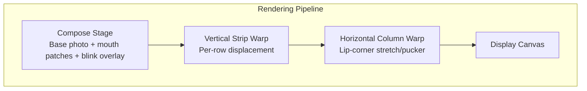
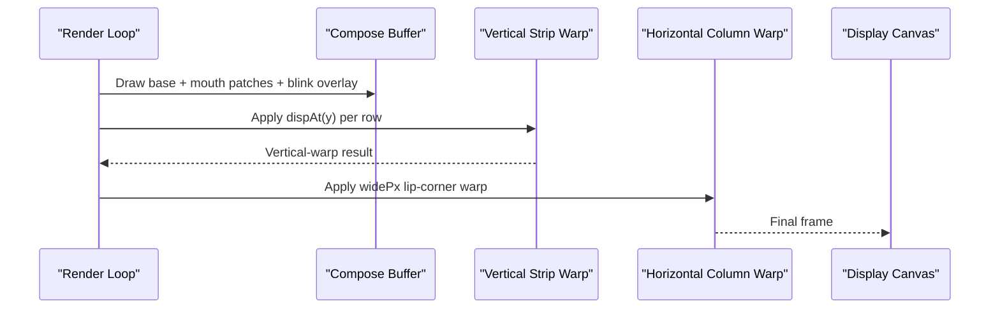
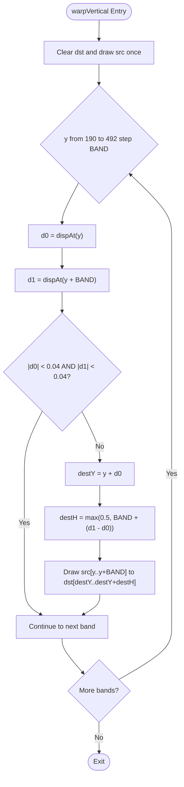
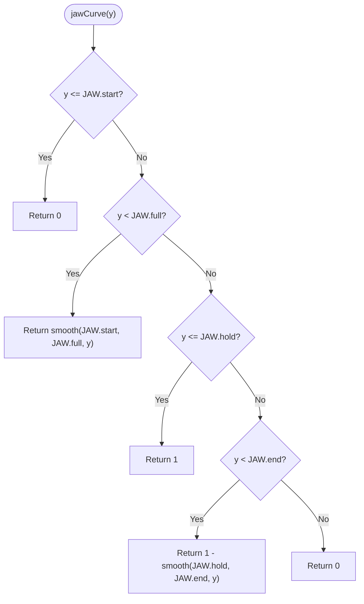
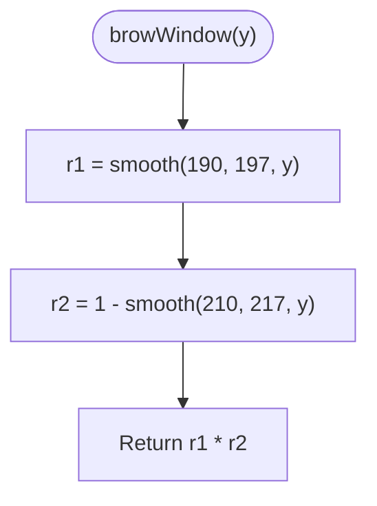
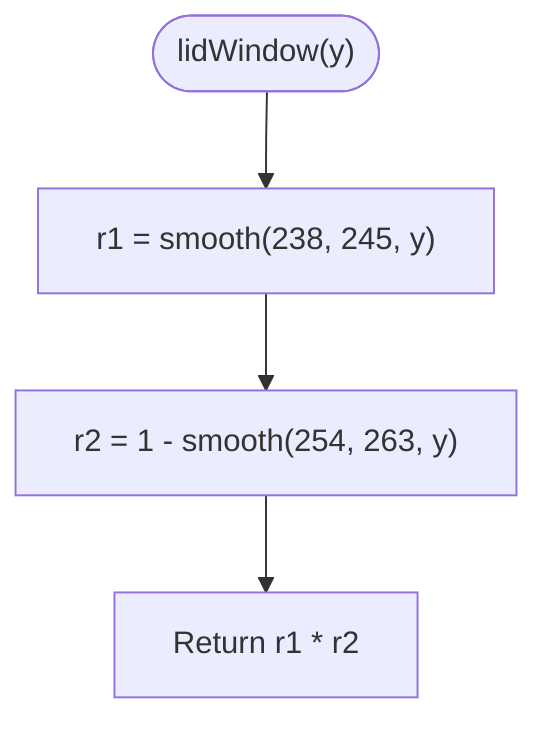
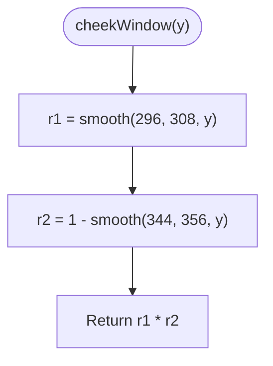
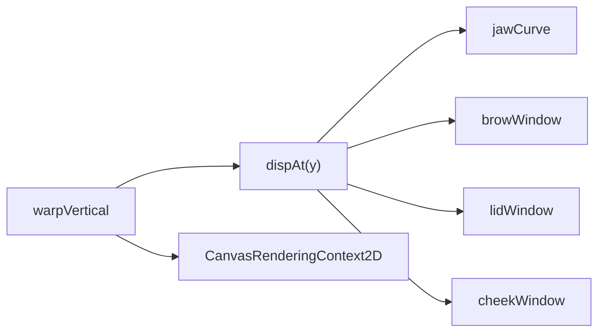

# Vertical Strip Warp Algorithm

<cite>
**Referenced Files in This Document**   
- [TalkingPortrait.tsx](file://src/components/TalkingPortrait.tsx)
- [test_strips.cjs](file://tools/test_strips.cjs)
- [test_math.cjs](file://tools/test_math.cjs)
</cite>

## Table of Contents
1. [Introduction](#introduction)
2. [Project Structure](#project-structure)
3. [Core Components](#core-components)
4. [Architecture Overview](#architecture-overview)
5. [Detailed Component Analysis](#detailed-component-analysis)
6. [Dependency Analysis](#dependency-analysis)
7. [Performance Considerations](#performance-considerations)
8. [Troubleshooting Guide](#troubleshooting-guide)
9. [Conclusion](#conclusion)
10. [Appendices](#appendices)

## Introduction
This document explains the Vertical Strip Warp algorithm used to simulate jaw movement and lower face deformation in a photorealistic talking portrait. The algorithm applies per-row vertical displacement across anatomical regions (brow, eyelids, cheeks, jaw) using feathered windows so that transitions between regions are smooth and physically plausible. It also documents the mathematical functions for jaw hinging, brow micro-motion, lower-lid response during blinks, and cheek lift during smiles, along with the BAND parameter that balances performance and smoothness. Finally, it provides coordinate transformation formulas, quality preservation notes, optimization techniques, and practical guidance for tuning parameters to create different expressions.

## Project Structure
The implementation lives in a single React component that composes photographic assets into an offscreen buffer and then applies two warps:
- Vertical strip warp: per-row vertical displacement driven by anatomical windows and jaw curve.
- Horizontal column warp: lip-corner stretch/pucker around the mouth.

**Diagram sources**
- [TalkingPortrait.tsx:393-402](file://src/components/TalkingPortrait.tsx#L393-L402)
- [TalkingPortrait.tsx:585-601](file://src/components/TalkingPortrait.tsx#L585-L601)

**Section sources**
- [TalkingPortrait.tsx:318-608](file://src/components/TalkingPortrait.tsx#L318-L608)

## Core Components
- Vertical strip warp function: processes horizontal bands of pixels and shifts them vertically based on a displacement function.
- Anatomical window functions:
  - jawCurve: models hinged jaw movement below the mouth.
  - browWindow: models eyebrow micro-motion.
  - lidWindow: models lower-lid response during blinks.
  - cheekWindow: models smiling cheek lift.
- Displacement composition: combines regional displacements into a single function used by the warp.
- Optimization: skips bands with minimal displacement (< 0.04 pixels).

Key responsibilities:
- Compute per-row displacement d(y) for y in the active facial region range.
- Draw each band from source to destination with adjusted destY and destH to preserve continuity.
- Ensure seamless transitions via feathered windows.

**Section sources**
- [TalkingPortrait.tsx:75-94](file://src/components/TalkingPortrait.tsx#L75-L94)
- [TalkingPortrait.tsx:270-287](file://src/components/TalkingPortrait.tsx#L270-L287)
- [TalkingPortrait.tsx:524-531](file://src/components/TalkingPortrait.tsx#L524-L531)

## Architecture Overview
The rendering pipeline composes the base image with mouth patches and blink overlays, then applies vertical and horizontal warps. The vertical warp is responsible for jaw drop, cheek lift, brow micro-motion, and lower-lid response. The horizontal warp handles lip-corner stretch or pucker.

**Diagram sources**
- [TalkingPortrait.tsx:549-583](file://src/components/TalkingPortrait.tsx#L549-L583)
- [TalkingPortrait.tsx:585-601](file://src/components/TalkingPortrait.tsx#L585-L601)

## Detailed Component Analysis

### Vertical Strip Warp
The vertical strip warp iterates over horizontal bands starting at y=190 up to y=492, stepping by BAND=3 pixels. For each band, it computes displacements at the top and bottom edges, optionally skipping the band if both displacements are negligible (< 0.04 pixels), then draws the band shifted vertically with a height adjusted by the difference in edge displacements.

Key behaviors:
- Per-row displacement: d(y) computed by dispAt(y).
- Feathered windows: ensure smooth transitions between anatomical regions.
- Band skipping: skip bands where |d0| < 0.04 and |d1| < 0.04 to save work.
- Height adjustment: destH = max(0.5, BAND + (d1 - d0)) to maintain continuity.

**Diagram sources**
- [TalkingPortrait.tsx:270-287](file://src/components/TalkingPortrait.tsx#L270-L287)

**Section sources**
- [TalkingPortrait.tsx:270-287](file://src/components/TalkingPortrait.tsx#L270-L287)

### Mathematical Functions

#### jawCurve: Hinged Jaw Movement
Models a hinge below the mouth: zero above start, ramping up to full between start and full, holding constant until hold, then tapering back to zero at end.

Behavior:
- Returns 0 for y <= JAW.start.
- Smoothly ramps from 0 to 1 between JAW.start and JAW.full.
- Holds 1 between JAW.full and JAW.hold.
- Smoothly ramps from 1 to 0 between JAW.hold and JAW.end.
- Returns 0 beyond JAW.end.

**Diagram sources**
- [TalkingPortrait.tsx:75-82](file://src/components/TalkingPortrait.tsx#L75-L82)

**Section sources**
- [TalkingPortrait.tsx:75-82](file://src/components/TalkingPortrait.tsx#L75-L82)

#### browWindow: Eyebrow Micro-Motion
A feathered window active between y=190 and y=220, peaking near the middle and fading out at the boundaries.

Behavior:
- Uses smooth ramps to create a bell-like shape.
- Active region: approximately y ∈ (190, 220).

**Diagram sources**
- [TalkingPortrait.tsx:85-86](file://src/components/TalkingPortrait.tsx#L85-L86)

**Section sources**
- [TalkingPortrait.tsx:85-86](file://src/components/TalkingPortrait.tsx#L85-L86)

#### lidWindow: Lower-Lid Response During Blinks
A feathered window active under the eyes, responding to blink closure.

Behavior:
- Active region: approximately y ∈ (236, 264).
- Uses smooth ramps to fade in/out at boundaries.

**Diagram sources**
- [TalkingPortrait.tsx:89-90](file://src/components/TalkingPortrait.tsx#L89-L90)

**Section sources**
- [TalkingPortrait.tsx:89-90](file://src/components/TalkingPortrait.tsx#L89-L90)

#### cheekWindow: Smiling Cheek Lift
A feathered window active in the cheek region, lifting upward during smiles.

Behavior:
- Active region: approximately y ∈ (294, 358).
- Uses smooth ramps to fade in/out at boundaries.

**Diagram sources**
- [TalkingPortrait.tsx:93-94](file://src/components/TalkingPortrait.tsx#L93-L94)

**Section sources**
- [TalkingPortrait.tsx:93-94](file://src/components/TalkingPortrait.tsx#L93-L94)

### Coordinate Transformation Formulas
For each band at row y with height BAND:
- Compute d0 = dispAt(y) and d1 = dispAt(y + BAND).
- If both |d0| and |d1| are less than 0.04, skip drawing this band.
- Destination y: destY = y + d0.
- Destination height: destH = max(0.5, BAND + (d1 - d0)).
- Draw source rectangle [0, y, IMG_W, BAND] to destination [0, destY, IMG_W, destH].

These formulas preserve image quality by:
- Using small BAND steps to approximate continuous vertical displacement.
- Adjusting destH to account for differential displacement across the band, reducing seams.
- Skipping negligible bands to avoid unnecessary operations while maintaining visual fidelity.

**Section sources**
- [TalkingPortrait.tsx:278-286](file://src/components/TalkingPortrait.tsx#L278-L286)

### Optimization Techniques
- Band skipping: Bands with |d0| < 0.04 and |destH| < 0.04 are skipped to reduce draw calls.
- Conditional warp execution: Only apply vertical/horizontal warps when thresholds are exceeded.
- Offscreen buffers: Compose once, then warp to minimize redundant drawing.

Practical impact:
- Reduces CPU/GPU load during frames with minimal motion.
- Maintains smoothness by keeping BAND small enough to approximate continuous motion.

**Section sources**
- [TalkingPortrait.tsx:278-286](file://src/components/TalkingPortrait.tsx#L278-L286)
- [TalkingPortrait.tsx:586-601](file://src/components/TalkingPortrait.tsx#L586-L601)

### Anatomy and Parameters
Anatomical constants define the active regions:
- Brow: y ∈ (190, 220)
- Lid: y ∈ (236, 264)
- Cheek: y ∈ (294, 358)
- Jaw: modeled by jawCurve with JAW.start/full/hold/end

Displacement composition:
- dispAt(y) sums contributions from browWindow, lidWindow, cheekWindow, and jawCurve scaled by their respective amplitudes.

Amplitude computation:
- jawPx: scales jaw movement with breath micro-motion.
- cheekD: negative amplitude for upward cheek lift during smiles.
- browD: micro-motion plus blink-related dip.
- lidLiftD: lower-lid response during blink closure.

**Section sources**
- [TalkingPortrait.tsx:60-63](file://src/components/TalkingPortrait.tsx#L60-L63)
- [TalkingPortrait.tsx:511-531](file://src/components/TalkingPortrait.tsx#L511-L531)

## Dependency Analysis
The vertical strip warp depends on:
- Window functions: jawCurve, browWindow, lidWindow, cheekWindow.
- Displacement composition: dispAt(y).
- Rendering context: CanvasRenderingContext2D methods for clearing, drawing, and clipping.

Coupling:
- High cohesion within TalkingPortrait.tsx for all facial deformation logic.
- Low coupling to external modules; relies on standard Canvas API.

Potential circular dependencies:
- None detected; all functions are self-contained within the component file.

External dependencies:
- React hooks for state and effects.
- Canvas API for drawing.

**Diagram sources**
- [TalkingPortrait.tsx:75-94](file://src/components/TalkingPortrait.tsx#L75-L94)
- [TalkingPortrait.tsx:270-287](file://src/components/TalkingPortrait.tsx#L270-L287)
- [TalkingPortrait.tsx:524-531](file://src/components/TalkingPortrait.tsx#L524-L531)

**Section sources**
- [TalkingPortrait.tsx:75-94](file://src/components/TalkingPortrait.tsx#L75-L94)
- [TalkingPortrait.tsx:270-287](file://src/components/TalkingPortrait.tsx#L270-L287)
- [TalkingPortrait.tsx:524-531](file://src/components/TalkingPortrait.tsx#L524-L531)

## Performance Considerations
- BAND = 3 pixels: Balances smoothness and performance. Smaller BAND increases accuracy but raises draw calls; larger BAND reduces cost but may introduce visible seams.
- Thresholds: Skip bands with negligible displacement (< 0.04 pixels) to avoid unnecessary work.
- Conditional warping: Only perform vertical/horizontal warps when necessary.
- Offscreen buffers: Minimize redundant drawing by composing once and warping to separate buffers.

Recommendations:
- Keep BAND at 3 for typical use cases.
- Tune thresholds based on target device performance.
- Monitor frame times and adjust amplitude scaling factors if needed.

[No sources needed since this section provides general guidance]

## Troubleshooting Guide
Common issues and resolutions:
- Visible seams between bands:
  - Ensure BAND is small enough (default 3).
  - Verify destH calculation accounts for d1 - d0.
- Excessive computational cost:
  - Increase threshold for skipping bands slightly if acceptable.
  - Reduce amplitude scaling factors to minimize displacement.
- Incorrect anatomical regions:
  - Adjust window boundaries (e.g., 190–220 for brow) to match specific portrait geometry.
  - Validate JAW constants against measured landmarks.

Validation tools:
- test_strips.cjs: Tests parabolic strip decomposition for horizontal variations.
- test_math.cjs: Validates mouth geometry calculations.

**Section sources**
- [test_strips.cjs:1-12](file://tools/test_strips.cjs#L1-L12)
- [test_math.cjs:1-9](file://tools/test_math.cjs#L1-L9)

## Conclusion
The Vertical Strip Warp algorithm achieves realistic jaw movement and lower face deformation through per-row vertical displacement guided by anatomical windows. The mathematical functions model hinged jaw motion, brow micro-motion, lower-lid response, and cheek lift. The BAND parameter and feathered windows ensure smooth transitions while maintaining performance. By tuning parameters such as anatomical boundaries and amplitude scaling, developers can create varied facial expressions while preserving image quality and physical plausibility.

[No sources needed since this section summarizes without analyzing specific files]

## Appendices

### Modifying Warp Parameters
To create different facial expressions:
- Increase jawPx amplitude for more pronounced jaw drop.
- Adjust cheekD to enhance or reduce smile-induced cheek lift.
- Modify browD to intensify or soften brow micro-motion.
- Change lidLiftD to strengthen lower-lid response during blinks.

Adjusting anatomical boundaries:
- Shift window ranges (e.g., browWindow 190–220) to align with specific portrait features.
- Update JAW constants to reflect different mouth/jaw geometries.

Example workflow:
1. Measure portrait landmarks to determine accurate y-coordinates.
2. Update window functions and JAW constants accordingly.
3. Test with varying amplitudes to achieve desired expression intensity.
4. Validate performance and visual quality.

[No sources needed since this section provides general guidance]