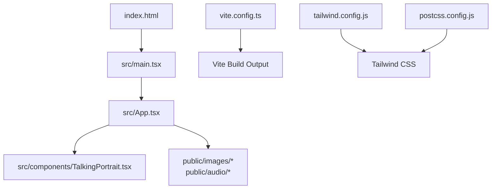
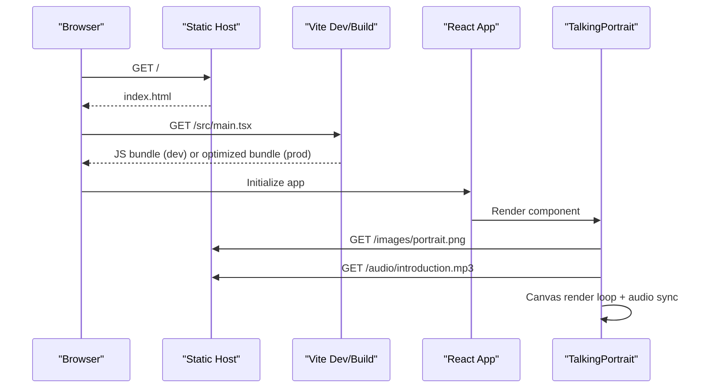
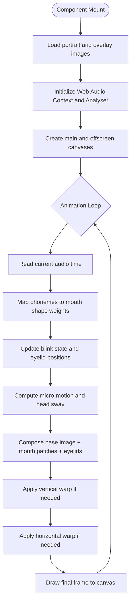
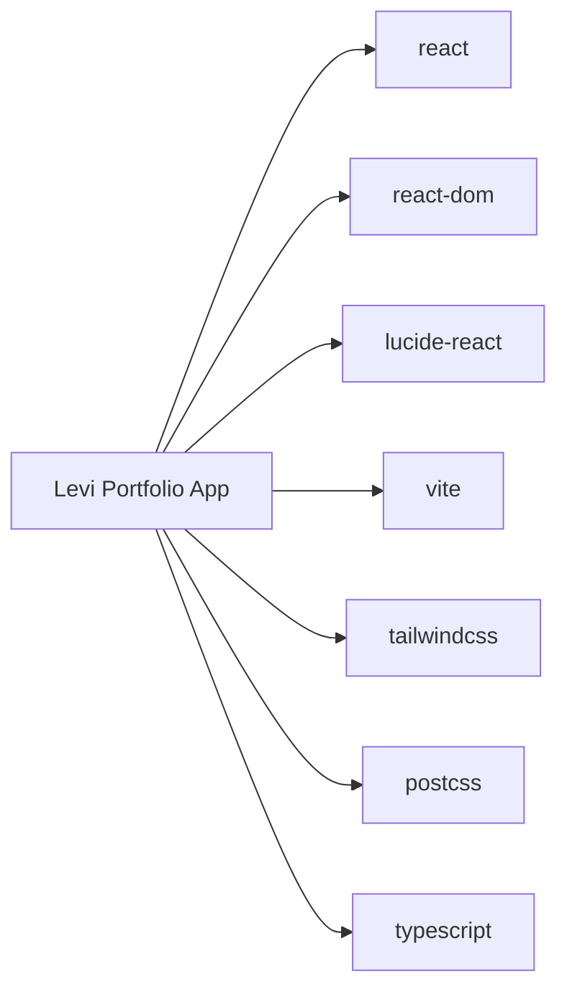

# Deployment Guide

<cite>
**Referenced Files in This Document**
- [vite.config.ts](file://vite.config.ts)
- [package.json](file://package.json)
- [index.html](file://index.html)
- [src/main.tsx](file://src/main.tsx)
- [src/App.tsx](file://src/App.tsx)
- [src/components/TalkingPortrait.tsx](file://src/components/TalkingPortrait.tsx)
- [tailwind.config.js](file://tailwind.config.js)
- [postcss.config.js](file://postcss.config.js)
</cite>

## Table of Contents
1. [Introduction](#introduction)
2. [Project Structure](#project-structure)
3. [Core Components](#core-components)
4. [Architecture Overview](#architecture-overview)
5. [Detailed Component Analysis](#detailed-component-analysis)
6. [Dependency Analysis](#dependency-analysis)
7. [Performance Considerations](#performance-considerations)
8. [Troubleshooting Guide](#troubleshooting-guide)
9. [Conclusion](#conclusion)
10. [Appendices](#appendices)

## Introduction
This deployment guide explains how to build, optimize, and deploy the Levi Portfolio application. The project is a React + TypeScript single-page application built with Vite, styled with Tailwind CSS and PostCSS, and includes an interactive talking portrait component that uses Canvas rendering and Web Audio APIs.

The guide covers:
- Production builds using Vite
- Asset optimization, code splitting, and bundle analysis
- Deployment strategies for static hosting, cloud platforms, and traditional web servers
- Environment configuration for development, staging, and production
- Asset management including CDN usage, caching headers, and image optimization
- Monitoring, analytics, error tracking, and performance monitoring
- Troubleshooting common deployment issues and security considerations

## Project Structure
At a high level, the application consists of:
- A Vite configuration that enables the React plugin, path aliases, dependency optimization, and asset handling.
- A React entry point that mounts the root component.
- An application shell that renders sections such as About, Skills, Experience, Leadership, Projects, Certifications, Future, and Contact.
- A complex interactive portrait component that composes images, warps facial regions, animates blinks, and syncs mouth movement with audio.
- Static assets under `public`, including images and audio referenced by the application.

**Diagram sources**
- [index.html:1-20](file://index.html#L1-L20)
- [src/main.tsx:1-11](file://src/main.tsx#L1-L11)
- [src/App.tsx:1-727](file://src/App.tsx#L1-L727)
- [src/components/TalkingPortrait.tsx:1-746](file://src/components/TalkingPortrait.tsx#L1-L746)
- [vite.config.ts:1-17](file://vite.config.ts#L1-L17)
- [tailwind.config.js:1-9](file://tailwind.config.js#L1-L9)
- [postcss.config.js:1-7](file://postcss.config.js#L1-L7)

**Section sources**
- [index.html:1-20](file://index.html#L1-L20)
- [src/main.tsx:1-11](file://src/main.tsx#L1-L11)
- [src/App.tsx:1-727](file://src/App.tsx#L1-L727)
- [src/components/TalkingPortrait.tsx:1-746](file://src/components/TalkingPortrait.tsx#L1-L746)
- [vite.config.ts:1-17](file://vite.config.ts#L1-L17)
- [tailwind.config.js:1-9](file://tailwind.config.js#L1-L9)
- [postcss.config.js:1-7](file://postcss.config.js#L1-L7)

## Core Components
- Vite configuration:
  - Enables the React plugin.
  - Defines a path alias for the source directory.
  - Excludes a specific icon library from dependency optimization.
- Application entry:
  - Mounts the React app into the DOM root element.
  - Imports global styles.
- Application shell:
  - Renders multiple portfolio sections.
  - Uses icons from a UI icon library.
  - References static images and external links.
- Interactive portrait:
  - Loads base portrait and overlay images.
  - Performs canvas-based composition and deformation.
  - Synchronizes mouth animation with an MP3 track.
  - Implements natural blinking and micro-movements.

**Section sources**
- [vite.config.ts:1-17](file://vite.config.ts#L1-L17)
- [src/main.tsx:1-11](file://src/main.tsx#L1-L11)
- [src/App.tsx:1-727](file://src/App.tsx#L1-L727)
- [src/components/TalkingPortrait.tsx:1-746](file://src/components/TalkingPortrait.tsx#L1-L746)

## Architecture Overview
The runtime architecture is a client-side SPA:
- Browser loads `index.html`.
- Vite serves the module script entry point.
- React initializes and renders the application shell.
- The talking portrait component manages its own canvas, audio, and animation loop.
- Static assets are served directly from the public directory.

**Diagram sources**
- [index.html:1-20](file://index.html#L1-L20)
- [src/main.tsx:1-11](file://src/main.tsx#L1-L11)
- [src/components/TalkingPortrait.tsx:318-746](file://src/components/TalkingPortrait.tsx#L318-L746)

## Detailed Component Analysis

### Vite Build and Optimization
- Plugins:
  - React plugin is enabled.
- Path alias:
  - `@` maps to the source directory.
- Dependency optimization:
  - Specific icon library excluded from pre-bundling.
- Build scripts:
  - Development server, production build, preview, linting, and type checking are defined.

Recommended production build steps:
- Run the production build command.
- Inspect the output directory for generated assets.
- Use a bundle analyzer plugin if you need detailed size breakdowns.

Asset handling:
- Images and audio referenced via absolute paths under `/images` and `/audio` are served as static files.
- Ensure these assets exist in the `public` directory before building.

Environment variables:
- No environment-specific configuration is present in the repository.
- For environment-specific behavior, add `.env` files and reference them through Vite’s environment variable support.

**Section sources**
- [vite.config.ts:1-17](file://vite.config.ts#L1-L17)
- [package.json:1-37](file://package.json#L1-L37)
- [src/components/TalkingPortrait.tsx:380-392](file://src/components/TalkingPortrait.tsx#L380-L392)
- [src/components/TalkingPortrait.tsx:728-742](file://src/components/TalkingPortrait.tsx#L728-L742)

### React Application Shell
- Entry point:
  - Creates the root React node and renders the app inside `StrictMode`.
- Global styles:
  - Imports a CSS file for site-wide styles.
- Sections:
  - The app contains multiple semantic sections for portfolio content.
- Navigation:
  - Includes navigation buttons and anchor links.
- External resources:
  - Links to GitHub, LinkedIn, and email are present.

Deployment notes:
- The HTML references the React entry module; ensure your host serves this correctly.
- If deploying behind a subpath, configure base URL settings in Vite accordingly.

**Section sources**
- [src/main.tsx:1-11](file://src/main.tsx#L1-L11)
- [src/App.tsx:101-175](file://src/App.tsx#L101-L175)
- [src/App.tsx:177-727](file://src/App.tsx#L177-L727)

### TalkingPortrait Component
Responsibilities:
- Load and manage image assets for the portrait and overlays.
- Create offscreen canvases for composition and deformation.
- Implement vertical and horizontal warping for realistic facial motion.
- Manage audio playback, analyser nodes, and time-based animation.
- Provide user controls for play, pause, replay, and progress seeking.

Key behaviors:
- Image loading:
  - Base portrait and closed eyes images are loaded from static paths.
- Audio setup:
  - Initializes Web Audio API context and analyser node.
  - Handles browser autoplay policies and suspended contexts.
- Animation loop:
  - Uses requestAnimationFrame for smooth rendering.
  - Computes phoneme-driven mouth shapes and natural blink timing.
- Performance:
  - Uses offscreen buffers to minimize redundant drawing.
  - Applies conditional warp logic based on current motion state.

**Diagram sources**
- [src/components/TalkingPortrait.tsx:318-746](file://src/components/TalkingPortrait.tsx#L318-L746)

**Section sources**
- [src/components/TalkingPortrait.tsx:1-746](file://src/components/TalkingPortrait.tsx#L1-L746)

### Styling Pipeline
- Tailwind CSS:
  - Scans HTML and source files for class usage.
  - Extends theme without custom plugins in the current configuration.
- PostCSS:
  - Processes Tailwind and autoprefixer.

Deployment notes:
- Ensure the build pipeline runs Tailwind and PostCSS during production.
- Verify that all required classes are included in the final CSS bundle.

**Section sources**
- [tailwind.config.js:1-9](file://tailwind.config.js#L1-L9)
- [postcss.config.js:1-7](file://postcss.config.js#L1-L7)

## Dependency Analysis
Runtime dependencies:
- React and ReactDOM for UI rendering.
- Lucide React for icons.

Development dependencies:
- Vite, ESLint, TypeScript, Tailwind CSS, PostCSS, Autoprefixer, and utility libraries used by scripts.

**Diagram sources**
- [package.json:13-35](file://package.json#L13-L35)

**Section sources**
- [package.json:1-37](file://package.json#L1-L37)

## Performance Considerations
- Code splitting:
  - Vite supports dynamic imports; consider lazy-loading heavy components if needed.
- Bundle size:
  - Use a bundle analyzer to identify large dependencies.
  - Exclude unnecessary libraries from dependency optimization when appropriate.
- Asset optimization:
  - Optimize images (size, format, dimensions).
  - Serve audio in efficient formats and sizes.
- Caching:
  - Configure long-lived caching for hashed static assets.
  - Set appropriate cache-control headers for images and audio.
- Rendering performance:
  - Avoid excessive canvas redraws.
  - Keep animation loops efficient and conditionally update only what changes.

[No sources needed since this section provides general guidance]

## Troubleshooting Guide

Common deployment issues:
- Missing static assets:
  - Ensure `/images/portrait.png`, `/images/closed_eyes.png`, `/images/mouth_open.png`, `/images/mouth_smile.png`, and `/audio/introduction.mp3` exist in the `public` directory.
- Incorrect base path:
  - If deploying under a subpath, configure Vite’s base URL so asset URLs resolve correctly.
- Autoplay restrictions:
  - Browsers may block audio autoplay; ensure user interaction triggers playback.
- CSS not applied:
  - Confirm Tailwind and PostCSS are running during the build.
- Type errors:
  - Run the type check script to catch TypeScript issues before deployment.

Environment-specific configurations:
- Add `.env` files for development, staging, and production.
- Reference environment variables through Vite’s supported mechanism.
- Keep secrets out of version control and inject them at deploy time.

Security considerations:
- Use HTTPS for all deployments.
- Set Content Security Policy headers where possible.
- Validate and sanitize any user-generated content if added later.
- Restrict access to sensitive configuration via server-side environment variables.

Monitoring and analytics:
- Integrate analytics providers via script injection or a dedicated analytics service.
- Set up error tracking for frontend exceptions.
- Monitor performance metrics such as load time, first paint, and interactivity.

**Section sources**
- [src/components/TalkingPortrait.tsx:341-358](file://src/components/TalkingPortrait.tsx#L341-L358)
- [src/components/TalkingPortrait.tsx:611-648](file://src/components/TalkingPortrait.tsx#L611-L648)
- [package.json:6-11](file://package.json#L6-L11)

## Conclusion
The Levi Portfolio is a modern React SPA built with Vite, featuring rich visual interactions and audio-synced animations. By following the recommended build, asset, and deployment practices outlined here, you can reliably ship the application across static hosts, cloud platforms, and traditional servers while maintaining performance, security, and observability.

[No sources needed since this section summarizes without analyzing specific files]

## Appendices

### Production Build Commands
- Install dependencies.
- Run the production build.
- Preview the build locally.
- Lint and type-check the codebase.

**Section sources**
- [package.json:6-11](file://package.json#L6-L11)

### Hosting Platform Notes
- Static site generators:
  - Deploy the Vite build output directory.
- Cloud platforms:
  - Configure the static site deployment target to serve the build output.
- Traditional web servers:
  - Serve the build output directory and set appropriate MIME types and caching headers.

[No sources needed since this section provides general guidance]