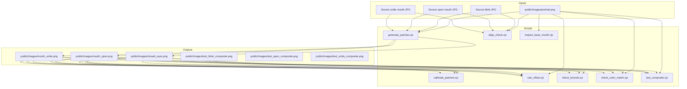
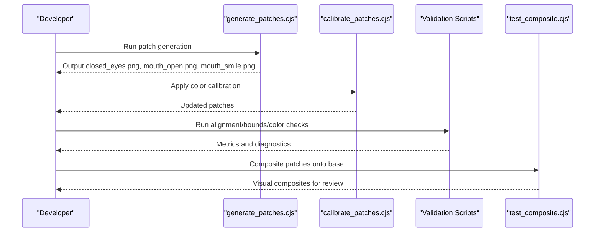
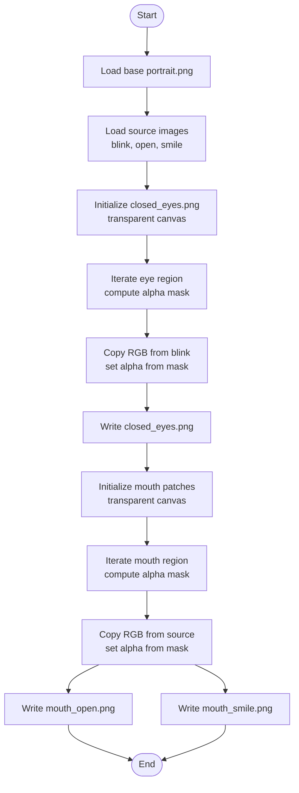
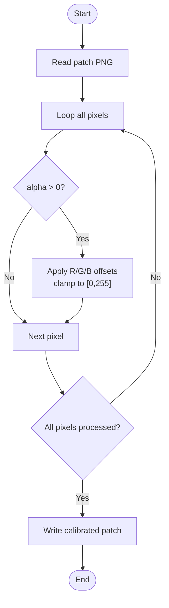
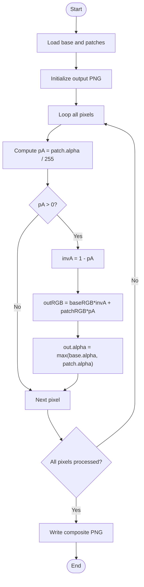
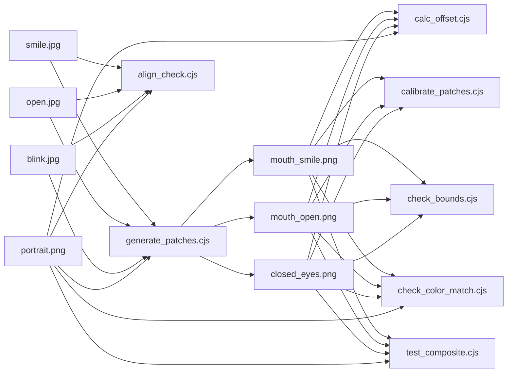

# Asset Processing Pipeline

<cite>
**Referenced Files in This Document**   
- [generate_patches.cjs](file://scripts/generate_patches.cjs)
- [calibrate_patches.cjs](file://scripts/calibrate_patches.cjs)
- [align_check.cjs](file://scripts/align_check.cjs)
- [calc_offset.cjs](file://scripts/calc_offset.cjs)
- [check_bounds.cjs](file://scripts/check_bounds.cjs)
- [check_color_match.cjs](file://scripts/check_color_match.cjs)
- [test_composite.cjs](file://scripts/test_composite.cjs)
- [inspect_base_mouth.cjs](file://scripts/inspect_base_mouth.cjs)
- [find_face.cjs](file://find_face.cjs)
- [test_mouth_patch.cjs](file://test_mouth_patch.cjs)
</cite>

## Table of Contents
1. [Introduction](#introduction)
2. [Project Structure](#project-structure)
3. [Core Components](#core-components)
4. [Architecture Overview](#architecture-overview)
5. [Detailed Component Analysis](#detailed-component-analysis)
6. [Dependency Analysis](#dependency-analysis)
7. [Performance Considerations](#performance-considerations)
8. [Troubleshooting Guide](#troubleshooting-guide)
9. [Conclusion](#conclusion)
10. [Appendices](#appendices)

## Introduction
This document explains the asset processing pipeline that generates facial expression patches and image assets for a talking portrait application. The core script, generate_patches.cjs, creates three alpha-masked PNG patches: closed_eyes.png, mouth_open.png, and mouth_smile.png. These patches are derived from source images and aligned to a base portrait using coordinate offsets and smooth alpha blending. Supporting scripts provide calibration, alignment checks, color matching diagnostics, bounds analysis, and compositing tests.

The pipeline emphasizes:
- Precise coordinate transformation between source images and the base portrait
- Smooth alpha feathering around patch boundaries to avoid hard edges
- Color calibration to match skin tones across patches
- Validation tools to ensure correct registration and visual quality

## Project Structure
The asset processing pipeline is implemented as Node.js CommonJS scripts under scripts/. Key outputs are written into public/images/.

**Diagram sources**
- [generate_patches.cjs:1-122](file://scripts/generate_patches.cjs#L1-L122)
- [calibrate_patches.cjs:1-21](file://scripts/calibrate_patches.cjs#L1-L21)
- [align_check.cjs:1-48](file://scripts/align_check.cjs#L1-L48)
- [calc_offset.cjs:1-33](file://scripts/calc_offset.cjs#L1-L33)
- [check_bounds.cjs:1-58](file://scripts/check_bounds.cjs#L1-L58)
- [check_color_match.cjs:1-32](file://scripts/check_color_match.cjs#L1-L32)
- [test_composite.cjs:1-39](file://scripts/test_composite.cjs#L1-L39)
- [inspect_base_mouth.cjs:1-18](file://scripts/inspect_base_mouth.cjs#L1-L18)

**Section sources**
- [generate_patches.cjs:1-122](file://scripts/generate_patches.cjs#L1-L122)
- [calibrate_patches.cjs:1-21](file://scripts/calibrate_patches.cjs#L1-L21)
- [align_check.cjs:1-48](file://scripts/align_check.cjs#L1-L48)
- [calc_offset.cjs:1-33](file://scripts/calc_offset.cjs#L1-L33)
- [check_bounds.cjs:1-58](file://scripts/check_bounds.cjs#L1-L58)
- [check_color_match.cjs:1-32](file://scripts/check_color_match.cjs#L1-L32)
- [test_composite.cjs:1-39](file://scripts/test_composite.cjs#L1-L39)
- [inspect_base_mouth.cjs:1-18](file://scripts/inspect_base_mouth.cjs#L1-L18)

## Core Components
- generate_patches.cjs: Creates closed_eyes.png, mouth_open.png, and mouth_smile.png by sampling source images with coordinate offsets and applying elliptical alpha masks with cosine feathering.
- calibrate_patches.cjs: Applies per-patch RGB channel offsets to non-transparent pixels to improve color matching against the base portrait.
- align_check.cjs: Detects nostril positions in base and source images to compute alignment offsets.
- calc_offset.cjs: Estimates average RGB offset in the outer feather ring to guide calibration.
- check_bounds.cjs: Computes bounding boxes and pixel counts for each patch’s visible region.
- check_color_match.cjs: Measures average color delta at transition borders to assess blending quality.
- test_composite.cjs: Blends patches onto the base portrait to visually validate results.
- inspect_base_mouth.cjs: Scans luminance values around the mouth area for manual inspection.
- find_face.cjs: Low-level PNG parsing utilities to analyze transparency and bounding boxes.
- test_mouth_patch.cjs: Verifies mouth patch dimensions and opaque pixel counts via raw PNG decoding.

**Section sources**
- [generate_patches.cjs:1-122](file://scripts/generate_patches.cjs#L1-L122)
- [calibrate_patches.cjs:1-21](file://scripts/calibrate_patches.cjs#L1-L21)
- [align_check.cjs:1-48](file://scripts/align_check.cjs#L1-L48)
- [calc_offset.cjs:1-33](file://scripts/calc_offset.cjs#L1-L33)
- [check_bounds.cjs:1-58](file://scripts/check_bounds.cjs#L1-L58)
- [check_color_match.cjs:1-32](file://scripts/check_color_match.cjs#L1-L32)
- [test_composite.cjs:1-39](file://scripts/test_composite.cjs#L1-L39)
- [inspect_base_mouth.cjs:1-18](file://scripts/inspect_base_mouth.cjs#L1-L18)
- [find_face.cjs:1-48](file://find_face.cjs#L1-L48)
- [test_mouth_patch.cjs:1-74](file://test_mouth_patch.cjs#L1-L74)

## Architecture Overview
The pipeline follows a linear flow:
1. Load base portrait and source images (blink, open mouth, smile).
2. Generate patches with coordinate offsets and alpha masks.
3. Calibrate patch colors to match the base portrait.
4. Validate alignment, color matching, and bounds.
5. Composite patches onto the base portrait for visual verification.

**Diagram sources**
- [generate_patches.cjs:1-122](file://scripts/generate_patches.cjs#L1-L122)
- [calibrate_patches.cjs:1-21](file://scripts/calibrate_patches.cjs#L1-L21)
- [check_bounds.cjs:1-58](file://scripts/check_bounds.cjs#L1-L58)
- [check_color_match.cjs:1-32](file://scripts/check_color_match.cjs#L1-L32)
- [test_composite.cjs:1-39](file://scripts/test_composite.cjs#L1-L39)

## Detailed Component Analysis

### Patch Generation: generate_patches.cjs
Purpose:
- Create closed_eyes.png by overlaying eyelid regions from a blink image onto a transparent canvas.
- Create mouth_open.png and mouth_smile.png by extracting mouth regions from source images and applying elliptical alpha masks.

Key algorithms:
- Coordinate transformation:
  - For eyes: Uses fixed centers and radii to compute normalized distances; applies blink image offsets to map source coordinates to destination coordinates.
  - For mouth: Uses fixed center and radii to compute normalized distances; applies mouth-specific offsets to map source coordinates.
- Alpha blending mask:
  - Elliptical distance metric d = sqrt((dx/rx)^2 + (dy/ry)^2)
  - Hard inner region where d <= threshold returns alpha = 1.0
  - Soft feather zone between thresholds uses cosine interpolation: alpha = 0.5 * (1 + cos(pi * t))
  - Outer region where d >= threshold returns alpha = 0.0
- Pixel manipulation:
  - Iterates over rectangular windows around features
  - Copies RGB channels from source to destination when alpha > threshold
  - Sets destination alpha proportional to computed mask value

Parameters:
- Eyes:
  - Left eye center: (427, 226), rx=28, ry=16
  - Right eye center: (515, 230), rx=28, ry=16
  - Feather thresholds: inner=0.7, outer=1.1
  - Blink offsets: offX=1, offY=1
- Mouth:
  - Center: (475, 330), rx=55, ry=40
  - Feather thresholds: inner=0.65, outer=1.05
  - Open mouth offsets: offX=1, offY=0
  - Smile mouth offsets: offX=1, offY=5

Output:
- public/images/closed_eyes.png
- public/images/mouth_open.png
- public/images/mouth_smile.png

**Diagram sources**
- [generate_patches.cjs:22-75](file://scripts/generate_patches.cjs#L22-L75)
- [generate_patches.cjs:77-122](file://scripts/generate_patches.cjs#L77-L122)

**Section sources**
- [generate_patches.cjs:1-122](file://scripts/generate_patches.cjs#L1-L122)

### Color Calibration: calibrate_patches.cjs
Purpose:
- Adjust RGB channels of non-transparent pixels in generated patches to better match the base portrait’s skin tone.

Algorithm:
- For each pixel with alpha > 0:
  - Add calibrated offsets to R, G, B channels
  - Clamp values to [0, 255]

Calibration values applied:
- closed_eyes.png: R=-3, G=-4, B=-3
- mouth_open.png: R=+4, G=+2, B=+2
- mouth_smile.png: R=+10, G=+7, B=+6

**Diagram sources**
- [calibrate_patches.cjs:4-16](file://scripts/calibrate_patches.cjs#L4-L16)

**Section sources**
- [calibrate_patches.cjs:1-21](file://scripts/calibrate_patches.cjs#L1-L21)

### Alignment Diagnostics: align_check.cjs
Purpose:
- Locate nostrils in base and source images to verify alignment offsets used during patch generation.

Algorithm:
- Compute luminance L = 0.299*R + 0.587*G + 0.114*B
- Scan a defined box around expected nostril locations
- Return position of minimum luminance (darkest point)

Usage:
- Compare nostril positions across base portrait and source images to confirm offsets like offX=1, offY=1 for eyes and offY=5 for smile mouth.

**Section sources**
- [align_check.cjs:1-48](file://scripts/align_check.cjs#L1-L48)

### Color Offset Estimation: calc_offset.cjs
Purpose:
- Estimate average RGB offset in the outer feather ring of patches relative to the base portrait.

Algorithm:
- Iterate over pixels where patch alpha is in [20, 80] (outer feather ring)
- Accumulate differences: baseRGB - patchRGB
- Average differences to estimate per-channel offsets

Output:
- Console logs for eyes, open, and smile patches indicating estimated offsets

**Section sources**
- [calc_offset.cjs:1-33](file://scripts/calc_offset.cjs#L1-L33)

### Bounds Analysis: check_bounds.cjs
Purpose:
- Compute bounding boxes and non-zero pixel counts for each patch to ensure proper coverage.

Algorithm:
- Iterate over patch pixels
- Track min/max x/y for pixels with alpha > threshold
- Count non-zero alpha pixels

Output:
- Non-zero pixel counts and bounding boxes for closed_eyes.png, mouth_open.png, mouth_smile.png

**Section sources**
- [check_bounds.cjs:1-58](file://scripts/check_bounds.cjs#L1-L58)

### Color Matching Quality: check_color_match.cjs
Purpose:
- Measure average color delta at transition borders to assess blending quality.

Algorithm:
- Iterate over pixels where patch alpha is in [30, 120] (transition zone)
- Compute absolute difference per channel between patch and base
- Average deltas across channels and pixels

Output:
- Console logs showing average delta for each patch

**Section sources**
- [check_color_match.cjs:1-32](file://scripts/check_color_match.cjs#L1-L32)

### Visual Compositing: test_composite.cjs
Purpose:
- Blend patches onto the base portrait to visually validate alignment and color matching.

Algorithm:
- For each pixel:
  - Normalize patch alpha pA = patch.alpha / 255
  - Compute inverse alpha invA = 1 - pA
  - Blend RGB: outRGB = baseRGB * invA + patchRGB * pA
  - Update output alpha to max(base.alpha, patch.alpha)

Output:
- test_blink_composite.png, test_open_composite.png, test_smile_composite.png

**Diagram sources**
- [test_composite.cjs:9-26](file://scripts/test_composite.cjs#L9-L26)

**Section sources**
- [test_composite.cjs:1-39](file://scripts/test_composite.cjs#L1-L39)

### Base Portrait Inspection: inspect_base_mouth.cjs
Purpose:
- Print luminance values around the mouth area to assist manual inspection and parameter tuning.

Algorithm:
- Iterate over a grid around the mouth region
- Compute luminance per pixel and print row-wise values

**Section sources**
- [inspect_base_mouth.cjs:1-18](file://scripts/inspect_base_mouth.cjs#L1-L18)

### Low-Level PNG Utilities: find_face.cjs and test_mouth_patch.cjs
Purpose:
- Provide low-level PNG parsing and analysis capabilities for transparency detection and raw pixel inspection.

Key functionality:
- find_face.cjs: Parses PNG headers and IDAT chunks to decompress raw image data and compute non-transparent bounding boxes.
- test_mouth_patch.cjs: Implements PNG filter types and Paeth predictor to reconstruct raw pixel data and verify mouth patch dimensions and opaque pixel counts.

**Section sources**
- [find_face.cjs:1-48](file://find_face.cjs#L1-L48)
- [test_mouth_patch.cjs:1-74](file://test_mouth_patch.cjs#L1-L74)

## Dependency Analysis
The pipeline has clear input-output dependencies:
- generate_patches.cjs depends on base portrait and source images to produce patches.
- calibrate_patches.cjs depends on generated patches to apply color corrections.
- Validation scripts depend on both base portrait and generated patches to compute metrics.
- test_composite.cjs depends on base portrait and patches to produce visual composites.

**Diagram sources**
- [generate_patches.cjs:1-122](file://scripts/generate_patches.cjs#L1-L122)
- [calibrate_patches.cjs:1-21](file://scripts/calibrate_patches.cjs#L1-L21)
- [align_check.cjs:1-48](file://scripts/align_check.cjs#L1-L48)
- [calc_offset.cjs:1-33](file://scripts/calc_offset.cjs#L1-L33)
- [check_bounds.cjs:1-58](file://scripts/check_bounds.cjs#L1-L58)
- [check_color_match.cjs:1-32](file://scripts/check_color_match.cjs#L1-L32)
- [test_composite.cjs:1-39](file://scripts/test_composite.cjs#L1-L39)

**Section sources**
- [generate_patches.cjs:1-122](file://scripts/generate_patches.cjs#L1-L122)
- [calibrate_patches.cjs:1-21](file://scripts/calibrate_patches.cjs#L1-L21)
- [align_check.cjs:1-48](file://scripts/align_check.cjs#L1-L48)
- [calc_offset.cjs:1-33](file://scripts/calc_offset.cjs#L1-L33)
- [check_bounds.cjs:1-58](file://scripts/check_bounds.cjs#L1-L58)
- [check_color_match.cjs:1-32](file://scripts/check_color_match.cjs#L1-L32)
- [test_composite.cjs:1-39](file://scripts/test_composite.cjs#L1-L39)

## Performance Considerations
- Image size: All patches are created at 1024x1024 resolution, which can be memory-intensive. Ensure sufficient RAM when processing multiple large images.
- Pixel iteration: Nested loops over entire image dimensions are O(W*H). For large images, consider vectorized operations or chunked processing.
- JPEG decoding: Source images are decoded using jpeg-js with useTArray=true, which may impact performance but provides direct access to pixel arrays.
- Alpha computation: Cosine-based feathering involves trigonometric functions; precomputing or approximating may improve speed if needed.
- Calibration: Per-pixel RGB adjustments are straightforward but still require full image traversal.

[No sources needed since this section provides general guidance]

## Troubleshooting Guide

Common issues and resolutions:

1. Misaligned facial features:
   - Symptom: Patches do not align with eyes or mouth in the base portrait.
   - Diagnosis: Use align_check.cjs to compare nostril positions across images.
   - Resolution: Adjust coordinate offsets in generate_patches.cjs (e.g., blinkOffX, blinkOffY, mouth offsets).

2. Visible seams or hard edges:
   - Symptom: Patch boundaries appear sharp or unnatural.
   - Diagnosis: Inspect alpha mask thresholds and feather zones in generate_patches.cjs.
   - Resolution: Tune inner/outer thresholds for smoother transitions.

3. Color mismatch:
   - Symptom: Patches look too bright/dark or have wrong skin tone.
   - Diagnosis: Use calc_offset.cjs to estimate RGB offsets and check_color_match.cjs to measure border deltas.
   - Resolution: Update calibration values in calibrate_patches.cjs based on estimated offsets.

4. Incorrect patch coverage:
   - Symptom: Patches miss parts of the face or extend too far.
   - Diagnosis: Use check_bounds.cjs to verify bounding boxes and non-zero pixel counts.
   - Resolution: Adjust iteration ranges and ellipse parameters in generate_patches.cjs.

5. Visual artifacts in composites:
   - Symptom: Blended images show ghosting or incorrect alpha behavior.
   - Diagnosis: Review blend function in test_composite.cjs and ensure patch alpha values are correctly set.
   - Resolution: Verify alpha computation and normalization in generate_patches.cjs.

**Section sources**
- [align_check.cjs:1-48](file://scripts/align_check.cjs#L1-L48)
- [generate_patches.cjs:22-122](file://scripts/generate_patches.cjs#L22-L122)
- [calc_offset.cjs:1-33](file://scripts/calc_offset.cjs#L1-L33)
- [check_color_match.cjs:1-32](file://scripts/check_color_match.cjs#L1-L32)
- [check_bounds.cjs:1-58](file://scripts/check_bounds.cjs#L1-L58)
- [test_composite.cjs:1-39](file://scripts/test_composite.cjs#L1-L39)

## Conclusion
The asset processing pipeline provides a robust framework for generating facial expression patches with precise alignment and color matching. By leveraging mathematical algorithms for alpha blending, coordinate transformation, and pixel manipulation, the system ensures high-quality visual integration of patches onto the base portrait. Supporting scripts enable comprehensive validation and troubleshooting, making the pipeline adaptable to various source images and desired outcomes.

[No sources needed since this section summarizes without analyzing specific files]

## Appendices

### Step-by-Step Instructions

1. Prepare source images:
   - Ensure portrait.png is available in public/images/.
   - Capture or obtain source images for blink, open mouth, and smile expressions.

2. Configure patch parameters:
   - Edit generate_patches.cjs to adjust eye and mouth centers, radii, and offsets as needed.
   - Modify feather thresholds to control smoothness of patch boundaries.

3. Generate patches:
   - Run generate_patches.cjs to create closed_eyes.png, mouth_open.png, and mouth_smile.png.

4. Calibrate colors:
   - Run calibrate_patches.cjs to apply RGB offsets for better color matching.

5. Validate alignment and quality:
   - Use align_check.cjs to verify nostril alignment.
   - Use calc_offset.cjs to estimate color offsets.
   - Use check_bounds.cjs to verify patch coverage.
   - Use check_color_match.cjs to assess border blending quality.

6. Visual validation:
   - Run test_composite.cjs to generate composite images for review.

7. Iterate and refine:
   - Adjust parameters based on diagnostic outputs and visual inspection.

[No sources needed since this section provides procedural guidance]