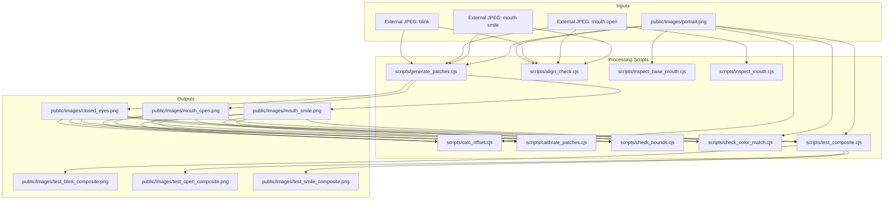
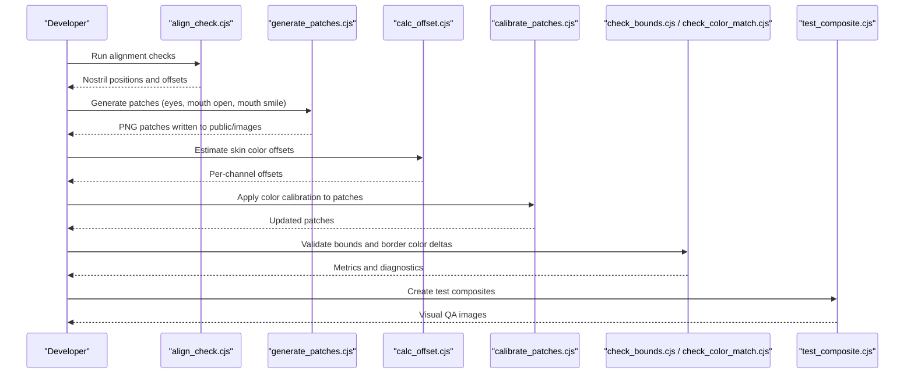
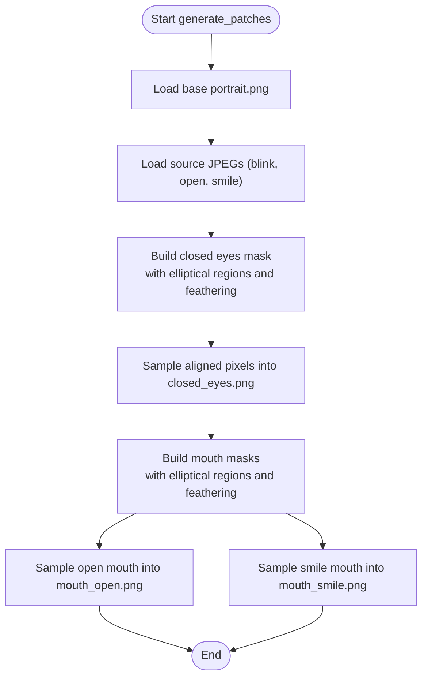
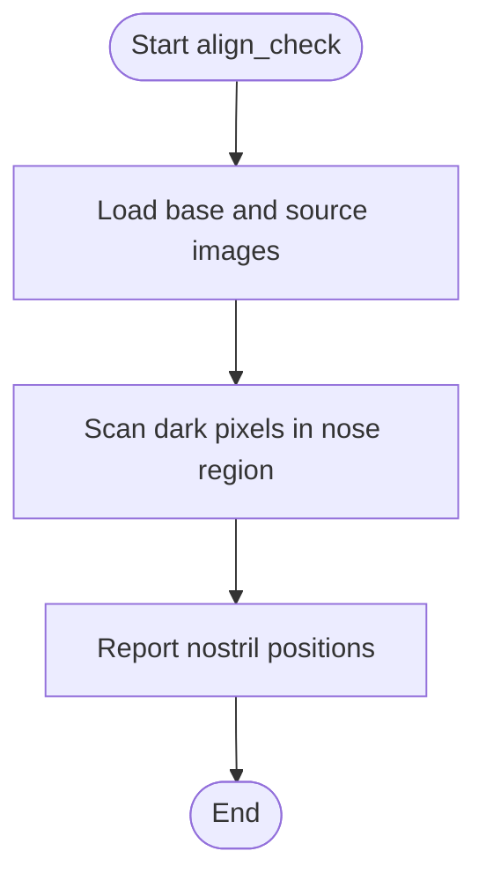
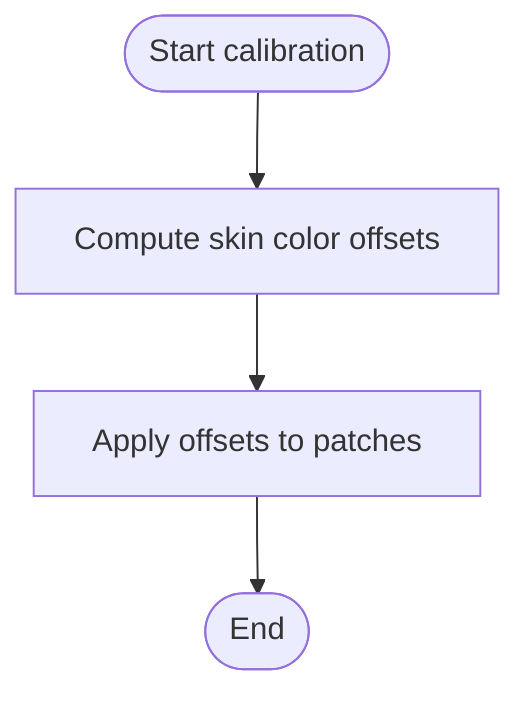
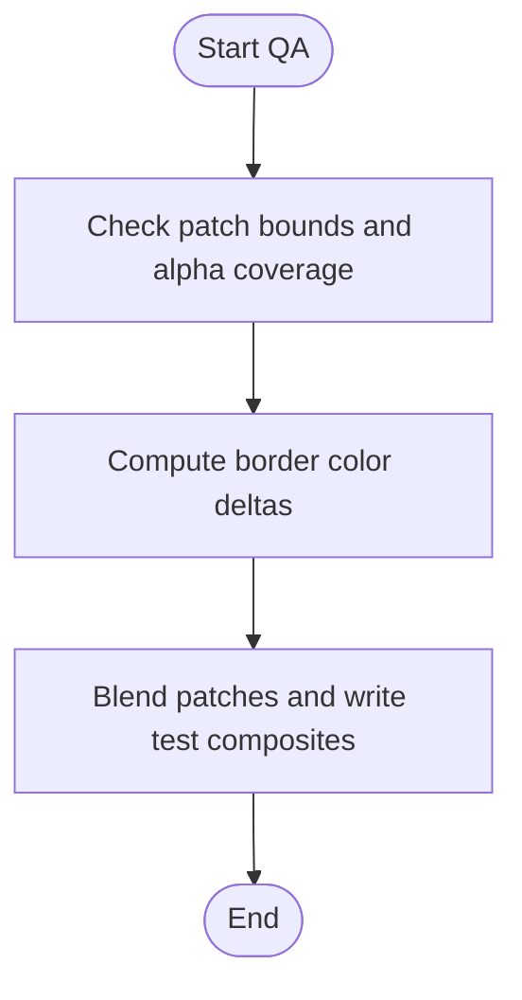
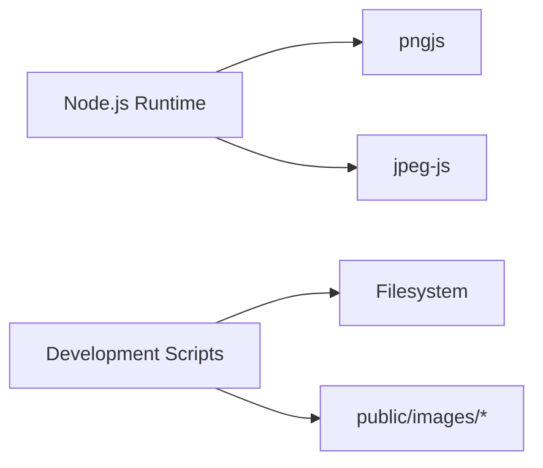

# Development Tools & Utilities

<cite>
**Referenced Files in This Document**
- [generate_patches.cjs](file://scripts/generate_patches.cjs)
- [align_check.cjs](file://scripts/align_check.cjs)
- [calibrate_patches.cjs](file://scripts/calibrate_patches.cjs)
- [check_bounds.cjs](file://scripts/check_bounds.cjs)
- [check_color_match.cjs](file://scripts/check_color_match.cjs)
- [calc_offset.cjs](file://scripts/calc_offset.cjs)
- [inspect_base_mouth.cjs](file://scripts/inspect_base_mouth.cjs)
- [inspect_mouth.cjs](file://scripts/inspect_mouth.cjs)
- [test_composite.cjs](file://scripts/test_composite.cjs)
</cite>

## Table of Contents
1. [Introduction](#introduction)
2. [Project Structure](#project-structure)
3. [Core Components](#core-components)
4. [Architecture Overview](#architecture-overview)
5. [Detailed Component Analysis](#detailed-component-analysis)
6. [Dependency Analysis](#dependency-analysis)
7. [Performance Considerations](#performance-considerations)
8. [Troubleshooting Guide](#troubleshooting-guide)
9. [Conclusion](#conclusion)
10. [Appendices](#appendices)

## Introduction
This document describes the Development Tools and Utilities located under the scripts directory. These utilities implement an asset processing pipeline for facial expression patches used by the project’s portrait system. The pipeline covers:
- Generating image patches (eyes closed, mouth open, mouth smile) from a base portrait and aligned source images
- Checking alignment between the base portrait and source images using landmark heuristics
- Calibrating patch colors to match the base portrait
- Validating patch bounds, color consistency at feathered edges, and visual compositing results

The tools are Node.js scripts that operate on PNG and JPEG images using pngjs and jpeg-js. They read assets from public/images and write processed outputs back into the same directory or to temporary test files.

## Project Structure
The scripts directory contains focused utilities for each stage of the asset pipeline. The main inputs are:
- Base portrait: public/images/portrait.png
- Source images for expressions: external JPEGs representing blink, mouth open, and mouth smile
- Generated patches: public/images/closed_eyes.png, public/images/mouth_open.png, public/images/mouth_smile.png
- Test composites: public/images/test_blink_composite.png, public/images/test_open_composite.png, public/images/test_smile_composite.png

**Diagram sources**
- [generate_patches.cjs:1-122](file://scripts/generate_patches.cjs#L1-L122)
- [align_check.cjs:1-48](file://scripts/align_check.cjs#L1-L48)
- [calibrate_patches.cjs:1-21](file://scripts/calibrate_patches.cjs#L1-L21)
- [check_bounds.cjs:1-58](file://scripts/check_bounds.cjs#L1-L58)
- [check_color_match.cjs:1-32](file://scripts/check_color_match.cjs#L1-L32)
- [calc_offset.cjs:1-33](file://scripts/calc_offset.cjs#L1-L33)
- [inspect_base_mouth.cjs:1-18](file://scripts/inspect_base_mouth.cjs#L1-L18)
- [inspect_mouth.cjs:1-24](file://scripts/inspect_mouth.cjs#L1-L24)
- [test_composite.cjs:1-39](file://scripts/test_composite.cjs#L1-L39)

**Section sources**
- [generate_patches.cjs:1-122](file://scripts/generate_patches.cjs#L1-L122)
- [align_check.cjs:1-48](file://scripts/align_check.cjs#L1-L48)
- [calibrate_patches.cjs:1-21](file://scripts/calibrate_patches.cjs#L1-L21)
- [check_bounds.cjs:1-58](file://scripts/check_bounds.cjs#L1-L58)
- [check_color_match.cjs:1-32](file://scripts/check_color_match.cjs#L1-L32)
- [calc_offset.cjs:1-33](file://scripts/calc_offset.cjs#L1-L33)
- [inspect_base_mouth.cjs:1-18](file://scripts/inspect_base_mouth.cjs#L1-L18)
- [inspect_mouth.cjs:1-24](file://scripts/inspect_mouth.cjs#L1-L24)
- [test_composite.cjs:1-39](file://scripts/test_composite.cjs#L1-L39)

## Core Components
- generate_patches.cjs: Creates closed eyes and mouth patches with soft feathered alpha masks, sampling from aligned source images and writing PNG outputs.
- align_check.cjs: Detects nostril landmarks in the base portrait and source images to verify alignment offsets.
- calibrate_patches.cjs: Applies per-channel RGB offsets to non-transparent pixels in generated patches to improve color matching.
- check_bounds.cjs: Scans patches for non-zero alpha regions and reports bounding boxes and pixel counts.
- check_color_match.cjs: Computes average color delta at transition borders between patches and the base portrait.
- calc_offset.cjs: Estimates skin color offsets by comparing base and patch pixels in the feathered ring region.
- inspect_base_mouth.cjs: Prints luminance samples around the mouth area of the base portrait for manual inspection.
- inspect_mouth.cjs: Prints luminance samples around the mouth area of source images to locate teeth/mouth cavity.
- test_composite.cjs: Blends patches onto the base portrait and writes test composite images for visual QA.

**Section sources**
- [generate_patches.cjs:1-122](file://scripts/generate_patches.cjs#L1-L122)
- [align_check.cjs:1-48](file://scripts/align_check.cjs#L1-L48)
- [calibrate_patches.cjs:1-21](file://scripts/calibrate_patches.cjs#L1-L21)
- [check_bounds.cjs:1-58](file://scripts/check_bounds.cjs#L1-L58)
- [check_color_match.cjs:1-32](file://scripts/check_color_match.cjs#L1-L32)
- [calc_offset.cjs:1-33](file://scripts/calc_offset.cjs#L1-L33)
- [inspect_base_mouth.cjs:1-18](file://scripts/inspect_base_mouth.cjs#L1-L18)
- [inspect_mouth.cjs:1-24](file://scripts/inspect_mouth.cjs#L1-L24)
- [test_composite.cjs:1-39](file://scripts/test_composite.cjs#L1-L39)

## Architecture Overview
The asset pipeline follows a linear flow:
1. Alignment verification using landmark heuristics
2. Patch generation with elliptical alpha masks and feathered boundaries
3. Color calibration based on estimated offsets
4. Quality assurance via bounds checking, border color delta analysis, and visual compositing

**Diagram sources**
- [align_check.cjs:1-48](file://scripts/align_check.cjs#L1-L48)
- [generate_patches.cjs:1-122](file://scripts/generate_patches.cjs#L1-L122)
- [calc_offset.cjs:1-33](file://scripts/calc_offset.cjs#L1-L33)
- [calibrate_patches.cjs:1-21](file://scripts/calibrate_patches.cjs#L1-L21)
- [check_bounds.cjs:1-58](file://scripts/check_bounds.cjs#L1-L58)
- [check_color_match.cjs:1-32](file://scripts/check_color_match.cjs#L1-L32)
- [test_composite.cjs:1-39](file://scripts/test_composite.cjs#L1-L39)

## Detailed Component Analysis

### Asset Generation Pipeline
Purpose:
- Produce closed_eyes.png, mouth_open.png, and mouth_smile.png with smooth alpha transitions.
- Use elliptical masks centered around facial features and sample from aligned source images.

Key behaviors:
- Closed eyes mask uses two ellipses for left/right eyes with cosine feathering between inner and outer radii.
- Mouth masks use a single ellipse with feathered boundary; offsets adjust for nostril alignment differences between base and source images.
- Outputs are full-canvas PNGs with transparent background and localized non-zero alpha regions.

Usage pattern:
- Ensure base portrait and source JPEGs are available at expected paths.
- Run the script to generate patches in public/images.

Quality considerations:
- Feathered edges reduce visible seams when blending.
- Offsets must be tuned to account for minor misalignment between base and source images.

**Diagram sources**
- [generate_patches.cjs:22-75](file://scripts/generate_patches.cjs#L22-L75)
- [generate_patches.cjs:77-121](file://scripts/generate_patches.cjs#L77-L121)

**Section sources**
- [generate_patches.cjs:1-122](file://scripts/generate_patches.cjs#L1-L122)

### Alignment Checking Tool
Purpose:
- Verify that source images align with the base portrait by detecting nostril landmarks.

Key behaviors:
- Scans a fixed rectangular region around the nose to find the darkest pixel (nostril heuristic).
- Reports coordinates for base and each source image to help compute offsets.

Usage pattern:
- Run before generating patches to confirm alignment.
- Use reported positions to adjust offsets in patch generation if needed.

**Diagram sources**
- [align_check.cjs:23-47](file://scripts/align_check.cjs#L23-L47)

**Section sources**
- [align_check.cjs:1-48](file://scripts/align_check.cjs#L1-L48)

### Calibration Tools
Purpose:
- Adjust patch colors to match the base portrait’s skin tones.

Key behaviors:
- calc_offset.cjs estimates per-channel offsets by comparing base and patch pixels within the feathered ring region.
- calibrate_patches.cjs applies these offsets to non-transparent pixels in patches.

Usage pattern:
- Run calc_offset.cjs to obtain recommended offsets.
- Update calibrate_patches.cjs with computed offsets and re-run to apply calibration.

**Diagram sources**
- [calc_offset.cjs:9-32](file://scripts/calc_offset.cjs#L9-L32)
- [calibrate_patches.cjs:4-20](file://scripts/calibrate_patches.cjs#L4-L20)

**Section sources**
- [calc_offset.cjs:1-33](file://scripts/calc_offset.cjs#L1-L33)
- [calibrate_patches.cjs:1-21](file://scripts/calibrate_patches.cjs#L1-L21)

### Quality Assurance Tools
Purpose:
- Validate patch geometry and color consistency.

Key behaviors:
- check_bounds.cjs scans patches for non-zero alpha pixels and prints bounding boxes and counts.
- check_color_match.cjs computes average color delta at transition borders (partial alpha range) between patches and base.
- test_composite.cjs blends patches onto the base portrait and writes test composites for visual review.

Usage pattern:
- After calibration, run bounds and color match checks.
- Review test composites to ensure seamless blending.

**Diagram sources**
- [check_bounds.cjs:4-57](file://scripts/check_bounds.cjs#L4-L57)
- [check_color_match.cjs:9-31](file://scripts/check_color_match.cjs#L9-L31)
- [test_composite.cjs:9-38](file://scripts/test_composite.cjs#L9-L38)

**Section sources**
- [check_bounds.cjs:1-58](file://scripts/check_bounds.cjs#L1-L58)
- [check_color_match.cjs:1-32](file://scripts/check_color_match.cjs#L1-L32)
- [test_composite.cjs:1-39](file://scripts/test_composite.cjs#L1-L39)

### Inspection Utilities
Purpose:
- Provide manual inspection of luminance values around the mouth region to aid alignment and patch design.

Key behaviors:
- inspect_base_mouth.cjs prints luminance samples across a grid around the mouth on the base portrait.
- inspect_mouth.cjs prints luminance samples across a grid around the mouth on source images to identify teeth/mouth cavity.

Usage pattern:
- Run these scripts during manual alignment and patch creation to validate feature placement.

**Section sources**
- [inspect_base_mouth.cjs:1-18](file://scripts/inspect_base_mouth.cjs#L1-L18)
- [inspect_mouth.cjs:1-24](file://scripts/inspect_mouth.cjs#L1-L24)

## Dependency Analysis
Scripts depend on:
- Node.js runtime
- pngjs for PNG reading/writing
- jpeg-js for JPEG decoding

Common input/output patterns:
- Inputs: public/images/portrait.png and external JPEGs for expressions
- Outputs: public/images/*.png patches and test composites

Coupling and cohesion:
- Each script is cohesive and focused on a specific task (generation, alignment, calibration, QA).
- Coupling is primarily through shared file paths and consistent image formats.

Potential circular dependencies:
- None observed; scripts are independent and invoked sequentially by the developer.

External integration points:
- Filesystem I/O for reading/writing images
- Hardcoded paths for external JPEGs require maintenance when source images change

**Diagram sources**
- [generate_patches.cjs:1-3](file://scripts/generate_patches.cjs#L1-L3)
- [align_check.cjs:1-3](file://scripts/align_check.cjs#L1-L3)
- [calibrate_patches.cjs:1-2](file://scripts/calibrate_patches.cjs#L1-L2)
- [check_bounds.cjs:1-2](file://scripts/check_bounds.cjs#L1-L2)
- [check_color_match.cjs:1-2](file://scripts/check_color_match.cjs#L1-L2)
- [calc_offset.cjs:1-2](file://scripts/calc_offset.cjs#L1-L2)
- [inspect_base_mouth.cjs:1-2](file://scripts/inspect_base_mouth.cjs#L1-L2)
- [inspect_mouth.cjs:1-3](file://scripts/inspect_mouth.cjs#L1-L3)
- [test_composite.cjs:1-2](file://scripts/test_composite.cjs#L1-L2)

**Section sources**
- [generate_patches.cjs:1-122](file://scripts/generate_patches.cjs#L1-L122)
- [align_check.cjs:1-48](file://scripts/align_check.cjs#L1-L48)
- [calibrate_patches.cjs:1-21](file://scripts/calibrate_patches.cjs#L1-L21)
- [check_bounds.cjs:1-58](file://scripts/check_bounds.cjs#L1-L58)
- [check_color_match.cjs:1-32](file://scripts/check_color_match.cjs#L1-L32)
- [calc_offset.cjs:1-33](file://scripts/calc_offset.cjs#L1-L33)
- [inspect_base_mouth.cjs:1-18](file://scripts/inspect_base_mouth.cjs#L1-L18)
- [inspect_mouth.cjs:1-24](file://scripts/inspect_mouth.cjs#L1-L24)
- [test_composite.cjs:1-39](file://scripts/test_composite.cjs#L1-L39)

## Performance Considerations
- Pixel-wise operations are O(W×H) per image; performance scales with image resolution.
- Feathered masks and border checks iterate over entire canvases; consider limiting loops to bounding boxes where possible.
- JPEG decoding and PNG encoding add overhead; batch operations where feasible.
- For large datasets, process images asynchronously or parallelize tasks to reduce wall-clock time.

[No sources needed since this section provides general guidance]

## Troubleshooting Guide
Common issues and resolutions:
- Misaligned patches:
  - Symptom: Visible seams or mismatched features when blending.
  - Action: Re-run align_check.cjs to verify nostril positions; adjust offsets in generate_patches.cjs accordingly.
  - Section sources
    - [align_check.cjs:23-47](file://scripts/align_check.cjs#L23-L47)
    - [generate_patches.cjs:53-55](file://scripts/generate_patches.cjs#L53-L55)

- Color mismatch at feathered edges:
  - Symptom: Noticeable color shift along patch boundaries.
  - Action: Run calc_offset.cjs to estimate offsets; update calibrate_patches.cjs and re-apply calibration.
  - Section sources
    - [calc_offset.cjs:9-32](file://scripts/calc_offset.cjs#L9-L32)
    - [calibrate_patches.cjs:4-20](file://scripts/calibrate_patches.cjs#L4-L20)

- Unexpected patch bounds:
  - Symptom: Alpha regions extend beyond intended areas.
  - Action: Run check_bounds.cjs to inspect bounding boxes and non-zero pixel counts; refine mask parameters in generate_patches.cjs.
  - Section sources
    - [check_bounds.cjs:4-57](file://scripts/check_bounds.cjs#L4-L57)
    - [generate_patches.cjs:31-51](file://scripts/generate_patches.cjs#L31-L51)

- Border color delta too high:
  - Symptom: High average delta indicates poor blending.
  - Action: Review check_color_match.cjs output; adjust calibration offsets and regenerate patches.
  - Section sources
    - [check_color_match.cjs:9-31](file://scripts/check_color_match.cjs#L9-L31)

- Visual artifacts in composites:
  - Symptom: Artifacts or incorrect blending in test images.
  - Action: Inspect test_composite.cjs blend function and alpha weighting; adjust alphaWeight if necessary.
  - Section sources
    - [test_composite.cjs:9-26](file://scripts/test_composite.cjs#L9-L26)

## Conclusion
The scripts directory provides a complete toolset for creating, aligning, calibrating, and validating facial expression patches. By following the pipeline—alignment verification, patch generation, color calibration, and quality assurance—you can produce visually consistent assets suitable for real-time portrait rendering. The modular design allows easy extension with new utilities and integration into broader development workflows.

[No sources needed since this section summarizes without analyzing specific files]

## Appendices

### Step-by-Step Guides

#### Creating New Facial Expression Patches
1. Prepare source images:
   - Capture or obtain aligned JPEGs for the new expression.
2. Verify alignment:
   - Run align_check.cjs to confirm nostril positions match the base portrait.
3. Generate patches:
   - Update generate_patches.cjs with new source paths and offsets if needed.
   - Run the script to create the new patch PNG.
4. Calibrate colors:
   - Run calc_offset.cjs to estimate offsets for the new patch.
   - Update calibrate_patches.cjs and apply calibration.
5. Validate:
   - Run check_bounds.cjs and check_color_match.cjs to ensure proper geometry and color consistency.
   - Run test_composite.cjs to visually inspect blending.

**Section sources**
- [align_check.cjs:1-48](file://scripts/align_check.cjs#L1-L48)
- [generate_patches.cjs:1-122](file://scripts/generate_patches.cjs#L1-L122)
- [calc_offset.cjs:1-33](file://scripts/calc_offset.cjs#L1-L33)
- [calibrate_patches.cjs:1-21](file://scripts/calibrate_patches.cjs#L1-L21)
- [check_bounds.cjs:1-58](file://scripts/check_bounds.cjs#L1-L58)
- [check_color_match.cjs:1-32](file://scripts/check_color_match.cjs#L1-L32)
- [test_composite.cjs:1-39](file://scripts/test_composite.cjs#L1-L39)

#### Calibrating Image Assets
1. Run calc_offset.cjs to compute per-channel offsets for existing patches.
2. Update calibrate_patches.cjs with the computed offsets.
3. Re-run calibrate_patches.cjs to apply changes.
4. Validate with check_color_match.cjs and test_composite.cjs.

**Section sources**
- [calc_offset.cjs:1-33](file://scripts/calc_offset.cjs#L1-L33)
- [calibrate_patches.cjs:1-21](file://scripts/calibrate_patches.cjs#L1-L21)
- [check_color_match.cjs:1-32](file://scripts/check_color_match.cjs#L1-L32)
- [test_composite.cjs:1-39](file://scripts/test_composite.cjs#L1-L39)

#### Extending the Toolset
- Add a new utility script:
  - Follow the pattern of existing scripts: require fs, pngjs, and/or jpeg-js.
  - Read inputs from public/images or external paths.
  - Write outputs back to public/images or dedicated test directories.
  - Include clear console logging for diagnostics.
- Integrate into workflow:
  - Invoke the new script after relevant stages (e.g., after patch generation or calibration).
  - Update documentation and any automation steps to include the new utility.

[No sources needed since this section provides general guidance]