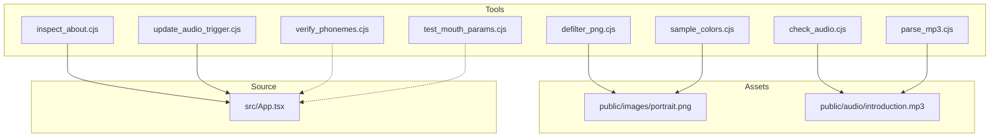
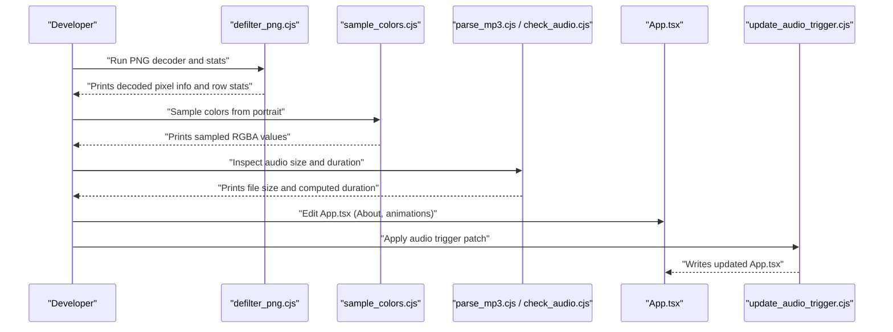
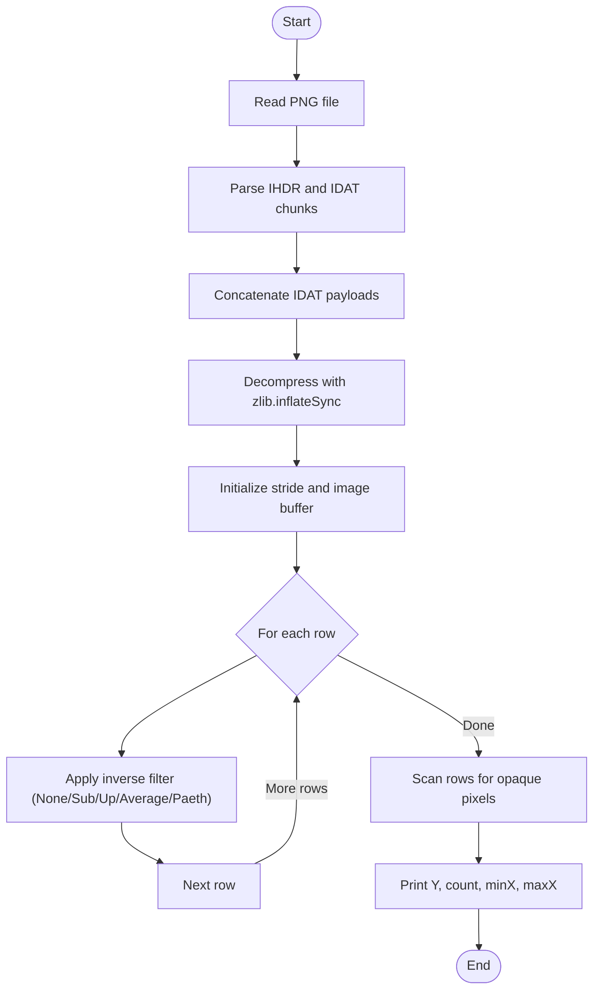
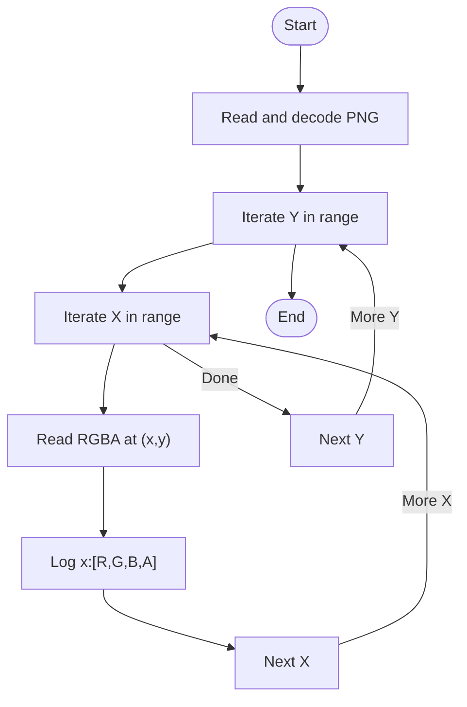
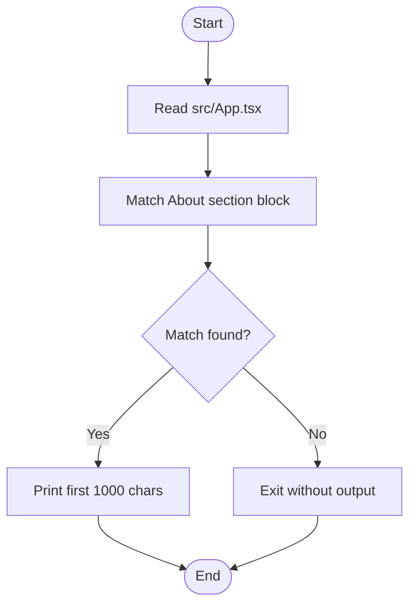
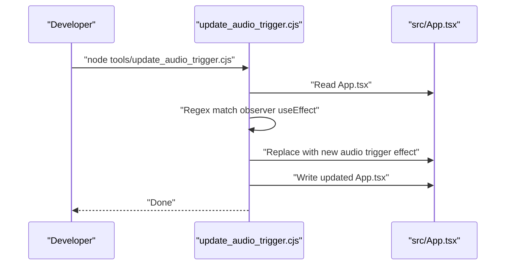
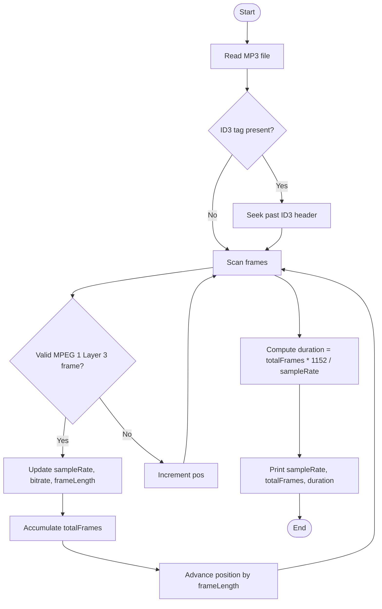
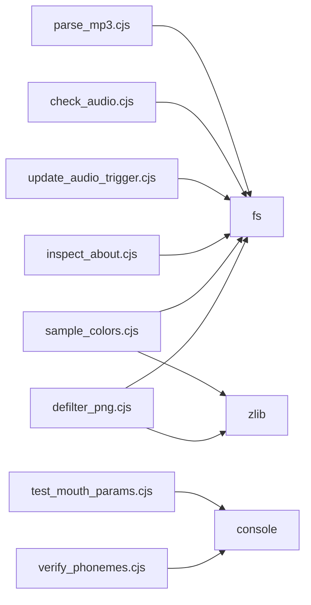

# Development Utilities

<cite>
**Referenced Files in This Document**
- [defilter_png.cjs](file://tools/defilter_png.cjs)
- [sample_colors.cjs](file://tools/sample_colors.cjs)
- [inspect_about.cjs](file://tools/inspect_about.cjs)
- [update_audio_trigger.cjs](file://tools/update_audio_trigger.cjs)
- [check_audio.cjs](file://tools/check_audio.cjs)
- [parse_mp3.cjs](file://tools/parse_mp3.cjs)
- [verify_phonemes.cjs](file://tools/verify_phonemes.cjs)
- [test_mouth_params.cjs](file://tools/test_mouth_params.cjs)
</cite>

## Table of Contents
1. [Introduction](#introduction)
2. [Project Structure](#project-structure)
3. [Core Components](#core-components)
4. [Architecture Overview](#architecture-overview)
5. [Detailed Component Analysis](#detailed-component-analysis)
6. [Dependency Analysis](#dependency-analysis)
7. [Performance Considerations](#performance-considerations)
8. [Troubleshooting Guide](#troubleshooting-guide)
9. [Conclusion](#conclusion)
10. [Appendices](#appendices)

## Introduction
This document describes the development utilities that support the project’s workflow and debugging processes. It focuses on:
- PNG analysis and optimization helpers for image assets
- Color palette extraction from the portrait asset
- Content verification for the About section
- Audio synchronization configuration updates
- Additional helper scripts for routine maintenance tasks such as audio inspection, MP3 parsing, phoneme mapping validation, and mouth parameter testing

These tools are designed to be run directly with Node.js and integrate into the main application development cycle by reading or writing files under public and src directories.

## Project Structure
The development utilities are primarily located under the tools directory. They operate on:
- public/images/portrait.png (PNG asset used for analysis)
- public/audio/introduction.mp3 (audio asset used for timing and duration checks)
- src/App.tsx (application source file edited by update utilities)

**Diagram sources**
- [defilter_png.cjs:1-80](file://tools/defilter_png.cjs#L1-L80)
- [sample_colors.cjs:1-37](file://tools/sample_colors.cjs#L1-L37)
- [inspect_about.cjs:1-7](file://tools/inspect_about.cjs#L1-L7)
- [update_audio_trigger.cjs:1-20](file://tools/update_audio_trigger.cjs#L1-L20)
- [check_audio.cjs:1-4](file://tools/check_audio.cjs#L1-L4)
- [parse_mp3.cjs:1-45](file://tools/parse_mp3.cjs#L1-L45)
- [verify_phonemes.cjs:1-87](file://tools/verify_phonemes.cjs#L1-L87)
- [test_mouth_params.cjs:1-27](file://tools/test_mouth_params.cjs#L1-L27)

**Section sources**
- [defilter_png.cjs:1-80](file://tools/defilter_png.cjs#L1-L80)
- [sample_colors.cjs:1-37](file://tools/sample_colors.cjs#L1-L37)
- [inspect_about.cjs:1-7](file://tools/inspect_about.cjs#L1-L7)
- [update_audio_trigger.cjs:1-20](file://tools/update_audio_trigger.cjs#L1-L20)
- [check_audio.cjs:1-4](file://tools/check_audio.cjs#L1-L4)
- [parse_mp3.cjs:1-45](file://tools/parse_mp3.cjs#L1-L45)
- [verify_phonemes.cjs:1-87](file://tools/verify_phonemes.cjs#L1-L87)
- [test_mouth_params.cjs:1-27](file://tools/test_mouth_params.cjs#L1-L27)

## Core Components
- defilter_png.cjs: Parses a PNG file at the byte level, decompresses IDAT chunks, applies inverse filter types (including Paeth), reconstructs pixel data, and prints per-row opaque pixel statistics to help verify image content and alignment.
- sample_colors.cjs: Reads the same PNG, decodes it, and samples colors across a grid region to extract representative color values for palette design and visual consistency checks.
- inspect_about.cjs: Extracts and prints a snippet of the About section from App.tsx to quickly verify its structure and boundaries.
- update_audio_trigger.cjs: Applies a targeted transformation to App.tsx to inject an audio trigger effect that plays audio after an unfold animation completes.
- check_audio.cjs: Prints the size of the introduction audio file to ensure it is present and correctly sized.
- parse_mp3.cjs: Parses MP3 frames to compute exact duration and sample rate, aiding synchronization planning.
- verify_phonemes.cjs: Validates a hand-authored phoneme map against expected word timings and counts total phonemes.
- test_mouth_params.cjs: Computes mouth strip geometry and maximum lip drop based on fixed parameters used in rendering.

Usage examples and command-line options:
- All scripts are executed via Node.js from the repository root. No explicit CLI arguments are parsed; paths are hardcoded to standard locations.
- Example commands:
  - node tools/defilter_png.cjs
  - node tools/sample_colors.cjs
  - node tools/inspect_about.cjs
  - node tools/update_audio_trigger.cjs
  - node tools/check_audio.cjs
  - node tools/parse_mp3.cjs
  - node tools/verify_phonemes.cjs
  - node tools/test_mouth_params.cjs

Integration patterns:
- Run image utilities before committing changes to public/images/portrait.png to validate decoded pixels and opacity distribution.
- Use color sampling to inform CSS variables or shader constants for consistent visuals.
- Verify the About section structure using inspect_about.cjs when editing App.tsx.
- Apply update_audio_trigger.cjs when integrating new audio behavior tied to UI state transitions.
- Validate audio asset integrity and duration with check_audio.cjs and parse_mp3.cjs prior to deployment.
- Confirm phoneme timing and mouth geometry with verify_phonemes.cjs and test_mouth_params.cjs during animation tuning.

**Section sources**
- [defilter_png.cjs:1-80](file://tools/defilter_png.cjs#L1-L80)
- [sample_colors.cjs:1-37](file://tools/sample_colors.cjs#L1-L37)
- [inspect_about.cjs:1-7](file://tools/inspect_about.cjs#L1-L7)
- [update_audio_trigger.cjs:1-20](file://tools/update_audio_trigger.cjs#L1-L20)
- [check_audio.cjs:1-4](file://tools/check_audio.cjs#L1-L4)
- [parse_mp3.cjs:1-45](file://tools/parse_mp3.cjs#L1-L45)
- [verify_phonemes.cjs:1-87](file://tools/verify_phonemes.cjs#L1-L87)
- [test_mouth_params.cjs:1-27](file://tools/test_mouth_params.cjs#L1-L27)

## Architecture Overview
The utilities form a lightweight pipeline around static assets and the application source:

**Diagram sources**
- [defilter_png.cjs:1-80](file://tools/defilter_png.cjs#L1-L80)
- [sample_colors.cjs:1-37](file://tools/sample_colors.cjs#L1-L37)
- [parse_mp3.cjs:1-45](file://tools/parse_mp3.cjs#L1-L45)
- [check_audio.cjs:1-4](file://tools/check_audio.cjs#L1-L4)
- [update_audio_trigger.cjs:1-20](file://tools/update_audio_trigger.cjs#L1-L20)

## Detailed Component Analysis

### defilter_png.cjs: PNG Decoding and Opaque Pixel Statistics
Purpose:
- Decode a PNG file without external libraries by parsing IHDR and IDAT chunks, decompressing with zlib, and applying inverse filters including Paeth prediction.
- Compute and print per-row statistics for opaque pixels to aid alignment and masking verification.

Key behaviors:
- Reads public/images/portrait.png synchronously.
- Iterates over PNG chunks to collect width, height, and IDAT payloads.
- Decompresses concatenated IDAT data and reconstructs pixel rows by reversing PNG filter types.
- Scans rows at intervals and reports counts and horizontal bounds where alpha exceeds a threshold.

Complexity:
- Time complexity: O(W × H × BPP) for decoding, where W is width, H is height, and BPP is bytes per pixel.
- Space complexity: O(W × H × BPP) for the reconstructed image buffer.

**Diagram sources**
- [defilter_png.cjs:4-22](file://tools/defilter_png.cjs#L4-L22)
- [defilter_png.cjs:24-60](file://tools/defilter_png.cjs#L24-L60)
- [defilter_png.cjs:64-79](file://tools/defilter_png.cjs#L64-L79)

Usage example:
- node tools/defilter_png.cjs

Integration pattern:
- Run after modifying portrait.png to confirm decoded pixel layout and opacity distribution matches expectations.

**Section sources**
- [defilter_png.cjs:1-80](file://tools/defilter_png.cjs#L1-L80)

### sample_colors.cjs: Color Palette Extraction
Purpose:
- Sample RGBA values from a rectangular region of the decoded portrait to assist in building a consistent color palette.

Key behaviors:
- Reads and decodes the same PNG as defilter_png.cjs.
- Iterates over a grid of coordinates within a specified range and logs sampled RGBA tuples.

Complexity:
- Time complexity: O(N) where N is the number of sampled points.
- Space complexity: Minimal, only buffers for decoding.

**Diagram sources**
- [sample_colors.cjs:4-23](file://tools/sample_colors.cjs#L4-L23)
- [sample_colors.cjs:25-36](file://tools/sample_colors.cjs#L25-L36)

Usage example:
- node tools/sample_colors.cjs

Integration pattern:
- Use printed samples to define CSS variables or shader constants for skin tones, shadows, and highlights.

**Section sources**
- [sample_colors.cjs:1-37](file://tools/sample_colors.cjs#L1-L37)

### inspect_about.cjs: About Section Verification
Purpose:
- Quickly verify the structure and boundaries of the About section in App.tsx by extracting a substring between known section markers.

Key behaviors:
- Reads src/App.tsx and matches the section block using a regex spanning from the start of the About section to the next section marker.
- Prints a truncated preview to inspect structure.

Complexity:
- Time complexity: O(S) where S is the length of App.tsx due to regex matching.
- Space complexity: O(1) beyond the input string.

**Diagram sources**
- [inspect_about.cjs:1-6](file://tools/inspect_about.cjs#L1-L6)

Usage example:
- node tools/inspect_about.cjs

Integration pattern:
- Run after editing App.tsx to ensure the About section remains intact and properly bounded.

**Section sources**
- [inspect_about.cjs:1-7](file://tools/inspect_about.cjs#L1-L7)

### update_audio_trigger.cjs: Audio Synchronization Configuration
Purpose:
- Inject an audio playback trigger into App.tsx that starts audio after an unfold animation begins, improving perceived synchronization.

Key behaviors:
- Reads src/App.tsx and replaces an existing IntersectionObserver-based useEffect block with a new effect that plays audio conditionally.
- Writes the modified content back to src/App.tsx.

Complexity:
- Time complexity: O(S) for regex replacement and write.
- Space complexity: O(S) for the loaded file content.

**Diagram sources**
- [update_audio_trigger.cjs:1-20](file://tools/update_audio_trigger.cjs#L1-L20)

Usage example:
- node tools/update_audio_trigger.cjs

Integration pattern:
- Apply this script when introducing or adjusting audio playback tied to UI state changes. Always review the diff afterward to ensure correctness.

**Section sources**
- [update_audio_trigger.cjs:1-20](file://tools/update_audio_trigger.cjs#L1-L20)

### check_audio.cjs: Audio File Size Check
Purpose:
- Ensure the introduction audio file exists and has the expected size.

Key behaviors:
- Reads public/audio/introduction.mp3 and prints its byte length.

Usage example:
- node tools/check_audio.cjs

Integration pattern:
- Run as part of pre-commit checks to catch missing or truncated audio assets.

**Section sources**
- [check_audio.cjs:1-4](file://tools/check_audio.cjs#L1-L4)

### parse_mp3.cjs: MP3 Duration and Frame Analysis
Purpose:
- Parse MP3 frame headers to determine sample rate, total frames, and compute precise duration.

Key behaviors:
- Skips optional ID3v2 tag.
- Iterates through frames, validates MPEG 1 Layer 3 frames, accumulates frame count, and computes duration using standard frame length formula.

Complexity:
- Time complexity: O(F) where F is the number of bytes scanned until EOF.
- Space complexity: O(1).

**Diagram sources**
- [parse_mp3.cjs:1-45](file://tools/parse_mp3.cjs#L1-L45)

Usage example:
- node tools/parse_mp3.cjs

Integration pattern:
- Use computed duration to align phoneme maps and mouth animations precisely.

**Section sources**
- [parse_mp3.cjs:1-45](file://tools/parse_mp3.cjs#L1-L45)

### verify_phonemes.cjs: Phoneme Map Validation
Purpose:
- Validate a hand-authored phoneme map for the introduction audio, counting words and phonemes to ensure completeness.

Key behaviors:
- Contains a transcript array with time ranges and phoneme entries.
- Logs total words and total phonemes.

Usage example:
- node tools/verify_phonemes.cjs

Integration pattern:
- Update this map when voiceover content changes; re-run to verify counts and adjust timing accordingly.

**Section sources**
- [verify_phonemes.cjs:1-87](file://tools/verify_phonemes.cjs#L1-L87)

### test_mouth_params.cjs: Mouth Geometry and Lip Drop Calculation
Purpose:
- Compute mouth strip geometry and maximum lower lip center drop based on fixed parameters used in rendering.

Key behaviors:
- Defines corner positions, center, and maximum open pixel displacement.
- Calculates strip width and uses a quadratic curve to estimate vertical displacement across strips.
- Prints maximum dy value.

Usage example:
- node tools/test_mouth_params.cjs

Integration pattern:
- Adjust parameters to tune mouth animation smoothness and realism; re-run to verify impact.

**Section sources**
- [test_mouth_params.cjs:1-27](file://tools/test_mouth_params.cjs#L1-L27)

## Dependency Analysis
The utilities have minimal coupling and mostly depend on Node.js built-ins:
- fs: File system operations
- zlib: PNG IDAT decompression
- Regex: Pattern matching for App.tsx transformations

**Diagram sources**
- [defilter_png.cjs:1-3](file://tools/defilter_png.cjs#L1-L3)
- [sample_colors.cjs:1-3](file://tools/sample_colors.cjs#L1-L3)
- [inspect_about.cjs:1-2](file://tools/inspect_about.cjs#L1-L2)
- [update_audio_trigger.cjs:1-2](file://tools/update_audio_trigger.cjs#L1-L2)
- [check_audio.cjs:1-2](file://tools/check_audio.cjs#L1-L2)
- [parse_mp3.cjs:1-2](file://tools/parse_mp3.cjs#L1-L2)

**Section sources**
- [defilter_png.cjs:1-80](file://tools/defilter_png.cjs#L1-L80)
- [sample_colors.cjs:1-37](file://tools/sample_colors.cjs#L1-L37)
- [inspect_about.cjs:1-7](file://tools/inspect_about.cjs#L1-L7)
- [update_audio_trigger.cjs:1-20](file://tools/update_audio_trigger.cjs#L1-L20)
- [check_audio.cjs:1-4](file://tools/check_audio.cjs#L1-L4)
- [parse_mp3.cjs:1-45](file://tools/parse_mp3.cjs#L1-L45)
- [verify_phonemes.cjs:1-87](file://tools/verify_phonemes.cjs#L1-L87)
- [test_mouth_params.cjs:1-27](file://tools/test_mouth_params.cjs#L1-L27)

## Performance Considerations
- PNG decoding is CPU-intensive due to per-pixel filtering reversal; avoid running on very large images frequently.
- Reading and writing App.tsx is I/O bound; batch edits if multiple scripts modify the same file.
- MP3 parsing scans the entire file; consider caching results if repeatedly analyzing the same asset.
- Sampling colors is lightweight but can be optimized by reducing grid resolution if needed.

[No sources needed since this section provides general guidance]

## Troubleshooting Guide
Common issues and resolutions:
- Missing assets:
  - Ensure public/images/portrait.png and public/audio/introduction.mp3 exist before running image/audio utilities.
- Incorrect paths:
  - Scripts assume repository-root working directory; run from the project root.
- App.tsx structure changes:
  - If inspect_about.cjs fails to match the About section, update the regex to reflect current markup.
  - If update_audio_trigger.cjs does not apply the intended change, verify the target useEffect signature still matches the regex.
- Unexpected audio behavior:
  - Use parse_mp3.cjs to confirm duration and sample rate; adjust phoneme timings accordingly.
- Mismatched mouth animation:
  - Re-run test_mouth_params.cjs after changing geometric parameters to verify maximum lip drop.

**Section sources**
- [inspect_about.cjs:1-7](file://tools/inspect_about.cjs#L1-L7)
- [update_audio_trigger.cjs:1-20](file://tools/update_audio_trigger.cjs#L1-L20)
- [parse_mp3.cjs:1-45](file://tools/parse_mp3.cjs#L1-L45)
- [test_mouth_params.cjs:1-27](file://tools/test_mouth_params.cjs#L1-L27)

## Conclusion
The development utilities provide essential tooling for validating image assets, extracting color palettes, verifying application content, configuring audio triggers, and ensuring synchronization accuracy. By integrating these scripts into your daily workflow—running them before commits and after asset or code changes—you can maintain high confidence in visual fidelity and audio-visual alignment.

[No sources needed since this section summarizes without analyzing specific files]

## Appendices

### Extending the Utility Set
Guidelines for adding custom development tools:
- Place scripts under tools/ and follow the established naming convention (verb_noun.cjs).
- Prefer Node.js built-ins (fs, zlib, path) to minimize dependencies.
- Keep file paths relative to the repository root and document assumptions in comments.
- Provide clear console output for human-readable diagnostics.
- When modifying App.tsx, use targeted regex replacements and always review diffs.
- Add usage examples and integration notes to this document when creating new utilities.

[No sources needed since this section provides general guidance]