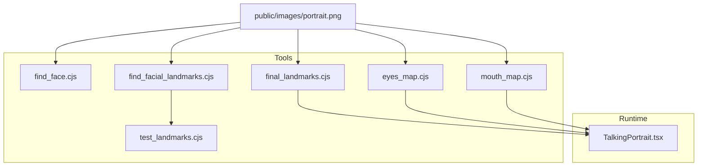
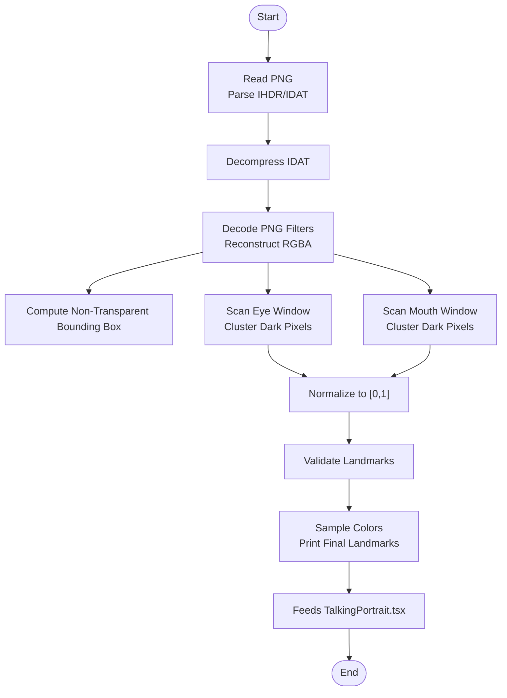
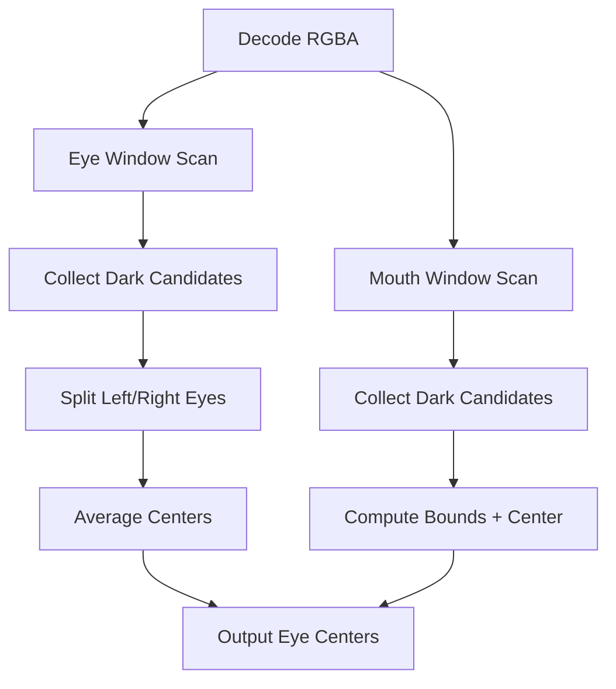
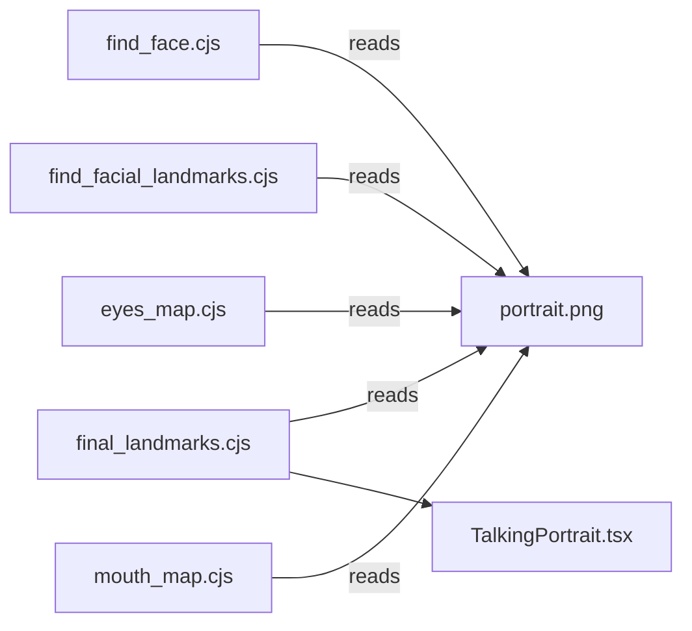
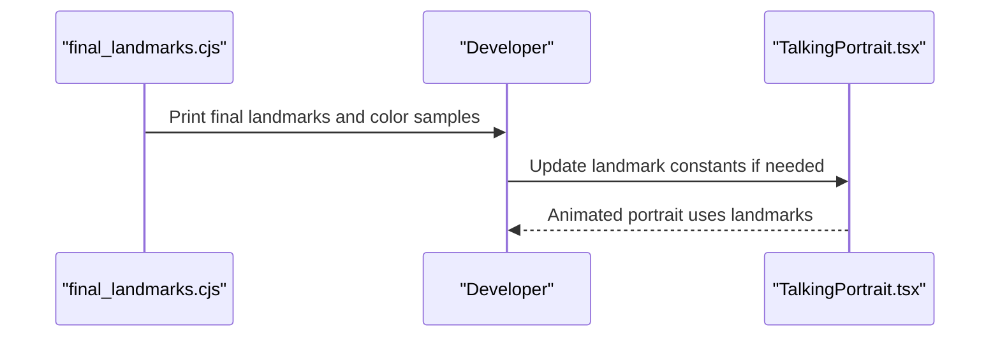

# Face Detection & Landmark Tools

<cite>
**Referenced Files in This Document**
- [find_face.cjs](file://tools/find_face.cjs)
- [find_facial_landmarks.cjs](file://tools/find_facial_landmarks.cjs)
- [test_landmarks.cjs](file://tools/test_landmarks.cjs)
- [final_landmarks.cjs](file://tools/final_landmarks.cjs)
- [eyes_map.cjs](file://tools/eyes_map.cjs)
- [mouth_map.cjs](file://tools/mouth_map.cjs)
- [TalkingPortrait.tsx](file://src/components/TalkingPortrait.tsx)
</cite>

## Table of Contents
1. [Introduction](#introduction)
2. [Project Structure](#project-structure)
3. [Core Components](#core-components)
4. [Architecture Overview](#architecture-overview)
5. [Detailed Component Analysis](#detailed-component-analysis)
6. [Dependency Analysis](#dependency-analysis)
7. [Performance Considerations](#performance-considerations)
8. [Troubleshooting Guide](#troubleshooting-guide)
9. [Conclusion](#conclusion)
10. [Appendices](#appendices)

## Introduction
This document explains the face detection and facial landmark identification tools used to prepare a portrait image for an animated talking portrait pipeline. The workflow includes:
- Detecting the face region in a PNG portrait using pixel transparency analysis.
- Identifying key facial landmarks (eyes, mouth, chin, corners) by scanning luminance within predefined regions.
- Validating normalized landmarks against a fixed 1024×1024 coordinate system.
- Compiling final landmark values and color samples that feed into the rendering engine.

The tools operate directly on the raw PNG data without external libraries, making them lightweight and deterministic for a single target portrait.

## Project Structure
The relevant scripts are located under the tools directory and integrate with the React-based talking portrait component.

**Diagram sources**
- [find_face.cjs:1-48](file://tools/find_face.cjs#L1-L48)
- [find_facial_landmarks.cjs:1-120](file://tools/find_facial_landmarks.cjs#L1-L120)
- [test_landmarks.cjs:1-16](file://tools/test_landmarks.cjs#L1-L16)
- [final_landmarks.cjs:1-112](file://tools/final_landmarks.cjs#L1-L112)
- [eyes_map.cjs:1-74](file://tools/eyes_map.cjs#L1-L74)
- [mouth_map.cjs:1-75](file://tools/mouth_map.cjs#L1-L75)
- [TalkingPortrait.tsx:35-63](file://src/components/TalkingPortrait.tsx#L35-L63)

**Section sources**
- [find_face.cjs:1-48](file://tools/find_face.cjs#L1-L48)
- [find_facial_landmarks.cjs:1-120](file://tools/find_facial_landmarks.cjs#L1-L120)
- [test_landmarks.cjs:1-16](file://tools/test_landmarks.cjs#L1-L16)
- [final_landmarks.cjs:1-112](file://tools/final_landmarks.cjs#L1-L112)
- [eyes_map.cjs:1-74](file://tools/eyes_map.cjs#L1-L74)
- [mouth_map.cjs:1-75](file://tools/mouth_map.cjs#L1-L75)
- [TalkingPortrait.tsx:35-63](file://src/components/TalkingPortrait.tsx#L35-L63)

## Core Components
- find_face.cjs: Parses PNG chunks, decompresses IDAT, scans alpha channel to compute the bounding box of non-transparent pixels, and identifies the top of the head region.
- find_facial_landmarks.cjs: Reconstructs the RGBA image from PNG filters, then detects eyes and mouth by sampling dark pixels within fixed windows and averaging candidate positions.
- test_landmarks.cjs: Defines normalized landmark coordinates for a 1024×1024 canvas and prints them for validation.
- final_landmarks.cjs: Reconstructs the image again, samples skin/oral cavity colors around known regions, and prints finalized landmark coordinates and face span.
- TalkingPortrait.tsx: Consumes landmark definitions to drive deformation, blinking, and mouth animation in the browser.

**Section sources**
- [find_face.cjs:1-48](file://tools/find_face.cjs#L1-L48)
- [find_facial_landmarks.cjs:1-120](file://tools/find_facial_landmarks.cjs#L1-L120)
- [test_landmarks.cjs:1-16](file://tools/test_landmarks.cjs#L1-L16)
- [final_landmarks.cjs:1-112](file://tools/final_landmarks.cjs#L1-L112)
- [TalkingPortrait.tsx:35-63](file://src/components/TalkingPortrait.tsx#L35-L63)

## Architecture Overview
The toolchain is a linear pipeline:
1. Input: A 1024×1024 PNG portrait with an alpha channel.
2. Image decoding: Scripts parse PNG IHDR/IDAT chunks and reconstruct RGBA pixels using PNG filter types (including Paeth).
3. Region detection:
   - Face bounding box via alpha thresholding.
   - Eye centers via dark-pixel clustering in eye windows.
   - Mouth seam and bounds via dark-pixel clustering in mouth windows.
4. Validation: Normalized landmarks are printed and cross-checked against expected ranges.
5. Finalization: Color sampling around anatomical regions and printing of final landmarks consumed by the runtime.

**Diagram sources**
- [find_face.cjs:1-48](file://tools/find_face.cjs#L1-L48)
- [find_facial_landmarks.cjs:1-120](file://tools/find_facial_landmarks.cjs#L1-L120)
- [test_landmarks.cjs:1-16](file://tools/test_landmarks.cjs#L1-L16)
- [final_landmarks.cjs:1-112](file://tools/final_landmarks.cjs#L1-L112)

## Detailed Component Analysis

### Face Region Detection (find_face.cjs)
- Reads the PNG file and iterates over chunks to collect IHDR dimensions and IDAT payloads.
- Decompresses concatenated IDAT data to obtain raw filtered scanlines.
- Scans the alpha channel to compute the minimal bounding box containing non-transparent pixels.
- Reports the topmost row as the approximate head top.

Key behaviors:
- Uses a simple alpha threshold to ignore background.
- Computes min/max x/y across all non-transparent pixels.
- Outputs width/height and bounding box for downstream use.

Complexity: O(W×H) per scanline due to full raster traversal.

**Section sources**
- [find_face.cjs:1-48](file://tools/find_face.cjs#L1-L48)

### Facial Landmark Identification (find_facial_landmarks.cjs)
- Reconstructs the RGBA image by applying PNG filter types (None, Sub, Up, Average, Paeth).
- Implements the Paeth predictor function for accurate reconstruction.
- Eye detection:
  - Scans a fixed window around expected eye locations.
  - Selects very dark pixels (luminance below a threshold) where alpha is high.
  - Clusters candidates into left/right eyes based on x-coordinate split.
  - Averages candidate positions to estimate eye centers.
- Mouth detection:
  - Scans a fixed window around expected mouth location.
  - Selects dark pixels representing the lip seam.
  - Computes average center and bounding box of mouth candidates.

Accuracy considerations:
- Relies on fixed windows calibrated for the specific portrait.
- Luminance thresholds tuned to distinguish pupils/lip seams from skin.

Complexity: O(Area_of_windows) per feature; overall O(W×H) due to full decode.

**Diagram sources**
- [find_facial_landmarks.cjs:24-59](file://tools/find_facial_landmarks.cjs#L24-L59)
- [find_facial_landmarks.cjs:62-119](file://tools/find_facial_landmarks.cjs#L62-L119)

**Section sources**
- [find_facial_landmarks.cjs:1-120](file://tools/find_facial_landmarks.cjs#L1-L120)

### Landmark Validation (test_landmarks.cjs)
- Defines normalized landmarks for a 1024×1024 canvas.
- Prints normalized coordinates for verification.

Usage:
- Compare computed landmarks against these normalized values to ensure consistency across runs or images.

**Section sources**
- [test_landmarks.cjs:1-16](file://tools/test_landmarks.cjs#L1-L16)

### Final Landmark Compilation (final_landmarks.cjs)
- Reconstructs RGBA image similarly to find_facial_landmarks.cjs.
- Samples skin color above the mouth and eyelid regions to validate color assumptions.
- Samples oral cavity color inside the mouth seam.
- Prints finalized landmark coordinates and face width span for the 1024×1024 image.

Outputs:
- Skin/oral cavity color samples for visual verification.
- Final landmark coordinates aligned with the runtime’s expectations.

**Section sources**
- [final_landmarks.cjs:1-112](file://tools/final_landmarks.cjs#L1-L112)

### Supporting Visualization Tools
- eyes_map.cjs: Renders an ASCII luminosity map of the eye region to visually confirm pupil/eyelid contrast.
- mouth_map.cjs: Renders an ASCII luminosity map of the mouth region to confirm lip seam visibility.

These help calibrate thresholds and windows when adapting to different portraits.

**Section sources**
- [eyes_map.cjs:1-74](file://tools/eyes_map.cjs#L1-L74)
- [mouth_map.cjs:1-75](file://tools/mouth_map.cjs#L1-L75)

## Dependency Analysis
- All tools depend on Node.js built-ins: fs and zlib.
- They read a fixed input path: public/images/portrait.png.
- The runtime component consumes landmark constants defined in code rather than reading outputs from scripts at runtime.

**Diagram sources**
- [find_face.cjs:1-48](file://tools/find_face.cjs#L1-L48)
- [find_facial_landmarks.cjs:1-120](file://tools/find_facial_landmarks.cjs#L1-L120)
- [final_landmarks.cjs:1-112](file://tools/final_landmarks.cjs#L1-L112)
- [eyes_map.cjs:1-74](file://tools/eyes_map.cjs#L1-L74)
- [mouth_map.cjs:1-75](file://tools/mouth_map.cjs#L1-L75)
- [TalkingPortrait.tsx:35-63](file://src/components/TalkingPortrait.tsx#L35-L63)

**Section sources**
- [find_face.cjs:1-48](file://tools/find_face.cjs#L1-L48)
- [find_facial_landmarks.cjs:1-120](file://tools/find_facial_landmarks.cjs#L1-L120)
- [final_landmarks.cjs:1-112](file://tools/final_landmarks.cjs#L1-L112)
- [eyes_map.cjs:1-74](file://tools/eyes_map.cjs#L1-L74)
- [mouth_map.cjs:1-75](file://tools/mouth_map.cjs#L1-L75)
- [TalkingPortrait.tsx:35-63](file://src/components/TalkingPortrait.tsx#L35-L63)

## Performance Considerations
- PNG decoding is O(W×H); for 1024×1024 this is manageable but repeated decodes across multiple scripts add overhead.
- Alpha thresholding and luminance scans are linear passes over the decoded buffer.
- Paeth predictor involves absolute differences and comparisons; it is constant-time per pixel.
- Memory usage is proportional to W×H×4 bytes for the reconstructed RGBA buffer.

Optimization opportunities:
- Cache decoded image buffers if running multiple analyses sequentially.
- Early-exit loops once sufficient candidates are found for clustering.
- Vectorize or parallelize per-row processing if scaling to larger images.

[No sources needed since this section provides general guidance]

## Troubleshooting Guide
Common issues and resolutions:
- Missing or incorrect portrait path: Ensure public/images/portrait.png exists and is a valid PNG with an alpha channel.
- Incorrect landmarks: Verify windows and thresholds in find_facial_landmarks.cjs match the portrait’s anatomy; use eyes_map.cjs and mouth_map.cjs to inspect luminance patterns.
- Misaligned runtime behavior: Confirm that TalkingPortrait.tsx landmark constants align with final_landmarks.cjs outputs.
- Orientation mismatches: If the portrait is rotated or mirrored, adjust the fixed windows and thresholds accordingly.

Validation steps:
- Run test_landmarks.cjs to print normalized landmarks and compare with expected ranges.
- Use eyes_map.cjs and mouth_map.cjs to visually verify contrast in critical regions.
- Cross-check final_landmarks.cjs output with TalkingPortrait.tsx constants.

**Section sources**
- [find_facial_landmarks.cjs:62-119](file://tools/find_facial_landmarks.cjs#L62-L119)
- [eyes_map.cjs:62-74](file://tools/eyes_map.cjs#L62-L74)
- [mouth_map.cjs:62-75](file://tools/mouth_map.cjs#L62-L75)
- [test_landmarks.cjs:1-16](file://tools/test_landmarks.cjs#L1-L16)
- [final_landmarks.cjs:101-112](file://tools/final_landmarks.cjs#L101-L112)
- [TalkingPortrait.tsx:35-63](file://src/components/TalkingPortrait.tsx#L35-L63)

## Conclusion
The face detection and landmark tools provide a deterministic, library-free pipeline tailored to a single 1024×1024 portrait. By decoding PNG data, scanning targeted regions, and validating normalized landmarks, the tools produce consistent inputs for the TalkingPortrait renderer. For new portraits, calibrate the fixed windows and thresholds using the ASCII maps and recompile final landmarks to maintain alignment with the runtime.

[No sources needed since this section summarizes without analyzing specific files]

## Appendices

### Coordinate System
- Origin: Top-left corner of the 1024×1024 image.
- X increases rightward; Y increases downward.
- Landmarks are provided both in absolute pixels and normalized to [0,1] for portability.

Normalization example:
- Absolute (x, y) → Normalized (x/1024, y/1024).

**Section sources**
- [test_landmarks.cjs:1-16](file://tools/test_landmarks.cjs#L1-L16)

### Integration with Portrait Rendering Pipeline
- TalkingPortrait.tsx defines eye and mouth geometry constants that drive deformation and animation.
- These constants should be synchronized with final_landmarks.cjs outputs to ensure accurate mapping between detected features and rendered motion.

**Diagram sources**
- [final_landmarks.cjs:101-112](file://tools/final_landmarks.cjs#L101-L112)
- [TalkingPortrait.tsx:35-63](file://src/components/TalkingPortrait.tsx#L35-L63)

**Section sources**
- [final_landmarks.cjs:101-112](file://tools/final_landmarks.cjs#L101-L112)
- [TalkingPortrait.tsx:35-63](file://src/components/TalkingPortrait.tsx#L35-L63)

### Customizing Detection Parameters
- Adjust eye and mouth windows in find_facial_landmarks.cjs to match different portrait scales or poses.
- Tune luminance thresholds to accommodate varying lighting or makeup.
- Use eyes_map.cjs and mouth_map.cjs to visualize contrast and refine thresholds.

Example customization points:
- Eye window: Y range and X range around expected pupil centers.
- Mouth window: Y range covering upper lip, seam, and lower lip.
- Alpha threshold: Controls which pixels are considered part of the subject.

**Section sources**
- [find_facial_landmarks.cjs:62-119](file://tools/find_facial_landmarks.cjs#L62-L119)
- [eyes_map.cjs:62-74](file://tools/eyes_map.cjs#L62-L74)
- [mouth_map.cjs:62-75](file://tools/mouth_map.cjs#L62-L75)

### Handling Different Portrait Orientations
- If the portrait is rotated or flipped, update the fixed windows and thresholds accordingly.
- Recompute normalized landmarks and synchronize with TalkingPortrait.tsx constants.
- Validate using test_landmarks.cjs and visual maps before integrating into the runtime.

**Section sources**
- [test_landmarks.cjs:1-16](file://tools/test_landmarks.cjs#L1-L16)
- [final_landmarks.cjs:101-112](file://tools/final_landmarks.cjs#L101-L112)
- [TalkingPortrait.tsx:35-63](file://src/components/TalkingPortrait.tsx#L35-L63)