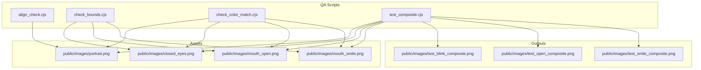
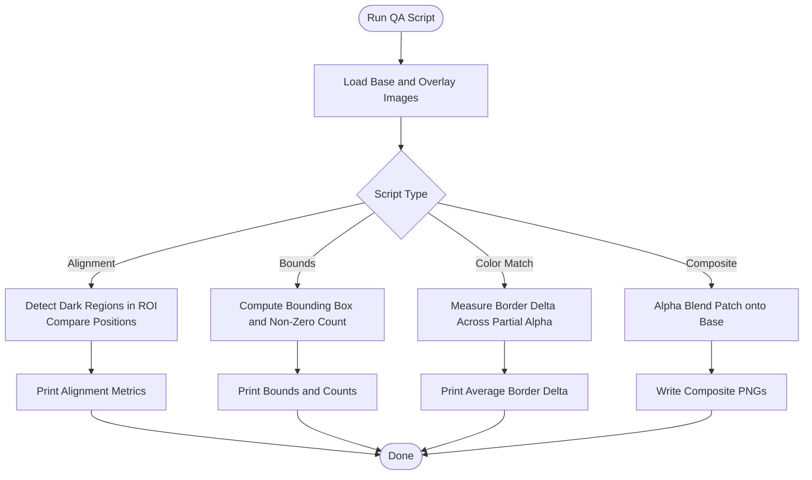
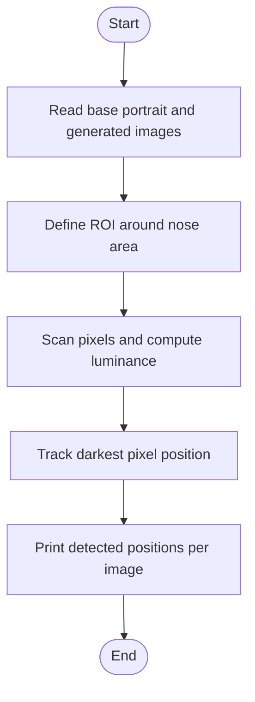
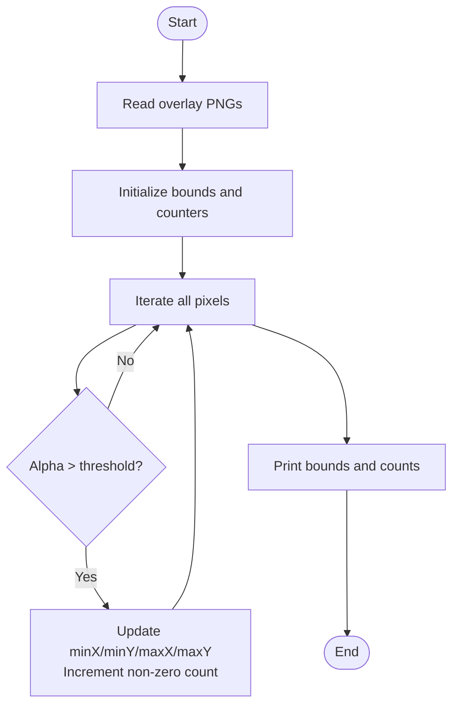
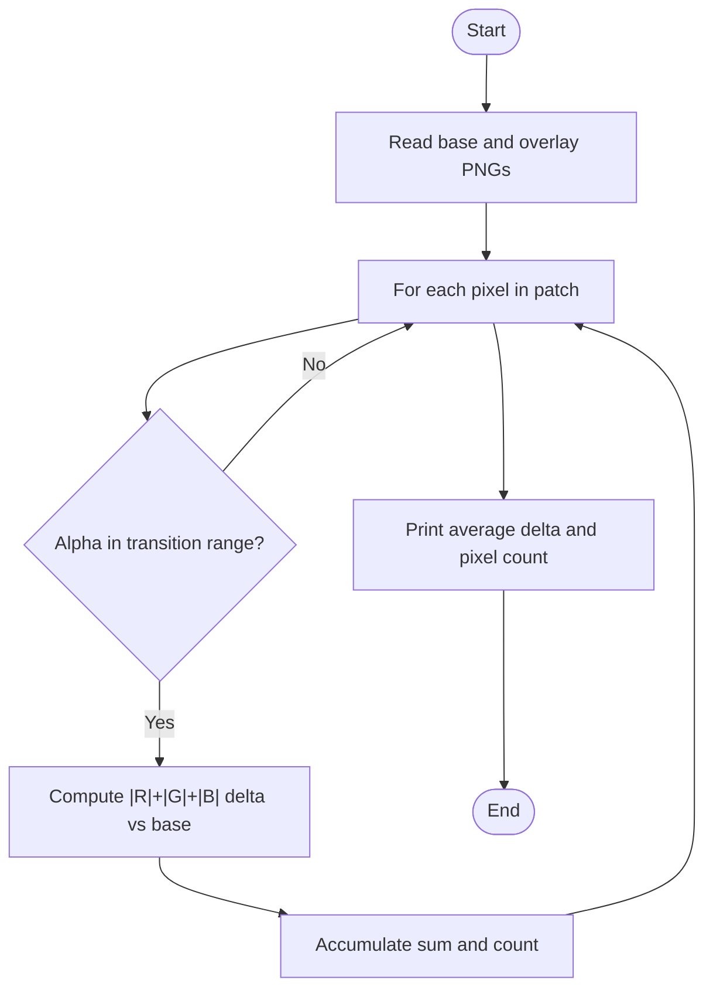
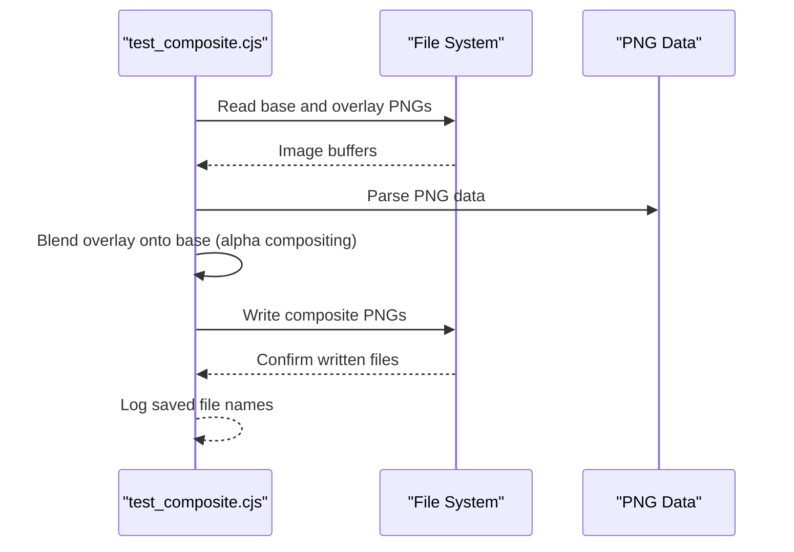
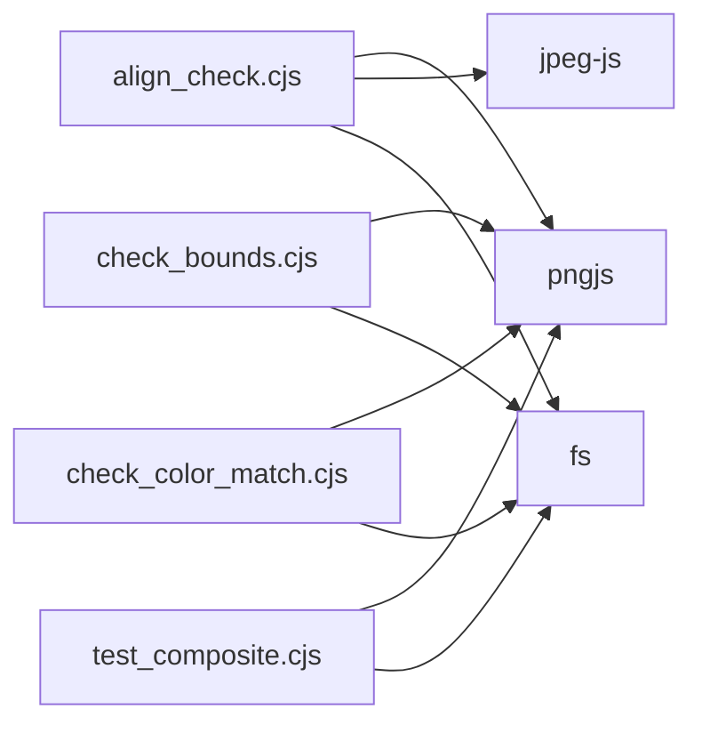

# Quality Assurance Scripts

<cite>
**Referenced Files in This Document**
- [align_check.cjs](file://tools/asset-scripts/align_check.cjs)
- [check_bounds.cjs](file://tools/asset-scripts/check_bounds.cjs)
- [check_color_match.cjs](file://tools/asset-scripts/check_color_match.cjs)
- [test_composite.cjs](file://tools/asset-scripts/test_composite.cjs)
</cite>

## Table of Contents
1. [Introduction](#introduction)
2. [Project Structure](#project-structure)
3. [Core Components](#core-components)
4. [Architecture Overview](#architecture-overview)
5. [Detailed Component Analysis](#detailed-component-analysis)
6. [Dependency Analysis](#dependency-analysis)
7. [Performance Considerations](#performance-considerations)
8. [Troubleshooting Guide](#troubleshooting-guide)
9. [Conclusion](#conclusion)

## Introduction
This document describes the quality assurance scripts that validate asset integrity and visual consistency for facial feature overlays. The scripts verify:
- Facial feature alignment across generated images
- Boundary validity of overlay assets
- Color consistency at patch borders
- Image composition and overlay blending behavior

These tools are designed to be run locally against the project’s image assets under public/images, ensuring consistent results when updating or generating new assets.

## Project Structure
The QA scripts reside under tools/asset-scripts and operate on PNG/JPEG assets located under public/images. Each script is self-contained and uses Node.js with common image libraries (pngjs, jpeg-js).

**Diagram sources**
- [align_check.cjs:1-48](file://tools/asset-scripts/align_check.cjs#L1-L48)
- [check_bounds.cjs:1-58](file://tools/asset-scripts/check_bounds.cjs#L1-L58)
- [check_color_match.cjs:1-32](file://tools/asset-scripts/check_color_match.cjs#L1-L32)
- [test_composite.cjs:1-39](file://tools/asset-scripts/test_composite.cjs#L1-L39)

**Section sources**
- [align_check.cjs:1-48](file://tools/asset-scripts/align_check.cjs#L1-L48)
- [check_bounds.cjs:1-58](file://tools/asset-scripts/check_bounds.cjs#L1-L58)
- [check_color_match.cjs:1-32](file://tools/asset-scripts/check_color_match.cjs#L1-L32)
- [test_composite.cjs:1-39](file://tools/asset-scripts/test_composite.cjs#L1-L39)

## Core Components
- align_check.cjs: Validates facial feature alignment by detecting dark regions (nostrils) within a fixed region of interest and comparing positions across base and generated images.
- check_bounds.cjs: Computes bounding boxes and non-zero pixel counts for overlay patches based on alpha thresholds.
- check_color_match.cjs: Measures average color delta between overlay patches and the base portrait along transition borders where partial alpha exists.
- test_composite.cjs: Blends overlay patches onto the base portrait using alpha compositing and writes composite outputs for visual inspection.

**Section sources**
- [align_check.cjs:1-48](file://tools/asset-scripts/align_check.cjs#L1-L48)
- [check_bounds.cjs:1-58](file://tools/asset-scripts/check_bounds.cjs#L1-L58)
- [check_color_match.cjs:1-32](file://tools/asset-scripts/check_color_match.cjs#L1-L32)
- [test_composite.cjs:1-39](file://tools/asset-scripts/test_composite.cjs#L1-L39)

## Architecture Overview
Each script follows a simple pipeline:
1. Load required image assets from public/images.
2. Perform analysis or transformation (alignment detection, bounds calculation, color delta measurement, or compositing).
3. Output console logs and/or write result images to public/images.

[No sources needed since this diagram shows conceptual workflow, not actual code structure]

## Detailed Component Analysis

### align_check.cjs: Facial Feature Alignment Validation
Purpose:
- Ensures that key facial features remain aligned across different generated images by locating dark regions (e.g., nostrils) within a predefined region of interest (ROI).

Key behaviors:
- Loads the base portrait and several generated images.
- Scans a fixed ROI to find the darkest pixel position using luminance.
- Prints detected positions for comparison across images.

Validation criteria:
- Consistent dark-region coordinates across images indicate proper alignment.
- Significant shifts suggest misalignment or incorrect generation.

Operational notes:
- Uses a hard-coded ROI; ensure generated images match expected dimensions and layout.
- Luminance thresholding is implicit via minimum brightness search.

**Diagram sources**
- [align_check.cjs:5-47](file://tools/asset-scripts/align_check.cjs#L5-L47)

**Section sources**
- [align_check.cjs:1-48](file://tools/asset-scripts/align_check.cjs#L1-L48)

### check_bounds.cjs: Boundary Validation for Overlay Assets
Purpose:
- Validates that overlay patches have expected boundaries and non-zero pixel coverage.

Key behaviors:
- Reads overlay PNGs (eyes, mouth open, mouth smile).
- Iterates over pixels and tracks non-zero alpha pixels above a threshold.
- Computes min/max X/Y bounds and total non-zero pixel count.

Validation criteria:
- Expected ranges for minX, maxX, minY, maxY should match design specs.
- Non-zero pixel counts should be within acceptable limits to avoid overly sparse or oversized patches.

**Diagram sources**
- [check_bounds.cjs:4-57](file://tools/asset-scripts/check_bounds.cjs#L4-L57)

**Section sources**
- [check_bounds.cjs:1-58](file://tools/asset-scripts/check_bounds.cjs#L1-L58)

### check_color_match.cjs: Color Consistency Testing
Purpose:
- Ensures smooth color transitions at patch borders by measuring average color deltas between overlay patches and the base portrait in areas with partial alpha.

Key behaviors:
- Loads base portrait and overlay patches.
- For each pixel in the patch, checks if alpha falls within a transition band.
- Computes average absolute delta across RGB channels for those pixels.

Validation criteria:
- Low average border delta indicates good color blending and minimal visible seams.
- High deltas may indicate mismatched colors or improper edge handling.

**Diagram sources**
- [check_color_match.cjs:4-31](file://tools/asset-scripts/check_color_match.cjs#L4-L31)

**Section sources**
- [check_color_match.cjs:1-32](file://tools/asset-scripts/check_color_match.cjs#L1-L32)

### test_composite.cjs: Image Composition and Overlay Effects
Purpose:
- Validates the visual result of blending overlay patches onto the base portrait using alpha compositing.

Key behaviors:
- Loads base portrait and overlay patches.
- Applies alpha blending per pixel, writing out composite images for each overlay.
- Saves output files for manual review.

Validation criteria:
- Visual inspection of saved composites to confirm correct overlay placement and blending.
- No unexpected artifacts such as halos, color shifts, or clipping.

**Diagram sources**
- [test_composite.cjs:4-38](file://tools/asset-scripts/test_composite.cjs#L4-L38)

**Section sources**
- [test_composite.cjs:1-39](file://tools/asset-scripts/test_composite.cjs#L1-L39)

## Dependency Analysis
All scripts depend on:
- Node.js runtime
- pngjs for PNG reading/writing
- jpeg-js for JPEG decoding (in align_check.cjs)
- fs for file I/O

**Diagram sources**
- [align_check.cjs:1-3](file://tools/asset-scripts/align_check.cjs#L1-L3)
- [check_bounds.cjs:1-2](file://tools/asset-scripts/check_bounds.cjs#L1-L2)
- [check_color_match.cjs:1-2](file://tools/asset-scripts/check_color_match.cjs#L1-L2)
- [test_composite.cjs:1-2](file://tools/asset-scripts/test_composite.cjs#L1-L2)

**Section sources**
- [align_check.cjs:1-48](file://tools/asset-scripts/align_check.cjs#L1-L48)
- [check_bounds.cjs:1-58](file://tools/asset-scripts/check_bounds.cjs#L1-L58)
- [check_color_match.cjs:1-32](file://tools/asset-scripts/check_color_match.cjs#L1-L32)
- [test_composite.cjs:1-39](file://tools/asset-scripts/test_composite.cjs#L1-L39)

## Performance Considerations
- All scripts perform full-image scans; expect O(W×H) complexity per image processed.
- Large images can increase runtime; consider downsampling during development.
- Avoid unnecessary repeated reads by caching loaded images within a single run if extending scripts.
- Batch processing multiple assets can be added to reduce overhead.

[No sources needed since this section provides general guidance]

## Troubleshooting Guide
Common issues and resolutions:
- Missing input files: Ensure public/images contains the expected assets referenced by each script.
- Dimension mismatches: Generated images must match the base portrait dimensions used by alignment logic.
- Incorrect ROI: If alignment fails, verify the ROI coordinates correspond to the actual face layout in your assets.
- High color delta: Investigate overlay patch creation pipelines for color space or alpha handling differences.
- Unexpected composites: Check alpha values and blending weights; ensure overlays are correctly positioned relative to the base.

Debugging steps:
- Run each script individually and inspect console output.
- Compare printed metrics (bounds, deltas, detected positions) against expected baselines.
- Visually inspect generated composites to identify artifacts.
- Validate asset formats and alpha channels using an image inspector.

**Section sources**
- [align_check.cjs:5-47](file://tools/asset-scripts/align_check.cjs#L5-L47)
- [check_bounds.cjs:4-57](file://tools/asset-scripts/check_bounds.cjs#L4-L57)
- [check_color_match.cjs:4-31](file://tools/asset-scripts/check_color_match.cjs#L4-L31)
- [test_composite.cjs:4-38](file://tools/asset-scripts/test_composite.cjs#L4-L38)

## Conclusion
These QA scripts provide a focused validation suite for facial feature alignment, boundary correctness, color consistency, and compositional fidelity. By running them regularly during asset updates, teams can maintain high visual quality and quickly detect regressions. Adopt the provided validation criteria and troubleshooting steps to keep asset pipelines robust and reliable.

[No sources needed since this section summarizes without analyzing specific files]