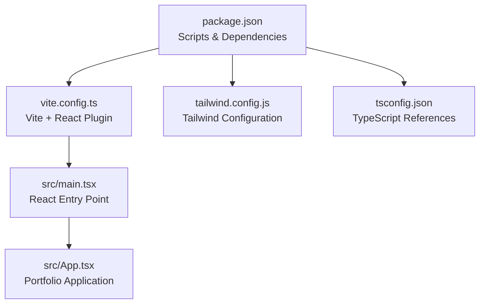
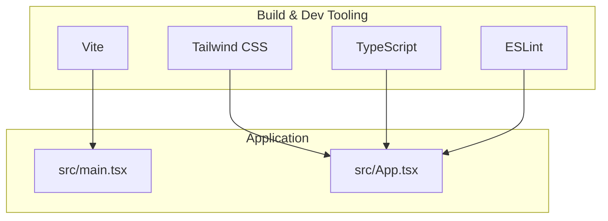
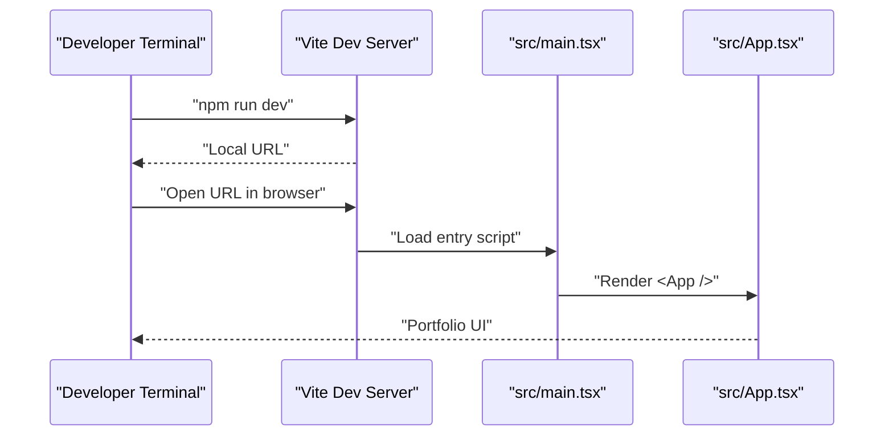
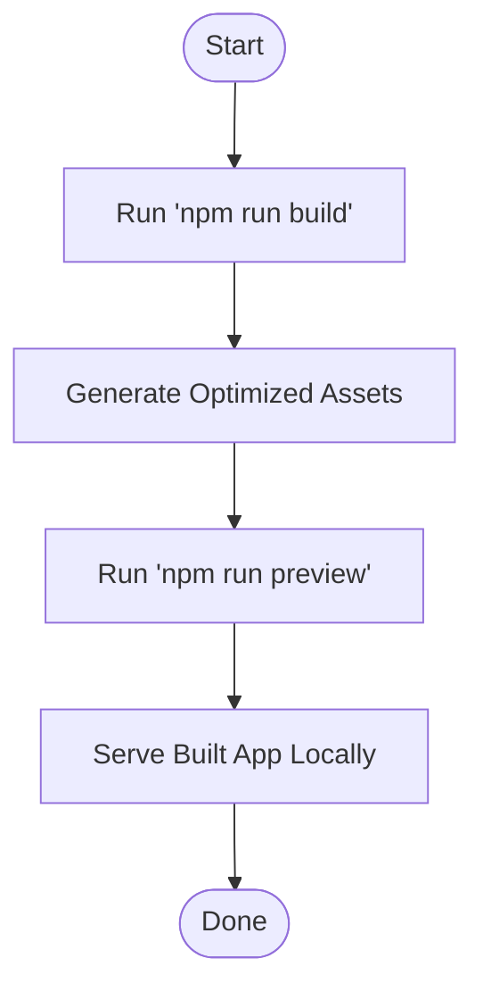
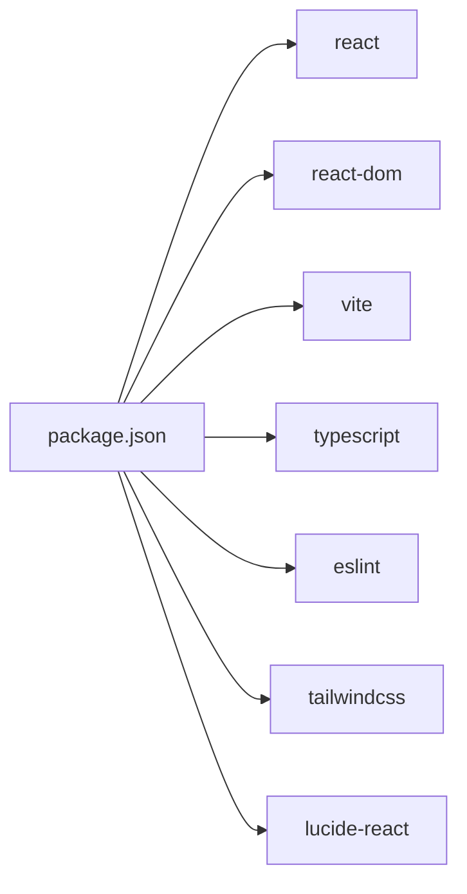

# Getting Started

<cite>
**Referenced Files in This Document**
- [package.json](file://package.json)
- [vite.config.ts](file://vite.config.ts)
- [tsconfig.json](file://tsconfig.json)
- [tailwind.config.js](file://tailwind.config.js)
- [src/main.tsx](file://src/main.tsx)
- [src/App.tsx](file://src/App.tsx)
</cite>

## Table of Contents
1. [Introduction](#introduction)
2. [Project Structure](#project-structure)
3. [Core Components](#core-components)
4. [Architecture Overview](#architecture-overview)
5. [Detailed Component Analysis](#detailed-component-analysis)
6. [Dependency Analysis](#dependency-analysis)
7. [Performance Considerations](#performance-considerations)
8. [Troubleshooting Guide](#troubleshooting-guide)
9. [Conclusion](#conclusion)

## Introduction
This guide helps you set up, run, and customize the Levi Portfolio project. It explains how to install dependencies, start the development server, build a production version, preview the built app, and understand the main configuration files. The project is a React application built with Vite, styled with Tailwind CSS, and written in TypeScript.

## Project Structure
At a high level:
- `package.json` defines scripts, runtime dependencies, and development tooling.
- `vite.config.ts` configures Vite, including the React plugin and an alias for the source directory.
- `tsconfig.json` references separate TypeScript configurations for the app and Node tooling.
- `tailwind.config.js` configures Tailwind CSS scanning and theme extensions.
- `src/main.tsx` mounts the React application into the DOM.
- `src/App.tsx` contains the main portfolio UI and navigation logic.

**Diagram sources**
- [package.json:6-11](file://package.json#L6-L11)
- [vite.config.ts:1-16](file://vite.config.ts#L1-L16)
- [tailwind.config.js:1-8](file://tailwind.config.js#L1-L8)
- [tsconfig.json:1-7](file://tsconfig.json#L1-L7)
- [src/main.tsx:1-10](file://src/main.tsx#L1-L10)
- [src/App.tsx:1-21](file://src/App.tsx#L1-L21)

**Section sources**
- [package.json:1-36](file://package.json#L1-L36)
- [vite.config.ts:1-16](file://vite.config.ts#L1-L16)
- [tsconfig.json:1-7](file://tsconfig.json#L1-L7)
- [tailwind.config.js:1-8](file://tailwind.config.js#L1-L8)
- [src/main.tsx:1-10](file://src/main.tsx#L1-L10)
- [src/App.tsx:1-21](file://src/App.tsx#L1-L21)

## Core Components
- Development scripts are defined in `package.json`. They provide commands for development, building, linting, previewing, and type checking.
- The React entry point is `src/main.tsx`, which renders the root component inside a React StrictMode wrapper.
- The main application UI lives in `src/App.tsx`, which includes sections like About, Skills, Experience, Leadership, Projects, Certifications, Future, and Contact.

Key responsibilities:
- `package.json`: Declares scripts (`dev`, `build`, `preview`, `lint`, `typecheck`) and dependencies (React, ReactDOM, Vite, Tailwind, ESLint, TypeScript).
- `src/main.tsx`: Creates the React root and mounts `<App />`.
- `src/App.tsx`: Implements the portfolio layout, navigation state, scroll behavior, and section content.

**Section sources**
- [package.json:6-11](file://package.json#L6-L11)
- [package.json:13-35](file://package.json#L13-L35)
- [src/main.tsx:1-10](file://src/main.tsx#L1-L10)
- [src/App.tsx:42-92](file://src/App.tsx#L42-L92)

## Architecture Overview
The application follows a simple, modern frontend architecture:
- Vite serves the app during development and builds optimized assets for production.
- React renders the UI tree starting from `App`.
- Tailwind CSS provides utility-first styling based on scanned content paths.
- TypeScript ensures type safety across the codebase.

**Diagram sources**
- [package.json:18-35](file://package.json#L18-L35)
- [vite.config.ts:1-16](file://vite.config.ts#L1-L16)
- [tailwind.config.js:1-8](file://tailwind.config.js#L1-L8)
- [src/main.tsx:1-10](file://src/main.tsx#L1-L10)
- [src/App.tsx:1-21](file://src/App.tsx#L1-L21)

## Detailed Component Analysis

### Installation and Setup
1. Install Node.js
   - Use a recent LTS version compatible with Vite 5.x and the project’s toolchain.
   - Verify installation by running your Node.js and npm versions in the terminal.

2. Install dependencies
   - Run `npm install` in the project root to install all dependencies declared in `package.json`.

3. Start the development server
   - Run `npm run dev`.
   - Open the local development URL shown in the terminal.

4. Build the production version
   - Run `npm run build`.
   - This creates optimized static assets ready for deployment.

5. Preview the built application
   - Run `npm run preview` to serve the built output locally.

6. Optional: Lint and type-check
   - Run `npm run lint` to check code quality.
   - Run `npm run typecheck` to validate TypeScript without emitting files.

**Section sources**
- [package.json:6-11](file://package.json#L6-L11)

### Running the Development Server
When you run `npm run dev`, Vite starts a development server with hot module replacement. The React entry point is `src/main.tsx`, which renders the root component.

**Diagram sources**
- [package.json:7](file://package.json#L7)
- [src/main.tsx:1-10](file://src/main.tsx#L1-L10)
- [src/App.tsx:42-92](file://src/App.tsx#L42-L92)

**Section sources**
- [package.json:7](file://package.json#L7)
- [src/main.tsx:1-10](file://src/main.tsx#L1-L10)
- [src/App.tsx:42-92](file://src/App.tsx#L42-L92)

### Building and Previewing
- Build: `npm run build` compiles TypeScript, processes assets, and outputs optimized files.
- Preview: `npm run preview` serves the built output locally so you can test the production bundle before deployment.

**Diagram sources**
- [package.json:8](file://package.json#L8)
- [package.json:10](file://package.json#L10)

**Section sources**
- [package.json:8](file://package.json#L8)
- [package.json:10](file://package.json#L10)

### Project Configuration Files

#### vite.config.ts
- Enables the React plugin for JSX/TSX support.
- Defines an alias `@` pointing to the `src` directory for cleaner imports.
- Excludes `lucide-react` from dependency optimization to avoid bundling issues.

Customization tips:
- Add plugins or middleware under the `plugins` array.
- Adjust aliases under `resolve.alias` if you reorganize folders.
- Tune `optimizeDeps.exclude` if other libraries need special handling.

**Section sources**
- [vite.config.ts:1-16](file://vite.config.ts#L1-L16)

#### tsconfig.json
- Uses TypeScript project references to separate app and Node tooling configurations.
- Keeps the root file minimal while delegating settings to referenced configs.

Customization tips:
- Extend compiler options in the referenced TypeScript config files.
- Add new project references if you split tooling further.

**Section sources**
- [tsconfig.json:1-7](file://tsconfig.json#L1-L7)

#### tailwind.config.js
- Scans HTML and source files for Tailwind classes.
- Provides a place to extend the theme and add plugins.

Customization tips:
- Add custom colors, fonts, or spacing under `theme.extend`.
- Include additional content paths if you move files outside the default scan locations.
- Add Tailwind plugins under `plugins` for extra utilities.

**Section sources**
- [tailwind.config.js:1-8](file://tailwind.config.js#L1-L8)

### Basic Customization Options
- Change the site title and meta information in the HTML entry file (not analyzed here).
- Update colors, typography, and spacing in `tailwind.config.js`.
- Modify global styles in the CSS entry file imported by `src/main.tsx`.
- Adjust navigation chapters and content in `src/App.tsx`.

**Section sources**
- [tailwind.config.js:1-8](file://tailwind.config.js#L1-L8)
- [src/main.tsx:4](file://src/main.tsx#L4)
- [src/App.tsx:12-21](file://src/App.tsx#L12-L21)

## Dependency Analysis
The project uses:
- React and ReactDOM for UI rendering.
- Vite for fast development and optimized builds.
- Tailwind CSS for utility-first styling.
- TypeScript for type safety.
- ESLint for code quality checks.

**Diagram sources**
- [package.json:13-35](file://package.json#L13-L35)

**Section sources**
- [package.json:13-35](file://package.json#L13-L35)

## Performance Considerations
- Keep images and media assets optimized; large files can slow down initial load.
- Avoid unnecessary re-renders in React components by using memoization where appropriate.
- Leverage Vite’s dependency pre-bundling and code splitting features.
- Monitor bundle size after adding new dependencies.

[No sources needed since this section provides general guidance]

## Troubleshooting Guide

Common setup issues and resolutions:
- Node.js version mismatch
  - Symptom: Errors when installing dependencies or running scripts.
  - Resolution: Install a supported Node.js LTS version and ensure npm is updated.

- Missing dependencies
  - Symptom: Module not found errors during development or build.
  - Resolution: Delete any lock files if necessary, then run `npm install` again.

- Port already in use
  - Symptom: Development server fails to start due to port conflicts.
  - Resolution: Stop other processes using the same port or configure Vite to use a different port.

- Tailwind classes not applied
  - Symptom: Styles do not appear even though classes are present.
  - Resolution: Ensure Tailwind scans the correct content paths in `tailwind.config.js`.

- TypeScript errors
  - Symptom: Type errors prevent build or development server startup.
  - Resolution: Run `npm run typecheck` to identify and fix type issues.

- Browser compatibility
  - Symptom: Features work in modern browsers but fail in older ones.
  - Resolution: Configure transpilation targets according to your audience and consider polyfills for legacy environments.

**Section sources**
- [tailwind.config.js:3](file://tailwind.config.js#L3)
- [package.json:11](file://package.json#L11)

## Conclusion
You now have the essentials to install, run, build, and customize the Levi Portfolio project. Use the provided scripts for development workflows, adjust configuration files to match your needs, and refer to the troubleshooting section if you encounter common issues. For deeper customization, explore the React components in `src/App.tsx` and the Tailwind configuration for styling changes.