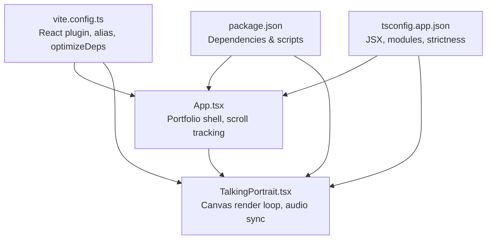
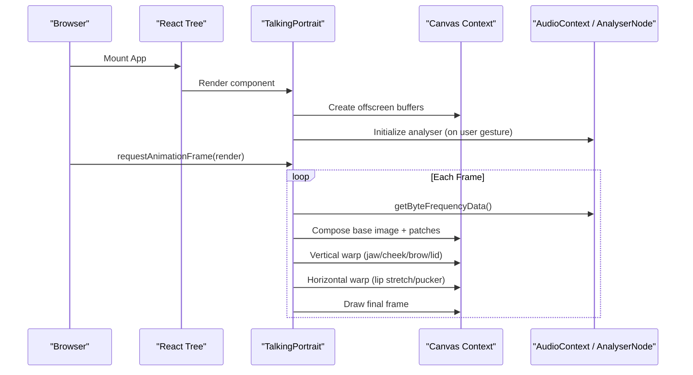
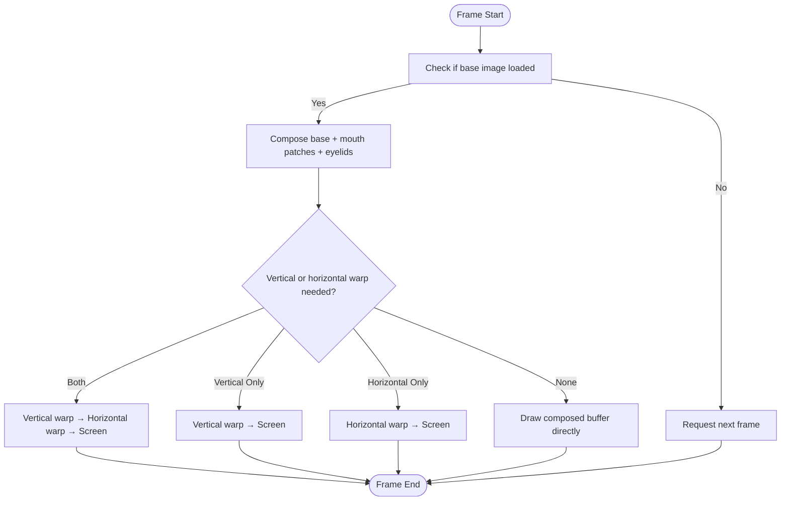
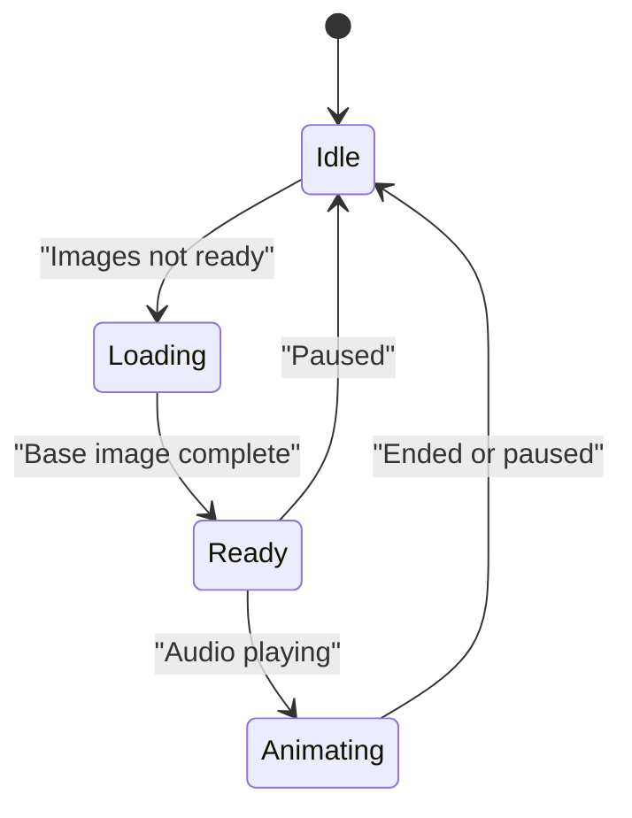
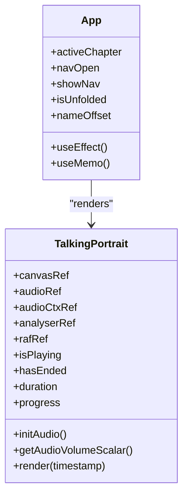
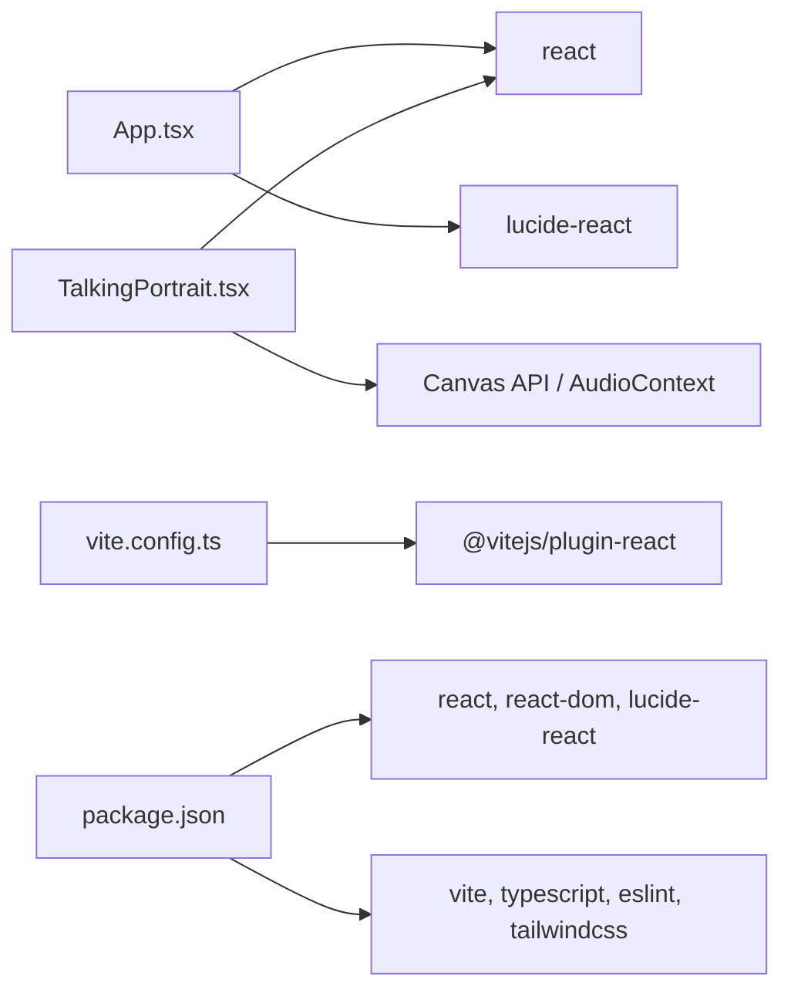

# Performance Optimization

<cite>
**Referenced Files in This Document**
- [App.tsx](file://src/App.tsx)
- [TalkingPortrait.tsx](file://src/components/TalkingPortrait.tsx)
- [vite.config.ts](file://vite.config.ts)
- [package.json](file://package.json)
- [tsconfig.app.json](file://tsconfig.app.json)
</cite>

## Table of Contents
1. [Introduction](#introduction)
2. [Project Structure](#project-structure)
3. [Core Components](#core-components)
4. [Architecture Overview](#architecture-overview)
5. [Detailed Component Analysis](#detailed-component-analysis)
6. [Dependency Analysis](#dependency-analysis)
7. [Performance Considerations](#performance-considerations)
8. [Troubleshooting Guide](#troubleshooting-guide)
9. [Conclusion](#conclusion)

## Introduction
This document explains the performance optimization strategies used by the portfolio application, with a focus on:
- Canvas rendering optimizations for the photorealistic talking portrait
- Animation and frame-rate tuning using `requestAnimationFrame`
- Resource loading and memory management for images and audio
- React-level optimizations such as memoization and controlled re-renders
- Build-time configuration that affects bundle size and dependency optimization
- Monitoring and profiling techniques to identify bottlenecks
- Guidelines for maintaining performance when adding features or modifying existing code

The implementation centers around two main areas:
- A React-based portfolio layout with scroll tracking, section visibility, and lightweight UI animations
- A high-performance canvas renderer that composes photographic assets, applies physical facial deformations, animates natural blinks, and syncs mouth movement with an MP3 timeline

## Project Structure
The project is a Vite + React + TypeScript application. The runtime surface area relevant to performance is small:
- `src/App.tsx`: Portfolio shell, navigation, scroll tracking, and section reveal logic
- `src/components/TalkingPortrait.tsx`: Photorealistic talking portrait with offscreen canvas buffering, audio-reactive animation, and efficient warping
- `vite.config.ts`: Vite plugin setup, path aliasing, and dependency optimization settings
- `package.json`: Dependencies, scripts, and build tool versions
- `tsconfig.app.json`: TypeScript compiler options including JSX mode and module resolution

**Diagram sources**
- [App.tsx:1-20](file://src/App.tsx#L1-L20)
- [TalkingPortrait.tsx:1-35](file://src/components/TalkingPortrait.tsx#L1-L35)
- [vite.config.ts:1-17](file://vite.config.ts#L1-L17)
- [package.json:1-37](file://package.json#L1-L37)
- [tsconfig.app.json:1-30](file://tsconfig.app.json#L1-L30)

**Section sources**
- [App.tsx:1-100](file://src/App.tsx#L1-L100)
- [TalkingPortrait.tsx:1-120](file://src/components/TalkingPortrait.tsx#L1-L120)
- [vite.config.ts:1-17](file://vite.config.ts#L1-L17)
- [package.json:1-37](file://package.json#L1-L37)
- [tsconfig.app.json:1-30](file://tsconfig.app.json#L1-L30)

## Core Components
The performance-critical components are:
- TalkingPortrait: Offscreen canvas composition, vertical/horizontal warping, blink state machine, audio-reactive mouth animation, and `requestAnimationFrame` loop
- App: Scroll-driven section tracking, intersection observers, minimal state updates, and lightweight CSS-driven reveals

Key performance characteristics:
- Canvas rendering uses multiple offscreen buffers to avoid redundant drawing and to separate composition from deformation
- Animation is driven by `requestAnimationFrame`, with delta-time accumulation and capped dt to prevent large jumps
- Audio analysis is limited to a narrow frequency band and smoothed analyser settings
- React state changes are minimized; heavy work is isolated in refs and effect lifecycles
- Vite excludes a large icon library from pre-bundling optimization to reduce transform overhead

**Section sources**
- [TalkingPortrait.tsx:318-608](file://src/components/TalkingPortrait.tsx#L318-L608)
- [App.tsx:42-100](file://src/App.tsx#L42-L100)
- [vite.config.ts:6-16](file://vite.config.ts#L6-L16)

## Architecture Overview
At runtime, the application renders a React UI while the talking portrait component owns its own rendering pipeline:

**Diagram sources**
- [TalkingPortrait.tsx:340-368](file://src/components/TalkingPortrait.tsx#L340-L368)
- [TalkingPortrait.tsx:370-608](file://src/components/TalkingPortrait.tsx#L370-L608)

## Detailed Component Analysis

### Canvas Rendering Optimizations
The talking portrait implements a multi-stage rendering pipeline designed to minimize expensive operations per frame:

- Offscreen buffering
  - Two offscreen canvases are created: one for composition and one for horizontal warping
  - Composition draws the base photo, mouth patches, and traveling eyelids into the composition buffer
  - Deformation steps draw from the composition buffer into either the screen context or the horizontal warp buffer
  - This separation avoids recomposing static content every time only the lip shape changes

- Efficient pixel manipulation
  - Vertical warp operates in bands and skips rows where displacement is negligible
  - Horizontal warp operates in narrow columns and uses a falloff function to keep seams sub-pixel
  - Blink drawing clips to eye geometry and redraws only the required region
  - Micro-motion and head cadence are kept sub-pixel so they do not cause visible jitter

- Memory management
  - Image objects are created once inside the effect and reused across frames
  - Offscreen canvases and their contexts are created once and reused
  - Animation state lives in local variables and refs, avoiding React re-renders during the render loop
  - The render loop cancels itself on cleanup via `cancelAnimationFrame`

**Diagram sources**
- [TalkingPortrait.tsx:393-402](file://src/components/TalkingPortrait.tsx#L393-L402)
- [TalkingPortrait.tsx:549-601](file://src/components/TalkingPortrait.tsx#L549-L601)

**Section sources**
- [TalkingPortrait.tsx:370-608](file://src/components/TalkingPortrait.tsx#L370-L608)

### Animation Performance Tuning
The animation system prioritizes smooth frame pacing and realistic motion without overdraw:

- `requestAnimationFrame` usage
  - The render loop is scheduled with `requestAnimationFrame`
  - Delta time is computed from timestamps and clamped to avoid large jumps
  - Cleanup cancels the animation frame on unmount

- Frame rate optimization
  - Expensive warps are conditionally applied only when displacement exceeds thresholds
  - When no meaningful deformation exists, the already-composed buffer is drawn directly
  - Blink timing uses randomized intervals and eased curves to feel natural without requiring extra computation

- Resource loading strategies
  - Images are loaded lazily inside the effect
  - The render loop waits until the base image is complete before composing
  - Audio metadata sets duration, and progress updates drive transcript highlighting rather than heavy computations

**Diagram sources**
- [TalkingPortrait.tsx:549-553](file://src/components/TalkingPortrait.tsx#L549-L553)
- [TalkingPortrait.tsx:603-608](file://src/components/TalkingPortrait.tsx#L603-L608)
- [TalkingPortrait.tsx:728-742](file://src/components/TalkingPortrait.tsx#L728-L742)

**Section sources**
- [TalkingPortrait.tsx:434-447](file://src/components/TalkingPortrait.tsx#L434-L447)
- [TalkingPortrait.tsx:586-601](file://src/components/TalkingPortrait.tsx#L586-L601)
- [TalkingPortrait.tsx:728-742](file://src/components/TalkingPortrait.tsx#L728-L742)

### Asset Optimization Approaches
The current asset strategy emphasizes correctness and realism over aggressive compression at runtime:

- Image handling
  - Base portrait and mouth/eyelid patches are loaded as standard images
  - No explicit lazy loading beyond waiting for the base image before composition
  - No CDN configuration is present in the repository

- Audio handling
  - The introduction audio is loaded through an HTML audio element
  - `preload="auto"` is used
  - Duration is set from metadata, and progress updates are bound to `timeupdate`

- Compression and CDN
  - There is no build-time image compression pipeline visible in the provided files
  - There is no CDN configuration in `vite.config.ts` or `package.json`
  - Development dependencies include PNG and JPEG libraries, but they are not used by the runtime components shown here

Recommendations grounded in the current codebase:
- Ensure images are optimized offline before deployment
- Consider lazy-loading non-critical images outside the critical render path
- If deploying behind a CDN, configure it at the hosting layer since the application does not hardcode CDN URLs

**Section sources**
- [TalkingPortrait.tsx:380-391](file://src/components/TalkingPortrait.tsx#L380-L391)
- [TalkingPortrait.tsx:728-742](file://src/components/TalkingPortrait.tsx#L728-L742)
- [package.json:13-35](file://package.json#L13-L35)

### React Performance Optimizations
The React layer uses several patterns that help reduce unnecessary work:

- Memoization
  - `useMemo` computes the active chapter index based on the active chapter id
  - `useMemo` selects the active phrase id based on current progress
  - `useCallback` wraps audio initialization and volume scalar calculation

- Controlled re-renders
  - Heavy animation state is kept out of React state
  - Only UI-facing values like `isPlaying`, `hasEnded`, `duration`, and `progress` trigger React updates
  - Intersection observers update navigation state instead of driving the render loop

- Bundle considerations
  - Vite excludes `lucide-react` from dependency optimization, which can reduce pre-bundling overhead
  - The app imports icons selectively from `lucide-react`

**Diagram sources**
- [App.tsx:42-87](file://src/App.tsx#L42-L87)
- [TalkingPortrait.tsx:318-368](file://src/components/TalkingPortrait.tsx#L318-L368)

**Section sources**
- [App.tsx:42-87](file://src/App.tsx#L42-L87)
- [TalkingPortrait.tsx:334-368](file://src/components/TalkingPortrait.tsx#L334-L368)
- [vite.config.ts:13-15](file://vite.config.ts#L13-L15)

## Dependency Analysis
The runtime dependencies relevant to performance are minimal:
- React and ReactDOM provide the component model
- `lucide-react` provides icons; it is excluded from Vite’s dependency optimization
- Vite handles bundling, development server, and build output
- TypeScript enforces types and strictness, helping catch performance-related mistakes early

**Diagram sources**
- [package.json:13-35](file://package.json#L13-L35)
- [vite.config.ts:1-17](file://vite.config.ts#L1-L17)
- [App.tsx:1-8](file://src/App.tsx#L1-L8)
- [TalkingPortrait.tsx:1-2](file://src/components/TalkingPortrait.tsx#L1-L2)

**Section sources**
- [package.json:13-35](file://package.json#L13-L35)
- [vite.config.ts:1-17](file://vite.config.ts#L1-L17)

## Performance Considerations
Based on the current implementation, the most impactful performance characteristics are:

- Canvas rendering
  - Offscreen buffers reduce redundant drawing
  - Conditional warping avoids unnecessary deformation
  - Sub-pixel micro-motion keeps visual quality without heavy cost

- Animation loop
  - `requestAnimationFrame` ensures browser-scheduled updates
  - Delta-time capping prevents stutter after long pauses
  - Cleanup prevents leaked animation frames

- Audio processing
  - Frequency analysis is limited to a small range
  - Smoothing reduces noise in volume estimation
  - Audio context is initialized on user interaction, following browser policies

- React updates
  - Memoization avoids recalculating derived values
  - Callback stability avoids unnecessary effect re-runs
  - State changes are scoped to UI concerns, not the render loop

- Build configuration
  - Excluding `lucide-react` from dependency optimization can improve dev startup
  - Path aliases simplify imports without runtime cost
  - Strict TypeScript helps maintain predictable behavior

Areas to monitor:
- Large image sizes for the portrait and mouth patches
- Audio preload behavior on slow networks
- Re-render triggers from scroll and progress updates
- Icon library bundle size if more icons are added

[No sources needed since this section provides general guidance]

## Troubleshooting Guide
Common performance issues and how to investigate them:

- Stuttering during portrait animation
  - Check whether both vertical and horizontal warps are being applied unnecessarily
  - Verify that the base image is fully loaded before composition begins
  - Inspect whether the render loop is still running after component unmount

- Audio not affecting animation
  - Confirm that `AudioContext` was created and resumed after a user gesture
  - Check that the analyser node is connected and frequency data is available
  - Validate that the audio source is playing and `currentTime` advances

- High CPU usage
  - Measure whether the render loop is running when audio is paused
  - Review whether too many React state updates occur during scrolling
  - Profile canvas draw calls and consider reducing patch opacity checks

- Slow initial load
  - Inspect image sizes and network timing
  - Consider deferring non-critical assets
  - Evaluate whether CDN caching improves repeat visits

Relevant implementation points to inspect:
- Render loop scheduling and cleanup
- Audio context initialization and analyser usage
- Image loading checks before composition
- Progress and duration state updates

**Section sources**
- [TalkingPortrait.tsx:340-368](file://src/components/TalkingPortrait.tsx#L340-L368)
- [TalkingPortrait.tsx:549-553](file://src/components/TalkingPortrait.tsx#L549-L553)
- [TalkingPortrait.tsx:603-608](file://src/components/TalkingPortrait.tsx#L603-L608)
- [TalkingPortrait.tsx:728-742](file://src/components/TalkingPortrait.tsx#L728-L742)

## Conclusion
The portfolio application achieves strong performance by isolating heavy work in a dedicated canvas render loop, using offscreen buffers, conditional warping, and careful animation timing. React-level optimizations keep UI updates lean, while Vite configuration reduces unnecessary dependency transformation. To maintain optimal performance:
- Keep animation state out of React state
- Prefer offscreen buffers and conditional drawing
- Limit audio analysis to necessary frequencies
- Optimize images and audio assets offline
- Monitor bundle growth from icon libraries and third-party dependencies
- Use profiling tools to validate that new features do not reintroduce expensive re-renders or excessive canvas work

[No sources needed since this section summarizes without analyzing specific files]