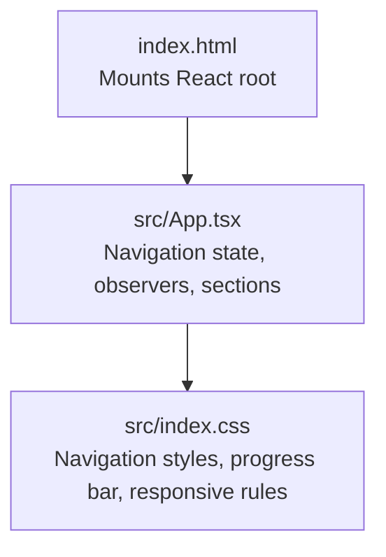
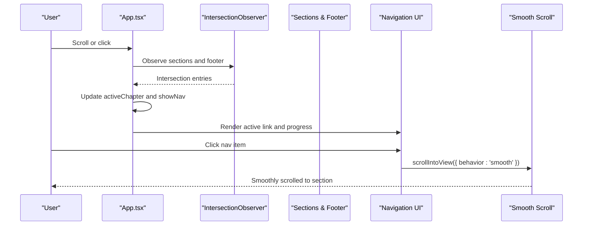
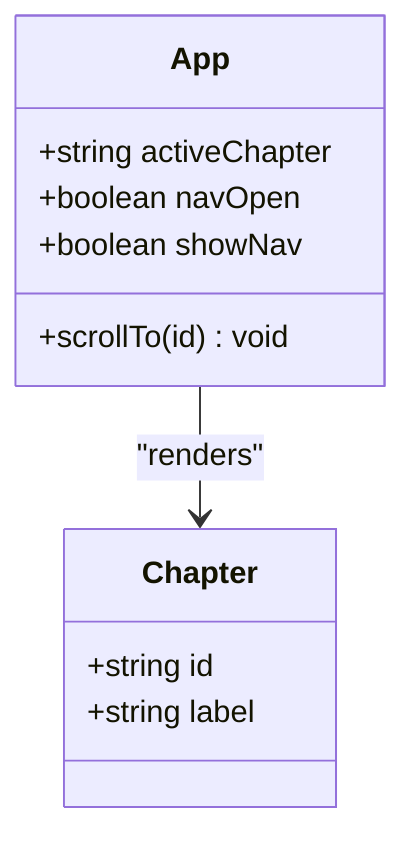
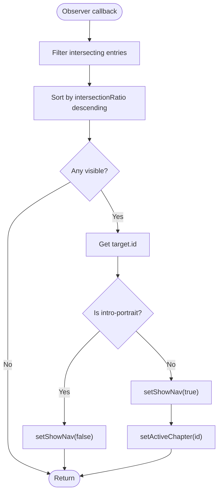
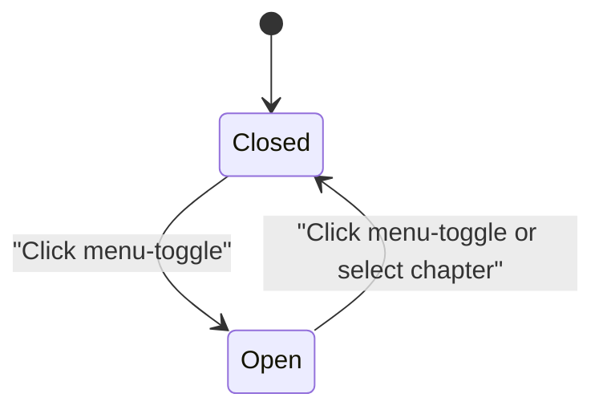
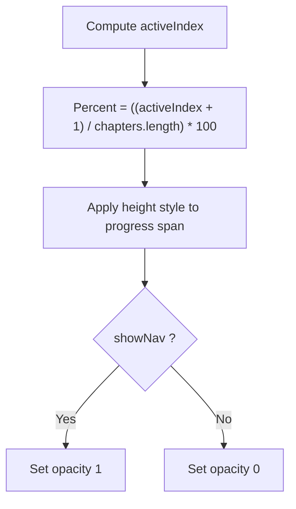
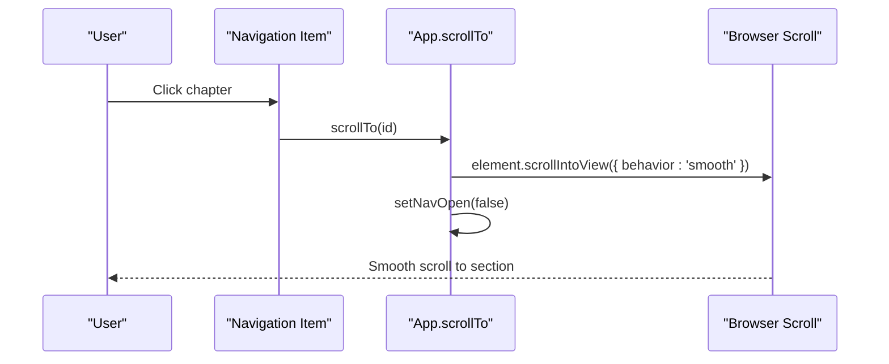
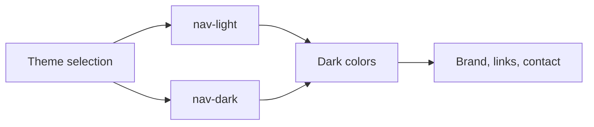
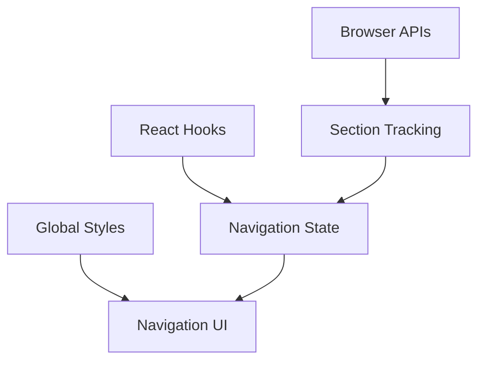

# Navigation System

<cite>
**Referenced Files in This Document**   
- [App.tsx](file://src/App.tsx)
- [index.css](file://src/index.css)
- [index.html](file://index.html)
</cite>

## Table of Contents
1. [Introduction](#introduction)
2. [Project Structure](#project-structure)
3. [Core Components](#core-components)
4. [Architecture Overview](#architecture-overview)
5. [Detailed Component Analysis](#detailed-component-analysis)
6. [Dependency Analysis](#dependency-analysis)
7. [Performance Considerations](#performance-considerations)
8. [Troubleshooting Guide](#troubleshooting-guide)
9. [Conclusion](#conclusion)
10. [Appendices](#appendices)

## Introduction
This document explains the chapter-based navigation system used by the portfolio application. The system tracks scroll position using `IntersectionObserver`, updates the active chapter dynamically, renders a mobile-responsive navigation menu with toggle behavior, shows a progress bar indicating current chapter position, and provides smooth scrolling between sections. It also documents the navigation state model (`navOpen`, `showNav`, `activeChapter`), responsive design patterns for mobile navigation, accessibility considerations, and practical guidance for adding chapters, customizing styling, and implementing custom scroll behaviors.

## Project Structure
The navigation system is implemented primarily in the React application component and styled through a global stylesheet. The HTML entry point mounts the React app into the DOM.

**Diagram sources**
- [index.html:15-18](file://index.html#L15-L18)
- [App.tsx:1-21](file://src/App.tsx#L1-L21)
- [App.tsx:42-92](file://src/App.tsx#L42-L92)
- [index.css:14-26](file://src/index.css#L14-L26)

**Section sources**
- [index.html:1-20](file://index.html#L1-L20)
- [App.tsx:1-21](file://src/App.tsx#L1-L21)
- [index.css:1-12](file://src/index.css#L1-L12)

## Core Components
- Chapter list: A typed array defines each chapter’s identifier and label.
- Navigation state:
  - `activeChapter`: Tracks the currently visible section.
  - `navOpen`: Controls whether the mobile navigation links are open.
  - `showNav`: Controls whether the navigation header and progress bar are visible.
- Section tracking: An `IntersectionObserver` monitors all sections and the footer to update `activeChapter` and `showNav`.
- Smooth scrolling: Clicking a navigation item scrolls smoothly to the target section and closes the mobile menu.
- Progress bar: A right-side vertical bar reflects the current chapter index relative to the total number of chapters.

Key responsibilities:
- Maintain navigation state.
- Observe sections and update active chapter.
- Render responsive navigation UI.
- Provide smooth scrolling behavior.
- Visualize progress based on active chapter.

**Section sources**
- [App.tsx:10-21](file://src/App.tsx#L10-L21)
- [App.tsx:42-92](file://src/App.tsx#L42-L92)
- [App.tsx:149-175](file://src/App.tsx#L149-L175)
- [index.css:14-26](file://src/index.css#L14-L26)

## Architecture Overview
The navigation architecture combines React state management, browser APIs, and CSS for visual feedback.

**Diagram sources**
- [App.tsx:60-75](file://src/App.tsx#L60-L75)
- [App.tsx:87-92](file://src/App.tsx#L87-L92)
- [App.tsx:149-175](file://src/App.tsx#L149-L175)

## Detailed Component Analysis

### Chapter List and State Model
- Chapters are defined as an array of objects with `id` and `label`.
- State variables:
  - `activeChapter`: Set by the observer when a section becomes visible.
  - `navOpen`: Toggled by the mobile menu button.
  - `showNav`: Set to true once the user scrolls past the intro portrait; hides while at the top.

**Diagram sources**
- [App.tsx:10-21](file://src/App.tsx#L10-L21)
- [App.tsx:42-46](file://src/App.tsx#L42-L46)
- [App.tsx:87-92](file://src/App.tsx#L87-L92)

**Section sources**
- [App.tsx:10-21](file://src/App.tsx#L10-L21)
- [App.tsx:42-46](file://src/App.tsx#L42-L46)

### IntersectionObserver-Based Section Tracking
The observer:
- Filters intersecting entries.
- Sorts them by intersection ratio to determine the most visible section.
- Updates `showNav` to false when the intro portrait is visible; otherwise sets it to true.
- Sets `activeChapter` to the observed element’s ID.
- Observes all elements with `section[id]` and `footer[id]`.

**Diagram sources**
- [App.tsx:60-75](file://src/App.tsx#L60-L75)

**Section sources**
- [App.tsx:60-75](file://src/App.tsx#L60-L75)

### Mobile-Responsive Navigation Menu
- Desktop: Horizontal navigation links with active indicator and contact link.
- Mobile (below 900px):
  - Links are hidden by default.
  - A hamburger button toggles the menu open/closed.
  - When open, links stack vertically with full-width buttons.
  - Contact link is hidden on mobile.
- Accessibility:
  - Toggle button has an accessible label.
  - Navigation items use semantic `<button>` elements.

**Diagram sources**
- [App.tsx:157-175](file://src/App.tsx#L157-L175)
- [index.css:21-26](file://src/index.css#L21-L26)
- [index.css:82-83](file://src/index.css#L82-L83)

**Section sources**
- [App.tsx:157-175](file://src/App.tsx#L157-L175)
- [index.css:21-26](file://src/index.css#L21-L26)
- [index.css:82-83](file://src/index.css#L82-L83)

### Progress Bar Visualization
- A fixed vertical bar on the right side indicates progress.
- Height percentage is calculated from the active chapter index divided by the total number of chapters.
- Opacity transitions with `showNav`.

**Diagram sources**
- [App.tsx:87-92](file://src/App.tsx#L87-L92)
- [App.tsx:149-154](file://src/App.tsx#L149-L154)
- [index.css:14-15](file://src/index.css#L14-L15)

**Section sources**
- [App.tsx:87-92](file://src/App.tsx#L87-L92)
- [App.tsx:149-154](file://src/App.tsx#L149-L154)
- [index.css:14-15](file://src/index.css#L14-L15)

### Smooth Scrolling Behavior
- Clicking a navigation item calls `scrollIntoView` with smooth behavior.
- After scrolling, the mobile menu is closed automatically.

**Diagram sources**
- [App.tsx:87-92](file://src/App.tsx#L87-L92)

**Section sources**
- [App.tsx:87-92](file://src/App.tsx#L87-L92)

### Navigation Styling and Themes
- Navigation theme switches between light and dark based on the active chapter.
- Brand mark, navigation links, and contact link inherit color from the theme.
- Active link receives a subtle underline dot and hover animation.

**Diagram sources**
- [App.tsx:157-175](file://src/App.tsx#L157-L175)
- [index.css:16-25](file://src/index.css#L16-L25)

**Section sources**
- [App.tsx:157-175](file://src/App.tsx#L157-L175)
- [index.css:16-25](file://src/index.css#L16-L25)

## Dependency Analysis
The navigation system depends on:
- React hooks for state and lifecycle management.
- Browser APIs (`IntersectionObserver`, `scrollIntoView`).
- Global CSS for layout, animations, and responsive behavior.

**Diagram sources**
- [App.tsx:1-1](file://src/App.tsx#L1-L1)
- [App.tsx:60-75](file://src/App.tsx#L60-L75)
- [index.css:14-26](file://src/index.css#L14-L26)

**Section sources**
- [App.tsx:1-1](file://src/App.tsx#L1-L1)
- [App.tsx:60-75](file://src/App.tsx#L60-L75)
- [index.css:14-26](file://src/index.css#L14-L26)

## Performance Considerations
- Observer configuration uses thresholds and margins to reduce unnecessary updates.
- Progress bar height is computed via simple arithmetic and applied inline for minimal reflows.
- Smooth scrolling leverages native browser behavior.
- Avoid heavy computations inside observer callbacks; keep logic focused on state updates.

[No sources needed since this section provides general guidance]

## Troubleshooting Guide
Common issues and resolutions:
- Navigation not appearing:
  - Ensure `showNav` becomes true after scrolling past the intro portrait.
  - Verify that sections have valid IDs matching the chapter list.
- Active chapter not updating:
  - Confirm that all sections and footer have unique IDs.
  - Check observer configuration and ensure elements are being observed.
- Mobile menu not toggling:
  - Verify the menu toggle button’s click handler updates `navOpen`.
  - Ensure CSS classes `.nav-links.open` apply on mobile breakpoints.
- Progress bar incorrect:
  - Validate `activeIndex` calculation and chapter count.
  - Confirm the progress bar container is visible and not hidden by other layers.

**Section sources**
- [App.tsx:60-75](file://src/App.tsx#L60-L75)
- [App.tsx:157-175](file://src/App.tsx#L157-L175)
- [index.css:82-83](file://src/index.css#L82-L83)

## Conclusion
The navigation system provides a robust, accessible, and responsive chapter-based experience. It uses `IntersectionObserver` for accurate section tracking, manages navigation state cleanly, and offers clear visual feedback through a progress bar and themed navigation. The implementation supports easy extension for new chapters and customization of styling and scroll behavior.

[No sources needed since this section summarizes without analyzing specific files]

## Appendices

### How to Add a New Chapter
Steps:
1. Add a new object to the chapter array with a unique `id` and `label`.
2. Create a corresponding section element with an `id` matching the chapter’s `id`.
3. Optionally add content and styling classes for the new section.
4. The observer will automatically track the new section and update the active chapter.

Example reference paths:
- Chapter array definition: [App.tsx:10-21](file://src/App.tsx#L10-L21)
- Section rendering pattern: [App.tsx:177-719](file://src/App.tsx#L177-L719)

**Section sources**
- [App.tsx:10-21](file://src/App.tsx#L10-L21)
- [App.tsx:177-719](file://src/App.tsx#L177-L719)

### How to Customize Navigation Styling
Options:
- Change theme colors by adjusting CSS variables and chapter-specific background classes.
- Modify active link appearance by editing `.nav-links button.active` styles.
- Adjust navigation spacing and typography via `.site-nav` and `.nav-links`.

Reference paths:
- Navigation styles: [index.css:16-26](file://src/index.css#L16-L26)
- Chapter themes: [index.css:27-28](file://src/index.css#L27-L28)

**Section sources**
- [index.css:16-26](file://src/index.css#L16-L26)
- [index.css:27-28](file://src/index.css#L27-L28)

### How to Implement Custom Scroll Behaviors
Approaches:
- Replace `scrollIntoView` with custom scroll logic if you need precise control over timing or easing.
- Integrate a scroll spy library if you require advanced features like inertia or snapping.
- Keep the observer callback minimal and delegate complex logic to utility functions.

Reference path:
- Smooth scroll function: [App.tsx:87-92](file://src/App.tsx#L87-L92)

**Section sources**
- [App.tsx:87-92](file://src/App.tsx#L87-L92)

### Responsive Design Patterns for Mobile Navigation
Patterns used:
- Hidden desktop navigation links on small screens.
- Hamburger toggle button appears only on mobile.
- Full-screen dropdown menu when open.
- Breakpoints adjust grid layouts and typography for readability.

Reference paths:
- Mobile breakpoint rules: [index.css:82-83](file://src/index.css#L82-L83)
- Toggle button visibility: [index.css:26](file://src/index.css#L26)

**Section sources**
- [index.css:26](file://src/index.css#L26)
- [index.css:82-83](file://src/index.css#L82-L83)

### Accessibility Considerations
- Navigation toggle button includes an accessible label.
- Navigation items are interactive buttons with keyboard focus support.
- Progress bar is marked as decorative (`aria-hidden`).
- Semantic structure uses proper headings and sections.

Reference paths:
- Toggle button label: [App.tsx:164-166](file://src/App.tsx#L164-L166)
- Decorative progress bar: [App.tsx:151-154](file://src/App.tsx#L151-L154)

**Section sources**
- [App.tsx:151-154](file://src/App.tsx#L151-L154)
- [App.tsx:164-166](file://src/App.tsx#L164-L166)