# Portfolio Interface

<cite>
**Referenced Files in This Document**   
- [App.tsx](file://src/App.tsx)
- [TalkingPortrait.tsx](file://src/components/TalkingPortrait.tsx)
- [index.css](file://src/index.css)
- [tailwind.config.js](file://tailwind.config.js)
- [index.html](file://index.html)
</cite>

## Table of Contents
1. [Introduction](#introduction)
2. [Project Structure](#project-structure)
3. [Core Components](#core-components)
4. [Architecture Overview](#architecture-overview)
5. [Detailed Component Analysis](#detailed-component-analysis)
6. [Dependency Analysis](#dependency-analysis)
7. [Performance Considerations](#performance-considerations)
8. [Troubleshooting Guide](#troubleshooting-guide)
9. [Guidelines for Adding Sections and Customizing Layouts](#guidelines-for-adding-sections-and-customizing-layouts)
10. [Conclusion](#conclusion)

## Introduction
This portfolio interface is a single-page React application that presents a chapter-based narrative: an animated curtain, a realistic talking portrait introduction, and scrollable portfolio chapters including About, Skills, Experience, Leadership, Projects, Certifications, Future, and Contact. The system uses Tailwind CSS as the base utility layer, with extensive custom CSS for layout, typography, color themes, animations, and responsive behavior.

The navigation system tracks which section is currently visible using `IntersectionObserver`, updates a progress indicator, and shows or hides the top navigation based on scroll position. Scroll-triggered reveal animations are applied to elements with the `.reveal` class, using staggered delays for visual rhythm.

## Project Structure
At runtime, the browser loads `index.html`, which mounts the React root into `#root`. Vite serves the TypeScript entry point `main.tsx`, which renders the main `App` component. The `App` component owns all portfolio sections, while the interactive portrait lives in a separate component.

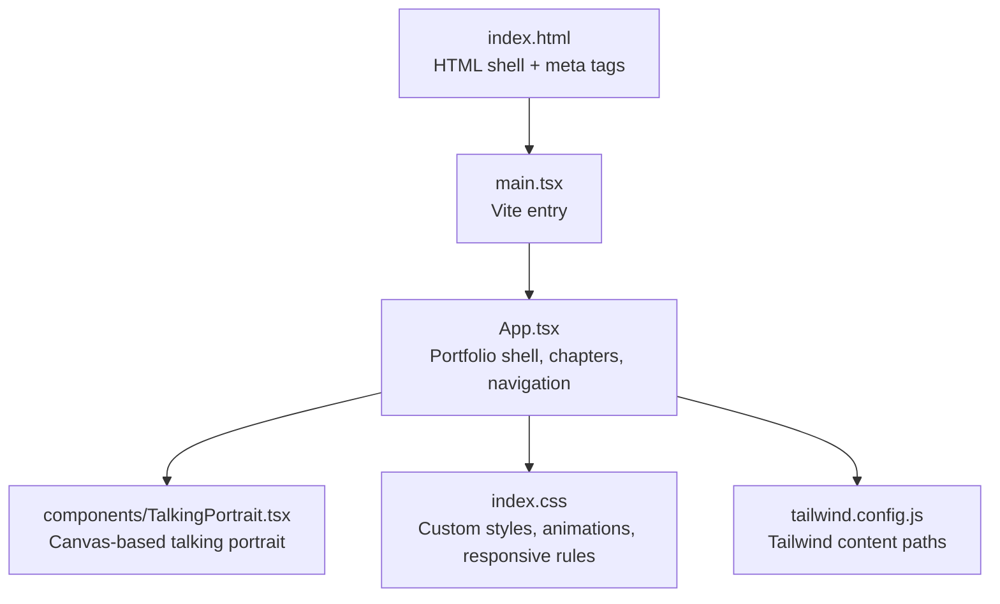

**Diagram sources**
- [index.html:1-20](file://index.html#L1-L20)
- [App.tsx:1-21](file://src/App.tsx#L1-L21)
- [TalkingPortrait.tsx:1-35](file://src/components/TalkingPortrait.tsx#L1-L35)
- [index.css:1-10](file://src/index.css#L1-L10)
- [tailwind.config.js:1-9](file://tailwind.config.js#L1-L9)

**Section sources**
- [index.html:1-20](file://index.html#L1-L20)
- [tailwind.config.js:1-9](file://tailwind.config.js#L1-L9)

## Core Components
The portfolio is built around these core responsibilities:

- **Chapter registry and navigation state:** A typed `Chapter` array defines the ordered sections. The active chapter drives the progress bar and navigation highlighting.
- **Scroll tracking:** An `IntersectionObserver` watches every `section[id]` and `footer[id]`, updating the active chapter and showing the navigation after the intro portrait.
- **Reveal animation observer:** A second observer adds `.is-visible` to elements with the `.reveal` class when they enter the viewport.
- **Curtain and unfold flow:** The initial name screen locks scrolling until the user scrolls down or clicks, then reveals the portfolio container.
- **Interactive talking portrait:** A canvas-driven component animates facial deformation, blinking, micro-motion, and synchronized transcript playback.

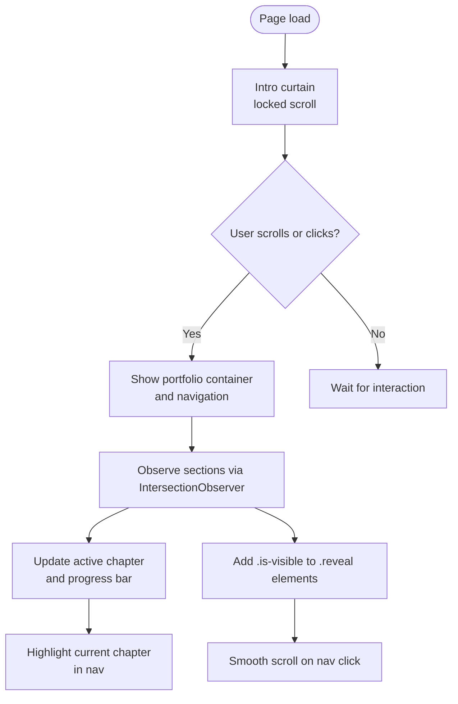

**Diagram sources**
- [App.tsx:49-92](file://src/App.tsx#L49-L92)
- [App.tsx:101-175](file://src/App.tsx#L101-L175)

**Section sources**
- [App.tsx:10-21](file://src/App.tsx#L10-L21)
- [App.tsx:49-92](file://src/App.tsx#L49-L92)
- [App.tsx:101-175](file://src/App.tsx#L101-L175)

## Architecture Overview
The architecture separates concerns between React state, DOM observation, and presentation:

- **State layer:** Chapter list, active chapter, navigation visibility, unfold state, and mouse offset for the name screen.
- **Observation layer:** Two `IntersectionObserver` instances handle chapter tracking and reveal animations.
- **Presentation layer:** Tailwind utility classes provide spacing and typography utilities; custom CSS provides theme colors, section backgrounds, grid layouts, animations, and responsive breakpoints.
- **Component layer:** `App` composes all sections; `TalkingPortrait` encapsulates audio, canvas rendering, and speech synchronization.

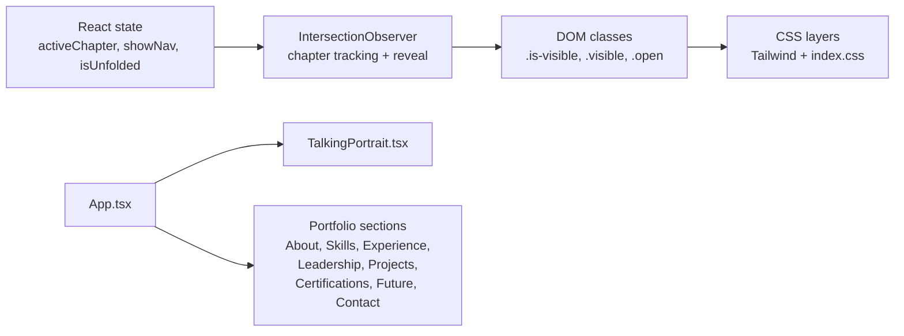

**Diagram sources**
- [App.tsx:42-92](file://src/App.tsx#L42-L92)
- [index.css:6-10](file://src/index.css#L6-L10)
- [index.css:14-28](file://src/index.css#L14-L28)

## Detailed Component Analysis

### Chapter-Based Navigation and Progress Indicators
The navigation system treats the page as a sequence of chapters. Each chapter has an `id` and a display label. The active chapter is determined by the most intersecting section near the center of the viewport.

Key behaviors:
- The first chapter is `about`; the last is `contact`.
- When the intro portrait section is visible, the navigation is hidden.
- For other sections, the navigation becomes visible and highlights the active chapter.
- The progress bar height is calculated from the active chapter index divided by the total number of chapters.
- Clicking a navigation item smooth-scrolls to the corresponding section and closes the mobile menu.

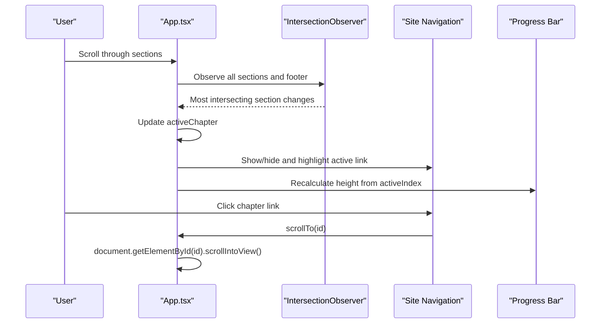

**Diagram sources**
- [App.tsx:12-21](file://src/App.tsx#L12-L21)
- [App.tsx:60-92](file://src/App.tsx#L60-L92)
- [App.tsx:151-175](file://src/App.tsx#L151-L175)

**Section sources**
- [App.tsx:12-21](file://src/App.tsx#L12-L21)
- [App.tsx:60-92](file://src/App.tsx#L60-L92)
- [App.tsx:151-175](file://src/App.tsx#L151-L175)

### Scroll-Triggered Reveal Animations
Reveal animations use a dedicated observer that adds the `.is-visible` class to elements with the `.reveal` class once they intersect the viewport. Staggered delays are implemented through utility classes such as `delay-one`, `delay-two`, and `delay-three`.

Behavior summary:
- Elements start invisible and shifted downward.
- When observed, they fade in and move to their natural position.
- Delays create a cascading effect across related elements.
- The observer is initialized after a short timeout to avoid blocking initial render.

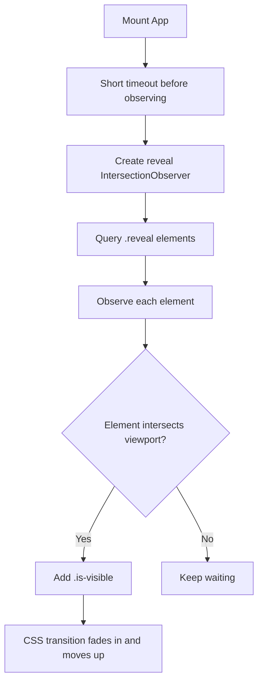

**Diagram sources**
- [App.tsx:77-85](file://src/App.tsx#L77-L85)
- [index.css:81](file://src/index.css#L81)

**Section sources**
- [App.tsx:77-85](file://src/App.tsx#L77-L85)
- [index.css:81](file://src/index.css#L81)

### About Section with Hanging Tablet Layout
The About section combines a hero-style hanging tablet illustration with a two-column bio layout. On smaller screens, the layout stacks vertically and centers content.

Key aspects:
- A wire-and-clip structure visually suspends a tablet frame containing a portrait image.
- The greeting area includes a headline, biography text, and icon pills for Networking, Cloud, and IoT.
- A secondary grid contains a large learning-focused heading, longer copy, signature line, and a timeline trail.
- Responsive rules adjust the hanging scene, tablet size, and column layout.

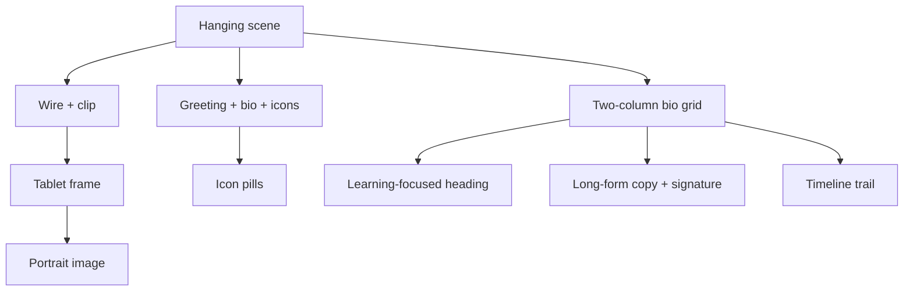

**Diagram sources**
- [App.tsx:177-220](file://src/App.tsx#L177-L220)
- [index.css:680-794](file://src/index.css#L680-L794)
- [index.css:861-870](file://src/index.css#L861-L870)

**Section sources**
- [App.tsx:177-220](file://src/App.tsx#L177-L220)
- [index.css:680-794](file://src/index.css#L680-L794)
- [index.css:861-870](file://src/index.css#L861-L870)

### Skills Categorization Grid
Skills are organized into four groups: Technology, Digital & practical, Customer & business, and Leadership & communication. Each group has a number, title, icon, accent rule, and list of items.

Design characteristics:
- Four-column grid on desktop.
- Two-column grid on tablets.
- Single-column grid on small phones.
- Accent lines differentiate categories visually.

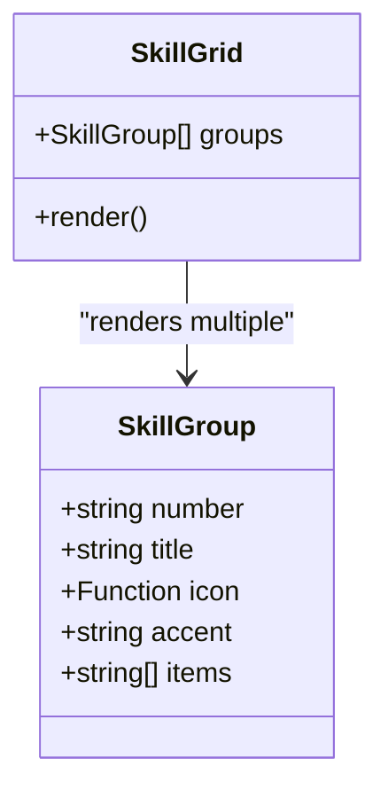

**Diagram sources**
- [App.tsx:23-40](file://src/App.tsx#L23-L40)
- [App.tsx:222-242](file://src/App.tsx#L222-L242)
- [index.css:74](file://src/index.css#L74)
- [index.css:82](file://src/index.css#L82)
- [index.css:83](file://src/index.css#L83)

**Section sources**
- [App.tsx:23-40](file://src/App.tsx#L23-L40)
- [App.tsx:222-242](file://src/App.tsx#L222-L242)
- [index.css:74](file://src/index.css#L74)
- [index.css:82](file://src/index.css#L82)
- [index.css:83](file://src/index.css#L83)

### Experience Timeline with Floating Cards
The Experience section uses a two-column layout: an introductory left column with a vertical rail and a right column with floating process cards connected by SVG paths.

Highlights:
- Left column includes social links, a heading, lead copy, and a badge indicating field experience.
- Right column contains three floating cards representing internship, lab experience, and work readiness.
- SVG dashed paths connect the cards with directional markers.
- On smaller screens, the layout collapses to a single column and hides the SVG connector.

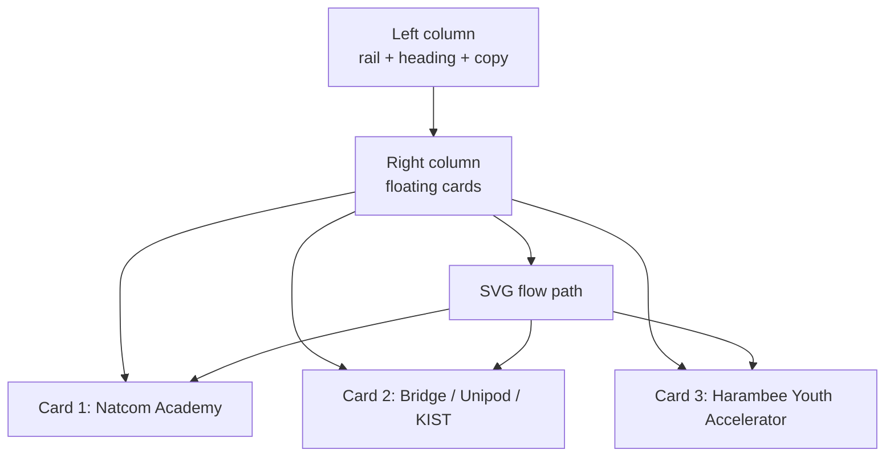

**Diagram sources**
- [App.tsx:244-358](file://src/App.tsx#L244-L358)
- [index.css:1766-1802](file://src/index.css#L1766-L1802)

**Section sources**
- [App.tsx:244-358](file://src/App.tsx#L244-L358)
- [index.css:1766-1802](file://src/index.css#L1766-L1802)

### Leadership Achievements Display
The Leadership section presents a quote and a card grid. One card spans both columns and includes trophy and medal achievements.

Layout behavior:
- Two-column card grid on desktop.
- Single-column stack on smaller screens.
- Feature card uses a darker background and wider span.

```mermaid
grid-template-columns 1fr 1fr
CardA["Coordinator role"]
CardB["Advisor role"]
CardC["Debate Club Lead<br/>feature card"]
```

**Diagram sources**
- [App.tsx:360-374](file://src/App.tsx#L360-L374)
- [index.css:76](file://src/index.css#L76)
- [index.css:83](file://src/index.css#L83)

**Section sources**
- [App.tsx:360-374](file://src/App.tsx#L360-L374)
- [index.css:76](file://src/index.css#L76)
- [index.css:83](file://src/index.css#L83)

### Projects Showcase with Hero Layouts
The Projects section includes featured hero projects, a split grid for infrastructure and innovation, and project cards with technology rows and achievement highlights.

Structure:
- Featured flagship project hero with metrics.
- International delegation hero with space connectivity context.
- Split grid containing cloud/Linux infrastructure and hackathon/competition achievements.
- Responsive stacking on smaller screens.

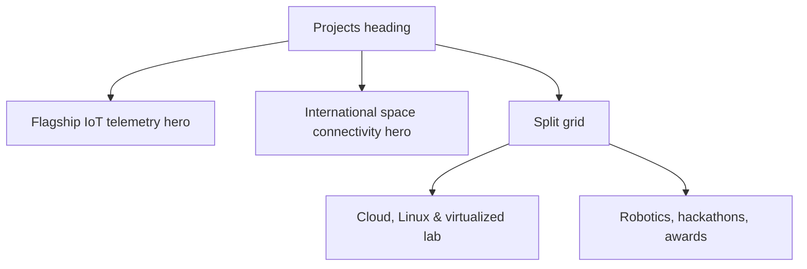

**Diagram sources**
- [App.tsx:376-518](file://src/App.tsx#L376-L518)
- [index.css:1766-1802](file://src/index.css#L1766-L1802)

**Section sources**
- [App.tsx:376-518](file://src/App.tsx#L376-L518)
- [index.css:1766-1802](file://src/index.css#L1766-L1802)

### Certifications Grid
The Certifications section features a decorative S-wave background, a prominent ITU badge card, and a centered grid of certification cards. It also includes a language fluency strip.

Characteristics:
- Three-column grid on desktop.
- Two-column grid on tablets.
- Single-column grid on small phones.
- Highlighted cards emphasize important credentials.

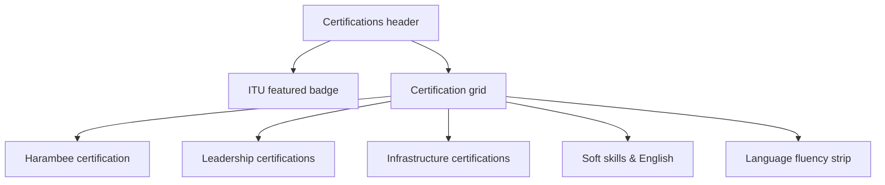

**Diagram sources**
- [App.tsx:520-677](file://src/App.tsx#L520-L677)
- [index.css:1805-1820](file://src/index.css#L1805-L1820)

**Section sources**
- [App.tsx:520-677](file://src/App.tsx#L520-L677)
- [index.css:1805-1820](file://src/index.css#L1805-L1820)

### Contact Information Footer
The Contact footer provides contact details, a call-to-action message, and a back-to-top button.

Responsiveness:
- Large display heading.
- Stacked contact links.
- Footer bottom row with branding, tagline, and scroll-to-top control.

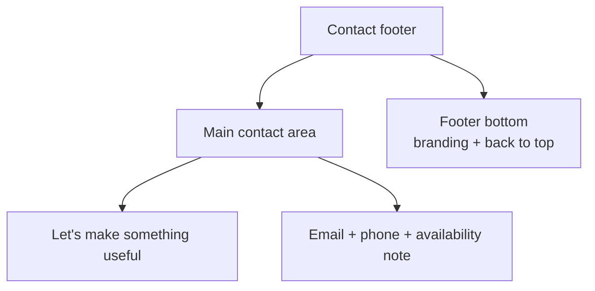

**Diagram sources**
- [App.tsx:700-719](file://src/App.tsx#L700-L719)
- [index.css:80](file://src/index.css#L80)

**Section sources**
- [App.tsx:700-719](file://src/App.tsx#L700-L719)
- [index.css:80](file://src/index.css#L80)

### Talking Portrait Component
The talking portrait is a self-contained component that renders a photorealistic animated face using Canvas, synchronizes mouth shapes with an MP3 timeline, handles natural blinking, and displays a live transcript with progress controls.

Core responsibilities:
- Load and compose photographic assets.
- Compute phoneme-based mouth shapes.
- Apply vertical and horizontal facial warps.
- Manage blink state machine.
- Render micro-motion and head cadence.
- Provide play/pause/replay controls and a clickable progress bar.

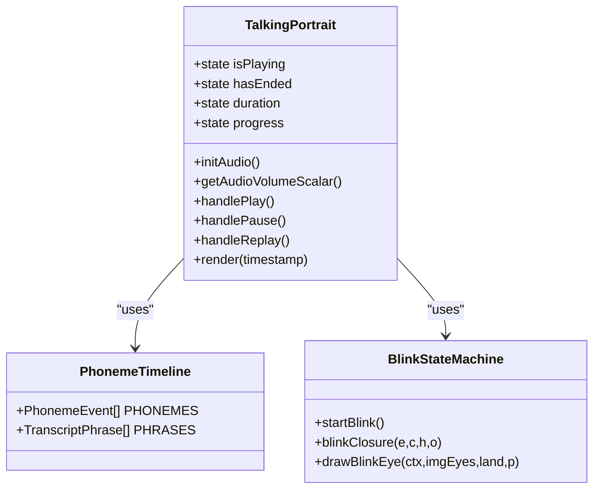

**Diagram sources**
- [TalkingPortrait.tsx:100-215](file://src/components/TalkingPortrait.tsx#L100-L215)
- [TalkingPortrait.tsx:217-316](file://src/components/TalkingPortrait.tsx#L217-L316)
- [TalkingPortrait.tsx:318-608](file://src/components/TalkingPortrait.tsx#L318-L608)
- [TalkingPortrait.tsx:610-746](file://src/components/TalkingPortrait.tsx#L610-L746)

**Section sources**
- [TalkingPortrait.tsx:1-35](file://src/components/TalkingPortrait.tsx#L1-L35)
- [TalkingPortrait.tsx:100-215](file://src/components/TalkingPortrait.tsx#L100-L215)
- [TalkingPortrait.tsx:217-316](file://src/components/TalkingPortrait.tsx#L217-L316)
- [TalkingPortrait.tsx:318-608](file://src/components/TalkingPortrait.tsx#L318-L608)
- [TalkingPortrait.tsx:610-746](file://src/components/TalkingPortrait.tsx#L610-L746)

## Dependency Analysis
The application has clear boundaries:

- `App.tsx` depends on `lucide-react` icons and imports `TalkingPortrait`.
- `TalkingPortrait.tsx` is independent of `App.tsx` except for being rendered inside it.
- Styling is layered: Tailwind utilities are imported at the top of `index.css`, followed by custom CSS variables, component styles, and media queries.
- The HTML shell only declares metadata and the root mount point.

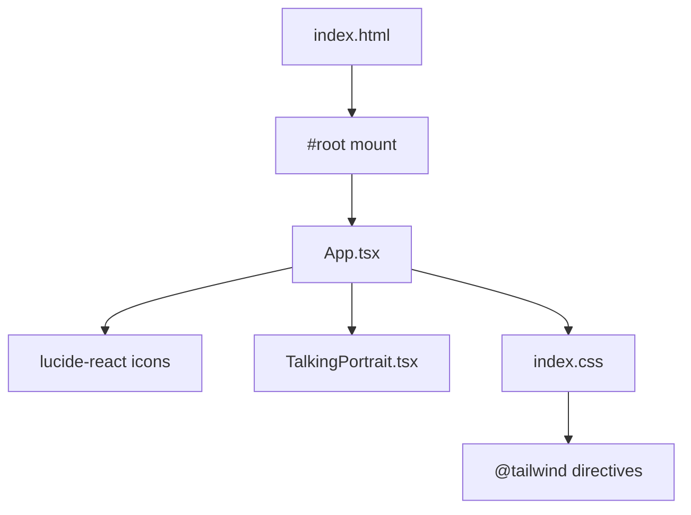

**Diagram sources**
- [App.tsx:1-8](file://src/App.tsx#L1-L8)
- [index.css:1-4](file://src/index.css#L1-L4)
- [index.html:15-17](file://index.html#L15-L17)

**Section sources**
- [App.tsx:1-8](file://src/App.tsx#L1-L8)
- [index.css:1-4](file://src/index.css#L1-L4)
- [index.html:15-17](file://index.html#L15-L17)

## Performance Considerations
- **IntersectionObserver usage:** Two observers are used—one for chapter tracking and one for reveal animations. Both are disconnected on cleanup, preventing memory leaks.
- **Scroll performance:** Smooth scrolling is enabled globally via CSS, and navigation uses `scrollIntoView` with smooth behavior.
- **Canvas rendering:** The talking portrait uses an offscreen composition pipeline and requestAnimationFrame. Heavy operations are guarded by image loading checks.
- **Responsive complexity:** Complex floating-card layouts and SVG connectors are simplified on smaller screens to reduce layout cost.
- **Animation costs:** CSS transitions and keyframes are used where possible; JavaScript-driven animations are limited to the portrait component.

[No sources needed since this section provides general guidance]

## Troubleshooting Guide
Common issues and resolutions:

- **Navigation does not appear:** Ensure the intro portrait section is no longer the most intersecting element. The navigation is hidden while the intro portrait is visible.
- **Active chapter not updating:** Verify that each section has a unique `id` matching the chapter registry.
- **Reveal animations not triggering:** Confirm that elements have the `.reveal` class and that the observer initialization runs after the DOM is ready.
- **Mobile menu not opening:** Check that the `.nav-links.open` class is toggled correctly and that the menu toggle button is visible on small screens.
- **Talking portrait not playing:** Audio playback requires user interaction and may be blocked by browser autoplay policies. Ensure the audio file path exists and the user clicks the play button.

**Section sources**
- [App.tsx:60-75](file://src/App.tsx#L60-L75)
- [App.tsx:77-85](file://src/App.tsx#L77-L85)
- [App.tsx:157-175](file://src/App.tsx#L157-L175)
- [TalkingPortrait.tsx:610-648](file://src/components/TalkingPortrait.tsx#L610-L648)

## Guidelines for Adding Sections and Customizing Layouts

### Adding a New Chapter
1. Add a new entry to the chapter array with a unique `id` and readable `label`.
2. Create a new `<section>` with that `id` and apply a chapter background class.
3. Add any `.reveal` elements you want to animate on scroll.
4. If the section needs special responsive behavior, add or update media queries in `index.css`.

**Section sources**
- [App.tsx:12-21](file://src/App.tsx#L12-L21)
- [App.tsx:177-719](file://src/App.tsx#L177-L719)
- [index.css:28](file://src/index.css#L28)

### Customizing Layouts
- Use the existing grid patterns: `.about-grid`, `.leadership-layout`, `.future-layout`, and `.footer-main` for two-column layouts.
- Use `.skill-grid` for categorized lists.
- Use `.cert-screenshot-grid` for certification cards.
- For complex layouts like Experience and Projects, follow the existing split-hero and card structures.

**Section sources**
- [index.css:69](file://src/index.css#L69)
- [index.css:74](file://src/index.css#L74)
- [index.css:76](file://src/index.css#L76)
- [index.css:79](file://src/index.css#L79)
- [index.css:80](file://src/index.css#L80)

### Maintaining Consistent Visual Design
- Use the CSS variables defined in `:root` for colors and lines.
- Use chapter background classes (`chapter-cream`, `chapter-black`, `chapter-charcoal`, `chapter-red`, `chapter-burgundy`, `chapter-warm`) for consistent section theming.
- Use `.display-heading` for large headings and `.section-kicker` for section numbering and labels.
- Keep typography consistent by relying on the imported fonts and existing heading classes.

**Section sources**
- [index.css:6](file://src/index.css#L6)
- [index.css:28](file://src/index.css#L28)
- [index.css:34](file://src/index.css#L34)
- [index.css:68](file://src/index.css#L68)

### Responsive Design Patterns
- Breakpoints:
  - `max-width: 900px`: Mobile navigation, stacked hero, reduced skill grid columns.
  - `max-width: 560px`: Smaller headings, single-column skills, stacked leadership cards, compact footer.
  - `max-width: 960px`: Simplified Experience layout, stacked project splits, two-column certification grid.
  - `max-width: 600px`: Single-column certification grid.
- Use flexbox and CSS Grid for layout shifts rather than absolute positioning where possible.
- Hide decorative SVG connectors on small screens to simplify the Experience layout.

**Section sources**
- [index.css:82](file://src/index.css#L82)
- [index.css:83](file://src/index.css#L83)
- [index.css:1766-1802](file://src/index.css#L1766-L1802)
- [index.css:1805-1820](file://src/index.css#L1805-L1820)

### CSS Architecture Using Tailwind CSS
- Tailwind is configured to scan `index.html` and files under `src/**/*.{js,ts,jsx,tsx}`.
- Custom styles extend Tailwind with semantic class names and animations.
- Avoid overriding Tailwind utilities directly; prefer adding new semantic classes in `index.css`.

**Section sources**
- [tailwind.config.js:1-9](file://tailwind.config.js#L1-L9)
- [index.css:1-4](file://src/index.css#L1-L4)

## Conclusion
The portfolio interface combines a structured chapter-based narrative with modern React state management, intersection-based scroll tracking, and a layered CSS architecture. The talking portrait component adds a sophisticated interactive layer, while the responsive design ensures readability and usability across devices. By following the provided guidelines, new sections can be added consistently, layouts can be customized safely, and visual coherence can be maintained across different screen sizes.

[No sources needed since this section summarizes without analyzing specific files]