# Portfolio Sections Layout

<cite>
**Referenced Files in This Document**
- [App.tsx](file://src/App.tsx)
- [index.css](file://src/index.css)
- [tailwind.config.js](file://tailwind.config.js)
- [index.html](file://index.html)
</cite>

## Table of Contents
1. [Introduction](#introduction)
2. [Project Structure](#project-structure)
3. [Core Components](#core-components)
4. [Architecture Overview](#architecture-overview)
5. [Detailed Component Analysis](#detailed-component-analysis)
6. [Dependency Analysis](#dependency-analysis)
7. [Performance Considerations](#performance-considerations)
8. [Troubleshooting Guide](#troubleshooting-guide)
9. [Conclusion](#conclusion)
10. [Appendices](#appendices)

## Introduction
This document explains the layout and structure of every portfolio section, including About, Skills, Experience, Leadership, Projects, Certifications, Future goals, and Contact footer. It also covers responsive behavior, CSS architecture using Tailwind CSS, and guidelines for adding new sections while keeping a consistent visual hierarchy.

The portfolio is built as a single-page React application with:
- A curtain landing screen
- A realistic talking portrait section
- A scroll-driven main portfolio with chapter-based navigation
- Section-specific layouts such as hanging tablet hero, skill grids, floating experience cards with SVG flow connectors, leadership cards, project showcases, certification badges, future goals, and contact footer

## Project Structure
At runtime, the app renders from `src/main.tsx` into the root element defined in `index.html`. The main UI lives in `src/App.tsx`, which defines all chapters and sections. Styling is layered on top of Tailwind CSS utilities and custom CSS in `src/index.css`.

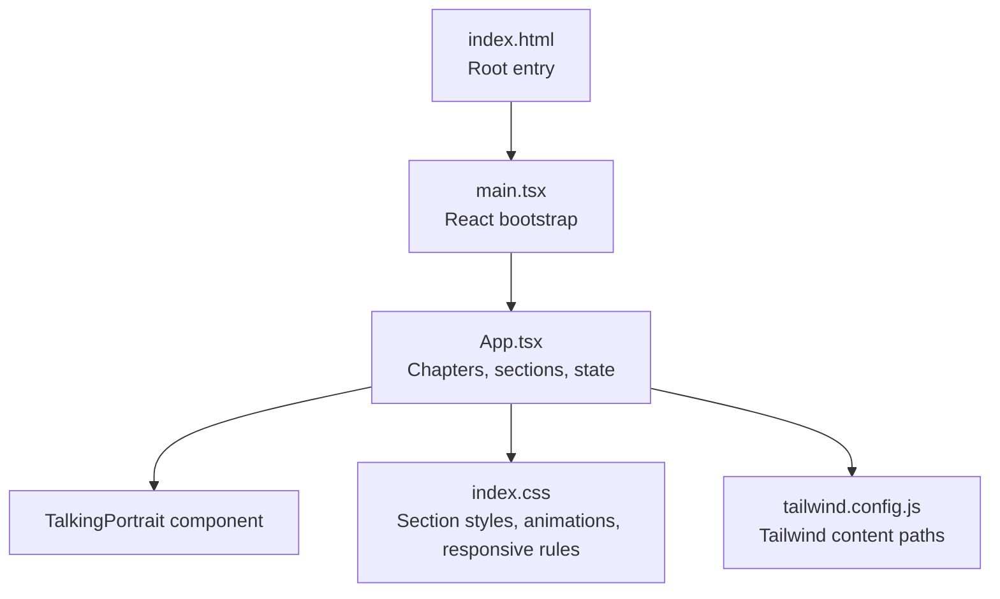

**Diagram sources**
- [index.html:15-18](file://index.html#L15-L18)
- [App.tsx:1-21](file://src/App.tsx#L1-L21)
- [tailwind.config.js:1-9](file://tailwind.config.js#L1-L9)

**Section sources**
- [index.html:1-20](file://index.html#L1-L20)
- [App.tsx:1-21](file://src/App.tsx#L1-L21)
- [tailwind.config.js:1-9](file://tailwind.config.js#L1-L9)

## Core Components
The portfolio is organized around eight chapters:
- About
- Skills
- Experience
- Leadership
- Projects
- Certifications
- Future
- Contact

Each chapter is a `<section>` with a unique `id`, enabling:
- Scroll-to-section navigation
- IntersectionObserver-based active chapter tracking
- Progress bar updates
- Navigation highlighting

The chapter list is centralized in `App.tsx`, making it easy to add or reorder sections.

**Section sources**
- [App.tsx:12-21](file://src/App.tsx#L12-L21)
- [App.tsx:60-75](file://src/App.tsx#L60-L75)

## Architecture Overview
The portfolio uses a layered architecture:

- **Entry layer**: `index.html` provides the root DOM node and metadata.
- **Application layer**: `App.tsx` manages state (active chapter, navigation visibility, unfold animation), renders the curtain, talking portrait, and all portfolio sections.
- **Presentation layer**: `index.css` defines typography, color system, grid layouts, section backgrounds, reveal animations, and responsive breakpoints.
- **Utility layer**: Tailwind CSS provides base utilities; custom CSS extends them with domain-specific components.

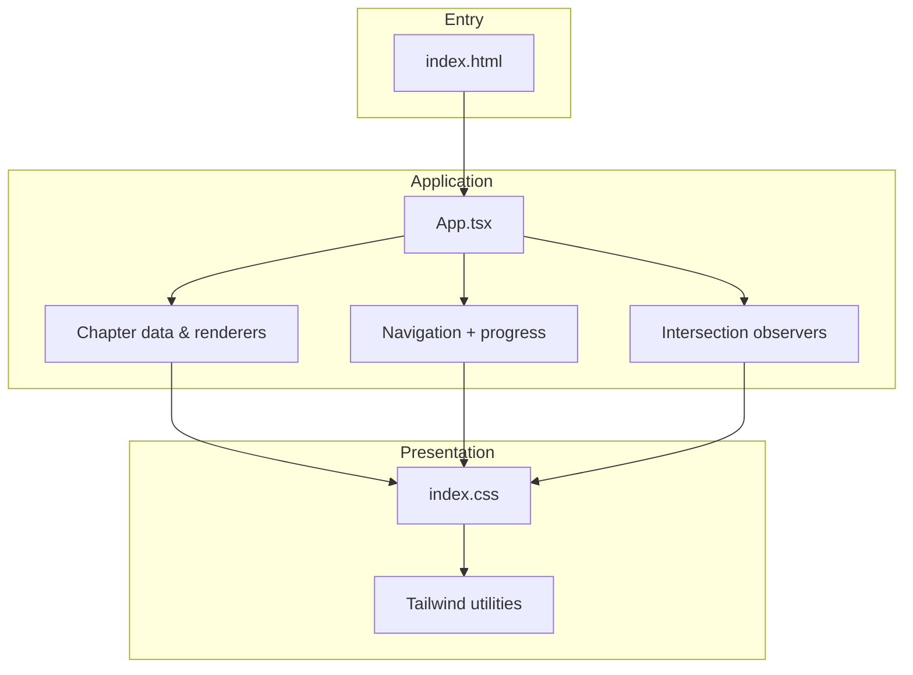

**Diagram sources**
- [index.html:15-18](file://index.html#L15-L18)
- [App.tsx:42-92](file://src/App.tsx#L42-L92)
- [index.css:1-10](file://src/index.css#L1-L10)

**Section sources**
- [index.html:15-18](file://index.html#L15-L18)
- [App.tsx:42-92](file://src/App.tsx#L42-L92)
- [index.css:1-10](file://src/index.css#L1-L10)

## Detailed Component Analysis

### About Section
The About section combines a hanging tablet hero with a two-column bio grid and a timeline trail.

Key layout behaviors:
- Hanging tablet hero:
  - Uses a wire-and-clip composition to suspend a tablet frame.
  - The tablet image is positioned at the top center and scales slightly on hover.
  - Gentle sway animation adds motion.
- Greeting and bio:
  - Left-aligned greeting, short bio paragraph, and icon pills for Networking, Cloud, and IoT.
- Secondary bio grid:
  - Two-column grid with a large display heading and copy block.
  - Signature line separates narrative from identity.
- Timeline trail:
  - Three-column timeline showing past, present, and next steps.

Responsive behavior:
- On smaller screens, the two-column grid collapses to one column.
- Skill grid and other multi-column layouts adapt via media queries.

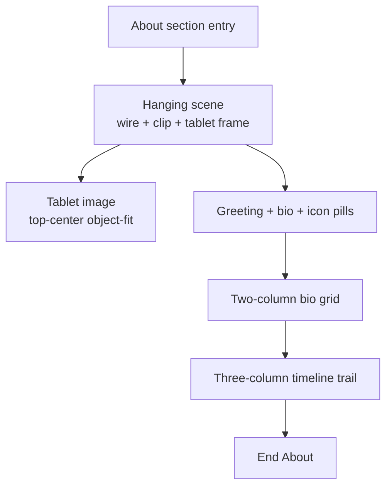

**Diagram sources**
- [App.tsx:177-220](file://src/App.tsx#L177-L220)
- [index.css:678-794](file://src/index.css#L678-L794)

**Section sources**
- [App.tsx:177-220](file://src/App.tsx#L177-L220)
- [index.css:678-794](file://src/index.css#L678-L794)

### Skills Section
The Skills section uses a categorized grid system with four groups:
- Technology
- Digital & practical
- Customer & business
- Leadership & communication

Each group includes:
- Numbered badge
- Icon
- Title
- Accent-colored rule line
- List of skills

Accent colors are applied through utility classes tied to CSS variables and semantic class names like `line-red`, `line-gold`, and `line-cream`.

Responsive behavior:
- Desktop: four columns
- Medium screens: two columns
- Small screens: one column

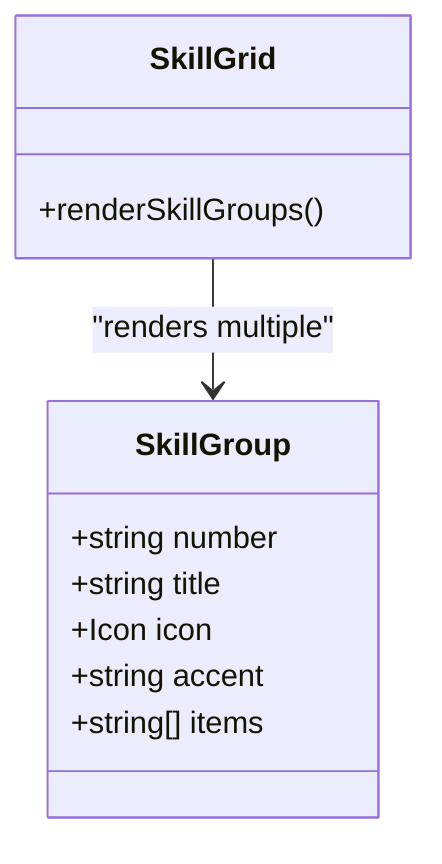

**Diagram sources**
- [App.tsx:23-40](file://src/App.tsx#L23-L40)
- [App.tsx:222-242](file://src/App.tsx#L222-L242)
- [index.css:74](file://src/index.css#L74)

**Section sources**
- [App.tsx:23-40](file://src/App.tsx#L23-L40)
- [App.tsx:222-242](file://src/App.tsx#L222-L242)
- [index.css:74](file://src/index.css#L74)

### Experience Section
The Experience section presents a structured process narrative with floating cards connected by curved SVG paths.

Layout elements:
- Left column:
  - Vertical rail with icons and links
  - Heading, lead copy, and meta badge
- Right column:
  - Floating cards representing stages:
    - Concept & Foundation
    - Systems & Cloud Lab
    - Execution & Readiness
  - SVG flow connector with dashed curves and directional markers

SVG flow connectors:
- Curved paths connect card positions
- Dashed strokes indicate flow direction
- Paperplane-like markers show movement between stages

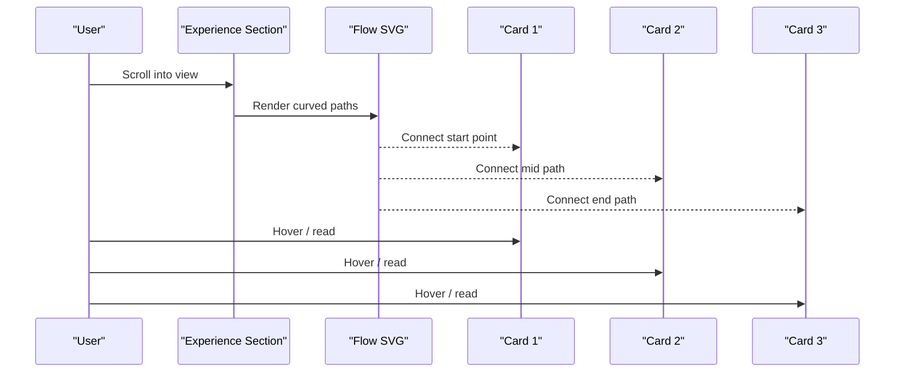

**Diagram sources**
- [App.tsx:244-358](file://src/App.tsx#L244-L358)

**Section sources**
- [App.tsx:244-358](file://src/App.tsx#L244-L358)

### Leadership Section
The Leadership section uses a split layout:
- Left side:
  - Display heading
  - Quote emphasizing contribution and shared leadership
- Right side:
  - Grid of leadership cards
  - One featured card spanning two columns with trophy metrics

Card types:
- Standard cards with role, organization, and description
- Featured card with icon, achievements, and expanded context

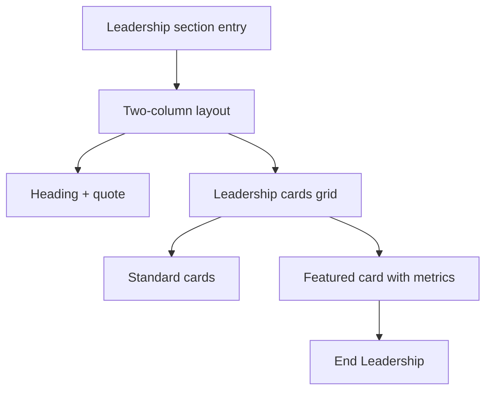

**Diagram sources**
- [App.tsx:360-374](file://src/App.tsx#L360-L374)
- [index.css:76](file://src/index.css#L76)

**Section sources**
- [App.tsx:360-374](file://src/App.tsx#L360-L374)
- [index.css:76](file://src/index.css#L76)

### Projects Section
The Projects section showcases work through hero layouts and split grids.

Structure:
- Hero projects:
  - Flagship project hero with category tag, status badge, metrics, and tech row
  - International flagship hero with space/connectivity theme and location metrics
- Split grid:
  - Infrastructure project card
  - Competitions and innovation card with highlights

Visual patterns:
- Category tags with icons
- Status badges with live pulse indicators
- Tech rows listing technologies
- Metrics boxes for performance or event details

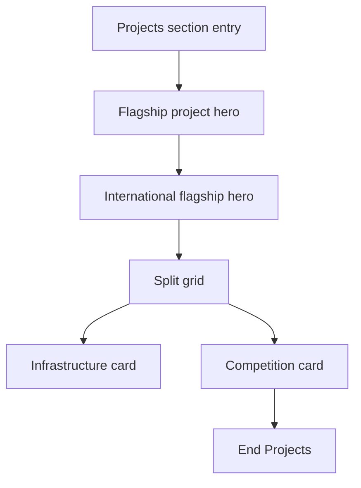

**Diagram sources**
- [App.tsx:376-518](file://src/App.tsx#L376-L518)

**Section sources**
- [App.tsx:376-518](file://src/App.tsx#L376-L518)

### Certifications Section
The Certifications section emphasizes industry-recognized credentials and international badges.

Key features:
- Decorative S-wave SVG background
- Centered heading and subtitle
- Prominent ITU badge feature card with emblem, glow, and metric badge
- Centered grid of certification cards with icons, titles, providers, and verified pills
- Language fluency strip

Badge and card patterns:
- Highlighted cards for notable certifications
- Verified pills with check icons
- Gold and cyan accents for emphasis

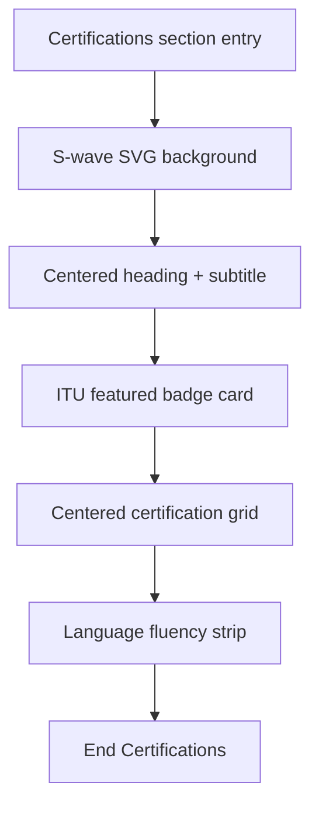

**Diagram sources**
- [App.tsx:520-677](file://src/App.tsx#L520-L677)

**Section sources**
- [App.tsx:520-677](file://src/App.tsx#L520-L677)

### Future Goals Section
The Future section communicates ongoing growth and global exposure.

Layout:
- Eyebrow label with line accent
- Display heading
- Copy paragraph
- Call-to-action button linking to Contact
- Global card with icon, title, participant note, and event details

Responsive behavior:
- Two-column layout collapses to one column on small screens
- Global card aligns left on mobile

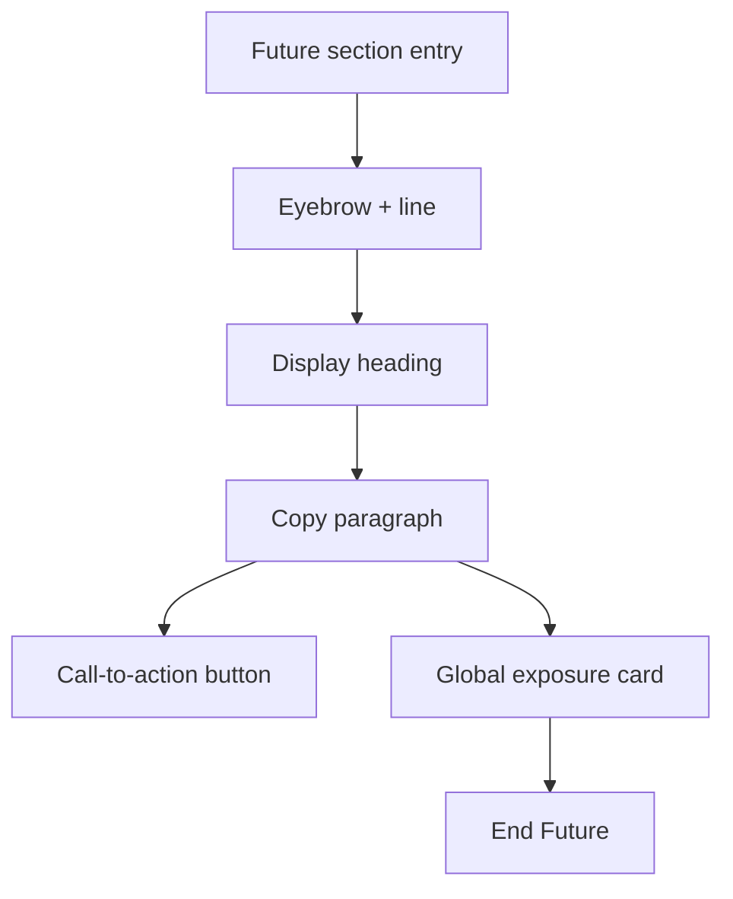

**Diagram sources**
- [App.tsx:679-698](file://src/App.tsx#L679-L698)
- [index.css:79](file://src/index.css#L79)

**Section sources**
- [App.tsx:679-698](file://src/App.tsx#L679-L698)
- [index.css:79](file://src/index.css#L79)

### Contact Footer
The Contact footer provides clear contact options and a back-to-top action.

Elements:
- Section kicker
- Eyebrow label
- Large footer title
- Contact details with mail and phone links
- Availability message
- Footer bottom with branding, tagline, and back-to-top button

Responsive behavior:
- Two-column layout collapses to one column
- Footer bottom adapts spacing and hides secondary text on very small screens

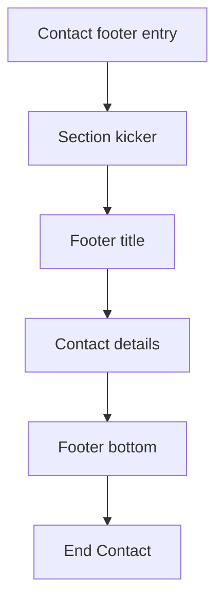

**Diagram sources**
- [App.tsx:700-719](file://src/App.tsx#L700-L719)
- [index.css:80](file://src/index.css#L80)

**Section sources**
- [App.tsx:700-719](file://src/App.tsx#L700-L719)
- [index.css:80](file://src/index.css#L80)

## Dependency Analysis
The portfolio’s dependencies are straightforward:

- `index.html` mounts the React app
- `App.tsx` imports icons from `lucide-react` and the `TalkingPortrait` component
- `index.css` imports fonts and applies Tailwind directives
- `tailwind.config.js` configures Tailwind scanning paths

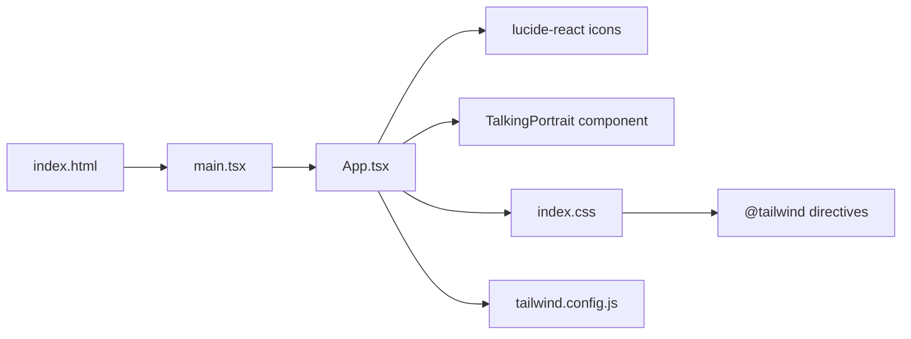

**Diagram sources**
- [index.html:15-18](file://index.html#L15-L18)
- [App.tsx:1-8](file://src/App.tsx#L1-L8)
- [index.css:1-4](file://src/index.css#L1-L4)
- [tailwind.config.js:1-9](file://tailwind.config.js#L1-L9)

**Section sources**
- [index.html:15-18](file://index.html#L15-L18)
- [App.tsx:1-8](file://src/App.tsx#L1-L8)
- [index.css:1-4](file://src/index.css#L1-L4)
- [tailwind.config.js:1-9](file://tailwind.config.js#L1-L9)

## Performance Considerations
- Reveal animations use IntersectionObserver to add visibility classes only when elements enter the viewport.
- Smooth scrolling is enabled globally.
- The curtain locks scroll until unfolded, preventing unintended navigation during the intro.
- SVG flow connectors are lightweight vector graphics suitable for responsive scaling.
- Tailwind utilities reduce custom CSS bloat where possible.

Recommendations:
- Keep reveal thresholds modest to avoid excessive reflows.
- Prefer static SVG paths over animated ones unless necessary.
- Use lazy loading for images if the portfolio grows significantly.

[No sources needed since this section provides general guidance]

## Troubleshooting Guide
Common issues and resolutions:

- Navigation not updating:
  - Ensure each section has a unique `id` matching the chapter list.
  - Verify IntersectionObserver is observing all sections and footers.
- Active chapter highlight incorrect:
  - Check that the observer sorts entries by intersection ratio and sets the active chapter accordingly.
- Mobile navigation not opening:
  - Confirm the menu toggle toggles the `nav-links open` class.
- About hanging tablet misaligned:
  - Verify the wire, clip, and tablet frame classes are applied correctly.
- Skills grid not responsive:
  - Check media query breakpoints and grid column overrides.

**Section sources**
- [App.tsx:60-75](file://src/App.tsx#L60-L75)
- [App.tsx:157-175](file://src/App.tsx#L157-L175)
- [index.css:82](file://src/index.css#L82)

## Conclusion
The portfolio sections follow a consistent design system:
- Centralized chapter definitions
- Section-specific layouts with clear visual hierarchy
- Responsive grids and adaptive typography
- Animated reveals and subtle motion
- Clear navigation and progress indicators

To maintain consistency:
- Add new sections to the chapter list
- Use section kickers, display headings, and copy blocks
- Follow grid patterns established in existing sections
- Apply accent colors and icons consistently
- Test responsiveness across breakpoints

[No sources needed since this section summarizes without analyzing specific files]

## Appendices

### Guidelines for Adding New Sections
- Define a new chapter entry in the chapter list with an `id` and `label`.
- Create a `<section>` with a unique `id` matching the chapter.
- Use the standard section structure:
  - Section kicker
  - Display heading
  - Supporting copy
  - Content grid or layout appropriate to the section type
- Apply consistent typography and spacing classes.
- If interactive, ensure accessibility attributes and keyboard navigation.
- Test reveal animations and responsive behavior.

**Section sources**
- [App.tsx:12-21](file://src/App.tsx#L12-L21)
- [index.css:68-83](file://src/index.css#L68-L83)