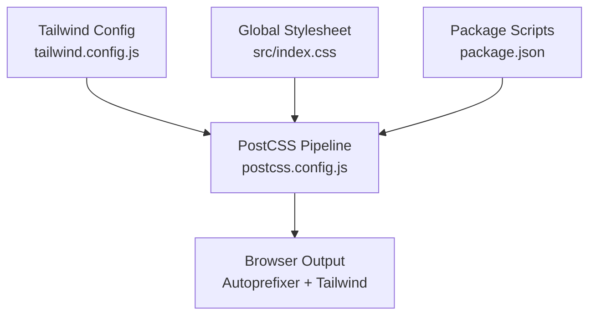
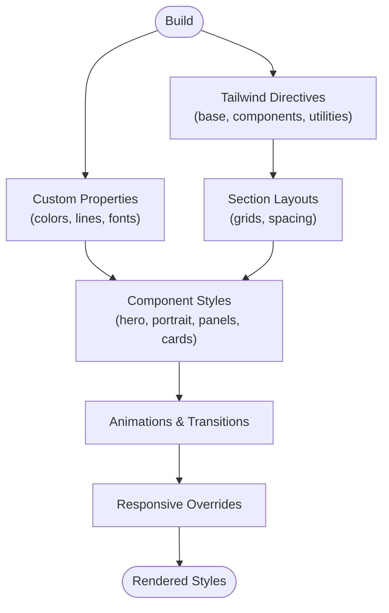
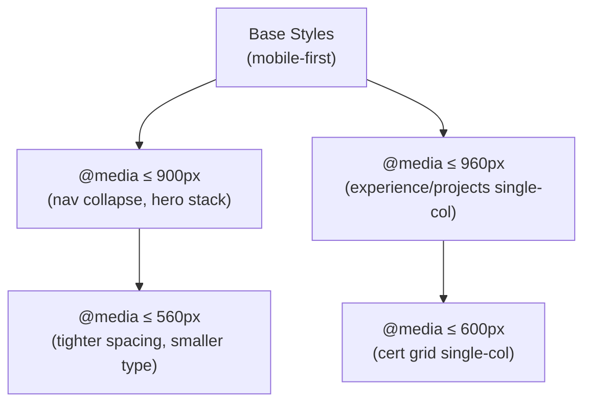
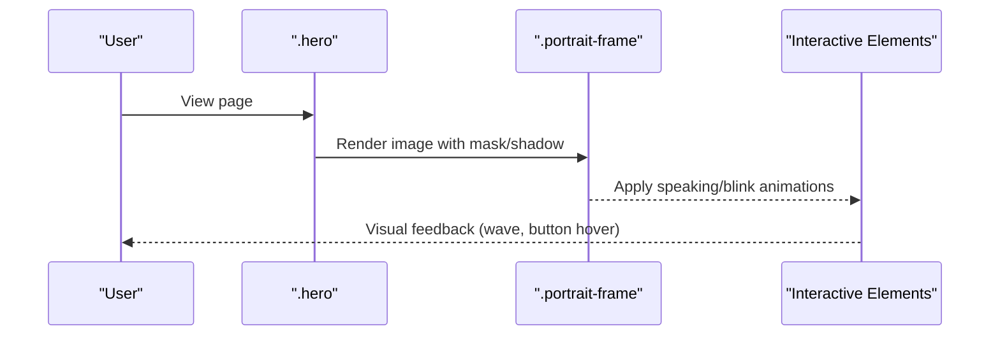
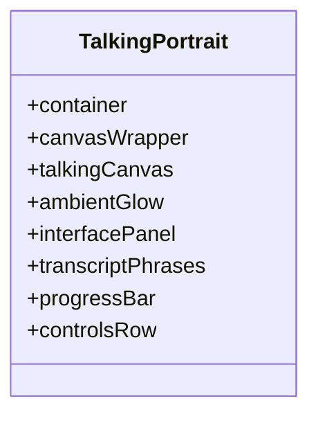
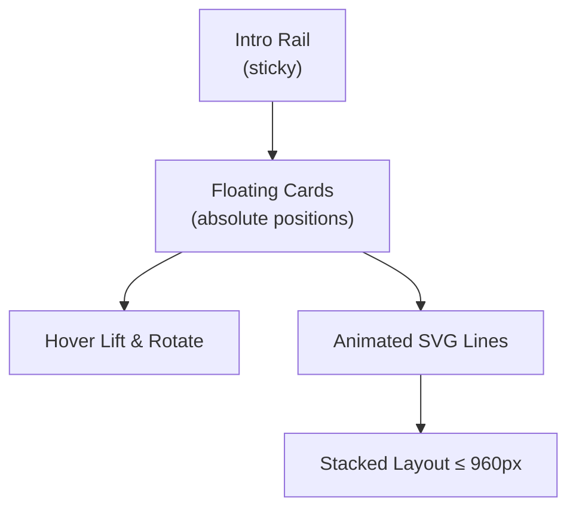
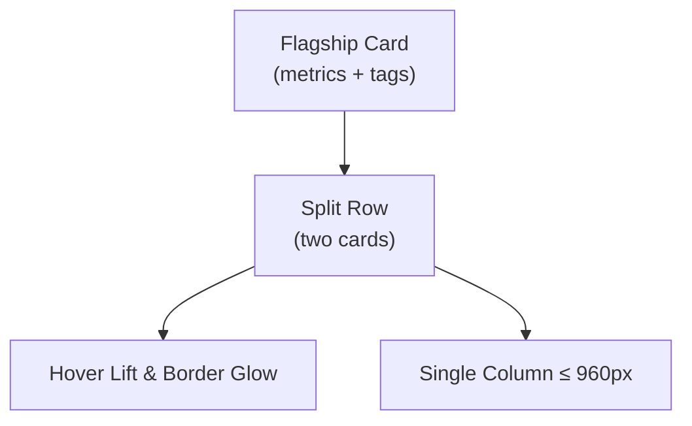
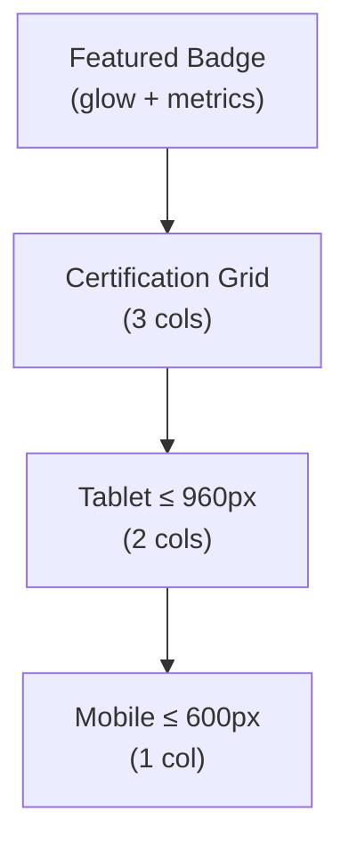
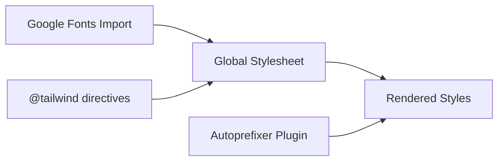

# Responsive Design & Styling

<cite>
**Referenced Files in This Document**
- [tailwind.config.js](file://tailwind.config.js)
- [postcss.config.js](file://postcss.config.js)
- [package.json](file://package.json)
- [src/index.css](file://src/index.css)
</cite>

## Table of Contents
1. [Introduction](#introduction)
2. [Project Structure](#project-structure)
3. [Core Components](#core-components)
4. [Architecture Overview](#architecture-overview)
5. [Detailed Component Analysis](#detailed-component-analysis)
6. [Dependency Analysis](#dependency-analysis)
7. [Performance Considerations](#performance-considerations)
8. [Troubleshooting Guide](#troubleshooting-guide)
9. [Conclusion](#conclusion)
10. [Appendices](#appendices)

## Introduction
This document explains the responsive design system and CSS architecture for the project. It covers Tailwind CSS configuration, custom CSS variables, component-specific styles, mobile-first strategies, breakpoint usage, color scheme, typography, spacing conventions, animations, naming patterns, extension guidelines, and cross-browser compatibility considerations. The goal is to help developers maintain a consistent, scalable, and accessible visual system across devices.

## Project Structure
The styling stack is minimal and focused:
- Tailwind CSS provides utility classes and base layer injection.
- PostCSS runs Tailwind and Autoprefixer for browser compatibility.
- A single global stylesheet defines custom properties, layout primitives, component styles, animations, and responsive overrides.

**Diagram sources**
- [tailwind.config.js:1-8](file://tailwind.config.js#L1-L8)
- [postcss.config.js:1-6](file://postcss.config.js#L1-L6)
- [src/index.css:1-4](file://src/index.css#L1-L4)
- [package.json:18-32](file://package.json#L18-L32)

**Section sources**
- [tailwind.config.js:1-8](file://tailwind.config.js#L1-L8)
- [postcss.config.js:1-6](file://postcss.config.js#L1-L6)
- [src/index.css:1-4](file://src/index.css#L1-L4)
- [package.json:18-32](file://package.json#L18-L32)

## Core Components
- Global CSS variables define the brand palette and line tokens used throughout components.
- Base resets and typography establish consistent defaults.
- Utility layers from Tailwind are injected via directives.
- Component styles are organized by section with clear class names.
- Animations and transitions are centralized as keyframes and reusable transition utilities.
- Responsive behavior is implemented using media queries at multiple breakpoints.

Key responsibilities:
- Color and contrast tokens via CSS variables.
- Typography scale and font families.
- Layout grids and spacing conventions.
- Interactive states and motion design.
- Mobile-first responsive rules.

**Section sources**
- [src/index.css:6-12](file://src/index.css#L6-L12)
- [src/index.css:1-4](file://src/index.css#L1-L4)

## Architecture Overview
The styling architecture follows a layered approach:
- Layer 1: Global theme tokens (variables), base resets, and typography.
- Layer 2: Section-level layouts and grid systems.
- Layer 3: Component styles (hero, portrait, panels, cards).
- Layer 4: Animation definitions and micro-interactions.
- Layer 5: Responsive overrides per section and global components.

**Diagram sources**
- [src/index.css:1-4](file://src/index.css#L1-L4)
- [src/index.css:6-12](file://src/index.css#L6-L12)
- [src/index.css:29-83](file://src/index.css#L29-L83)
- [src/index.css:87-187](file://src/index.css#L87-L187)
- [src/index.css:813-871](file://src/index.css#L813-L871)

## Detailed Component Analysis

### Tailwind Configuration
- Content scanning includes HTML and all source files under src.
- Theme extension is empty; customization is primarily done via CSS variables and component styles.
- No plugins are configured.

Guidelines:
- Keep Tailwind’s default theme unless you need to extend it.
- Prefer CSS variables for colors and tokens to keep them consistent across components.
- Use Tailwind utilities for layout and spacing where appropriate, but rely on custom classes for complex sections.

**Section sources**
- [tailwind.config.js:1-8](file://tailwind.config.js#L1-L8)

### PostCSS Pipeline
- Tailwind CSS plugin is enabled.
- Autoprefixer is enabled for cross-browser compatibility.

Implications:
- Vendor prefixes are automatically added for modern features like backdrop-filter, mask-image, and transforms.
- Ensure feature flags or fallbacks are considered when using advanced CSS features.

**Section sources**
- [postcss.config.js:1-6](file://postcss.config.js#L1-L6)

### Custom CSS Variables and Theme Tokens
- Root variables include cream, ink, red, burgundy, warm, and line tokens for light/dark contexts.
- These variables are used consistently across chapters, buttons, badges, and interactive elements.

Recommendations:
- Extend the variable set for new semantic colors (e.g., success, warning, info) rather than hardcoding hex values.
- Maintain contrast ratios against backgrounds for accessibility.

**Section sources**
- [src/index.css:6-6](file://src/index.css#L6-L6)

### Typography System
- Primary sans-serif font is Manrope; monospace accents use DM Mono; serif accents use Playfair Display.
- Font imports are declared at the top of the stylesheet.
- Display headings and body copy use clamp() for fluid scaling.

Guidelines:
- Use clamp() for responsive type scales to avoid excessive breakpoints.
- Reserve serif for accent text and quotes; keep body copy in sans-serif for readability.

**Section sources**
- [src/index.css:1-1](file://src/index.css#L1-L1)
- [src/index.css:34-36](file://src/index.css#L34-L36)

### Spacing Conventions
- Padding and margins are expressed in pixels and viewport units (vw/vh).
- Grid gaps are defined per section; common gaps are reused across layouts.
- Vertical rhythm is maintained through consistent section padding and spacing between content blocks.

Best practices:
- Favor consistent gap values within grids and stacks.
- Use vw-based padding for large sections to maintain proportional spacing.

**Section sources**
- [src/index.css:29-83](file://src/index.css#L29-L83)

### Color Scheme Implementation
- Brand colors are defined as CSS variables and applied to backgrounds, borders, and text.
- Chapter variants switch background and text colors while reusing tokens.
- Accent colors (red, burgundy, warm) are used for highlights and status indicators.

Accessibility tips:
- Ensure sufficient contrast between text and backgrounds.
- Avoid relying solely on color to convey meaning; pair with icons or labels.

**Section sources**
- [src/index.css:6-6](file://src/index.css#L6-L6)
- [src/index.css:27-28](file://src/index.css#L27-L28)

### Animations and Micro-Interactions
- Keyframes define breathing, blinking, mouth movement, voice pulse, floating particles, gentle sway, progress bar fills, and spin effects.
- Reusable transition utilities provide reveal animations with staggered delays.

Patterns:
- Use subtle motion for state changes (hover, active, speaking).
- Limit animation duration and easing to maintain performance and accessibility.

**Section sources**
- [src/index.css:45-64](file://src/index.css#L45-L64)
- [src/index.css:111-129](file://src/index.css#L111-L129)
- [src/index.css:705-708](file://src/index.css#L705-L708)
- [src/index.css:800-808](file://src/index.css#L800-L808)
- [src/index.css:985-987](file://src/index.css#L985-L987)
- [src/index.css:1203-1206](file://src/index.css#L1203-L1206)
- [src/index.css:1520-1522](file://src/index.css#L1520-L1522)

### Responsive Strategy and Breakpoints
- Mobile-first approach: base styles target small screens; larger screens refine layout.
- Breakpoints:
  - 900px: Navigation collapses, hero stacks vertically, grids become single-column, some decorative elements hide.
  - 560px: Further adjustments for very small screens, including tighter paddings and smaller type.
  - 960px: Experience flow and projects showcase adapt to single-column layouts; metrics stack horizontally.
  - 600px: Certification grid becomes single column; text wrapping adjusts.

Strategies:
- Use flex-direction and grid-template-columns to reflow content.
- Hide non-essential decorations on smaller screens to reduce clutter.
- Scale typography with clamp() to maintain readability without extra breakpoints.

**Diagram sources**
- [src/index.css:82-83](file://src/index.css#L82-L83)
- [src/index.css:813-871](file://src/index.css#L813-L871)
- [src/index.css:1766-1802](file://src/index.css#L1766-L1802)
- [src/index.css:1806-1820](file://src/index.css#L1806-L1820)

**Section sources**
- [src/index.css:82-83](file://src/index.css#L82-L83)
- [src/index.css:813-871](file://src/index.css#L813-L871)
- [src/index.css:1766-1802](file://src/index.css#L1766-L1802)
- [src/index.css:1806-1820](file://src/index.css#L1806-L1820)

### Component-Specific Styles

#### Hero and Portrait Area
- Two-column grid on desktop; stacks on smaller screens.
- Portrait frame uses masks and shadows; animated states for speaking and blinking.
- Side labels and orbit decorations are hidden on mobile.

**Diagram sources**
- [src/index.css:29-45](file://src/index.css#L29-L45)
- [src/index.css:46-64](file://src/index.css#L46-L64)
- [src/index.css:82-83](file://src/index.css#L82-L83)

**Section sources**
- [src/index.css:29-64](file://src/index.css#L29-L64)
- [src/index.css:82-83](file://src/index.css#L82-L83)

#### Talking Portrait Interface
- Canvas and panel layout adapts to screen size.
- Transcript phrases highlight spoken and active segments.
- Progress bar and controls are centered on mobile.

**Diagram sources**
- [src/index.css:204-259](file://src/index.css#L204-L259)
- [src/index.css:297-370](file://src/index.css#L297-L370)
- [src/index.css:411-489](file://src/index.css#L411-L489)
- [src/index.css:535-600](file://src/index.css#L535-L600)
- [src/index.css:602-660](file://src/index.css#L602-L660)
- [src/index.css:813-871](file://src/index.css#L813-L871)

**Section sources**
- [src/index.css:204-259](file://src/index.css#L204-L259)
- [src/index.css:297-370](file://src/index.css#L297-L370)
- [src/index.css:411-489](file://src/index.css#L411-L489)
- [src/index.css:535-600](file://src/index.css#L535-L600)
- [src/index.css:602-660](file://src/index.css#L602-L660)
- [src/index.css:813-871](file://src/index.css#L813-L871)

#### Experience Process Flow
- Left sticky intro rail with icons; right canvas with floating cards.
- Animated dashed SVG lines indicate process flow.
- On tablet/mobile, layout switches to stacked cards and hides the SVG flow.

**Diagram sources**
- [src/index.css:877-987](file://src/index.css#L877-L987)
- [src/index.css:989-1127](file://src/index.css#L989-L1127)
- [src/index.css:1766-1802](file://src/index.css#L1766-L1802)

**Section sources**
- [src/index.css:877-987](file://src/index.css#L877-L987)
- [src/index.css:989-1127](file://src/index.css#L989-L1127)
- [src/index.css:1766-1802](file://src/index.css#L1766-L1802)

#### Projects Showcase
- Hero flagship card with metrics and tech tags.
- Split row of project cards with hover lift and border glow.
- Responsive: hero body stacks; split row becomes single column.

**Diagram sources**
- [src/index.css:1133-1243](file://src/index.css#L1133-L1243)
- [src/index.css:1245-1305](file://src/index.css#L1245-L1305)
- [src/index.css:1311-1406](file://src/index.css#L1311-L1406)
- [src/index.css:1766-1802](file://src/index.css#L1766-L1802)

**Section sources**
- [src/index.css:1133-1243](file://src/index.css#L1133-L1243)
- [src/index.css:1245-1305](file://src/index.css#L1245-L1305)
- [src/index.css:1311-1406](file://src/index.css#L1311-L1406)
- [src/index.css:1766-1802](file://src/index.css#L1766-L1802)

#### Certifications Grid
- Centered featured badge card with glowing ring and metrics.
- Grid of certification cards with icon variations and verified pills.
- Responsive: 3 columns → 2 columns → 1 column.

**Diagram sources**
- [src/index.css:1412-1522](file://src/index.css#L1412-L1522)
- [src/index.css:1606-1715](file://src/index.css#L1606-L1715)
- [src/index.css:1806-1820](file://src/index.css#L1806-L1820)

**Section sources**
- [src/index.css:1412-1522](file://src/index.css#L1412-L1522)
- [src/index.css:1606-1715](file://src/index.css#L1606-L1715)
- [src/index.css:1806-1820](file://src/index.css#L1806-L1820)

### Naming Conventions and Patterns
- Class names are descriptive and scoped to components (e.g., .tp-container, .exp-float-card, .pro-project-hero).
- Modifier suffixes indicate states or variants (e.g., --live, --primary, --gold, --cyan).
- Utilities for reveal animations use delay modifiers (.delay-one, .delay-two).

Guidelines:
- Keep class names semantic and readable.
- Use consistent modifier patterns for variants and states.
- Avoid overly generic names that could conflict across sections.

**Section sources**
- [src/index.css:204-259](file://src/index.css#L204-L259)
- [src/index.css:800-808](file://src/index.css#L800-L808)
- [src/index.css:1067-1088](file://src/index.css#L1067-L1088)
- [src/index.css:1653-1715](file://src/index.css#L1653-L1715)

## Dependency Analysis
- Tailwind directives inject base, components, and utilities into the global stylesheet.
- Autoprefixer adds vendor prefixes based on supported browsers.
- CSS variables and component styles depend on the imported fonts and global resets.

**Diagram sources**
- [src/index.css:1-4](file://src/index.css#L1-L4)
- [postcss.config.js:1-6](file://postcss.config.js#L1-L6)

**Section sources**
- [src/index.css:1-4](file://src/index.css#L1-L4)
- [postcss.config.js:1-6](file://postcss.config.js#L1-L6)

## Performance Considerations
- Prefer transform and opacity for animations to leverage GPU acceleration.
- Limit heavy filters and box-shadows on frequently updated elements.
- Use clamp() for fluid typography to reduce media query complexity.
- Minimize absolute positioning and complex z-index stacking where possible.
- Keep animation durations short and easing curves smooth for perceived performance.

[No sources needed since this section provides general guidance]

## Troubleshooting Guide
Common issues and resolutions:
- Missing vendor prefixes: Ensure Autoprefixer is enabled in PostCSS.
- Fonts not loading: Verify Google Fonts import URL and network access.
- Animations not triggering: Check class toggling logic and ensure keyframes are defined.
- Responsive layout breaks: Validate media query breakpoints and test at multiple widths.
- Contrast/accessibility failures: Adjust colors or add labels/icons to meet WCAG guidelines.

**Section sources**
- [postcss.config.js:1-6](file://postcss.config.js#L1-L6)
- [src/index.css:1-1](file://src/index.css#L1-L1)
- [src/index.css:813-871](file://src/index.css#L813-L871)

## Conclusion
The styling system combines Tailwind utilities with a robust set of custom CSS variables, component styles, and responsive overrides. By following the established naming conventions, animation patterns, and breakpoint strategies, teams can maintain consistency and scalability. Extending the design system should prioritize CSS variables and semantic class names, while ensuring cross-browser compatibility through Autoprefixer and careful use of advanced CSS features.

[No sources needed since this section summarizes without analyzing specific files]

## Appendices

### Cross-Browser Compatibility Notes
- Backdrop-filter and mask-image are used; Autoprefixer handles prefixes where applicable.
- Test in major browsers to confirm behavior of gradients, transforms, and animations.

**Section sources**
- [postcss.config.js:1-6](file://postcss.config.js#L1-L6)
- [src/index.css:224-235](file://src/index.css#L224-L235)
- [src/index.css:432-464](file://src/index.css#L432-L464)

### Extension Guidelines
- Add new semantic colors via CSS variables in :root.
- Create new sections with dedicated class namespaces to avoid conflicts.
- Introduce new breakpoints only when necessary; prefer clamp() and flexible layouts.
- Document any new animation patterns and their performance implications.

**Section sources**
- [src/index.css:6-6](file://src/index.css#L6-L6)
- [src/index.css:800-808](file://src/index.css#L800-L808)