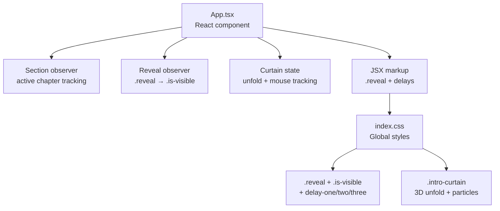
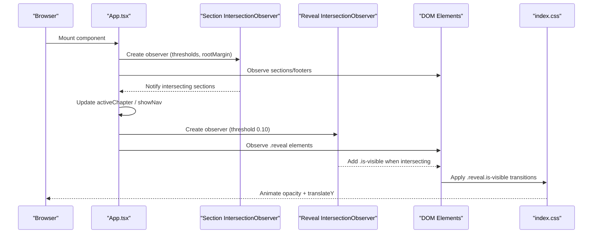
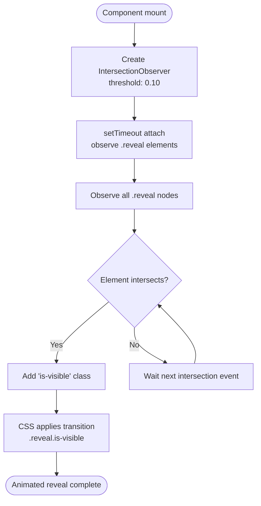
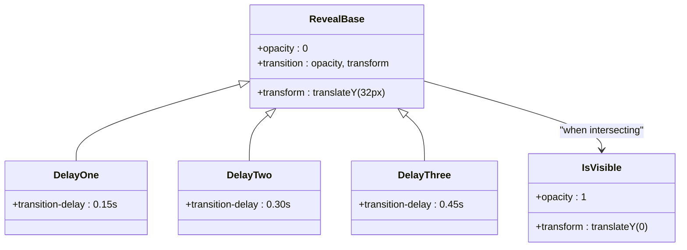
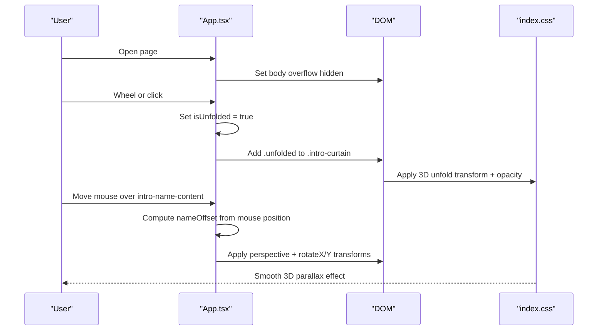
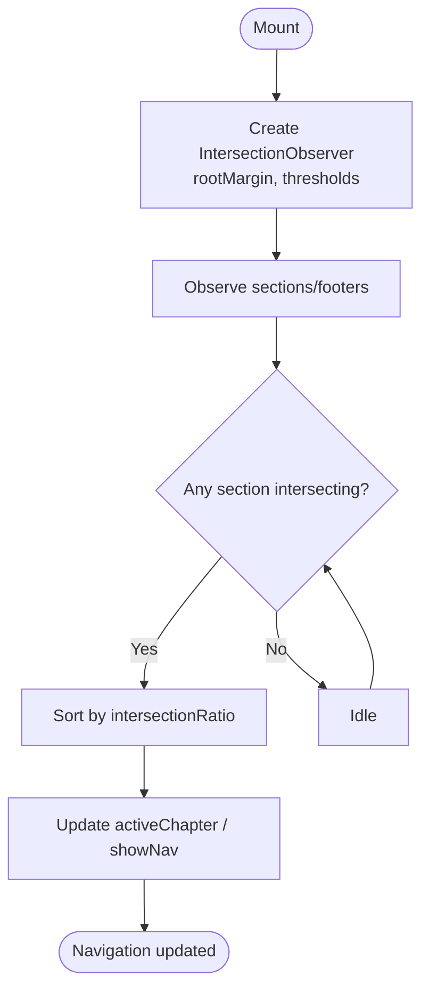
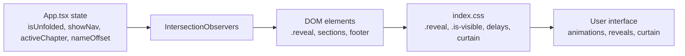

# Scroll Animations & Reveal Effects

<cite>
**Referenced Files in This Document**   
- [App.tsx](file://src/App.tsx)
- [index.css](file://src/index.css)
</cite>

## Table of Contents
1. [Introduction](#introduction)
2. [Project Structure](#project-structure)
3. [Core Components](#core-components)
4. [Architecture Overview](#architecture-overview)
5. [Detailed Component Analysis](#detailed-component-analysis)
6. [Dependency Analysis](#dependency-analysis)
7. [Performance Considerations](#performance-considerations)
8. [Troubleshooting Guide](#troubleshooting-guide)
9. [Conclusion](#conclusion)

## Introduction
This document explains the scroll-triggered reveal animation system used by the portfolio application. It covers:
- The IntersectionObserver implementation that adds `is-visible` to elements with the `.reveal` class when they enter the viewport.
- The staggered delay system using CSS classes like `delay-one`, `delay-two`, and `delay-three`.
- The curtain landing page animation, including 3D perspective transforms and mouse-tracking parallax effects.
- Guidelines for adding new reveal animations, customizing transition timings, and creating complex scroll-based interactions.
- Performance optimizations and browser compatibility considerations.

## Project Structure
The scroll animation behavior is implemented across two main files:
- `src/App.tsx`: React component logic, including IntersectionObserver setup, section tracking, state management, and interactive curtain behavior.
- `src/index.css`: Global styles, including reveal base states, delay utilities, and the curtain landing screen styling.

**Diagram sources**
- [App.tsx:60-85](file://src/App.tsx#L60-L85)
- [App.tsx:94-137](file://src/App.tsx#L94-L137)
- [index.css:87-129](file://src/index.css#L87-L129)
- [index.css:799-808](file://src/index.css#L799-L808)

**Section sources**
- [App.tsx:42-137](file://src/App.tsx#L42-L137)
- [index.css:87-129](file://src/index.css#L87-L129)
- [index.css:799-808](file://src/index.css#L799-L808)

## Core Components
- Section tracking observer: Determines the active chapter based on intersection ratios and updates navigation state.
- Reveal observer: Adds `is-visible` to any element with the `.reveal` class when it enters the viewport.
- Curtain landing animation: A full-screen overlay that unfolds with a 3D perspective transform and supports mouse-driven parallax tilt.
- Staggered delays: CSS utility classes that offset transitions for sequential reveal effects.

Key responsibilities:
- `App.tsx` sets up observers, manages state (`isUnfolded`, `showNav`, `activeChapter`, `nameOffset`), and renders sections with `.reveal` and delay classes.
- `index.css` defines the visual transitions for `.reveal`, `.is-visible`, and delay utilities, plus the curtain layout and 3D unfold animation.

**Section sources**
- [App.tsx:60-85](file://src/App.tsx#L60-L85)
- [App.tsx:94-137](file://src/App.tsx#L94-L137)
- [index.css:87-129](file://src/index.css#L87-L129)
- [index.css:799-808](file://src/index.css#L799-L808)

## Architecture Overview
The animation architecture combines JavaScript-driven observation with CSS-driven transitions:

**Diagram sources**
- [App.tsx:60-85](file://src/App.tsx#L60-L85)
- [index.css:799-808](file://src/index.css#L799-L808)

## Detailed Component Analysis

### IntersectionObserver Reveal System
The reveal system uses an IntersectionObserver to add the `is-visible` class to elements with the `.reveal` class once they enter the viewport.

Implementation highlights:
- Observer creation with a threshold of `0.10`.
- Callback adds `is-visible` to each intersecting target.
- Observers are attached after a small timeout to ensure DOM readiness.
- Cleanup disconnects observers on unmount.

**Diagram sources**
- [App.tsx:77-85](file://src/App.tsx#L77-L85)
- [index.css:799-808](file://src/index.css#L799-L808)

**Section sources**
- [App.tsx:77-85](file://src/App.tsx#L77-L85)
- [index.css:799-808](file://src/index.css#L799-L808)

### Staggered Delay System
Staggered delays are achieved via CSS utility classes applied alongside `.reveal`:
- `delay-one`
- `delay-two`
- `delay-three`

These classes set different `transition-delay` values so that multiple reveal elements animate sequentially rather than simultaneously.

Usage pattern:
- Add `.reveal` to any element you want to animate on scroll.
- Append one of the delay classes to control timing order.
- Adjust delay values in CSS to customize the sequence speed.

**Diagram sources**
- [index.css:799-808](file://src/index.css#L799-L808)

**Section sources**
- [index.css:799-808](file://src/index.css#L799-L808)

### Curtain Landing Page Animation
The curtain landing page is a full-screen overlay that:
- Blocks scrolling until unfolded.
- Unfolds with a 3D perspective transform and fade-out.
- Supports mouse-tracking parallax tilt on the name content.

Behavior breakdown:
- Scroll lock: While not unfolded, body overflow is hidden; wheel events trigger unfolding.
- Unfold state: When `isUnfolded` becomes true, the curtain gains the `.unfolded` class, applying a 3D rotateX and translateY transform along with opacity fade.
- Mouse parallax: The name content container tracks mouse position and applies dynamic `rotateY` and `rotateX` transforms within a 3D perspective context.

**Diagram sources**
- [App.tsx:49-58](file://src/App.tsx#L49-L58)
- [App.tsx:94-137](file://src/App.tsx#L94-L137)
- [index.css:87-129](file://src/index.css#L87-L129)

**Section sources**
- [App.tsx:49-58](file://src/App.tsx#L49-L58)
- [App.tsx:94-137](file://src/App.tsx#L94-L137)
- [index.css:87-129](file://src/index.css#L87-L129)

### Section Tracking Observer
The section tracking observer determines which section is currently visible and updates navigation state accordingly.

Key points:
- Uses thresholds `[0.05, 0.2, 0.5]` and a negative root margin to prioritize sections entering from the bottom.
- Sorts intersecting entries by intersection ratio to select the most visible section.
- Hides navigation for the intro portrait section and shows it for other sections.

**Diagram sources**
- [App.tsx:60-75](file://src/App.tsx#L60-L75)

**Section sources**
- [App.tsx:60-75](file://src/App.tsx#L60-L75)

## Dependency Analysis
The animation system has clear dependencies between React state, DOM observation, and CSS transitions:

**Diagram sources**
- [App.tsx:42-137](file://src/App.tsx#L42-L137)
- [index.css:87-129](file://src/index.css#L87-L129)
- [index.css:799-808](file://src/index.css#L799-L808)

**Section sources**
- [App.tsx:42-137](file://src/App.tsx#L42-L137)
- [index.css:87-129](file://src/index.css#L87-L129)
- [index.css:799-808](file://src/index.css#L799-L808)

## Performance Considerations
- Use IntersectionObserver instead of scroll listeners to avoid layout thrashing and reduce main-thread work.
- Keep thresholds low (e.g., `0.10`) to balance responsiveness and performance.
- Limit the number of observed elements; only observe elements that need reveal animations.
- Prefer CSS transitions for animations; avoid animating expensive properties like width/height during reveal.
- Debounce or throttle heavy computations if extending the system with additional scroll-based effects.
- Ensure cleanup of observers in useEffect return functions to prevent memory leaks.

[No sources needed since this section provides general guidance]

## Troubleshooting Guide
Common issues and resolutions:
- Elements do not reveal:
  - Verify elements have both `.reveal` and optionally a delay class.
  - Check that the IntersectionObserver is observing the correct nodes.
  - Confirm CSS includes `.reveal.is-visible` rules.
- Delays not working:
  - Ensure delay classes (`delay-one`, `delay-two`, `delay-three`) are applied alongside `.reveal`.
  - Verify CSS defines appropriate `transition-delay` values.
- Curtain does not unfold:
  - Confirm `isUnfolded` state toggles correctly on wheel/click.
  - Check that `.intro-curtain.unfolded` styles are present.
- Navigation not updating:
  - Validate section IDs match those being observed.
  - Ensure thresholds and rootMargin are configured appropriately.

**Section sources**
- [App.tsx:60-85](file://src/App.tsx#L60-L85)
- [index.css:87-129](file://src/index.css#L87-L129)
- [index.css:799-808](file://src/index.css#L799-L808)

## Conclusion
The scroll-triggered reveal system combines lightweight JavaScript observation with robust CSS transitions to deliver smooth, performant animations. The curtain landing page enhances user engagement through 3D perspective transforms and mouse-driven parallax. By following the guidelines for adding new reveals, customizing delays, and optimizing performance, developers can extend the system to support complex scroll-based interactions while maintaining accessibility and cross-browser compatibility.

[No sources needed since this section summarizes without analyzing specific files]