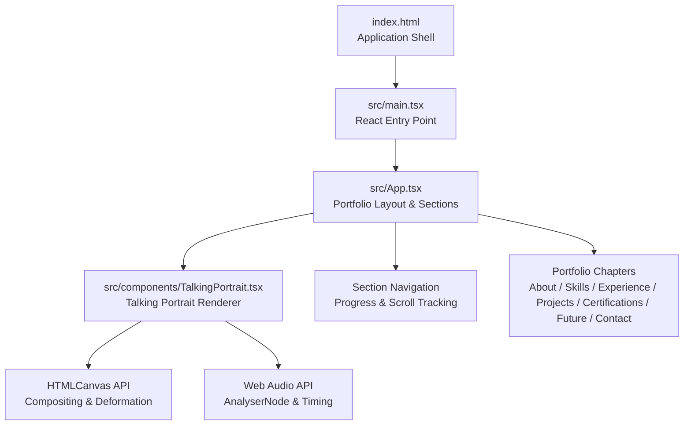
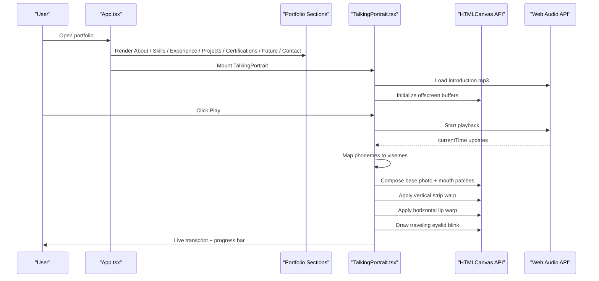
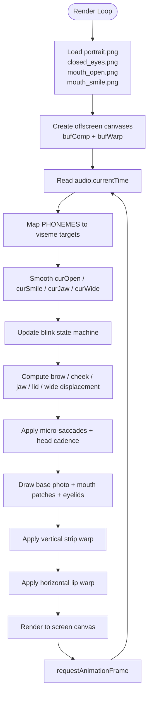
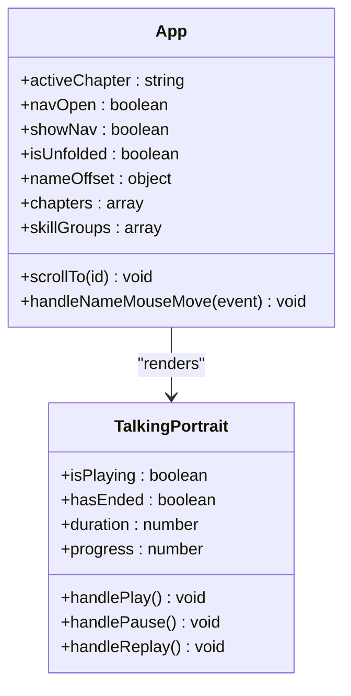
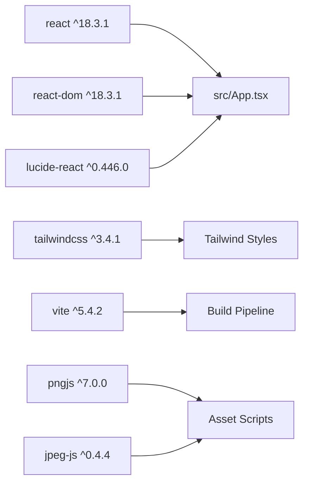

# Project Overview

<cite>
**Referenced Files in This Document**
- [package.json](file://package.json)
- [index.html](file://index.html)
- [src/App.tsx](file://src/App.tsx)
- [src/components/TalkingPortrait.tsx](file://src/components/TalkingPortrait.tsx)
</cite>

## Table of Contents
1. [Introduction](#introduction)
2. [Project Structure](#project-structure)
3. [Core Components](#core-components)
4. [Architecture Overview](#architecture-overview)
5. [Detailed Component Analysis](#detailed-component-analysis)
6. [Dependency Analysis](#dependency-analysis)
7. [Performance Considerations](#performance-considerations)
8. [Troubleshooting Guide](#troubleshooting-guide)
9. [Conclusion](#conclusion)

## Introduction
The Levi Portfolio is a sophisticated React-based portfolio website centered around an advanced photorealistic talking portrait animation system. It demonstrates how a professional personal brand can combine storytelling, interactive sections, and real-time audio-driven facial animation into one cohesive digital experience.

At its core, the project showcases:
- An interactive portfolio with scroll-triggered animations, section tracking, and a cinematic curtain entry.
- A realistic talking portrait that uses Canvas rendering, facial deformation algorithms, natural blink patterns, and synchronized speech transcripts.
- Real-time audio synchronization using Web Audio analysis to subtly influence mouth movement intensity.

For beginners, this portfolio demonstrates what modern web portfolios can achieve beyond static pages: motion, interactivity, personality, and technical depth. For experienced developers, it provides a concrete implementation of a physical facial-deformation renderer, a phoneme-to-viseme timeline, a blink state machine, and a React + Canvas animation loop.

## Project Structure
The repository follows a standard Vite + React + TypeScript layout:
- `index.html` is the application shell.
- `src/main.tsx` mounts the React application.
- `src/App.tsx` implements the portfolio layout, chapters, navigation, scroll tracking, and reveal animations.
- `src/components/TalkingPortrait.tsx` implements the photorealistic talking portrait.
- `public/audio/introduction.mp3` and `public/images/*` provide media assets.
- `package.json` declares dependencies such as React 18.3.1, Vite, Tailwind CSS, and utility libraries for image processing used by development scripts.

**Diagram sources**
- [index.html:1-20](file://index.html#L1-L20)
- [src/App.tsx:1-100](file://src/App.tsx#L1-L100)
- [src/components/TalkingPortrait.tsx:1-35](file://src/components/TalkingPortrait.tsx#L1-L35)

**Section sources**
- [index.html:1-20](file://index.html#L1-L20)
- [package.json:1-37](file://package.json#L1-L37)
- [src/App.tsx:1-100](file://src/App.tsx#L1-L100)

## Core Components
This portfolio has two primary layers:
1. **Portfolio Application Layer:** The main React application manages sections, navigation, scroll behavior, reveal animations, and user interaction.
2. **Talking Portrait Layer:** A dedicated component renders a photorealistic animated face using Canvas, driven by a precise audio timeline and facial deformation logic.

Key responsibilities:
- `App.tsx`: Chapter definitions, scroll observation, progress bar, navigation UI, and section content.
- `TalkingPortrait.tsx`: Photorealistic rendering pipeline, blink state machine, micro-motion, audio sync, and transcript display.

**Section sources**
- [src/App.tsx:10-100](file://src/App.tsx#L10-L100)
- [src/components/TalkingPortrait.tsx:1-35](file://src/components/TalkingPortrait.tsx#L1-L35)

## Architecture Overview
The system architecture combines a declarative React UI with imperative Canvas rendering and Web Audio timing.

**Diagram sources**
- [src/App.tsx:140-175](file://src/App.tsx#L140-L175)
- [src/components/TalkingPortrait.tsx:318-370](file://src/components/TalkingPortrait.tsx#L318-L370)
- [src/components/TalkingPortrait.tsx:434-608](file://src/components/TalkingPortrait.tsx#L434-L608)

## Detailed Component Analysis

### Talking Portrait System
The talking portrait is implemented as a physical facial-deformation renderer rather than simple overlay swaps. Its pipeline includes:
- **Compose Stage:** Base photograph plus authentic photographic patches (mouth open, mouth smile, closed eyelids) are composited into an offscreen buffer.
- **Deform Stage:** Two warps are applied:
  - Vertical strip warp for jaw drop, cheek lift, brow micro-motion, and lower-lid response during blinks.
  - Horizontal column warp for lip-corner stretch and lip pucker around the mouth.
- **Blink System:** A traveling upper eyelid margin moves from crease to lower lid; real closed-eyelid imagery is remapped per frame so the lash line stays aligned. Blink timing includes randomized closing, hold, reopening durations, inter-ocular lead, spontaneous intervals, occasional double blinks, and speech-pause blinks.
- **Micro-Motion:** Zero-mean organic noise adds subtle brow movement, jaw breathing, micro-saccades, and slow head cadence without visible shaking.
- **Audio Synchronization:** Phoneme events map to visemes and aperture values, driving mouth openness, smile weight, jaw depth, and lip width.

**Diagram sources**
- [src/components/TalkingPortrait.tsx:370-408](file://src/components/TalkingPortrait.tsx#L370-L408)
- [src/components/TalkingPortrait.tsx:434-548](file://src/components/TalkingPortrait.tsx#L434-L548)
- [src/components/TalkingPortrait.tsx:549-608](file://src/components/TalkingPortrait.tsx#L549-L608)

#### Key Implementation Details
- **Facial Landmarks:** Eye landmarks define corner points, crease, lash line, lower lid, and pupil center for accurate blink mapping.
- **Mouth Geometry:** Mouth center and jaw region parameters control jaw drop curves and lip deformation bands.
- **Viseme Mapping:** Phoneme events include time ranges, viseme types (`open`, `smile`, `round`, `closed`, `narrow`), and aperture values.
- **Blink Closure Curve:** Eased close → brief hold → eased reopen curve ensures natural eyelid motion.
- **Audio Reactivity:** AnalyserNode frequency data influences volume scalar, slightly modulating mouth openness for realism.

**Section sources**
- [src/components/TalkingPortrait.tsx:35-100](file://src/components/TalkingPortrait.tsx#L35-L100)
- [src/components/TalkingPortrait.tsx:100-216](file://src/components/TalkingPortrait.tsx#L100-L216)
- [src/components/TalkingPortrait.tsx:217-317](file://src/components/TalkingPortrait.tsx#L217-L317)
- [src/components/TalkingPortrait.tsx:318-408](file://src/components/TalkingPortrait.tsx#L318-L408)
- [src/components/TalkingPortrait.tsx:434-608](file://src/components/TalkingPortrait.tsx#L434-L608)

### Portfolio Application Layer
The main application layer provides:
- **Curtain Entry:** A name screen locks scrolling until the user scrolls or clicks to unfold the portfolio.
- **Section Tracking:** IntersectionObserver tracks visible sections and updates active chapter state.
- **Scroll-Reveal Animations:** Elements gain visibility classes when intersecting.
- **Navigation:** Header shows chapter progress, links, and contact link.
- **Chapters:** About, Skills, Experience, Leadership, Projects, Certifications, Future, Contact.

**Diagram sources**
- [src/App.tsx:42-100](file://src/App.tsx#L42-L100)
- [src/components/TalkingPortrait.tsx:318-370](file://src/components/TalkingPortrait.tsx#L318-L370)

**Section sources**
- [src/App.tsx:42-100](file://src/App.tsx#L42-L100)
- [src/App.tsx:100-175](file://src/App.tsx#L100-L175)
- [src/App.tsx:177-727](file://src/App.tsx#L177-L727)

## Dependency Analysis
The project’s runtime dependencies emphasize a modern React ecosystem:
- **React 18.3.1 and react-dom:** Core UI framework.
- **Vite:** Build tool and dev server.
- **Tailwind CSS:** Utility-first styling.
- **lucide-react:** Icon library used across portfolio sections.
- **Development utilities:** pngjs, jpeg-js, and other tools support asset inspection and script-based updates.

**Diagram sources**
- [package.json:13-35](file://package.json#L13-L35)
- [src/App.tsx:1-10](file://src/App.tsx#L1-L10)

**Section sources**
- [package.json:1-37](file://package.json#L1-L37)

## Performance Considerations
- **Canvas Rendering:** Offscreen buffers reduce redundant drawing operations; only necessary warps are applied each frame.
- **Micro-Motion Limits:** Displacements are constrained to sub-pixel ranges to avoid visual jitter while maintaining life-like motion.
- **Audio Analysis Window:** Frequency analysis uses a small band to compute volume scalar efficiently.
- **Request Animation Frame:** The render loop uses `requestAnimationFrame` for smooth 60fps animation where possible.
- **Image Loading Guard:** The render loop waits for images to complete before compositing to prevent blank frames.

[No sources needed since this section provides general guidance]

## Troubleshooting Guide
Common issues and their likely causes:
- **Audio does not play:** Browser may require user gesture; ensure `AudioContext` is resumed after user interaction.
- **Portrait remains static:** Verify that `/images/portrait.png`, `/images/closed_eyes.png`, `/images/mouth_open.png`, and `/images/mouth_smile.png` are present and load successfully.
- **Blink looks unnatural:** Check landmark coordinates and closure curve parameters; ensure blink state machine transitions are not interrupted.
- **Mouth sync drift:** Confirm phoneme timeline matches the actual audio duration and that `audio.currentTime` updates correctly.
- **Scroll tracking broken:** Ensure sections have valid `id` attributes and that IntersectionObserver is observing them.

**Section sources**
- [src/components/TalkingPortrait.tsx:340-358](file://src/components/TalkingPortrait.tsx#L340-L358)
- [src/components/TalkingPortrait.tsx:549-553](file://src/components/TalkingPortrait.tsx#L549-L553)
- [src/App.tsx:60-85](file://src/App.tsx#L60-L85)

## Conclusion
The Levi Portfolio demonstrates a high-quality intersection of professional branding and advanced front-end engineering. It uses React for structured UI composition, Vite for efficient builds, Tailwind CSS for scalable styling, and the Canvas API for photorealistic facial animation. The talking portrait system stands out through its physical deformation approach, natural blink modeling, micro-motion, and tight audio synchronization.

For beginners, it illustrates how a portfolio can become an immersive experience. For experienced developers, it offers a clear reference implementation for real-time Canvas animation, Web Audio integration, and React-driven state management.

[No sources needed since this section summarizes without analyzing specific files]