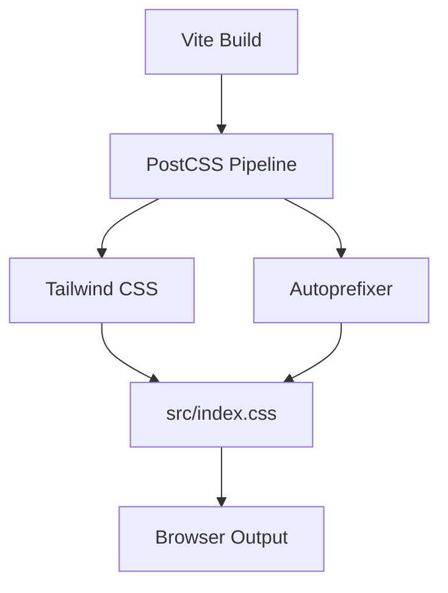
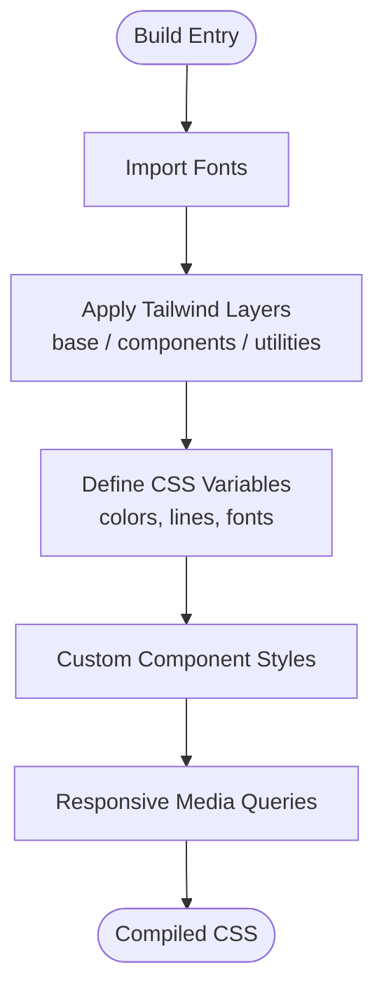
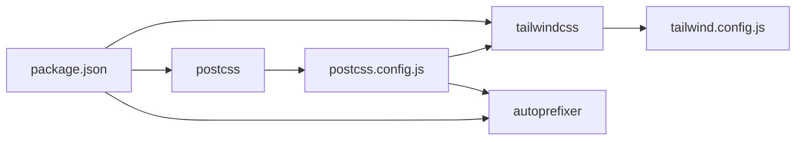

# Styling & Design System

<cite>
**Referenced Files in This Document**
- [tailwind.config.js](file://tailwind.config.js)
- [postcss.config.js](file://postcss.config.js)
- [src/index.css](file://src/index.css)
- [package.json](file://package.json)
</cite>

## Table of Contents
1. [Introduction](#introduction)
2. [Project Structure](#project-structure)
3. [Core Components](#core-components)
4. [Architecture Overview](#architecture-overview)
5. [Detailed Component Analysis](#detailed-component-analysis)
6. [Dependency Analysis](#dependency-analysis)
7. [Performance Considerations](#performance-considerations)
8. [Troubleshooting Guide](#troubleshooting-guide)
9. [Conclusion](#conclusion)
10. [Appendices](#appendices)

## Introduction
This document explains the styling and design system for the project, focusing on how Tailwind CSS is configured and extended, how PostCSS processes styles, and how custom component styles are organized. It also documents responsive breakpoints, mobile-first patterns, color palette, typography, spacing conventions, animations, and cross-browser considerations. The goal is to provide a clear guide for maintaining visual consistency and extending the design system safely.

## Project Structure
The styling layer consists of:
- A minimal Tailwind configuration that scans source files and leaves theme customization open for extension.
- A PostCSS pipeline that runs Tailwind and Autoprefixer.
- A single global stylesheet that imports fonts, applies Tailwind layers, defines design tokens, and contains all custom component styles and responsive rules.

**Diagram sources**
- [postcss.config.js:1-7](file://postcss.config.js#L1-L7)
- [tailwind.config.js:1-9](file://tailwind.config.js#L1-L9)
- [src/index.css:1-4](file://src/index.css#L1-L4)

**Section sources**
- [tailwind.config.js:1-9](file://tailwind.config.js#L1-L9)
- [postcss.config.js:1-7](file://postcss.config.js#L1-L7)
- [src/index.css:1-4](file://src/index.css#L1-L4)

## Core Components
- Tailwind Configuration
  - Scans HTML and TypeScript/JSX/TSX files under src for content classes.
  - Uses an empty extend block, indicating theme customization is done via CSS variables and utility composition rather than Tailwind theme overrides.
  - No plugins are registered.

- PostCSS Configuration
  - Runs Tailwind CSS first, then Autoprefixer to add vendor prefixes as needed.

- Global Stylesheet (src/index.css)
  - Imports Google Fonts.
  - Applies Tailwind base, components, and utilities layers.
  - Defines CSS custom properties for colors and lines.
  - Contains all custom component styles, animations, and responsive media queries.

**Section sources**
- [tailwind.config.js:1-9](file://tailwind.config.js#L1-L9)
- [postcss.config.js:1-7](file://postcss.config.js#L1-L7)
- [src/index.css:1-4](file://src/index.css#L1-L4)

## Architecture Overview
The styling architecture follows a layered approach:
- Base layer: resets, typography defaults, and global variables.
- Components layer: reusable UI primitives and section layouts.
- Utilities layer: Tailwind’s generated utilities composed with custom components.

**Diagram sources**
- [src/index.css:1-4](file://src/index.css#L1-L4)
- [src/index.css:6-12](file://src/index.css#L6-L12)

**Section sources**
- [src/index.css:1-12](file://src/index.css#L1-L12)

## Detailed Component Analysis

### Color Palette and Theme Tokens
- The design uses CSS custom properties for core colors and line opacities:
  - Cream, ink, red, burgundy, warm, line-light, line-dark.
- These variables are applied across sections and components to maintain consistent contrast and tone.
- Section backgrounds use semantic class names (e.g., chapter-cream, chapter-black, chapter-charcoal, chapter-red, chapter-burgundy, chapter-warm) mapped to specific background and text colors.

Guidelines:
- Prefer using CSS variables for brand colors instead of hard-coded hex values.
- Use semantic section classes to switch themes per page area.

**Section sources**
- [src/index.css:6-6](file://src/index.css#L6-L6)
- [src/index.css:27-28](file://src/index.css#L27-L28)

### Typography System
- Primary font stack: Manrope sans-serif.
- Accent serif: Playfair Display for display headings and quotes.
- Monospace: DM Mono for labels, tags, and small metadata.
- Font weights range from regular to extra-bold; letter-spacing and line-height are tuned for readability and hierarchy.
- Headings use clamp() for fluid scaling across viewports.

Guidelines:
- Use DM Mono for uppercase labels and metadata.
- Use Playfair Display sparingly for emphasis and quotes.
- Keep body copy in Manrope for clarity.

**Section sources**
- [src/index.css:1-1](file://src/index.css#L1-L1)
- [src/index.css:32-38](file://src/index.css#L32-L38)
- [src/index.css:70-70](file://src/index.css#L70-L70)

### Spacing Conventions
- Padding and margins are defined inline or via utility classes where appropriate.
- Section padding uses viewport-based units (e.g., 8vw) for scalable layouts.
- Grid gaps are consistent within each layout pattern.

Guidelines:
- Use vw-based padding for large sections to keep proportions consistent.
- Maintain consistent gap sizes within grids and lists.

**Section sources**
- [src/index.css:16-16](file://src/index.css#L16-L16)
- [src/index.css:68-68](file://src/index.css#L68-L68)

### Animations and Motion
- Keyframes include portrait breathing, blinking, mouth movement, voice pulse, curtain unfold, floating particles, gentle sway, progress bar transitions, and reveal animations.
- Transitions are used for hover states, active states, and scroll-triggered reveals.

Guidelines:
- Reuse existing keyframe names when possible.
- Keep animation durations subtle and purposeful.
- Avoid heavy animations on low-power devices by limiting simultaneous transforms and filters.

**Section sources**
- [src/index.css:45-52](file://src/index.css#L45-L52)
- [src/index.css:62-64](file://src/index.css#L62-L64)
- [src/index.css:90-129](file://src/index.css#L90-L129)
- [src/index.css:799-808](file://src/index.css#L799-L808)

### Responsive Design Patterns and Breakpoints
- Mobile-first methodology: default styles target smaller screens; larger screens enhance layout.
- Breakpoints:
  - Max-width 900px: switches navigation to a mobile menu, stacks grids, adjusts hero layout.
  - Max-width 560px: further tightens spacing, reduces grid columns, and scales typography.
- Many components use clamp() for fluid typography and min()/max() for image sizing.

Guidelines:
- Add new breakpoints only when necessary; prefer flexible layouts over many media queries.
- Test at 900px and 560px to ensure consistent behavior.

**Section sources**
- [src/index.css:82-83](file://src/index.css#L82-L83)
- [src/index.css:813-871](file://src/index.css#L813-L871)

### CSS Architecture and Organization
- Single-file organization: all custom styles live in src/index.css.
- Clear section comments separate major areas (e.g., Curtain, Talking Portrait, Portfolio Container, About, Experience Process Flow, Projects Showcase, Certifications).
- Utility-first approach: Tailwind utilities compose most layout and spacing; custom classes encapsulate complex component logic.

Guidelines:
- Keep custom classes scoped to their section with descriptive names.
- Avoid deep nesting; rely on utilities for simple styling.

**Section sources**
- [src/index.css:87-187](file://src/index.css#L87-L187)
- [src/index.css:189-664](file://src/index.css#L189-L664)
- [src/index.css:665-871](file://src/index.css#L665-L871)
- [src/index.css:872-1600](file://src/index.css#L872-L1600)

### PostCSS Processing Pipeline
- Tailwind generates utilities based on scanned content paths.
- Autoprefixer adds vendor prefixes for broader browser support.
- Vite integrates PostCSS automatically during build and dev.

Guidelines:
- Do not manually edit generated Tailwind output.
- Extend Tailwind via config if you need custom utilities or theme values.

**Section sources**
- [postcss.config.js:1-7](file://postcss.config.js#L1-L7)
- [tailwind.config.js:1-9](file://tailwind.config.js#L1-L9)

### Cross-Browser Compatibility
- Autoprefixer ensures compatibility for modern features like backdrop-filter, mask-image, and transform.
- Vendor-prefixed properties are present for mask-image in older WebKit browsers.

Guidelines:
- Rely on Autoprefixer; avoid manual vendor prefixes unless testing shows gaps.
- Test critical interactions on Safari and Chrome.

**Section sources**
- [postcss.config.js:1-7](file://postcss.config.js#L1-L7)
- [src/index.css:230-231](file://src/index.css#L230-L231)
- [src/index.css:440-441](file://src/index.css#L440-L441)
- [src/index.css:456-457](file://src/index.css#L456-L457)

## Dependency Analysis
The styling dependencies are straightforward:
- Tailwind CSS provides utility generation.
- Autoprefixer handles vendor prefixes.
- Google Fonts are loaded via @import.
- Vite orchestrates the build and development server.

**Diagram sources**
- [package.json:18-34](file://package.json#L18-L34)
- [tailwind.config.js:1-9](file://tailwind.config.js#L1-L9)
- [postcss.config.js:1-7](file://postcss.config.js#L1-L7)

**Section sources**
- [package.json:18-34](file://package.json#L18-L34)
- [tailwind.config.js:1-9](file://tailwind.config.js#L1-L9)
- [postcss.config.js:1-7](file://postcss.config.js#L1-L7)

## Performance Considerations
- Minimize custom CSS complexity: prefer Tailwind utilities for simple styling.
- Limit heavy effects: excessive box-shadow, backdrop-filter, and filter can impact performance on mobile.
- Use will-change judiciously; rely on transform and opacity for smooth animations.
- Keep animations short and avoid animating expensive properties like width/height when possible.
- Ensure images and masks are optimized; avoid overly large assets behind gradients and shadows.

[No sources needed since this section provides general guidance]

## Troubleshooting Guide
- Tailwind classes not applied:
  - Verify content paths in tailwind.config.js include your file extensions and directories.
  - Ensure the file is imported into the build entry point.
- Missing vendor prefixes:
  - Confirm Autoprefixer is enabled in postcss.config.js.
  - Check browser targets in your environment; Autoprefixer respects standard configs.
- Fonts not loading:
  - Confirm the @import URL is reachable and CORS allows loading.
  - Validate network requests for Google Fonts.
- Animations jittery on mobile:
  - Reduce simultaneous animations and heavy filters.
  - Prefer transform and opacity changes.

**Section sources**
- [tailwind.config.js:1-9](file://tailwind.config.js#L1-L9)
- [postcss.config.js:1-7](file://postcss.config.js#L1-L7)
- [src/index.css:1-1](file://src/index.css#L1-L1)

## Conclusion
The styling system combines Tailwind utilities with a focused set of custom component styles and design tokens. It emphasizes mobile-first responsiveness, semantic theming through CSS variables, and a clean separation between base, components, and utilities. By following the guidelines here—using variables, reusing animations, and keeping custom CSS scoped—you can extend the design system consistently while maintaining performance and cross-browser compatibility.

[No sources needed since this section summarizes without analyzing specific files]

## Appendices

### Adding New Styles
- Prefer Tailwind utilities for layout, spacing, and color application.
- Create a new custom class only when the pattern is reused or complex.
- Place new styles near related sections in src/index.css and comment clearly.
- Use CSS variables for colors and shared tokens.

**Section sources**
- [src/index.css:6-6](file://src/index.css#L6-L6)
- [src/index.css:87-187](file://src/index.css#L87-L187)

### Creating Responsive Components
- Start with mobile-first defaults.
- Add media queries for 900px and 560px breakpoints as needed.
- Use clamp() for fluid typography and min()/max() for image constraints.

**Section sources**
- [src/index.css:82-83](file://src/index.css#L82-L83)
- [src/index.css:813-871](file://src/index.css#L813-L871)

### Design Tokens Reference
- Colors: cream, ink, red, burgundy, warm.
- Lines: line-light, line-dark.
- Fonts: Manrope, Playfair Display, DM Mono.

**Section sources**
- [src/index.css:6-6](file://src/index.css#L6-L6)
- [src/index.css:1-1](file://src/index.css#L1-L1)