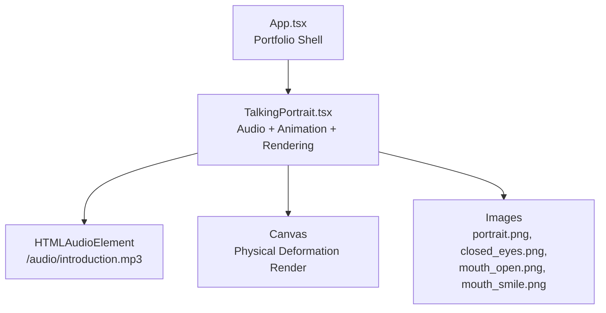
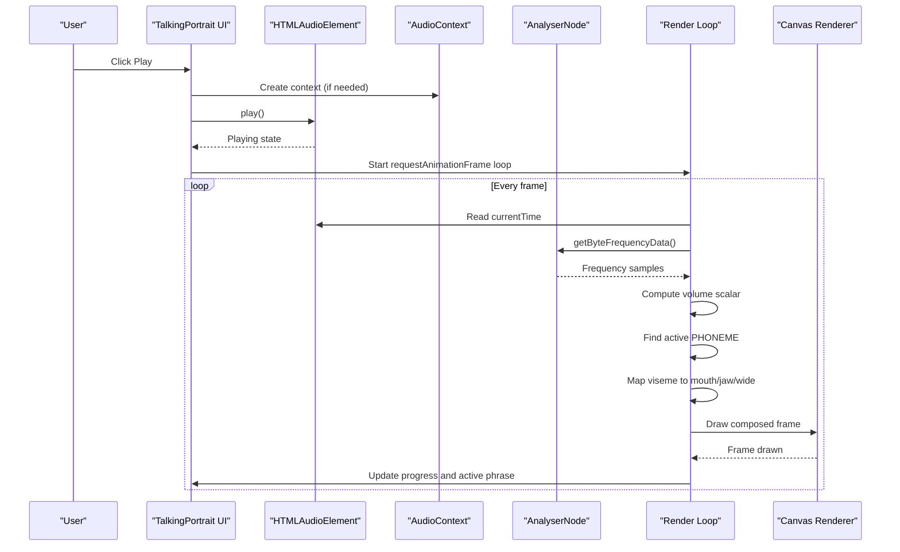
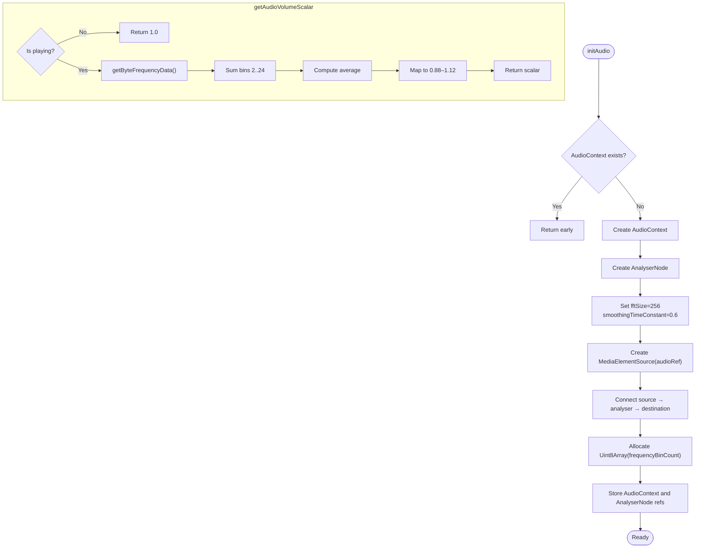
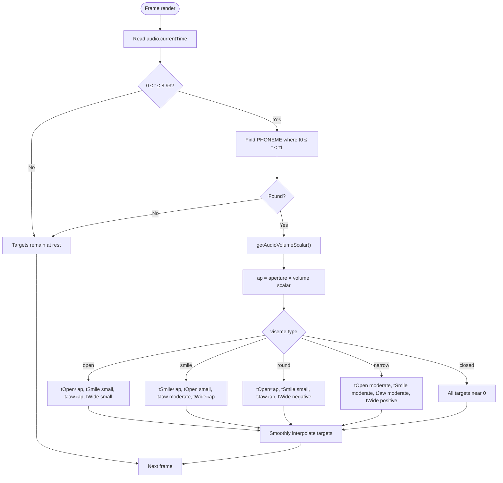
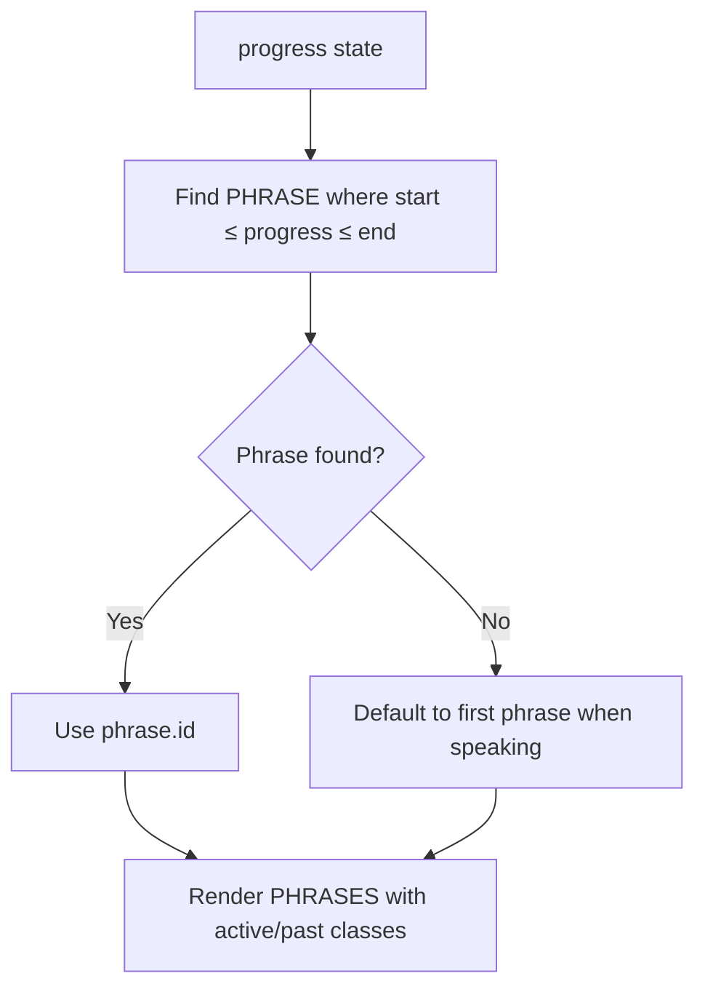
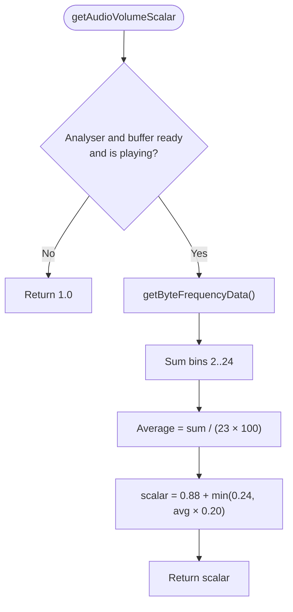
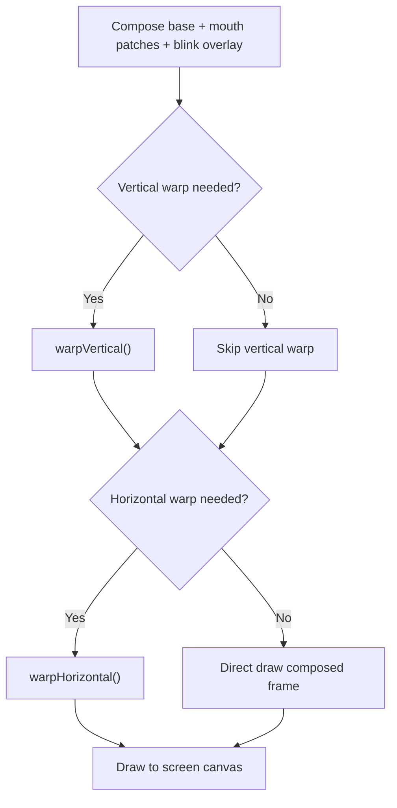
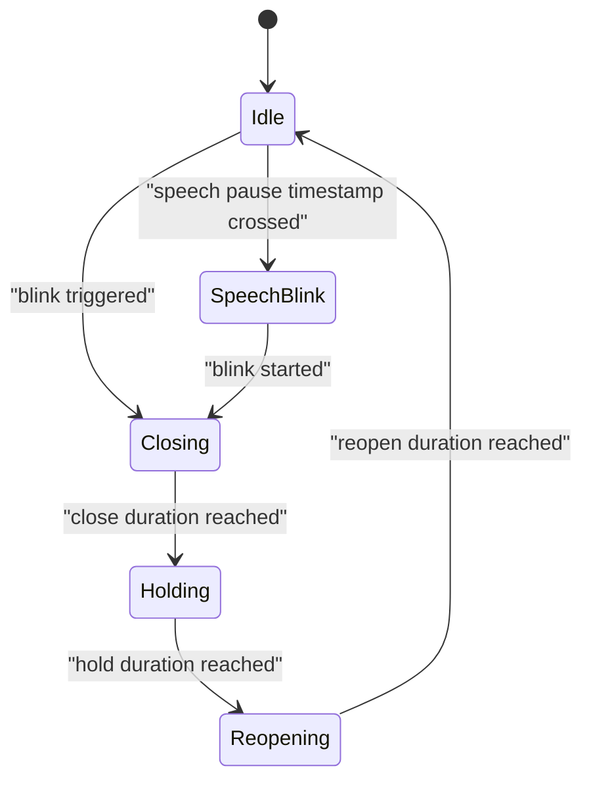
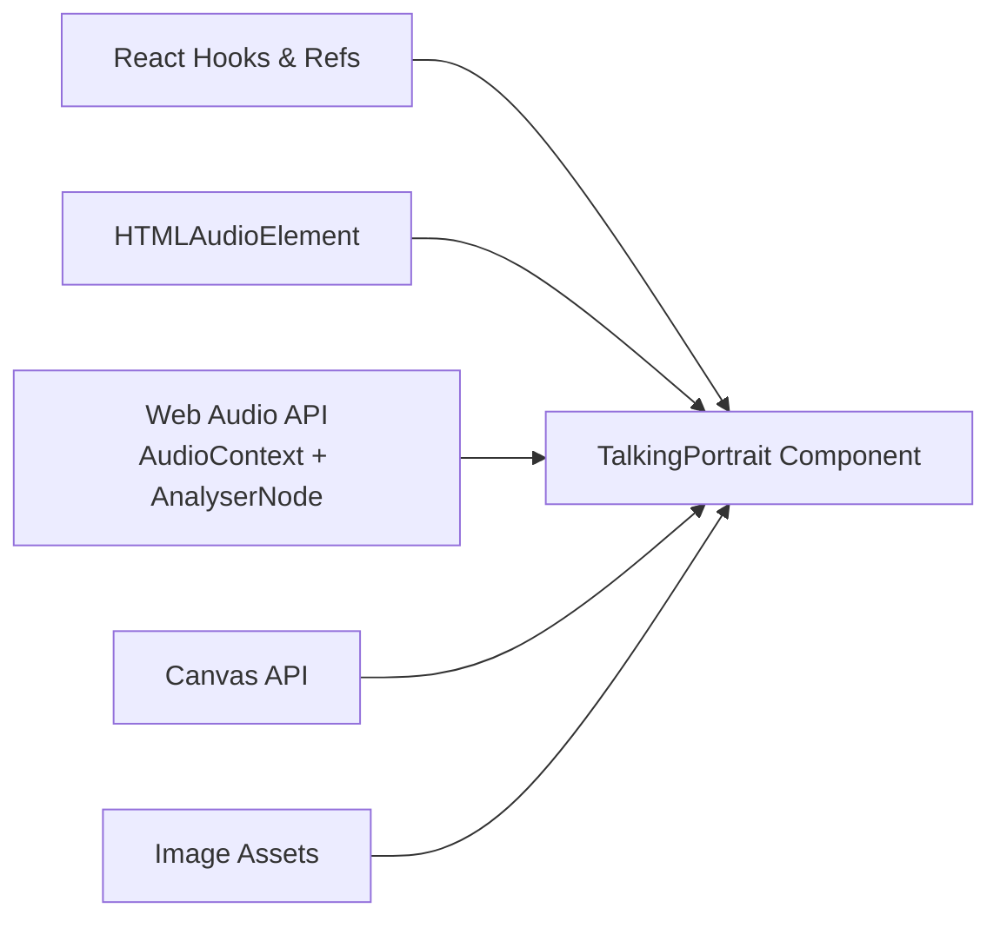

# Audio Synchronization

<cite>
**Referenced Files in This Document**
- [TalkingPortrait.tsx](file://src/components/TalkingPortrait.tsx)
- [App.tsx](file://src/App.tsx)
- [README.txt](file://public/audio/README.txt)
</cite>

## Table of Contents
1. [Introduction](#introduction)
2. [Project Structure](#project-structure)
3. [Core Components](#core-components)
4. [Architecture Overview](#architecture-overview)
5. [Detailed Component Analysis](#detailed-component-analysis)
6. [Dependency Analysis](#dependency-analysis)
7. [Performance Considerations](#performance-considerations)
8. [Troubleshooting Guide](#troubleshooting-guide)
9. [Conclusion](#conclusion)
10. [Appendices](#appendices)

## Introduction
This document explains the Audio Synchronization system that coordinates facial animations with spoken audio. The system drives a photorealistic talking portrait by combining:
- Web Audio API integration using `AudioContext` and `AnalyserNode` for real-time audio analysis and volume detection.
- A phoneme-to-viseme mapping system that converts an audio timeline into facial expressions.
- A transcript display system that synchronizes text phrases with audio playback.
- An audio volume scalar calculation that adjusts animation intensity based on speech volume.
- Canvas-based physical deformation, natural blinking, micro-motion, and visual rendering.

The implementation is contained primarily in the talking portrait component, while the application shell renders it as part of the portfolio page.

**Section sources**
- [App.tsx:142-144](file://src/App.tsx#L142-L144)
- [TalkingPortrait.tsx:1-33](file://src/components/TalkingPortrait.tsx#L1-L33)

## Project Structure
At a high level:
- The application root composes sections and renders the talking portrait inside the introduction section.
- The talking portrait component owns all audio, canvas, animation, and synchronization logic.
- Public assets include the audio file referenced by the component and image assets used for the face, mouth patches, and closed eyes.

**Diagram sources**
- [App.tsx:142-144](file://src/App.tsx#L142-L144)
- [TalkingPortrait.tsx:318-330](file://src/components/TalkingPortrait.tsx#L318-L330)
- [TalkingPortrait.tsx:380-391](file://src/components/TalkingPortrait.tsx#L380-L391)
- [TalkingPortrait.tsx:728-742](file://src/components/TalkingPortrait.tsx#L728-L742)

**Section sources**
- [App.tsx:142-144](file://src/App.tsx#L142-L144)
- [TalkingPortrait.tsx:318-330](file://src/components/TalkingPortrait.tsx#L318-L330)

## Core Components
The audio synchronization system is implemented inside the talking portrait component. Its core responsibilities are:
- Managing the HTML audio element and its lifecycle.
- Creating and configuring the Web Audio API graph with `AudioContext` and `AnalyserNode`.
- Computing a real-time audio volume scalar from frequency data.
- Mapping the current audio time to phoneme events and viseme targets.
- Driving physical facial deformation through vertical and horizontal warps.
- Rendering natural blinks, micro-motion, and animated mouth patches.
- Displaying synchronized transcript phrases.

Key data structures:
- `PHONEMES`: Time-based phoneme events with viseme types and aperture values.
- `PHRASES`: Transcript phrases with start and end times.
- `SPEECH_BLINKS`: Timestamps for natural blinks during speech pauses.

**Section sources**
- [TalkingPortrait.tsx:100-215](file://src/components/TalkingPortrait.tsx#L100-L215)
- [TalkingPortrait.tsx:318-368](file://src/components/TalkingPortrait.tsx#L318-L368)

## Architecture Overview
The audio synchronization pipeline connects audio playback to facial animation and transcript display.

**Diagram sources**
- [TalkingPortrait.tsx:340-368](file://src/components/TalkingPortrait.tsx#L340-L368)
- [TalkingPortrait.tsx:434-484](file://src/components/TalkingPortrait.tsx#L434-L484)
- [TalkingPortrait.tsx:549-603](file://src/components/TalkingPortrait.tsx#L549-L603)
- [TalkingPortrait.tsx:611-627](file://src/components/TalkingPortrait.tsx#L611-L627)

## Detailed Component Analysis

### Web Audio API Integration and Volume Detection
The component initializes an `AudioContext` and an `AnalyserNode`, connects the HTML audio element to the analyser, and then to the destination. It also allocates a frequency data buffer sized to the analyser’s `frequencyBinCount`.

Volume detection works by reading frequency bins and averaging a low-frequency band to estimate energy. The result is mapped into a scalar range of approximately 0.88 to 1.12, which modulates the phoneme aperture.

Important behaviors:
- Audio context creation supports both standard and webkit prefixes.
- The analyser uses FFT size 256 and smoothing constant 0.6.
- If audio context setup fails, a warning is logged and the component continues without audio reactivity.
- Playback and replay handle suspended contexts by resuming before playing.

**Diagram sources**
- [TalkingPortrait.tsx:340-368](file://src/components/TalkingPortrait.tsx#L340-L368)

**Section sources**
- [TalkingPortrait.tsx:340-368](file://src/components/TalkingPortrait.tsx#L340-L368)

### Phoneme-to-Viseme Mapping System
The phoneme timeline defines discrete speech segments with start and end times, viseme types, and aperture values. Viseme types include:
- `open`: Open mouth shape.
- `smile`: Smiling mouth shape.
- `round`: Rounded mouth shape.
- `narrow`: Narrow mouth shape.
- `closed`: Lips resting together.

Each event has:
- `t0`: Start time in seconds.
- `t1`: End time in seconds.
- `viseme`: One of the five viseme types.
- `aperture`: Mouth openness value between 0 and 1.

During playback, the render loop finds the active phoneme for the current audio time. It multiplies the base aperture by the audio volume scalar to produce an adjusted aperture. Then it maps the viseme to target weights for open mouth, smile, jaw drop, and horizontal lip stretch.

**Diagram sources**
- [TalkingPortrait.tsx:100-197](file://src/components/TalkingPortrait.tsx#L100-L197)
- [TalkingPortrait.tsx:442-484](file://src/components/TalkingPortrait.tsx#L442-L484)

**Section sources**
- [TalkingPortrait.tsx:100-197](file://src/components/TalkingPortrait.tsx#L100-L197)
- [TalkingPortrait.tsx:442-484](file://src/components/TalkingPortrait.tsx#L442-L484)

### Transcript Display System
The transcript display synchronizes visible phrases with audio playback. Each phrase has:
- `id`: Unique identifier.
- `text`: Phrase text.
- `start`: Start time in seconds.
- `end`: End time in seconds.

The active phrase is computed from the current progress. Phrases are rendered with classes indicating whether they are active or already spoken.

**Diagram sources**
- [TalkingPortrait.tsx:207-212](file://src/components/TalkingPortrait.tsx#L207-L212)
- [TalkingPortrait.tsx:334-338](file://src/components/TalkingPortrait.tsx#L334-L338)
- [TalkingPortrait.tsx:674-691](file://src/components/TalkingPortrait.tsx#L674-L691)

**Section sources**
- [TalkingPortrait.tsx:207-212](file://src/components/TalkingPortrait.tsx#L207-L212)
- [TalkingPortrait.tsx:334-338](file://src/components/TalkingPortrait.tsx#L334-L338)
- [TalkingPortrait.tsx:674-691](file://src/components/TalkingPortrait.tsx#L674-L691)

### Audio Volume Scalar Calculation
The volume scalar adjusts animation intensity based on speech volume. It computes an average over a low-frequency band and maps it to a bounded range around 1.0.

Behavior:
- Returns 1.0 when not playing or analyser data is unavailable.
- Reads frequency data each frame while playing.
- Sums bins 2 through 24 and divides by the number of summed bins normalized by 100.
- Maps the average to a scalar between 0.88 and 1.12.

**Diagram sources**
- [TalkingPortrait.tsx:360-368](file://src/components/TalkingPortrait.tsx#L360-L368)

**Section sources**
- [TalkingPortrait.tsx:360-368](file://src/components/TalkingPortrait.tsx#L360-L368)

### Facial Deformation and Rendering Pipeline
The component composes the base portrait with authentic mouth patches, applies physical warps, draws traveling-lid blinks, and adds micro-motion.

Pipeline stages:
1. Compose stage: Base photo plus mouth patches and blink overlays.
2. Vertical warp: Jaw drop, cheek lift, brow motion, and lower-lid response.
3. Horizontal warp: Lip-corner stretch for smiles and pucker for round shapes.
4. Micro-motion: Sub-pixel head movement, breath noise, and gaze saccades.

**Diagram sources**
- [TalkingPortrait.tsx:549-603](file://src/components/TalkingPortrait.tsx#L549-L603)
- [TalkingPortrait.tsx:270-316](file://src/components/TalkingPortrait.tsx#L270-L316)

**Section sources**
- [TalkingPortrait.tsx:270-316](file://src/components/TalkingPortrait.tsx#L270-L316)
- [TalkingPortrait.tsx:549-603](file://src/components/TalkingPortrait.tsx#L549-L603)

### Blink and Micro-Motion System
Blinks are modeled with closing, hold, and reopening phases, including randomized timing and inter-ocular lead. Speech pauses trigger additional blinks. Micro-motion includes breath, brow movement, cheek response, and subtle head sway.

**Diagram sources**
- [TalkingPortrait.tsx:214-225](file://src/components/TalkingPortrait.tsx#L214-L225)
- [TalkingPortrait.tsx:423-432](file://src/components/TalkingPortrait.tsx#L423-L432)
- [TalkingPortrait.tsx:465-478](file://src/components/TalkingPortrait.tsx#L465-L478)
- [TalkingPortrait.tsx:486-507](file://src/components/TalkingPortrait.tsx#L486-L507)

**Section sources**
- [TalkingPortrait.tsx:214-225](file://src/components/TalkingPortrait.tsx#L214-L225)
- [TalkingPortrait.tsx:423-432](file://src/components/TalkingPortrait.tsx#L423-L432)
- [TalkingPortrait.tsx:465-478](file://src/components/TalkingPortrait.tsx#L465-L478)
- [TalkingPortrait.tsx:486-507](file://src/components/TalkingPortrait.tsx#L486-L507)

## Dependency Analysis
The talking portrait component depends on:
- React hooks and refs for state and DOM access.
- HTMLAudioElement for audio playback and metadata/time updates.
- Web Audio API (`AudioContext`, `AnalyserNode`) for real-time analysis.
- Canvas API for drawing and physical deformation.
- Image assets for the base portrait, closed eyes, and mouth patches.

**Diagram sources**
- [TalkingPortrait.tsx:1-2](file://src/components/TalkingPortrait.tsx#L1-L2)
- [TalkingPortrait.tsx:318-330](file://src/components/TalkingPortrait.tsx#L318-L330)
- [TalkingPortrait.tsx:340-358](file://src/components/TalkingPortrait.tsx#L340-L358)
- [TalkingPortrait.tsx:370-402](file://src/components/TalkingPortrait.tsx#L370-L402)
- [TalkingPortrait.tsx:728-742](file://src/components/TalkingPortrait.tsx#L728-L742)

**Section sources**
- [TalkingPortrait.tsx:318-402](file://src/components/TalkingPortrait.tsx#L318-L402)
- [TalkingPortrait.tsx:728-742](file://src/components/TalkingPortrait.tsx#L728-L742)

## Performance Considerations
- The render loop runs every frame via `requestAnimationFrame`.
- Frequency data is read only while playing; otherwise, the volume scalar returns 1.0.
- Vertical and horizontal warps are conditionally applied only when displacement exceeds thresholds.
- Offscreen canvases reduce redundant drawing operations.
- Image loading checks prevent rendering until assets are ready.

Recommendations:
- Keep `fftSize` modest to avoid excessive CPU usage.
- Avoid heavy per-frame allocations inside the render loop.
- Ensure images are preloaded or cached to minimize startup latency.
- Consider throttling frequency analysis if other UI work increases.

[No sources needed since this section provides general guidance]

## Troubleshooting Guide
Common issues and resolutions:
- AudioContext setup failure: The component logs a warning and continues without audio reactivity. Verify browser support and user gesture requirements.
- Suspended audio context: Resume the context before playback.
- Playback errors: Catch and log playback exceptions; ensure the audio file is available and autoplay policies are satisfied.
- Missing assets: Ensure `/images/portrait.png`, `/images/closed_eyes.png`, `/images/mouth_open.png`, `/images/mouth_smile.png`, and `/audio/introduction.mp3` exist.

Browser compatibility considerations:
- Web Audio API requires a user gesture in many browsers; initialization should be tied to user interaction.
- Some browsers require the webkit prefix for `AudioContext`; the component handles this.
- Canvas drawing performance varies across devices; test on mobile and desktop.

Error handling locations:
- Audio context creation and analyser setup.
- Playback and replay functions.
- Audio metadata and time update handlers.

**Section sources**
- [TalkingPortrait.tsx:340-358](file://src/components/TalkingPortrait.tsx#L340-L358)
- [TalkingPortrait.tsx:611-648](file://src/components/TalkingPortrait.tsx#L611-L648)
- [TalkingPortrait.tsx:728-742](file://src/components/TalkingPortrait.tsx#L728-L742)

## Conclusion
The Audio Synchronization system integrates Web Audio API analysis with a precise phoneme-to-viseme timeline to animate a photorealistic portrait. It combines real-time volume detection, physical facial deformation, natural blinking, and synchronized transcript display. The design keeps the audio timeline authoritative and ensures smooth, responsive animation while maintaining robust error handling and browser compatibility practices.

[No sources needed since this section summarizes without analyzing specific files]

## Appendices

### Adding a New Audio Track
Steps:
1. Place the new audio file under `public/audio/`.
2. Update the audio element source path in the component.
3. Align the `PHONEMES` array timestamps with the new audio duration.
4. Update `PHRASES` to match the new transcript timing.
5. Test playback, analyser data, and visual synchronization.

Relevant paths:
- Audio element source and metadata handlers.
- Phoneme timeline structure.
- Transcript phrase structure.

**Section sources**
- [TalkingPortrait.tsx:728-742](file://src/components/TalkingPortrait.tsx#L728-L742)
- [TalkingPortrait.tsx:100-197](file://src/components/TalkingPortrait.tsx#L100-L197)
- [TalkingPortrait.tsx:207-212](file://src/components/TalkingPortrait.tsx#L207-L212)

### Modifying Phoneme Mappings
To adjust phoneme mappings:
- Edit the `PHONEMES` array entries to reflect new viseme types and aperture values.
- Ensure `t0` and `t1` boundaries align with the audio track.
- Validate that viseme types map correctly to mouth/jaw/wide targets in the render loop.

Guidance:
- `open`: Emphasize mouth opening and jaw drop.
- `smile`: Emphasize lip-corner stretch and moderate jaw.
- `round`: Emphasize rounded lips and jaw.
- `narrow`: Emphasize narrow lip shape.
- `closed`: Rest lips together.

**Section sources**
- [TalkingPortrait.tsx:100-197](file://src/components/TalkingPortrait.tsx#L100-L197)
- [TalkingPortrait.tsx:442-463](file://src/components/TalkingPortrait.tsx#L442-L463)

### Implementing Custom Audio-Reactive Behaviors
To add custom audio-reactive behaviors:
- Extend the volume scalar computation or introduce additional metrics from frequency data.
- Map new metrics to animation parameters such as eye openness, eyebrow lift, or background effects.
- Ensure the behavior is gated by playback state and analyser availability.

Example approach:
- Read additional frequency bands or compute spectral centroid.
- Apply non-linear scaling similar to the existing volume scalar.
- Blend the new parameter into the render loop alongside existing targets.

**Section sources**
- [TalkingPortrait.tsx:360-368](file://src/components/TalkingPortrait.tsx#L360-L368)
- [TalkingPortrait.tsx:434-484](file://src/components/TalkingPortrait.tsx#L434-L484)

### Data Model Reference

#### Phoneme Event
- `t0`: Start time in seconds.
- `t1`: End time in seconds.
- `viseme`: Viseme type (`open`, `smile`, `round`, `narrow`, `closed`).
- `aperture`: Mouth openness value between 0 and 1.

#### Transcript Phrase
- `id`: Unique identifier.
- `text`: Phrase text.
- `start`: Start time in seconds.
- `end`: End time in seconds.

**Section sources**
- [TalkingPortrait.tsx:100-106](file://src/components/TalkingPortrait.tsx#L100-L106)
- [TalkingPortrait.tsx:200-205](file://src/components/TalkingPortrait.tsx#L200-L205)

### Asset Notes
The public audio directory contains documentation about alignment between the phoneme timeline, transcript phrases, and the MP3 file. Ensure any changes preserve this alignment.

**Section sources**
- [README.txt:5-5](file://public/audio/README.txt#L5-L5)