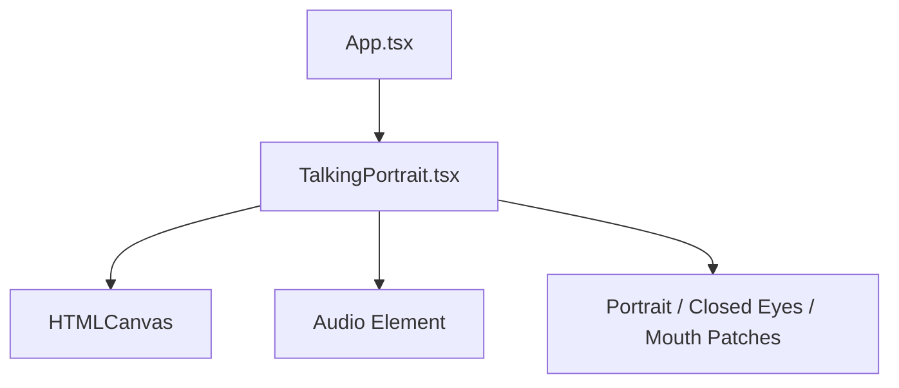
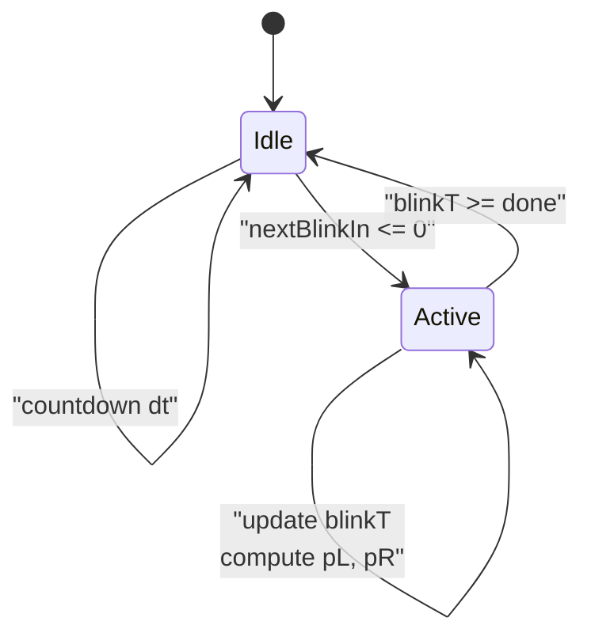
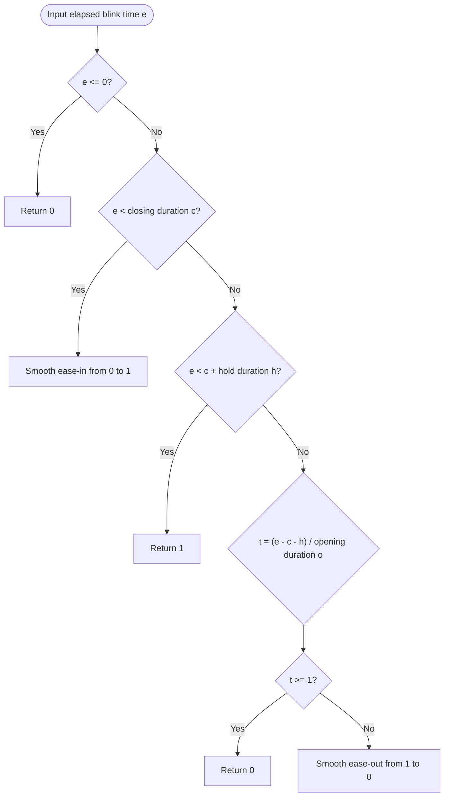
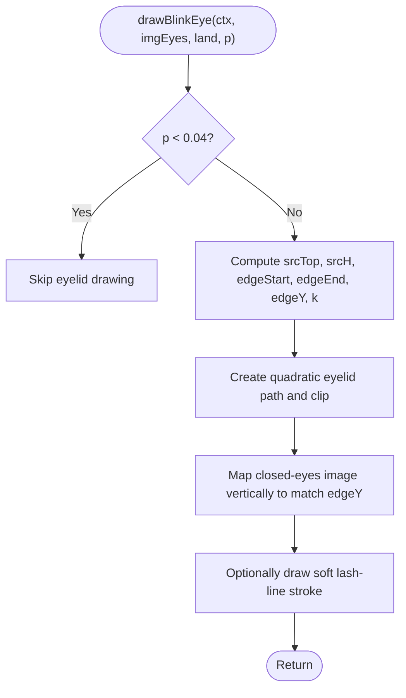
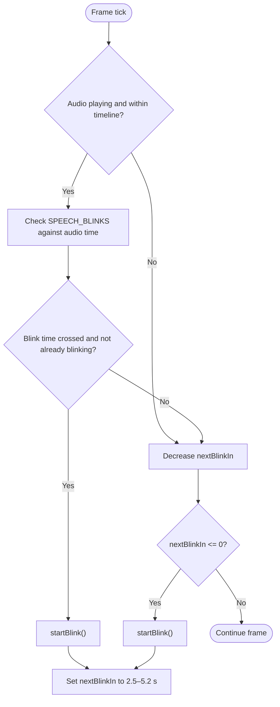
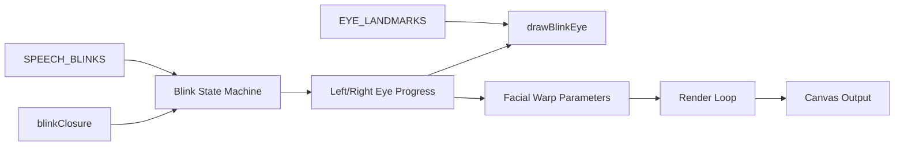

# Blink Animation System

<cite>
**Referenced Files in This Document**
- [TalkingPortrait.tsx](file://src/components/TalkingPortrait.tsx)
</cite>

## Table of Contents
1. [Introduction](#introduction)
2. [Project Structure](#project-structure)
3. [Core Components](#core-components)
4. [Architecture Overview](#architecture-overview)
5. [Detailed Component Analysis](#detailed-component-analysis)
6. [Dependency Analysis](#dependency-analysis)
7. [Performance Considerations](#performance-considerations)
8. [Troubleshooting Guide](#troubleshooting-guide)
9. [Conclusion](#conclusion)
10. [Appendices](#appendices)

## Introduction
This document explains the Blink Animation System that produces natural, human-like eye blinking for a photorealistic talking portrait. The system is implemented inside the React component responsible for rendering and animating the face on an HTML canvas. It combines:

- A blink state machine with randomized closure, hold, and reopening phases.
- A traveling-lid technique that maps closed eyelid imagery along the advancing eyelid margin.
- An inter-ocular lead effect so one eye starts slightly before the other.
- Natural timing with random intervals, occasional double blinks, and speech-pause synchronization through a predefined blink schedule.

The goal is to make the eyes feel alive without disrupting the existing speech articulation, lip-sync, or facial deformation pipeline.

## Project Structure
The blink animation logic lives entirely within the talking portrait component. It composes base portrait assets, mouth patches, and closed-eye imagery into offscreen canvases, applies vertical and horizontal warps, and renders each frame using `requestAnimationFrame`.



**Diagram sources**
- [TalkingPortrait.tsx:318-608](file://src/components/TalkingPortrait.tsx#L318-L608)

**Section sources**
- [TalkingPortrait.tsx:318-608](file://src/components/TalkingPortrait.tsx#L318-L608)

## Core Components
The blink system is composed of several cooperating parts:

| Component | Responsibility | Key Implementation Details |
|---|---|---|
| Blink state machine | Controls whether a blink is active, tracks elapsed blink time, and computes per-eye closure progress | Uses `blinkActive`, `blinkT`, `blinkC`, `blinkH`, `blinkO`, `blinkLeadL`, `blinkLeadR`, and `nextBlinkIn` |
| Closure curve | Produces eased close → hold → reopen values from 0 to 1 | `blinkClosure(e, c, h, o)` uses smooth easing ramps |
| Traveling-lid renderer | Draws the real closed-eyelid image mapped to the advancing lid margin | `drawBlinkEye(ctx, imgEyes, land, p)` clips and remaps the eyelid region |
| Inter-ocular lead | Delays one eye’s blink start by up to ~32 ms | Randomly assigns `blinkLeadL` or `blinkLeadR` |
| Timing controller | Schedules spontaneous blinks, double blinks, and speech-synchronized blinks | Random interval 2.5–5.2 seconds; 13% chance of double blink; `SPEECH_BLINKS` array |
| Facial integration | Blends blink motion with brow dip, lower-lid lift, cheek movement, jaw drop, and micro-gaze | Computes `pMax = max(pL, pR)` and feeds it into brow/lid/cheek displacement functions |

**Section sources**
- [TalkingPortrait.tsx:217-268](file://src/components/TalkingPortrait.tsx#L217-L268)
- [TalkingPortrait.tsx:410-507](file://src/components/TalkingPortrait.tsx#L410-L507)
- [TalkingPortrait.tsx:509-583](file://src/components/TalkingPortrait.tsx#L509-L583)

## Architecture Overview
At runtime, the component runs a continuous render loop. Each frame:

1. Reads audio time if playing.
2. Maps phonemes to mouth shape targets.
3. Triggers speech-pause blinks when audio time crosses configured blink times.
4. Updates the blink state machine and computes left/right eye closure progress.
5. Composes the base portrait, mouth patches, and traveling-lid blink overlays.
6. Applies vertical and horizontal warps for jaw, cheeks, brows, lids, and lips.
7. Draws the final frame to the screen canvas.

```mermaid
sequenceDiagram
participant Loop as "Render Loop"
participant Audio as "Audio Timeline"
participant Blink as "Blink State Machine"
participant Draw as "Compositing & Warping"
participant Canvas as "Screen Canvas"
Loop->>Audio : Read current playback time
Audio-->>Loop : Time in seconds
Loop->>Blink : Update nextBlinkIn and blinkT
Blink-->>Loop : pL, pR closure progress
Loop->>Draw : Compose base + mouth patches + drawBlinkEye
Draw->>Draw : Apply vertical warp (jaw, brow, lids, cheeks)
Draw->>Draw : Apply horizontal warp (lip stretch/pucker)
Draw->>Canvas : Render final frame
```

**Diagram sources**
- [TalkingPortrait.tsx:434-608](file://src/components/TalkingPortrait.tsx#L434-L608)

## Detailed Component Analysis

### Blink State Machine
The blink state machine has two primary states:

- **Idle**: Waiting for the next blink. `nextBlinkIn` counts down each frame. When it reaches zero, a blink starts.
- **Active**: A blink is in progress. `blinkT` accumulates elapsed time, and both eyes compute closure progress through `blinkClosure`.

Key behaviors:

- Closure phase duration: 95–140 ms.
- Closed-hold phase duration: 55–105 ms.
- Reopening phase duration: 130–190 ms.
- Inter-ocular lead: One eye starts 0–32 ms earlier than the other.
- Double blink probability: 13%.
- Spontaneous blink interval: 2.5–5.2 seconds.



**Diagram sources**
- [TalkingPortrait.tsx:410-507](file://src/components/TalkingPortrait.tsx#L410-L507)

**Section sources**
- [TalkingPortrait.tsx:410-507](file://src/components/TalkingPortrait.tsx#L410-L507)

### Closure Curve
The closure curve converts elapsed blink time into a normalized 0–1 value representing how closed the eye is. It supports three phases:

1. **Closing ramp**: Smooth ease-in from open to fully closed.
2. **Hold period**: Fully closed for a short duration.
3. **Reopening ramp**: Smooth ease-out back to open.

This curve is applied independently to each eye, offset by their respective inter-ocular lead.



**Diagram sources**
- [TalkingPortrait.tsx:217-225](file://src/components/TalkingPortrait.tsx#L217-L225)

**Section sources**
- [TalkingPortrait.tsx:217-225](file://src/components/TalkingPortrait.tsx#L217-L225)

### Traveling-Lid Technique
The traveling-lid technique avoids flashing or swapping images. Instead, it draws the real closed-eyelid photograph once and maps its vertical region so the lash line aligns exactly with the advancing eyelid edge. As `p` increases from 0 to 1:

- The clipped eyelid region grows downward from the crease toward the lower lid.
- The closed-eyelid image is vertically scaled so its internal lash position matches the current edge.
- A soft lash-line stroke fades in as closure progresses.
- At very low closure values, no eyelid overlay is drawn to avoid artifacts.



**Diagram sources**
- [TalkingPortrait.tsx:227-268](file://src/components/TalkingPortrait.tsx#L227-L268)

**Section sources**
- [TalkingPortrait.tsx:227-268](file://src/components/TalkingPortrait.tsx#L227-L268)

### Inter-Ocular Lead Effect
Each blink randomly selects which eye leads:

- If the left eye leads, `blinkLeadL > 0` and `blinkLeadR = 0`.
- If the right eye leads, `blinkLeadR > 0` and `blinkLeadL = 0`.
- The lead delay is between 0 and 32 ms.
- Both eyes still use the same closure, hold, and reopening durations; only the start time differs.

This small asymmetry makes the blink look less mechanical and more organic.

**Section sources**
- [TalkingPortrait.tsx:423-432](file://src/components/TalkingPortrait.tsx#L423-L432)
- [TalkingPortrait.tsx:495-499](file://src/components/TalkingPortrait.tsx#L495-L499)

### Natural Timing System
The timing system combines three layers:

| Layer | Behavior | Configuration |
|---|---|---|
| Spontaneous interval | Random wait before starting a new blink | 2.5–5.2 seconds |
| Double blink | Occasionally triggers another blink shortly after the first | 13% probability |
| Speech-pause synchronization | Forces a blink at specific moments aligned with breath pauses in the audio timeline | `SPEECH_BLINKS` array |



**Diagram sources**
- [TalkingPortrait.tsx:465-475](file://src/components/TalkingPortrait.tsx#L465-L475)
- [TalkingPortrait.tsx:490-507](file://src/components/TalkingPortrait.tsx#L490-L507)

**Section sources**
- [TalkingPortrait.tsx:465-507](file://src/components/TalkingPortrait.tsx#L465-L507)

### Integration With Facial Deformation
Blink motion is not isolated. The maximum eye closure `pMax` influences:

- Brow dip: Brows subtly lower as eyes close.
- Lower-lid response: The under-eye region lifts slightly during closure.
- Cheek movement: Cheeks respond to smile and expression weights.
- Jaw drop: Jaw depth responds to speech articulation and breathing noise.

This ensures the blink feels physically connected to the rest of the face rather than layered on top.

**Section sources**
- [TalkingPortrait.tsx:509-531](file://src/components/TalkingPortrait.tsx#L509-L531)

## Dependency Analysis
The blink system depends on several shared components and data structures:



**Diagram sources**
- [TalkingPortrait.tsx:41-58](file://src/components/TalkingPortrait.tsx#L41-L58)
- [TalkingPortrait.tsx:214-268](file://src/components/TalkingPortrait.tsx#L214-L268)
- [TalkingPortrait.tsx:410-583](file://src/components/TalkingPortrait.tsx#L410-L583)

**Section sources**
- [TalkingPortrait.tsx:41-58](file://src/components/TalkingPortrait.tsx#L41-L58)
- [TalkingPortrait.tsx:214-268](file://src/components/TalkingPortrait.tsx#L214-L268)
- [TalkingPortrait.tsx:410-583](file://src/components/TalkingPortrait.tsx#L410-L583)

## Performance Considerations
The blink system is designed to be lightweight and integrated into an already demanding render loop:

- **Offscreen composition**: The base portrait, mouth patches, and eyelid overlays are composed into an offscreen buffer before warping.
- **Conditional warping**: Vertical and horizontal warps are only applied when needed, avoiding unnecessary pixel operations.
- **Small eyelid region**: The traveling-lid technique operates only over the eye region, not the full image.
- **Single closed-eyes asset**: The system reuses one closed-eyelid image instead of swapping frames or toggling opacity.
- **Sub-pixel micro-motion**: Micro-gaze and head cadence are intentionally small to keep the face alive without visible shaking.

Recommended practices:

- Keep `IMG_W` and `IMG_H` consistent with the source portrait resolution.
- Avoid adding heavy per-frame allocations inside the render loop.
- Ensure `/images/closed_eyes.png` loads before relying on eyelid drawing.
- Preserve the existing phoneme and phrase timelines so speech sync remains stable.

[No sources needed since this section provides general guidance]

## Troubleshooting Guide

| Symptom | Likely Cause | Resolution |
|---|---|---|
| No eyelid overlay appears | `p` stays below the drawing threshold or the closed-eyes image is not loaded | Verify `imgEyes.complete` and ensure `pL` or `pR` reaches at least 0.04 |
| Eyelid looks stretched or misaligned | Landmark coordinates do not match the actual portrait geometry | Adjust `creaseY`, `lashY`, `lowerLidY`, and corner positions in `EYE_LANDMARKS` |
| Blinks feel too fast or too slow | Closure, hold, or reopening durations are outside natural ranges | Tune `blinkC`, `blinkH`, and `blinkO` while keeping them within 95–140 ms, 55–105 ms, and 130–190 ms respectively |
| Blinks happen too frequently | `nextBlinkIn` is too small or double-blink probability is too high | Increase the spontaneous interval range and reduce the double-blink probability |
| Blinks do not sync with speech pauses | `SPEECH_BLINKS` times do not match breath pauses in the audio | Align `SPEECH_BLINKS` with the actual MP3 pause locations |
| Blink looks disconnected from facial motion | `pMax` is not influencing brow, lid, or cheek displacement | Confirm `pMax` is used in brow, lid, and cheek displacement calculations |

**Section sources**
- [TalkingPortrait.tsx:217-268](file://src/components/TalkingPortrait.tsx#L217-L268)
- [TalkingPortrait.tsx:410-583](file://src/components/TalkingPortrait.tsx#L410-L583)

## Conclusion
The Blink Animation System achieves natural eye behavior by combining a well-defined state machine, realistic timing, and physically grounded rendering. Rather than simple opacity swaps, it uses a traveling-lid technique that maps real eyelid imagery along the advancing eyelid margin. Inter-ocular lead, randomized intervals, occasional double blinks, and speech-pause synchronization together produce a conversational, human-like appearance that integrates smoothly with the portrait’s speech articulation and facial deformation pipeline.

[No sources needed since this section summarizes without analyzing specific files]

## Appendices

### Customizing Blink Timing
To adjust the natural feel of the blink cycle:

- **Closure duration**: Modify the closing phase range around 95–140 ms.
- **Closed-hold duration**: Modify the hold phase range around 55–105 ms.
- **Reopening duration**: Modify the reopening phase range around 130–190 ms.
- **Inter-ocular lead**: Change the maximum lead delay from 0–32 ms.
- **Spontaneous interval**: Change the random interval range from 2.5–5.2 seconds.
- **Double blink probability**: Change the 13% chance to a higher or lower value.

These parameters are initialized when a blink starts and affect only the current blink cycle.

**Section sources**
- [TalkingPortrait.tsx:423-432](file://src/components/TalkingPortrait.tsx#L423-L432)
- [TalkingPortrait.tsx:502-506](file://src/components/TalkingPortrait.tsx#L502-L506)

### Adding New Blink Patterns
To add new blink patterns:

1. Define a named pattern configuration object containing closure, hold, reopening, lead, and interval settings.
2. Extend the blink initialization logic to select among multiple patterns based on context such as speech intensity, gaze direction, or user preference.
3. Keep the closure curve unchanged so all patterns share the same eased close → hold → reopen behavior.
4. Test double-blink behavior to ensure new patterns do not overwhelm the conversation flow.

**Section sources**
- [TalkingPortrait.tsx:410-432](file://src/components/TalkingPortrait.tsx#L410-L432)
- [TalkingPortrait.tsx:495-507](file://src/components/TalkingPortrait.tsx#L495-L507)

### Integrating With Speech Detection
The current implementation uses a fixed `SPEECH_BLINKS` array synchronized with the MP3 timeline. To integrate with live speech detection:

- Replace or augment `SPEECH_BLINKS` with timestamps generated by a speech detector.
- Trigger blinks on detected breath pauses, sentence boundaries, or emphasis points.
- Preserve the 13% double-blink probability and 2.5–5.2 second spontaneous interval for non-triggered blinks.
- Ensure blink timing does not override critical phoneme articulation windows.

**Section sources**
- [TalkingPortrait.tsx:214-215](file://src/components/TalkingPortrait.tsx#L214-L215)
- [TalkingPortrait.tsx:465-475](file://src/components/TalkingPortrait.tsx#L465-L475)