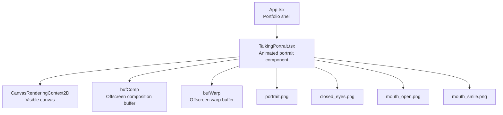
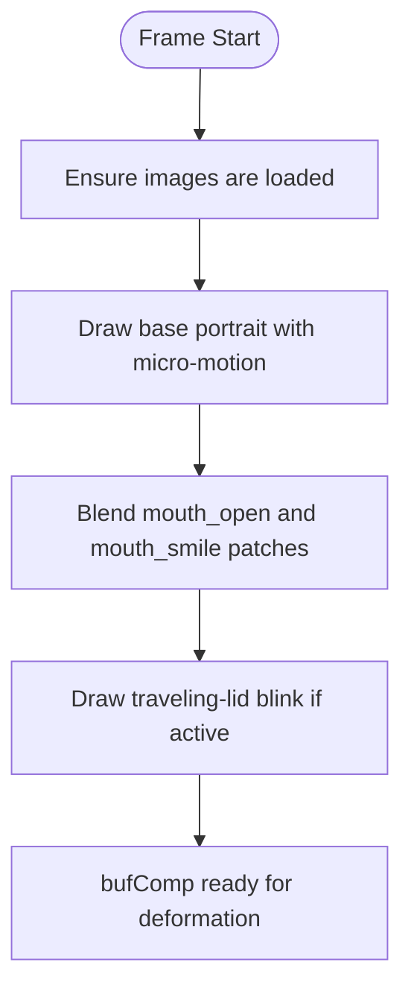
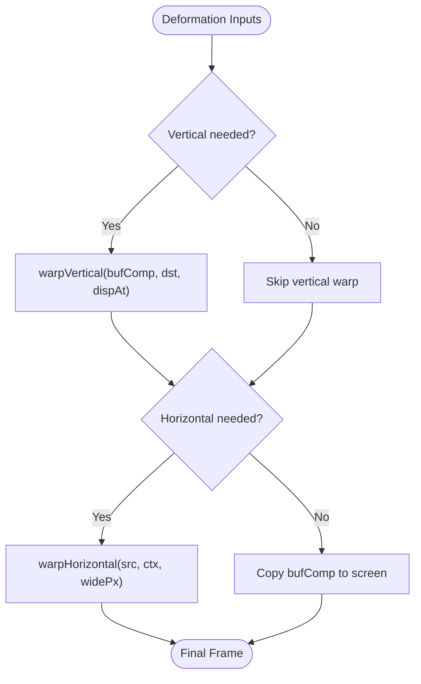
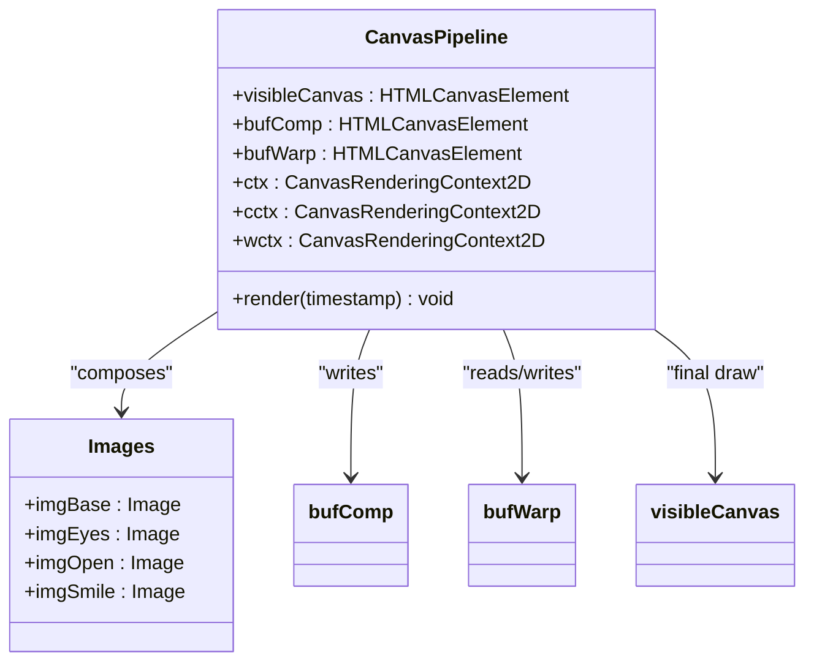
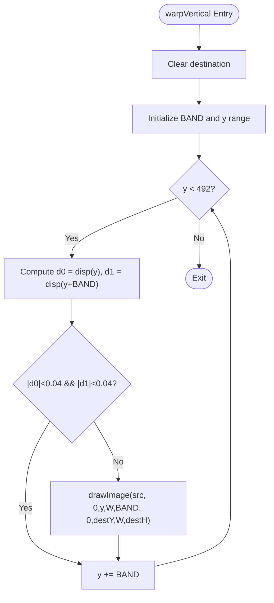
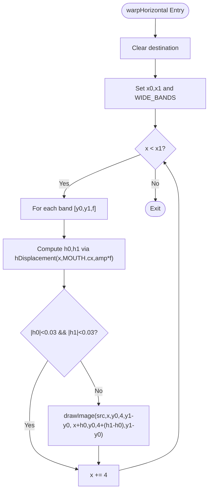
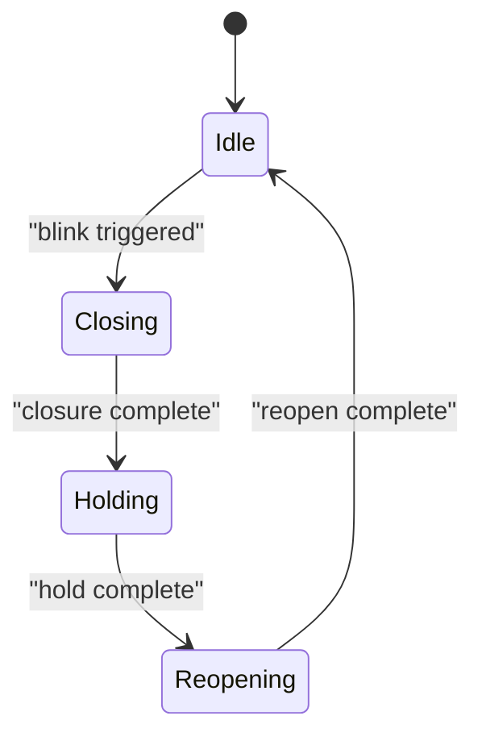
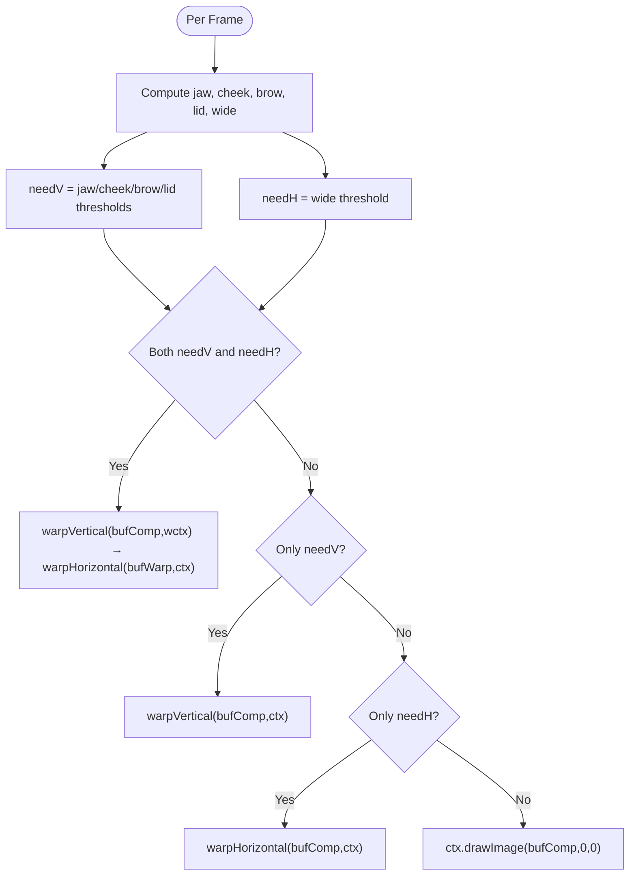
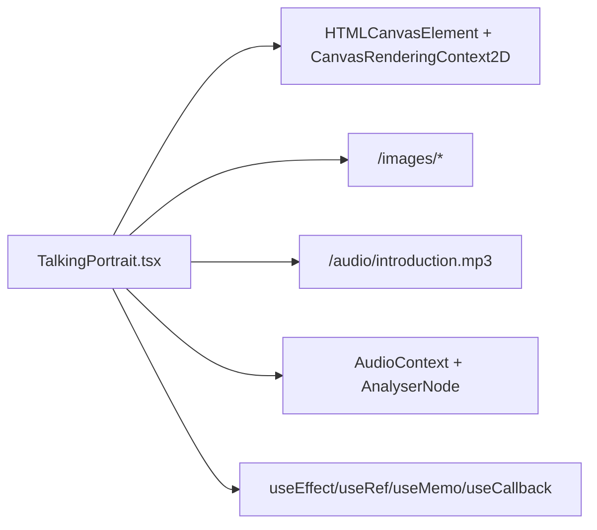

# Canvas Rendering Pipeline

<cite>
**Referenced Files in This Document**
- [TalkingPortrait.tsx](file://src/components/TalkingPortrait.tsx)
- [App.tsx](file://src/App.tsx)
</cite>

## Table of Contents
1. [Introduction](#introduction)
2. [Project Structure](#project-structure)
3. [Core Components](#core-components)
4. [Architecture Overview](#architecture-overview)
5. [Detailed Component Analysis](#detailed-component-analysis)
6. [Dependency Analysis](#dependency-analysis)
7. [Performance Considerations](#performance-considerations)
8. [Troubleshooting Guide](#troubleshooting-guide)
9. [Conclusion](#conclusion)
10. [Appendices](#appendices)

## Introduction
This document explains the Canvas Rendering Pipeline used by the Talking Portrait component to produce a high-performance, photorealistic animated portrait synchronized with speech. The pipeline is organized into three conceptual stages:

- Composition stage: base photo plus authentic photographic patches (mouth open/smile and closed eyelids) are composited into an offscreen buffer.
- Deformation stage: the composed frame is warped vertically and horizontally to simulate jaw drop, cheek lift, brow micro-motion, lower-lid response, lip-corner stretch, and lip pucker.
- Final screen output: the result is drawn to the visible canvas once per animation frame.

The implementation uses multiple canvas elements for offscreen buffering, conditional rendering based on deformation magnitude, band-based processing to reduce unnecessary work, and careful memory management for large image assets. It also includes natural blinking, micro-gaze motion, and audio-reactive mouth shaping.

## Project Structure
The rendering logic lives inside the Talking Portrait React component. The parent application mounts this component within the portfolio layout.



**Diagram sources**
- [App.tsx:142-144](file://src/App.tsx#L142-L144)
- [TalkingPortrait.tsx:371-402](file://src/components/TalkingPortrait.tsx#L371-L402)

**Section sources**
- [App.tsx:142-144](file://src/App.tsx#L142-L144)
- [TalkingPortrait.tsx:371-402](file://src/components/TalkingPortrait.tsx#L371-L402)

## Core Components
- Visible canvas: the final drawing target presented to the user.
- Offscreen composition buffer (`bufComp`): accumulates the base photo, mouth patches, and blink overlays before deformation.
- Offscreen warp buffer (`bufWarp`): holds the result after horizontal warping when both vertical and horizontal deformations are active.
- Image assets: base portrait, closed eyelids, open-mouth patch, and smile-mouth patch.
- Animation loop: driven by `requestAnimationFrame`, computing phoneme-driven articulation, blink state, micro-motion, and then composing and warping frames.

Key responsibilities:
- Audio setup and analysis for volume-reactive mouth shaping.
- Phoneme-to-articulation mapping producing open, smile, round, narrow, and closed states.
- Blink state machine with randomized timing and inter-ocular lead.
- Vertical strip warp for jaw/cheek/brow/lid displacement.
- Horizontal column warp for lip-corner stretch/pucker.
- Conditional rendering using `needV` and `needH` to skip unnecessary operations.

**Section sources**
- [TalkingPortrait.tsx:371-402](file://src/components/TalkingPortrait.tsx#L371-L402)
- [TalkingPortrait.tsx:434-607](file://src/components/TalkingPortrait.tsx#L434-L607)

## Architecture Overview
The rendering pipeline follows a strict sequence each frame:

1. Compute time delta and current audio time.
2. Map phonemes to articulation targets (open, smile, jaw, wide).
3. Update blink state machine and compute eye closure progress.
4. Derive physical warp parameters including jaw, cheek, brow, lid, and lip-wide displacements.
5. Compose base photo, mouth patches, and blink overlays into `bufComp`.
6. Conditionally apply vertical and/or horizontal warps and draw to the visible canvas.

```mermaid
sequenceDiagram
participant Loop as "Animation Loop"
participant Audio as "Audio & Analyser"
participant Comp as "Composition Stage"
participant V as "Vertical Warp"
participant H as "Horizontal Warp"
participant Screen as "Visible Canvas"
Loop->>Audio : Read currentTime and frequency data
Loop->>Loop : Map phonemes → articulation targets
Loop->>Loop : Update blink state and micro-motion
Loop->>Comp : Draw base + patches + blink into bufComp
alt Both vertical and horizontal needed
Loop->>V : warpVertical(bufComp, wctx, dispAt)
V-->>Loop : Warped frame in bufWarp
Loop->>H : warpHorizontal(bufWarp, ctx, widePx)
H-->>Screen : Final frame
else Only vertical needed
Loop->>V : warpVertical(bufComp, ctx, dispAt)
V-->>Screen : Final frame
else Only horizontal needed
Loop->>H : warpHorizontal(bufComp, ctx, widePx)
H-->>Screen : Final frame
else No deformation
Loop->>Screen : Draw bufComp directly
end
```

**Diagram sources**
- [TalkingPortrait.tsx:434-607](file://src/components/TalkingPortrait.tsx#L434-L607)

## Detailed Component Analysis

### Three-Stage Rendering Process

#### Composition Stage
- The base portrait is translated, rotated, and slightly shifted to simulate micro-head motion.
- Authentic mouth patches are blended using alpha values derived from open and smile articulation weights.
- Closed eyelids are drawn using a traveling-lid technique that maps the eyelid asset so the lash line tracks the advancing eyelid edge during closure.



**Diagram sources**
- [TalkingPortrait.tsx:549-583](file://src/components/TalkingPortrait.tsx#L549-L583)
- [TalkingPortrait.tsx:230-268](file://src/components/TalkingPortrait.tsx#L230-L268)

**Section sources**
- [TalkingPortrait.tsx:549-583](file://src/components/TalkingPortrait.tsx#L549-L583)
- [TalkingPortrait.tsx:230-268](file://src/components/TalkingPortrait.tsx#L230-L268)

#### Deformation Stage
- Vertical warp applies per-row displacement across a facial band to simulate jaw drop, cheek lift, brow micro-motion, and lower-lid movement.
- Horizontal warp applies column-wise displacement around the mouth to create lip-corner stretch (smile) and lip pucker (round), with Gaussian falloff to keep seams sub-pixel.



**Diagram sources**
- [TalkingPortrait.tsx:585-601](file://src/components/TalkingPortrait.tsx#L585-L601)
- [TalkingPortrait.tsx:271-316](file://src/components/TalkingPortrait.tsx#L271-L316)

**Section sources**
- [TalkingPortrait.tsx:585-601](file://src/components/TalkingPortrait.tsx#L585-L601)
- [TalkingPortrait.tsx:271-316](file://src/components/TalkingPortrait.tsx#L271-L316)

#### Final Screen Output
- If both vertical and horizontal warps are required, the pipeline writes the vertical warp into the intermediate buffer and then applies horizontal warp to the visible canvas.
- If only one warp is needed, it writes directly to the visible canvas.
- If no deformation is needed, the composed buffer is copied directly to the visible canvas.

**Section sources**
- [TalkingPortrait.tsx:585-601](file://src/components/TalkingPortrait.tsx#L585-L601)

### Offscreen Buffering Strategy
- `bufComp`: Holds the fully composed frame before any deformation.
- `bufWarp`: Holds the result after vertical warp when horizontal warp must follow.
- The visible canvas context is configured with alpha enabled to support transparent patches and smooth blending.



**Diagram sources**
- [TalkingPortrait.tsx:371-402](file://src/components/TalkingPortrait.tsx#L371-L402)

**Section sources**
- [TalkingPortrait.tsx:371-402](file://src/components/TalkingPortrait.tsx#L371-L402)

### Warp Functions

#### Vertical Warp: Per-Row Displacement
- Iterates over a vertical band with a small step size.
- Computes displacement at the top and bottom of each band; skips bands where displacement is negligible.
- Draws each band from the source to a destination row offset by the computed displacement, preserving height continuity.



**Diagram sources**
- [TalkingPortrait.tsx:271-287](file://src/components/TalkingPortrait.tsx#L271-L287)

**Section sources**
- [TalkingPortrait.tsx:271-287](file://src/components/TalkingPortrait.tsx#L271-L287)

#### Horizontal Warp: Lip-Corner Stretch/Pucker
- Defines horizontal bands around the mouth with varying influence factors.
- For each column segment, computes left and right displacement using a tanh-Gaussian function.
- Skips columns where displacement is negligible and draws thin vertical strips with adjusted width to maintain seam continuity.



**Diagram sources**
- [TalkingPortrait.tsx:289-316](file://src/components/TalkingPortrait.tsx#L289-L316)

**Section sources**
- [TalkingPortrait.tsx:289-316](file://src/components/TalkingPortrait.tsx#L289-L316)

### Blink and Micro-Motion
- Blink closure curve provides eased close, hold, and reopen phases.
- Traveling-lid drawing maps the closed-eyelid asset so the lash line tracks the eyelid edge.
- Micro-saccades and slow head cadence add organic life without visible shaking.



**Diagram sources**
- [TalkingPortrait.tsx:217-225](file://src/components/TalkingPortrait.tsx#L217-L225)
- [TalkingPortrait.tsx:486-507](file://src/components/TalkingPortrait.tsx#L486-L507)

**Section sources**
- [TalkingPortrait.tsx:217-225](file://src/components/TalkingPortrait.tsx#L217-L225)
- [TalkingPortrait.tsx:486-507](file://src/components/TalkingPortrait.tsx#L486-L507)

### Conditional Rendering and Band-Based Processing
- `needV` checks whether vertical deformation is significant enough to warrant processing.
- `needH` checks whether horizontal deformation is significant enough to warrant processing.
- Bands in both warps skip negligible regions to minimize draw calls and pixel operations.



**Diagram sources**
- [TalkingPortrait.tsx:585-601](file://src/components/TalkingPortrait.tsx#L585-L601)

**Section sources**
- [TalkingPortrait.tsx:585-601](file://src/components/TalkingPortrait.tsx#L585-L601)

## Dependency Analysis
The Talking Portrait component depends on:
- DOM canvas element for rendering.
- Image resources under `/images`.
- Audio resource under `/audio`.
- React hooks for lifecycle and state management.
- Web Audio API for analyzing audio frequency data.



**Diagram sources**
- [TalkingPortrait.tsx:340-358](file://src/components/TalkingPortrait.tsx#L340-L358)
- [TalkingPortrait.tsx:371-402](file://src/components/TalkingPortrait.tsx#L371-L402)
- [TalkingPortrait.tsx:728-742](file://src/components/TalkingPortrait.tsx#L728-L742)

**Section sources**
- [TalkingPortrait.tsx:340-358](file://src/components/TalkingPortrait.tsx#L340-L358)
- [TalkingPortrait.tsx:371-402](file://src/components/TalkingPortrait.tsx#L371-L402)
- [TalkingPortrait.tsx:728-742](file://src/components/TalkingPortrait.tsx#L728-L742)

## Performance Considerations
- Offscreen buffers reduce redundant compositing and allow selective warping.
- Conditional rendering avoids expensive warp operations when deformation is below thresholds.
- Band-based iteration minimizes draw calls by skipping near-zero displacement regions.
- Alpha channel handling ensures smooth blending of mouth patches and eyelid overlays.
- Image loading guards prevent rendering before assets are ready.
- Audio reactivity is limited to a small frequency band to avoid heavy computation.

Recommendations:
- Preload all image assets and reuse them across component instances.
- Consider disabling or reducing micro-motion on low-power devices.
- Use device pixel ratio scaling carefully to balance sharpness and performance.
- Batch canvas operations where possible and avoid frequent context state changes.

[No sources needed since this section provides general guidance]

## Troubleshooting Guide
Common issues and resolutions:
- Canvas context not available: Ensure the canvas element exists and supports 2D context.
- Images not loaded: Guard against incomplete images and wait for load events before rendering.
- AudioContext blocked: Resume or initialize AudioContext after user interaction.
- Stuttering or dropped frames: Reduce warp band density, disable unnecessary effects, or lower resolution.
- Cross-browser compatibility: Verify Web Audio API availability and fallbacks for older browsers.

**Section sources**
- [TalkingPortrait.tsx:340-358](file://src/components/TalkingPortrait.tsx#L340-L358)
- [TalkingPortrait.tsx:549-553](file://src/components/TalkingPortrait.tsx#L549-L553)

## Conclusion
The Canvas Rendering Pipeline in the Talking Portrait component achieves realistic, synchronized facial animation through a disciplined three-stage process: composition, deformation, and screen output. Offscreen buffering, conditional rendering, and band-based processing ensure efficient performance while maintaining visual fidelity. The design is extensible for additional effects and can be tuned for different devices and capabilities.

[No sources needed since this section summarizes without analyzing specific files]

## Appendices

### Customizing the Rendering Pipeline
- Add new visual effects by extending the composition stage with additional patches or overlay layers.
- Introduce new deformation passes by adding functions similar to `warpVertical` and `warpHorizontal`, and integrating them into the conditional rendering branch.
- Adjust thresholds for `needV` and `needH` to fine-tune performance versus quality.

**Section sources**
- [TalkingPortrait.tsx:549-601](file://src/components/TalkingPortrait.tsx#L549-L601)

### Optimizing for Different Devices
- Reduce image resolution or disable micro-motion on mobile devices.
- Lower the frequency analysis window size or skip audio reactivity when battery saver is active.
- Use simpler warp bands or larger step sizes to reduce draw calls.

[No sources needed since this section provides general guidance]

### Canvas Context Configuration and Alpha Handling
- The visible canvas context is created with alpha enabled to support transparent overlays.
- Mouth patches use alpha blending controlled by computed weights.
- Eyelid drawing uses clipping paths and stroke overlays for precise lash-line definition.

**Section sources**
- [TalkingPortrait.tsx:375-378](file://src/components/TalkingPortrait.tsx#L375-L378)
- [TalkingPortrait.tsx:566-576](file://src/components/TalkingPortrait.tsx#L566-L576)
- [TalkingPortrait.tsx:247-267](file://src/components/TalkingPortrait.tsx#L247-L267)

### Cross-Browser Compatibility
- Web Audio API initialization includes vendor prefix fallback.
- Audio playback errors are caught and logged.
- Canvas features used are widely supported; verify context creation and image drawing behavior across browsers.

**Section sources**
- [TalkingPortrait.tsx:340-358](file://src/components/TalkingPortrait.tsx#L340-L358)
- [TalkingPortrait.tsx:621-627](file://src/components/TalkingPortrait.tsx#L621-L627)