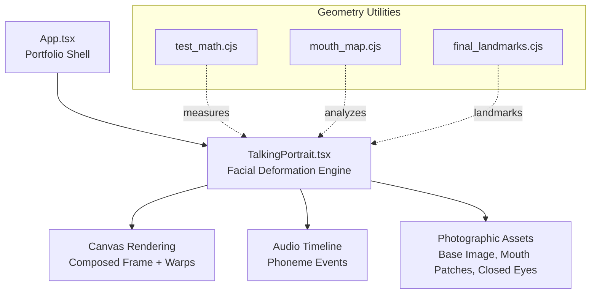
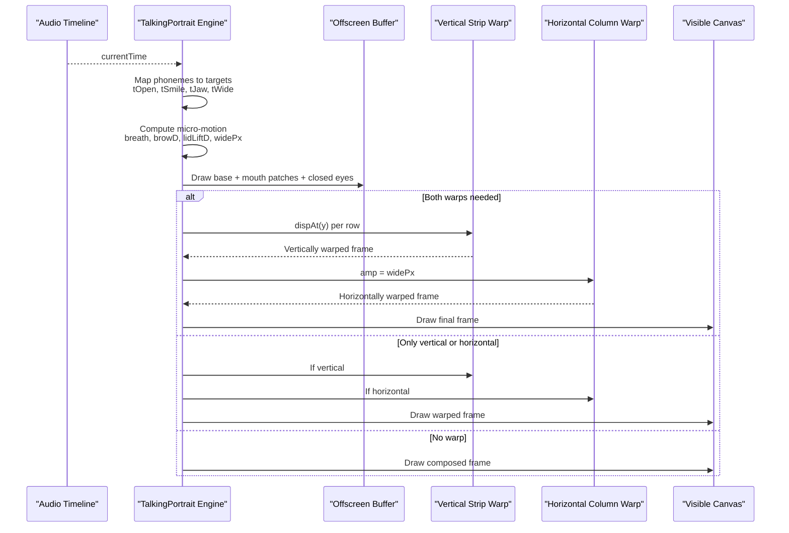
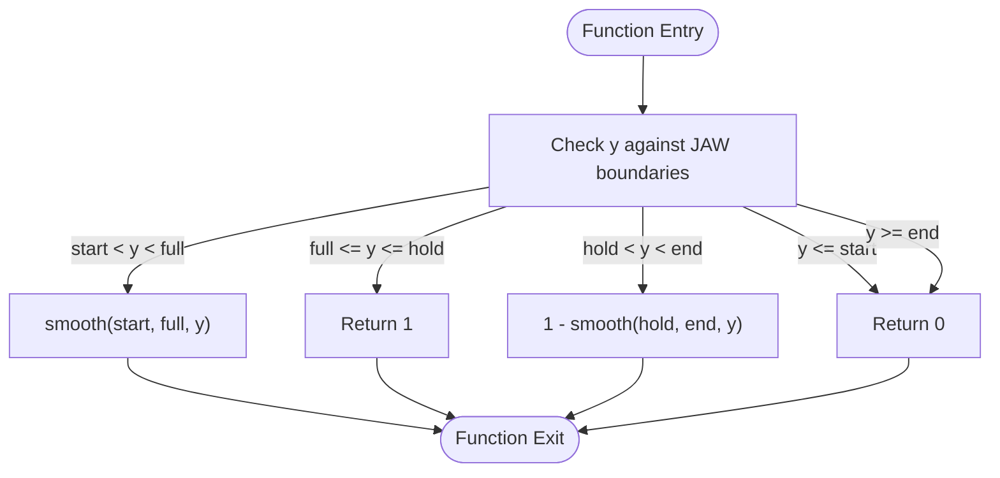
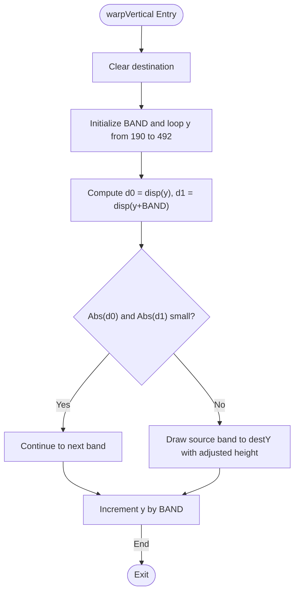
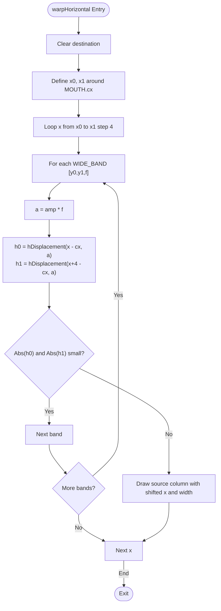
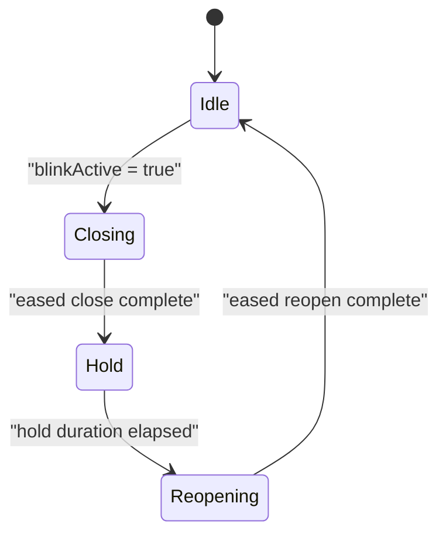
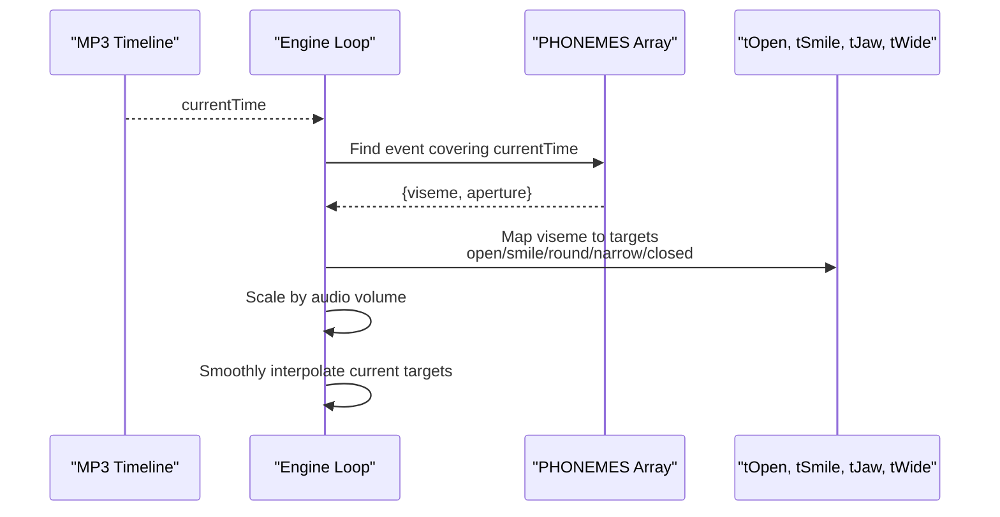
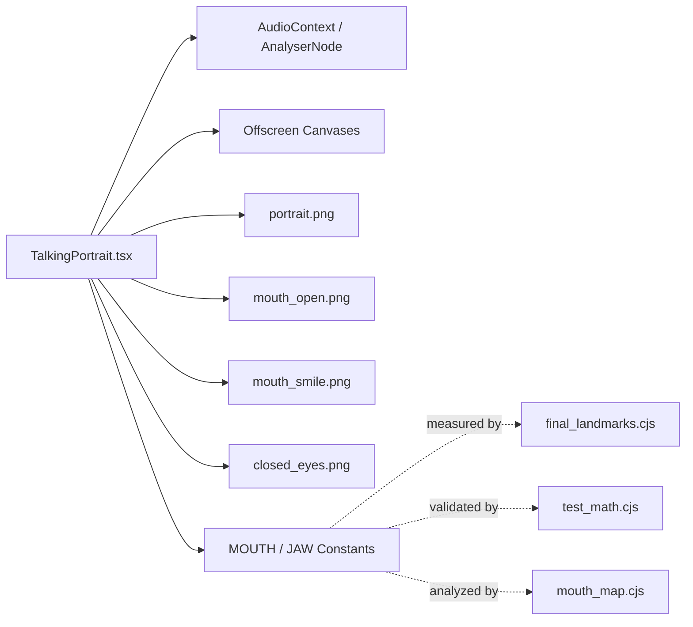

# Facial Deformation Engine

<cite>
**Referenced Files in This Document**
- [TalkingPortrait.tsx](file://src/components/TalkingPortrait.tsx)
- [App.tsx](file://src/App.tsx)
- [test_math.cjs](file://test_math.cjs)
- [mouth_map.cjs](file://mouth_map.cjs)
- [final_landmarks.cjs](file://final_landmarks.cjs)
</cite>

## Table of Contents
1. [Introduction](#introduction)
2. [Project Structure](#project-structure)
3. [Core Components](#core-components)
4. [Architecture Overview](#architecture-overview)
5. [Detailed Component Analysis](#detailed-component-analysis)
6. [Dependency Analysis](#dependency-analysis)
7. [Performance Considerations](#performance-considerations)
8. [Troubleshooting Guide](#troubleshooting-guide)
9. [Conclusion](#conclusion)
10. [Appendices](#appendices)

## Introduction
This document explains the Facial Deformation Engine that physically manipulates a portrait image in real time to match spoken audio. The engine composes photographic assets and then applies two layered warps:
- Vertical strip warp for jaw drop, cheek lift, brow micro-motion, and lower-lid response during blinks.
- Horizontal column warp for lip-corner stretch (smile) and lip pucker (round).

It also includes micro-motion systems for natural breathing effects and a traveling-lid blink system. Phoneme events drive mouth shapes through visemes, mapping audio timing to physical deformations.

## Project Structure
The facial deformation logic lives inside the Talking Portrait component. The application shell mounts this component into the portfolio page. Supporting scripts analyze the source portrait to measure landmarks and validate geometry used by the engine.

**Diagram sources**
- [App.tsx:142-144](file://src/App.tsx#L142-L144)
- [TalkingPortrait.tsx:370-608](file://src/components/TalkingPortrait.tsx#L370-L608)
- [test_math.cjs:1-9](file://test_math.cjs#L1-L9)
- [mouth_map.cjs:62-74](file://mouth_map.cjs#L62-L74)
- [final_landmarks.cjs:101-111](file://final_landmarks.cjs#L101-L111)

**Section sources**
- [App.tsx:142-144](file://src/App.tsx#L142-L144)
- [TalkingPortrait.tsx:370-608](file://src/components/TalkingPortrait.tsx#L370-L608)

## Core Components
The engine is implemented as a single React component with:
- Geometry constants defining mouth and jaw structure.
- Smooth interpolation function for easing transitions.
- Jaw curve function for vertical falloff.
- Window functions for brow, lid, and cheek regions.
- Horizontal displacement function for lip expressions.
- Vertical and horizontal warp functions for per-row and per-column pixel manipulation.
- Blink state machine and traveling eyelid drawing.
- Micro-motion generators for breath, brow noise, gaze saccades, and head cadence.
- Phoneme-to-viseme timeline mapping to target deformation parameters.

Key responsibilities:
- Compose base photo with authentic mouth patches and closed eyelids.
- Compute physical warp parameters from phonemes, audio volume, and micro-motion.
- Apply vertical strip warp followed by horizontal column warp.
- Render the final frame at 60 fps using requestAnimationFrame.

**Section sources**
- [TalkingPortrait.tsx:60-98](file://src/components/TalkingPortrait.tsx#L60-L98)
- [TalkingPortrait.tsx:270-316](file://src/components/TalkingPortrait.tsx#L270-L316)
- [TalkingPortrait.tsx:434-608](file://src/components/TalkingPortrait.tsx#L434-L608)

## Architecture Overview
The rendering pipeline has three stages:
1. Compose Stage: Base portrait plus mouth patches and closed eyes are drawn into an offscreen buffer.
2. Deform Stage: The composed frame is warped vertically and horizontally based on computed displacements.
3. Output Stage: The result is drawn to the visible canvas.

**Diagram sources**
- [TalkingPortrait.tsx:434-608](file://src/components/TalkingPortrait.tsx#L434-L608)
- [TalkingPortrait.tsx:270-316](file://src/components/TalkingPortrait.tsx#L270-L316)

## Detailed Component Analysis

### Mathematical Functions
- Smooth interpolation: A cubic ease-in-out ramp between two thresholds. It ensures smooth transitions for jaw curves, window functions, and blink-related opacity.
- Jaw curve: Defines vertical falloff hinged below the mouth, full across chin/neck, and zero above the start line.
- Horizontal displacement: Combines odd-symmetry tanh with Gaussian falloff around the mouth center to produce natural lip-corner stretch and pucker.

**Diagram sources**
- [TalkingPortrait.tsx:70-82](file://src/components/TalkingPortrait.tsx#L70-L82)

**Section sources**
- [TalkingPortrait.tsx:70-98](file://src/components/TalkingPortrait.tsx#L70-L98)

### Facial Geometry Constants
- MOUTH: Center coordinates used to define the horizontal region for lip expressions.
- JAW: Vertical boundaries defining where jaw movement begins, becomes full, holds, and fades out.

These constants anchor the physical structure of the face and determine where windows and warps apply.

**Section sources**
- [TalkingPortrait.tsx:60-63](file://src/components/TalkingPortrait.tsx#L60-L63)
- [final_landmarks.cjs:101-111](file://final_landmarks.cjs#L101-L111)

### Vertical Strip Warp
The vertical warp processes rows in bands and draws each band with a per-row displacement. It supports jaw drop, cheek lift, brow micro-motion, and lower-lid response during blinks.

**Diagram sources**
- [TalkingPortrait.tsx:270-287](file://src/components/TalkingPortrait.tsx#L270-L287)

**Section sources**
- [TalkingPortrait.tsx:270-287](file://src/components/TalkingPortrait.tsx#L270-L287)

### Horizontal Column Warp
The horizontal warp processes columns near the mouth center and applies per-column displacement using WIDE_BANDS and hDisplacement. It supports smile stretch and round pucker.

**Diagram sources**
- [TalkingPortrait.tsx:289-316](file://src/components/TalkingPortrait.tsx#L289-L316)

**Section sources**
- [TalkingPortrait.tsx:289-316](file://src/components/TalkingPortrait.tsx#L289-L316)

### Blink System and Traveling Eyelid
The blink system uses a state machine with randomized closing, hold, and reopening durations. The traveling eyelid draws the closed-eye asset mapped so its lash line aligns with the advancing edge.

**Diagram sources**
- [TalkingPortrait.tsx:217-225](file://src/components/TalkingPortrait.tsx#L217-L225)
- [TalkingPortrait.tsx:423-432](file://src/components/TalkingPortrait.tsx#L423-L432)
- [TalkingPortrait.tsx:495-507](file://src/components/TalkingPortrait.tsx#L495-L507)

**Section sources**
- [TalkingPortrait.tsx:217-268](file://src/components/TalkingPortrait.tsx#L217-L268)
- [TalkingPortrait.tsx:423-507](file://src/components/TalkingPortrait.tsx#L423-L507)

### Micro-Motion Systems
Micro-motion adds organic, zero-mean noise to keep the face alive without shaking:
- Breath: Two sine waves combined to modulate jaw movement subtly.
- Brow noise: Sinusoidal variation affecting brow displacement.
- Gaze saccades: Randomized micro-movements smoothed over frames.
- Head cadence: Slow rotation and translation to simulate subtle head motion.

These values feed into dispAt and render transforms.

**Section sources**
- [TalkingPortrait.tsx:511-547](file://src/components/TalkingPortrait.tsx#L511-L547)

### Phoneme Events and Physical Deformations
Phoneme events map audio timestamps to visemes and aperture values. Each viseme sets target weights for open mouth, smile, jaw drop, and horizontal width. Audio volume scales aperture to add realism.

**Diagram sources**
- [TalkingPortrait.tsx:100-197](file://src/components/TalkingPortrait.tsx#L100-L197)
- [TalkingPortrait.tsx:442-484](file://src/components/TalkingPortrait.tsx#L442-L484)

**Section sources**
- [TalkingPortrait.tsx:100-197](file://src/components/TalkingPortrait.tsx#L100-L197)
- [TalkingPortrait.tsx:442-484](file://src/components/TalkingPortrait.tsx#L442-L484)

## Dependency Analysis
The engine depends on:
- Audio context and analyser node for volume-based modulation.
- Offscreen canvases for composition and warping.
- Photographic assets loaded from public images.
- Geometry constants derived from landmark analysis scripts.

**Diagram sources**
- [TalkingPortrait.tsx:340-402](file://src/components/TalkingPortrait.tsx#L340-L402)
- [final_landmarks.cjs:101-111](file://final_landmarks.cjs#L101-L111)
- [test_math.cjs:1-9](file://test_math.cjs#L1-L9)
- [mouth_map.cjs:62-74](file://mouth_map.cjs#L62-L74)

**Section sources**
- [TalkingPortrait.tsx:340-402](file://src/components/TalkingPortrait.tsx#L340-L402)

## Performance Considerations
- Band-based processing reduces draw calls while maintaining smoothness.
- Threshold checks skip negligible displacements to avoid unnecessary work.
- Offscreen buffers minimize redundant compositing.
- requestAnimationFrame ensures efficient rendering synchronized with display refresh.
- Volume scalar smoothing prevents jitter from audio spikes.

[No sources needed since this section provides general guidance]

## Troubleshooting Guide
Common issues and resolutions:
- AudioContext setup failures: Ensure user gesture initiates playback; catch and log errors.
- Missing assets: Verify image paths and loading states before rendering.
- Stuttering or dropped frames: Reduce warp bandwidth or disable unnecessary warps when not needed.
- Incorrect mouth shape: Validate phoneme timings and aperture scaling against audio duration.
- Blink artifacts: Adjust closure/hold/reopen durations and inter-ocular lead for natural timing.

**Section sources**
- [TalkingPortrait.tsx:340-358](file://src/components/TalkingPortrait.tsx#L340-L358)
- [TalkingPortrait.tsx:550-608](file://src/components/TalkingPortrait.tsx#L550-L608)

## Conclusion
The Facial Deformation Engine combines precise geometry, smooth interpolation, and layered warps to create realistic facial animation synchronized with speech. Its modular design allows customization of deformation parameters, warp intensities, and extension with new facial movements. The system balances performance and realism through careful band processing, thresholding, and micro-motion generation.

[No sources needed since this section summarizes without analyzing specific files]

## Appendices

### Customization Examples
- Adjusting warp intensities:
  - Modify jawPx scale factor to increase or decrease jaw drop magnitude.
  - Change widePx multipliers to strengthen or soften smile stretch and round pucker.
- Extending facial movements:
  - Add new window functions for additional regions (e.g., nose bridge or forehead).
  - Introduce new visemes and map them to target weights in the phoneme loop.
  - Extend WIDE_BANDS to refine horizontal deformation zones.

**Section sources**
- [TalkingPortrait.tsx:511-531](file://src/components/TalkingPortrait.tsx#L511-L531)
- [TalkingPortrait.tsx:289-316](file://src/components/TalkingPortrait.tsx#L289-L316)