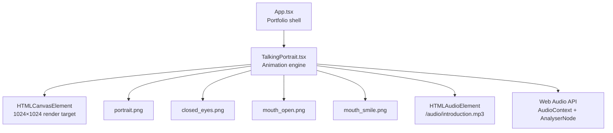
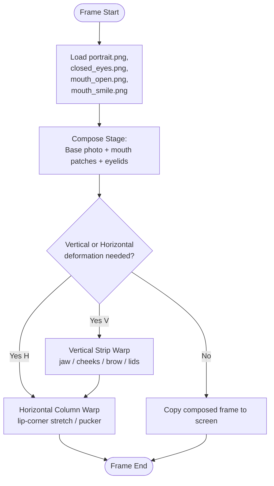
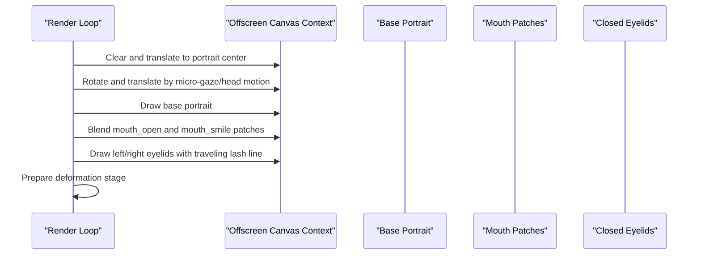
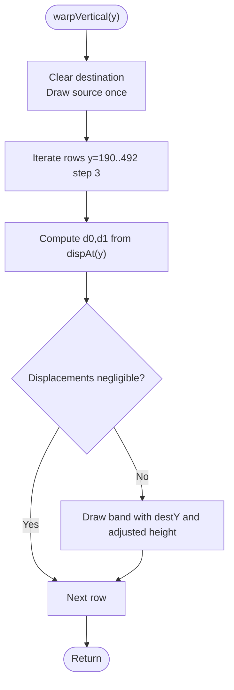
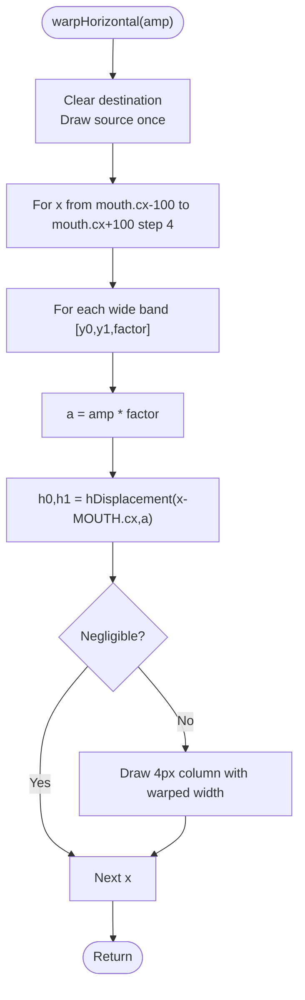
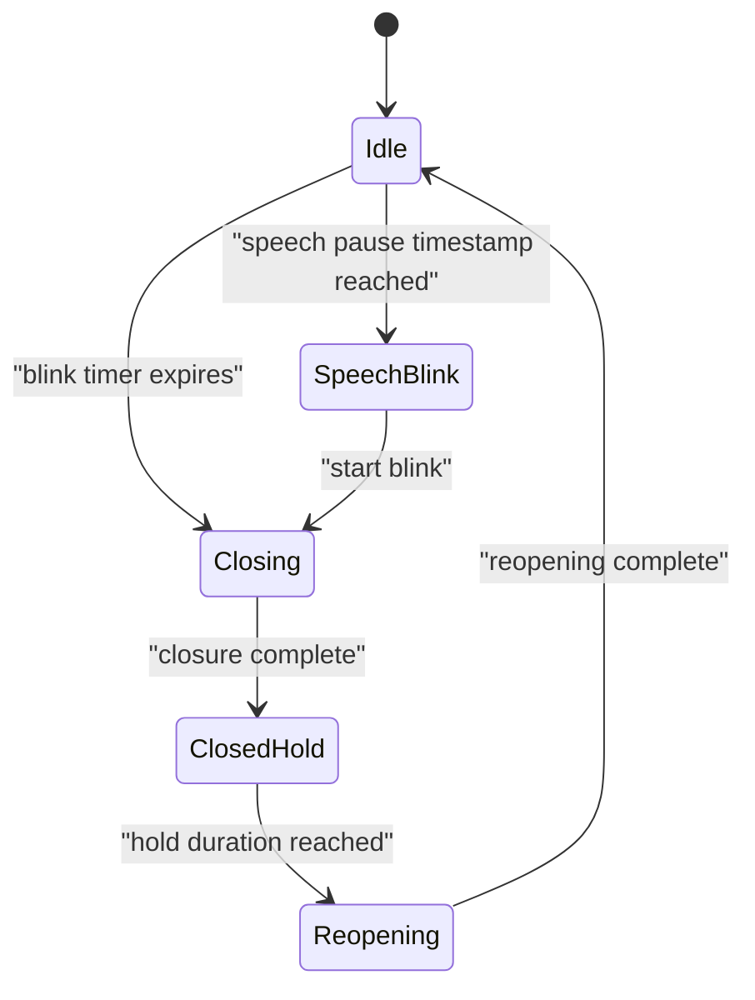
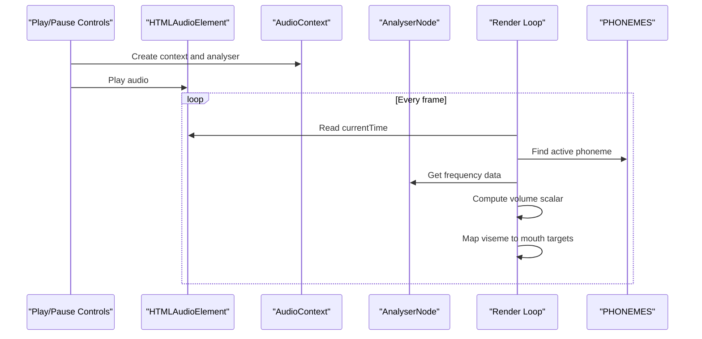
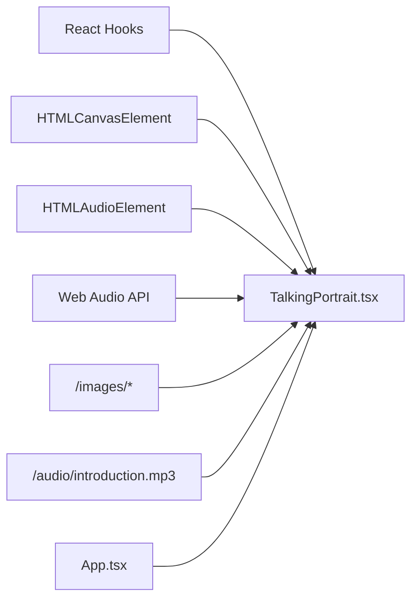

# Talking Portrait System

<cite>
**Referenced Files in This Document**
- [TalkingPortrait.tsx](file://src/components/TalkingPortrait.tsx)
- [App.tsx](file://src/App.tsx)
- [package.json](file://package.json)
- [README.txt](file://public/audio/README.txt)
</cite>

## Table of Contents
1. [Introduction](#introduction)
2. [Project Structure](#project-structure)
3. [Core Components](#core-components)
4. [Architecture Overview](#architecture-overview)
5. [Detailed Component Analysis](#detailed-component-analysis)
6. [Dependency Analysis](#dependency-analysis)
7. [Performance Considerations](#performance-considerations)
8. [Troubleshooting Guide](#troubleshooting-guide)
9. [Conclusion](#conclusion)
10. [Appendices](#appendices)

## Introduction
The Talking Portrait System is the photorealistic facial animation engine at the center of this portfolio. It animates a static portrait photograph so that mouth movements, jaw motion, lip expressions, eye blinks, and subtle micro-motions are synchronized with an audio introduction. The system does not simply swap images; it composes photographic patches and then applies physical-style deformations to keep seams invisible and motion organic.

Key capabilities:
- Photorealistic composition using base portrait imagery and authentic mouth/eyelid patches.
- Vertical strip warping for jaw drop, cheek lift, brow micro-motion, and lower-lid response.
- Horizontal column warping for lip-corner stretch (smile) and lip pucker (round).
- Blink animation with natural timing, inter-ocular lead, spontaneous intervals, occasional double blinks, and speech-pause synchronization.
- Audio integration through Web Audio API for real-time volume analysis and phoneme-to-viseme mapping.
- Micro-motion systems for breathing, micro-saccades, and slow head cadence.
- Offscreen buffering and efficient canvas rendering for smooth playback.

This document explains how these pieces fit together, how to customize expressions and parameters, and how to integrate new audio sources.

## Project Structure
At runtime, the Talking Portrait component renders a 1024×1024 canvas, loads image assets from `/images`, plays audio from `/audio/introduction.mp3`, and drives animation through `requestAnimationFrame`. The parent application mounts the component inside the portfolio’s intro section.

**Diagram sources**
- [App.tsx:142-144](file://src/App.tsx#L142-L144)
- [TalkingPortrait.tsx:318-330](file://src/components/TalkingPortrait.tsx#L318-L330)
- [TalkingPortrait.tsx:380-391](file://src/components/TalkingPortrait.tsx#L380-L391)
- [TalkingPortrait.tsx:728-742](file://src/components/TalkingPortrait.tsx#L728-L742)

**Section sources**
- [App.tsx:142-144](file://src/App.tsx#L142-L144)
- [TalkingPortrait.tsx:318-330](file://src/components/TalkingPortrait.tsx#L318-L330)
- [package.json:1-37](file://package.json#L1-L37)

## Core Components
The Talking Portrait system is implemented as a single React component responsible for:
- Asset loading and offscreen buffer management.
- Phoneme timeline and viseme mapping.
- Blink state machine and inter-ocular timing.
- Vertical and horizontal warp functions.
- Micro-motion generation for breath, gaze, and head movement.
- Web Audio API setup and real-time volume sampling.
- UI controls for play, pause, replay, and progress seeking.

Important constants and data structures:
- Image dimensions: 1024×1024.
- Eye landmarks defining eyelid geometry.
- Mouth center and jaw curve boundaries.
- Phoneme events mapping time ranges to visemes and aperture values.
- Phrase transcript entries for UI highlighting.
- Speech blink timestamps aligned with conversational pauses.

**Section sources**
- [TalkingPortrait.tsx:35-63](file://src/components/TalkingPortrait.tsx#L35-L63)
- [TalkingPortrait.tsx:100-215](file://src/components/TalkingPortrait.tsx#L100-L215)

## Architecture Overview
The animation pipeline follows a strict two-stage process each frame:

1. Compose Stage
   - Draw the base portrait into an offscreen canvas.
   - Overlay mouth patches for open and smile shapes with alpha blending.
   - Draw traveling eyelids for both eyes during blink phases.
   - Apply micro-head translation and rotation around the portrait center.

2. Deform Stage
   - If vertical deformation is needed, draw the composed frame into another offscreen canvas and apply per-row displacement for jaw, cheeks, brows, and lids.
   - If horizontal deformation is needed, draw the result into the screen canvas and apply column-wise lip-corner stretch or pucker.
   - If neither is needed, copy the composed frame directly to the screen.

**Diagram sources**
- [TalkingPortrait.tsx:393-402](file://src/components/TalkingPortrait.tsx#L393-L402)
- [TalkingPortrait.tsx:549-583](file://src/components/TalkingPortrait.tsx#L549-L583)
- [TalkingPortrait.tsx:585-601](file://src/components/TalkingPortrait.tsx#L585-L601)

## Detailed Component Analysis

### Photorealistic Composition Pipeline
The composition stage builds a physically coherent face by combining:
- Base portrait image.
- Authentic mouth patches for open and smile visemes.
- Real closed-eyelid imagery mapped to the advancing eyelid margin.
- Subtle head translation and rotation derived from micro-gaze and cadence.

Mouth patch opacity uses a mild power curve to avoid ghosting while preserving sync timing. Eyelid drawing clips to an eye-shaped path and remaps the closed-eyelid image so the lash line stays on the moving edge.

**Diagram sources**
- [TalkingPortrait.tsx:549-583](file://src/components/TalkingPortrait.tsx#L549-L583)
- [TalkingPortrait.tsx:230-268](file://src/components/TalkingPortrait.tsx#L230-L268)

**Section sources**
- [TalkingPortrait.tsx:380-391](file://src/components/TalkingPortrait.tsx#L380-L391)
- [TalkingPortrait.tsx:549-583](file://src/components/TalkingPortrait.tsx#L549-L583)

### Vertical Strip Warping for Jaw Movement
Vertical warping moves rows of pixels based on anatomical windows:
- Brow window: small upward/downward motion during speech and blink-related brow dip.
- Lid window: lower lid responds when eyes close.
- Cheek window: cheeks lift slightly during smiles.
- Jaw curve: hinged below the mouth, full across chin/neck, with smooth falloffs.

The function draws narrow bands and adjusts destination Y positions and heights to simulate physical jaw drop without tearing seams.

**Diagram sources**
- [TalkingPortrait.tsx:270-287](file://src/components/TalkingPortrait.tsx#L270-L287)
- [TalkingPortrait.tsx:511-531](file://src/components/TalkingPortrait.tsx#L511-L531)

**Section sources**
- [TalkingPortrait.tsx:75-94](file://src/components/TalkingPortrait.tsx#L75-L94)
- [TalkingPortrait.tsx:270-287](file://src/components/TalkingPortrait.tsx#L270-L287)
- [TalkingPortrait.tsx:511-531](file://src/components/TalkingPortrait.tsx#L511-L531)

### Horizontal Column Warping for Lip Expressions
Horizontal warping creates lip-corner stretch for smiles and lip pucker for round sounds:
- Displacement uses an odd-symmetry tanh multiplied by a Gaussian falloff centered at the mouth.
- Wide bands around the mouth control local intensity.
- Columns are drawn in small steps to keep seams sub-pixel.

**Diagram sources**
- [TalkingPortrait.tsx:289-316](file://src/components/TalkingPortrait.tsx#L289-L316)
- [TalkingPortrait.tsx:96-98](file://src/components/TalkingPortrait.tsx#L96-L98)

**Section sources**
- [TalkingPortrait.tsx:96-98](file://src/components/TalkingPortrait.tsx#L96-L98)
- [TalkingPortrait.tsx:289-316](file://src/components/TalkingPortrait.tsx#L289-L316)

### Blink Animation System
Blink behavior includes:
- Natural closure curve with eased close, brief hold, and eased reopen.
- Randomized durations per phase.
- Inter-ocular lead where one eye marginally starts first.
- Spontaneous intervals between 2.5–5.2 seconds.
- Occasional double blinks (~13% chance after a blink completes).
- Speech-pause blinks triggered at predefined timestamps.

The traveling-lid draw function maps the closed-eyelid image so the lash line aligns with the advancing eyelid edge, avoiding flashes or disappearing eyes.

**Diagram sources**
- [TalkingPortrait.tsx:217-225](file://src/components/TalkingPortrait.tsx#L217-L225)
- [TalkingPortrait.tsx:423-432](file://src/components/TalkingPortrait.tsx#L423-L432)
- [TalkingPortrait.tsx:486-507](file://src/components/TalkingPortrait.tsx#L486-L507)
- [TalkingPortrait.tsx:230-268](file://src/components/TalkingPortrait.tsx#L230-L268)

**Section sources**
- [TalkingPortrait.tsx:217-225](file://src/components/TalkingPortrait.tsx#L217-L225)
- [TalkingPortrait.tsx:423-432](file://src/components/TalkingPortrait.tsx#L423-L432)
- [TalkingPortrait.tsx:486-507](file://src/components/TalkingPortrait.tsx#L486-L507)

### Audio Integration and Phoneme-to-Viseme Mapping
Audio integration uses:
- An HTMLAudioElement bound to `/audio/introduction.mp3`.
- A Web Audio API AudioContext and AnalyserNode for real-time frequency data.
- Volume scalar computation from low-frequency bins to modulate mouth aperture.
- A fixed phoneme timeline matching the audio duration.

Phoneme events map time ranges to visemes (`open`, `smile`, `round`, `narrow`, `closed`) and aperture values. Each viseme produces different mouth shape targets:
- Open: strong jaw depth, moderate smile weight, positive lip-corner stretch.
- Smile: high smile weight, moderate jaw, maximum lip-corner stretch.
- Round: strong jaw and negative lip-corner stretch (pucker).
- Narrow: moderate open/smile/jaw with slight positive stretch.
- Closed: all targets remain near zero.

**Diagram sources**
- [TalkingPortrait.tsx:340-368](file://src/components/TalkingPortrait.tsx#L340-L368)
- [TalkingPortrait.tsx:442-484](file://src/components/TalkingPortrait.tsx#L442-L484)
- [TalkingPortrait.tsx:728-742](file://src/components/TalkingPortrait.tsx#L728-L742)

**Section sources**
- [TalkingPortrait.tsx:340-368](file://src/components/TalkingPortrait.tsx#L340-L368)
- [TalkingPortrait.tsx:442-484](file://src/components/TalkingPortrait.tsx#L442-L484)
- [TalkingPortrait.tsx:728-742](file://src/components/TalkingPortrait.tsx#L728-L742)

### Micro-Motion Systems
Micro-motion keeps the face alive without visible shaking:
- Breathing: sinusoidal jaw movement combined with speech activity.
- Brow noise: gentle oscillation affecting brow position.
- Lower lid lift: responds to blink intensity.
- Micro-saccades: random gaze targets with smooth interpolation.
- Slow head cadence: tiny translation and rotation over time.

These displacements converge to the original photograph when speech weights are zero.

**Section sources**
- [TalkingPortrait.tsx:511-547](file://src/components/TalkingPortrait.tsx#L511-L547)

### Rendering and Offscreen Buffering
Rendering uses three canvases:
- Screen canvas: final output.
- Composition buffer: base photo + mouth patches + eyelids.
- Warp buffer: intermediate result for vertical/horizontal warps.

The render loop clears buffers conditionally and only performs warps when necessary, falling back to direct copying when no deformation is required.

**Section sources**
- [TalkingPortrait.tsx:393-402](file://src/components/TalkingPortrait.tsx#L393-L402)
- [TalkingPortrait.tsx:585-601](file://src/components/TalkingPortrait.tsx#L585-L601)

## Dependency Analysis
The Talking Portrait component depends on:
- React hooks for refs, state, memoization, and effects.
- HTMLCanvasElement for rendering.
- HTMLAudioElement for audio playback.
- Web Audio API for analysis.
- Image assets under `/images`.
- Audio asset under `/audio/introduction.mp3`.

The parent App component mounts the component and provides portfolio navigation and layout.

**Diagram sources**
- [TalkingPortrait.tsx:1-1](file://src/components/TalkingPortrait.tsx#L1-L1)
- [TalkingPortrait.tsx:318-330](file://src/components/TalkingPortrait.tsx#L318-L330)
- [App.tsx:142-144](file://src/App.tsx#L142-L144)

**Section sources**
- [TalkingPortrait.tsx:1-1](file://src/components/TalkingPortrait.tsx#L1-L1)
- [App.tsx:142-144](file://src/App.tsx#L142-L144)

## Performance Considerations
Optimization techniques used by the system:
- Offscreen buffers prevent repeated expensive operations on the visible canvas.
- Conditional warps skip unnecessary deformation passes.
- Small band widths and column steps reduce pixel processing overhead.
- Frequency bin averaging limits audio analysis cost.
- Smooth easing reduces abrupt transitions and visual artifacts.
- requestAnimationFrame ensures frame-rate-aligned updates.

Recommendations:
- Keep image assets optimized and preloaded.
- Avoid heavy per-pixel operations; prefer drawImage-based warps.
- Limit analyser frequency range and smoothing to balance responsiveness and CPU usage.
- Use conditional rendering paths to minimize work when the face is still.

[No sources needed since this section provides general guidance]

## Troubleshooting Guide
Common issues and resolutions:
- AudioContext suspended: Resume the context before playing audio.
- Missing assets: Ensure `/images/portrait.png`, `/images/closed_eyes.png`, `/images/mouth_open.png`, `/images/mouth_smile.png` exist.
- Wrong audio file: The component expects `/audio/introduction.mp3`; update the audio element source if changing formats.
- Playback errors: Catch and log errors from `play()` and `resume()`.
- Timeline mismatch: Verify phoneme timestamps match the actual audio duration.

Relevant implementation points:
- AudioContext creation and analyser setup.
- Error handling for playback and replay.
- Duration metadata handling and progress tracking.

**Section sources**
- [TalkingPortrait.tsx:340-358](file://src/components/TalkingPortrait.tsx#L340-L358)
- [TalkingPortrait.tsx:611-648](file://src/components/TalkingPortrait.tsx#L611-L648)
- [TalkingPortrait.tsx:728-742](file://src/components/TalkingPortrait.tsx#L728-L742)

## Conclusion
The Talking Portrait System delivers a realistic, synchronized facial animation experience by combining photographic composition, physical-style deformations, natural blink behavior, and precise audio-driven timing. Its architecture emphasizes performance through offscreen buffering and conditional rendering, while remaining customizable for new expressions, parameters, and audio sources.

[No sources needed since this section summarizes without analyzing specific files]

## Appendices

### Customizing Facial Expressions
To adjust expressions:
- Modify viseme-to-target mappings to change how `open`, `smile`, `round`, `narrow`, and `closed` affect jaw, smile weight, and lip-corner stretch.
- Adjust aperture scaling via the audio volume scalar if you want more or less mouth openness.
- Tune micro-motion amplitudes for breath, brow, and head cadence to make the face feel more or less alive.

**Section sources**
- [TalkingPortrait.tsx:442-484](file://src/components/TalkingPortrait.tsx#L442-L484)
- [TalkingPortrait.tsx:511-547](file://src/components/TalkingPortrait.tsx#L511-L547)

### Adjusting Animation Parameters
To tweak timing and realism:
- Change blink phase durations (`closing`, `hold`, `reopening`) and inter-ocular lead.
- Adjust spontaneous blink interval ranges and double-blink probability.
- Modify phoneme timestamps and aperture values to better match your audio.
- Update mouth geometry constants (`MOUTH`, `JAW`) if asset measurements change.

**Section sources**
- [TalkingPortrait.tsx:217-225](file://src/components/TalkingPortrait.tsx#L217-L225)
- [TalkingPortrait.tsx:423-432](file://src/components/TalkingPortrait.tsx#L423-L432)
- [TalkingPortrait.tsx:108-197](file://src/components/TalkingPortrait.tsx#L108-L197)
- [TalkingPortrait.tsx:60-63](file://src/components/TalkingPortrait.tsx#L60-L63)

### Integrating New Audio Sources
Steps to integrate a new audio track:
1. Place the new audio file in `/audio` and update the `<audio>` element source.
2. Recalculate phoneme timestamps to match the new audio duration.
3. Optionally adjust phrase transcript entries to reflect new spoken text.
4. Verify Web Audio API initialization and playback controls handle the new file.

Asset expectations:
- Audio file path: `/audio/introduction.mp3` in current implementation.
- README placeholder indicates alternative naming conventions may be used in tooling.

**Section sources**
- [TalkingPortrait.tsx:728-742](file://src/components/TalkingPortrait.tsx#L728-L742)
- [README.txt:1-2](file://public/audio/README.txt#L1-L2)